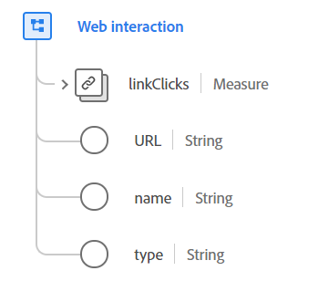

# Datatypen [!UICONTROL Web interaction]

[!UICONTROL Web interaction] är en XDM-datatyp (Standard Experience Data Model) som beskriver information om interaktioner som inträffade på en webbsida efter att den första sidinläsningen slutfördes. Den är avsedd för inspelning av interaktioner i webbprogram som inte aktiverar en ny sidinläsning, t.ex. ett webbprogram (SPA).

 

| Egenskap | Datatyp | Beskrivning |
| --- | --- | --- |
| `linkClicks` | [[!UICONTROL Measure]](./measure.md) | Ett mått som spårar klickningen på en webblänk. |
| `URL` | Sträng | Den faktiska länken eller URL-adressen som används för den här webbinteraktionen. |
| `name` | Sträng | Det normativa namn som används för den här webblänken. Detta används för klassificeringsändamål. |
| `type` | Sträng | Länktypen. Den här egenskapen måste vara lika med ett av följande enum-värden: <li> `download` </li> <li> `exit` </li> <li> `other` </li> |

{style="table-layout:auto"}

Mer information om datatypen finns i den offentliga XDM-databasen:

* [Populerat exempel](https://github.com/adobe/xdm/blob/master/components/datatypes/deprecated/webinteraction.example.1.json)
* [Fullständigt schema](https://github.com/adobe/xdm/blob/master/components/datatypes/deprecated/webinteraction.schema.json)
