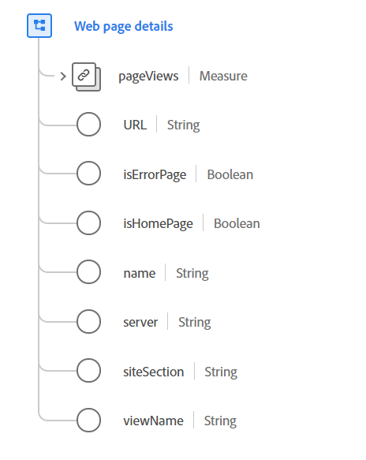

# [!UICONTROL Web page details] datatyp

[!UICONTROL Web page details] är en XDM-datatyp (Standard Experience Data Model) som beskriver information om en webbsida som just har lästs in och visats, vilket registreras av en ExperienceEvent.

Datatypen är avsedd för fullständig sidinformation och inledande sidinläsning av webbprogram med en sida (SPA). Information om interaktioner som sker på en inläst sida som inte utlöser en ny sidinläsning finns i datatypen [webbinteraktion](./web-interactions.md).

 

| Egenskap | Datatyp | Beskrivning |
| --- | --- | --- |
| `pageViews` | [[!UICONTROL Measure]](./measure.md) | Antalet vyer på en webbsida. |
| `URL` | Sträng | Webbsidans normativa eller vanliga URL. Detta kan vara den faktiska URL-adress som används för att nå sidan. Om du vill registrera URL:en som används för att nå sidan använder du `webLink`. URI-formatet ska följa standarden [RFC 3986](https://tools.ietf.org/html/rfc3986). |
| `isErrorPage` | Boolean | Den här egenskapen använder en flagga som anger om sidan är en felsida eller inte. Den här flaggan används för att kategorisera webbinteraktioner i stort. Felet definieras av programmet och kan motsvara en sida som hanteras med en HTTP-felkod. |
| `isHomePage` | Boolean | Den här egenskapen använder en flagga som anger om sidan är en hemsida eller inte. Den här flaggan används för att kategorisera webbinteraktioner i stort. Definitionen av hemsida bestäms av programmet. |
| `name` | Sträng | Webbsidans normativa namn. Det här namnet är inte nödvändigtvis sidrubriken eller direkt kopplat till sidinnehållet, utan används för att ordna en webbplats sidor i klassificeringssyfte. |
| `server` | Sträng | Den normativa eller vanliga server som är värd för webbsidan. Detta kan vara den värd eller server som faktiskt betjänade sidinteraktionen. |
| `siteSection` | Sträng | Det normativa namnet på det webbplatsavsnitt där den här webbsidan finns. Detta kan användas för att klassificera eller kategorisera interaktionen. |
| `viewName` | Sträng | Vyns namn på en sida. Den här egenskapen används vanligtvis för enkelsidiga program eller sidor med tabbar eller kontroller som ändrar större delen av sidlayouten. |

Mer information om datatypen finns i den offentliga XDM-databasen:

* [Populerat exempel](https://github.com/adobe/xdm/blob/master/components/datatypes/web/webpagedetails.example.2.json)
* [Fullständigt schema](https://github.com/adobe/xdm/blob/master/components/datatypes/web/webpagedetails.schema.json)