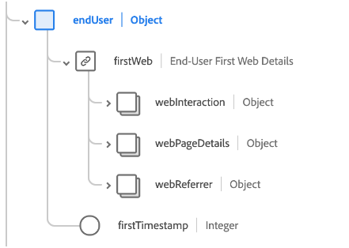

# [!UICONTROL Adobe Analytics ExperienceEvent Full Extension] schemafältgrupp

[!UICONTROL Adobe Analytics ExperienceEvent Full Extension] är en standardgrupp för schemafält för [[!DNL XDM ExperienceEvent] class](../../classes/experienceevent.md), som samlar in gemensamma mätvärden från Adobe Analytics.

Det här dokumentet beskriver strukturen och användningsfallet för fältgruppen för Analytics-tillägget.

>[!NOTE]
>
>På grund av storleken och antalet upprepade element i den här fältgruppen har många av fälten som visas i den här guiden komprimerats för att spara utrymme. Om du vill utforska den fullständiga strukturen för den här fältgruppen kan du [söka i plattformsgränssnittet](../../ui/explore.md) eller visa hela schemat i [publik XDM-databas](https://github.com/adobe/xdm/blob/master/extensions/adobe/experience/analytics/experienceevent-all.schema.json).

## Fältgruppstruktur

Fältgruppen innehåller en `_experience` objekt till ett schema, som i sin tur innehåller ett enda `analytics` -objekt.

| Egenskap | Datatyp | Beskrivning |
| --- | --- | --- |
| `customDimensions` | Objekt | Hämtar anpassade dimensioner som spåras av Analytics. Se [underavsnitt nedan](#custom-dimensions) om du vill ha mer information om objektets innehåll. |
| `endUser` | Objekt | Hämtar webbinteraktionsinformationen för slutanvändaren som utlöste händelsen. Se [underavsnitt nedan](#end-user) om du vill ha mer information om objektets innehåll. |
| `environment` | Objekt | Hämtar information om den webbläsare och det operativsystem som utlöste händelsen. Se [underavsnitt nedan](#environment) om du vill ha mer information om objektets innehåll. |
| `event1to100`  `event101to200`  `event201to300`  `event301to400`  `event401to500`  `event501to100`  `event601to700`  `event701to800`  `event801to900`  `event901to1000` | Objekt | Fältgruppen innehåller objektfält för att fånga upp till 1 000 anpassade händelser. Se [underavsnitt nedan](#events) för mer information om dessa fält. |
| `session` | Objekt | Hämtar information om sessionen som utlöste händelsen. Se [underavsnitt nedan](#session) om du vill ha mer information om objektets innehåll. |

{style="table-layout:auto"}

## `customDimensions` {#custom-dimensions}

`customDimensions` anpassade klipp [dimensioner](https://experienceleague.adobe.com/docs/analytics/components/dimensions/overview.html) som spåras av Analytics.

| Egenskap | Datatyp | Beskrivning |
| --- | --- | --- |
| `eVars` | Objekt | Ett objekt som hämtar upp till 250 konverteringsvariabler ([eVars](https://experienceleague.adobe.com/docs/analytics/components/dimensions/evar.html)). Objektets egenskaper är nedtonade `eVar1` till `eVar250` och godkänner bara strängar för sin datatyp. |
| `hierarchies` | Objekt | Ett objekt som hämtar upp till fem anpassade hierarkivariabler ([värmare](https://experienceleague.adobe.com/docs/analytics/implementation/vars/page-vars/hier.html)). Objektets egenskaper är nedtonade `hier1` till `hier5`, som i sig är objekt med följande underegenskaper:<ul><li>`delimiter`: Den ursprungliga avgränsaren som användes för att generera listan i `values`.</li><li>`values`: En avgränsad lista med namn på hierarkinivåer, representerat som en sträng.</li></ul> |
| `listProps` | Objekt | Ett objekt som hämtar upp till 75 [lista-proffs](https://experienceleague.adobe.com/docs/analytics/implementation/vars/page-vars/prop.html#list-props). Objektets egenskaper är nedtonade `prop1` till `prop75`, som i sig är objekt med följande underegenskaper:<ul><li>`delimiter`: Den ursprungliga avgränsaren som användes för att generera listan i `values`.</li><li>`values`: En avgränsad lista med värden för propen, representerad som en sträng.</li></ul> |
| `lists` | Objekt | Ett objekt som hämtar upp till tre [listor](https://experienceleague.adobe.com/docs/analytics/implementation/vars/page-vars/list.html). Objektets egenskaper är nedtonade `list1` till `list3`. Var och en av dessa egenskaper innehåller en `list` array med [[!UICONTROL Key Value Pair]](../../data-types/key-value-pair.md) datatyper. |
| `props` | Objekt | Ett objekt som hämtar upp till 75 [proppar](https://experienceleague.adobe.com/docs/analytics/implementation/vars/page-vars/prop.html). Objektets egenskaper är nedtonade `prop1` till `prop75` och godkänner bara strängar för sin datatyp. |
| `postalCode` | Sträng | Ett postnummer som kunden angett. |
| `stateProvince` | Sträng | En klienttillhandahållen stat eller provinsplats. |

{style="table-layout:auto"}

## `endUser` {#end-user}

`endUser` hämtar webbinteraktionsinformation för slutanvändaren som utlöste händelsen.

| Egenskap | Datatyp | Beskrivning |
| --- | --- | --- |
| `firstWeb` | [[!UICONTROL Web Information]](../../data-types/web-information.md) | Informationen om webbsida, länk och referens från den första Experience Event-händelsen för den här slutanvändaren. |
| `firstTimestamp` | Heltal | En Unix-tidsstämpel för den första ExperienceEvent-händelsen för den här slutanvändaren. |

## `environment` {#environment}

`environment` hämtar information om den webbläsare och det operativsystem som utlöste händelsen.

| Egenskap | Datatyp | Beskrivning |
| --- | --- | --- |
| `browserIDStr` | Sträng | Adobe Analytics-identifieraren för den webbläsare som används (kallas även [webbläsartypdimension](https://experienceleague.adobe.com/docs/analytics/components/dimensions/browser-type.html)). |
| `operatingSystemIDStr` | Sträng | Adobe Analytics-identifieraren för det operativsystem som används (kallas även [typdimension för operativsystem](https://experienceleague.adobe.com/docs/analytics/components/dimensions/operating-system-types.html)). |

## Anpassade händelsefält {#events}

Fältgruppen för analystillägg innehåller tio objektfält som fångar upp till 100 [anpassade händelsemått](https://experienceleague.adobe.com/docs/analytics/components/metrics/custom-events.html) var och en, för totalt 1000 för fältgruppen.

Varje händelseobjekt på den översta nivån innehåller de enskilda händelseobjekten för respektive intervall. Till exempel: `event101to200` innehåller de händelser som klistras in `event101` till `event200`.

Varje jämnt objekt använder [[!UICONTROL Measure]](../../data-types/measure.md) datatyp, som ger en unik identifierare och ett kvantifierbart värde.

## `session` {#session}

`session` hämtar information om sessionen som utlöste händelsen.

| Egenskap | Datatyp | Beskrivning |
| --- | --- | --- |
| `search` | [[!UICONTROL Search]](../../data-types/search.md) | Hämtar information om webb- eller mobilsökning för sessionsposten. |
| `web` | [[!UICONTROL Web Information]](../../data-types/web-information.md) | Hämtar information om länkklick, webbsidesinformation, referensinformation och webbläsarinformation för sessionsposten. |
| `depth` | Heltal | Slutanvändarens aktuella sessionsdjup (till exempel sidnummer). |
| `num` | Heltal | Slutanvändarens aktuella sessionsnummer. |
| `timestamp` | Heltal | En Unix-tidsstämpel för sessionsposten. |

## Nästa steg

Det här dokumentet innehöll struktur och användningsexempel för fältgruppen för Analytics-tillägget. Mer information om själva fältgruppen finns i [publik XDM-databas](https://github.com/adobe/xdm/blob/master/extensions/adobe/experience/analytics/experienceevent-all.schema.json).

Om du använder den här fältgruppen för att samla in Analytics-data med Adobe Experience Platform Web SDK läser du i handboken på [konfigurera ett datastream](../../../datastreams/overview.md) om du vill lära dig att mappa data till XDM på serversidan.
