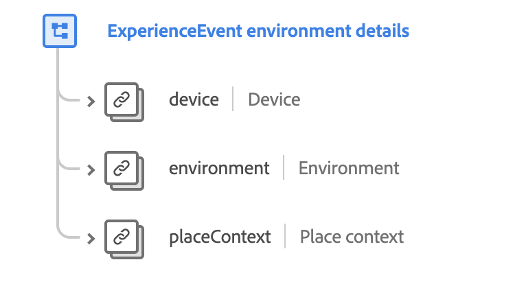

# [!UICONTROL Environment Details] schemafältgrupp

>[!NOTE]
>
>Namnen på flera schemafältgrupper har ändrats. Visa dokumentet på [uppdaterar fältgruppnamn](../name-updates.md) för mer information.

[!UICONTROL Environment Details] är en standardgrupp för schemafält för [[!DNL XDM ExperienceEvent] class](../../classes/experienceevent.md) används för att samla in information om miljödetaljer som rör en upplevelsehändelse, t.ex. enhetsinformation, webbläsarinformation, lokal tid och annan geografisk information.

 

| Egenskap | Datatyp | Beskrivning |
| --- | --- | --- |
| `device` | [Enhet](../../data-types/device.md) | Beskriver en identifierad enhets-, program- eller enhetsläsarinstans som kan spåras mellan sessioner, vanligtvis via cookies. |
| `environment` | [Miljö](../../data-types/environment.md) | Beskriver information om situationsförhållanden för händelseobservationen, särskilt med detaljerad information om övergångar, t.ex. nätverks- eller programversioner. |
| `placeContext` | [Montera kontext](../../data-types/place-context.md) | Beskriver de övergående omständigheter som rör händelseobservationen. Exemplen omfattar språkområdesspecifik information som väder, lokal tid, trafik, veckodag, arbetsdag kontra semester och arbetstimmar. |

{style="table-layout:auto"}

Mer information om fältgruppen finns i den offentliga XDM-databasen:

* [Populerat exempel](https://github.com/adobe/xdm/blob/master/components/fieldgroups/experience-event/experienceevent-environment-details.example.1.json)
* [Fullständigt schema](https://github.com/adobe/xdm/blob/master/components/fieldgroups/experience-event/experienceevent-environment-details.schema.json)
