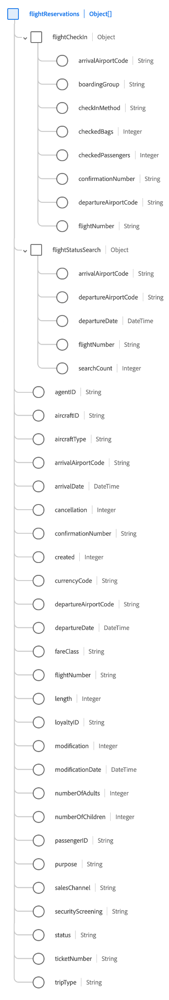

# [!UICONTROL Flight Reservation] schemafältgrupp

[!UICONTROL Flight Reservation] är en standardgrupp för schemafält för [[!DNL XDM ExperienceEvent] class](../../classes/experienceevent.md) används för att samla in information om en flygreservation.

Fältgruppen är ett tillägg till [!UICONTROL Reservation Details] fältgrupp och innehåller alla samma fält under ett enda fält av objekttyp, `reservations`. Förutom dessa generiska fält [!UICONTROL Flight Reservation] innehåller `flightReservations` array. Den här objektmatrisen används för att beskriva en eller flera reservationer med egenskaper som är unika för flygresor.

>[!NOTE]
>
>Det här dokumentet innehåller information om `flightReservations` array. För information om andra fält som anges i `reservations` -objekt, se [[!UICONTROL Reservation Details] fältgruppsreferens](./reservation-details.md).

## `flightReservations`

`flightReservations` är en array med objekt som representerar en lista med flygbokningar. Om en bokningshändelse omfattar reservationer för flera anslutande flygningar på en resa, kan dessa reservationer till exempel anges som enskilda objekt under `flightReservations` för en enda händelse.

Strukturen för varje objekt som anges under `flightReservations` anges nedan.

| Egenskap | Datatyp | Beskrivning |
| --- | --- | --- |
| `flightCheckIn` | Objekt | Hämtar information om incheckningen av flygningen. Objektet innehåller följande egenskaper:<ul><li>`arrivalAirportCode`: (String) Ankomststadens flygplatskod.</li><li>`boardingGroup`: (String) Den flygspecifika indikatorn för ombordstigningsorder.</li><li>`checkInMethod`: (String) Den metod som används för incheckningen, till exempel räknare, online, kioskdator eller självbetjäning.</li><li>`checkedBags`: (heltal) Antalet påsar som kontrolleras för flygningen.</li><li>`checkedPassengers`: (heltal) Det antal passagerare som checkas in för flygningen, om det finns flera passagerare för samma bokningsnummer.</li><li>`confirmationNumber`: (String) Reservationens bekräftelsenummer eller identifierare.</li><li>`departureAirportCode`: (String) Avgångsstadens flygplatskod.</li><li>`flightNumber`: (String) Flygnumret för den flygning som reserveras.</li></ul> |
| `flightStatusSearch` | Objekt | Hämtar de uppgifter som returneras när flygningens status genomsöks. Objektet innehåller följande egenskaper:<ul><li>`arrivalAirportCode`: (String) Ankomststadens flygplatskod.</li><li>`boardingGroup`: (String) Den flygspecifika indikatorn för ombordstigningsorder.</li><li>`departureAirportCode`: (String) Avgångsstadens flygplatskod.</li><li>`departureDate`: (DateTime) Avgångsdatumet för den flygning som reserveras.</li><li>`flightNumber`: (String) Flygnumret för den flygning som reserveras.</li><li>`searchCount`: (heltal) Det antal gånger som statusen för den reserverade flygningen har sökts efter.</li></ul> |
| `agentID` | Sträng | Ombudet eller bokgivaren som är ansvarig för bokningen av reservationen, om tillämpligt. |
| `aircraftID` | Sträng | En identifierare för luftfartyget. |
| `aircraftType` | Sträng | Typ av luftfartyg. |
| `arrivalAirportCode` | Sträng | Ankomststadens flygplatskod. |
| `arrivalDate` | DateTime | Ankomstdatumet för den flygning som reserveras. |
| `cancellation` | Heltal | Det här värdet hämtas när en reservation har annullerats. |
| `confirmationNumber` | Sträng | Reservationsbekräftelsenummer eller identifierare. |
| `created` | Sträng | Det här värdet hämtas när en reservation har skapats. |
| `currencyCode` | Sträng | ISO 4217-valutakoden som användes för att göra köpet. |
| `departureAirportCode` | Sträng | Avgångsstadens flygplatskod. |
| `departureDate` | DateTime | Avgångsdatumet för den flygning som reserveras. |
| `fareClass` | Sträng | Flygningens biljettklass som reserveras. |
| `flightNumber` | Sträng | Flygnumret för den flygning som reserveras. |
| `length` | Heltal | Det totala antalet dagar för reservationen. |
| `loyaltyID` | Sträng | Förmåns- eller belöningsprogram-ID för den passagerare som anges i reservationen. |
| `modification` | Heltal | Det här värdet hämtas när en reservation har ändrats. |
| `modificationDate` | DateTime | Tidpunkten när reservationen senast ändrades. |
| `numberOfAdults` | Heltal | Antalet vuxna som är associerade med reservationen. |
| `numberOfChildren` | Heltal | Antalet underordnade som är associerade med reservationen. |
| `passengerID` | Sträng | Passagerarinformation som är associerad med reservationen. |
| `purpose` | Sträng | Syftet med reservationen, vanligtvis antingen affärsmässig eller personlig. |
| `salesChannel` | Sträng | Försäljningskanalen som reservationen bokförts från. |
| `securityScreening` | Sträng | Den typ av säkerhetskontroll som passageraren omfattas av. |
| `status` | Sträng | Status för flygreservationen. |
| `ticketNumber` | Sträng | Reservationsnummer eller identifierare. |
| `tripType` | Sträng | Anger om reservationen gäller en enkelriktad resa, en rundtur eller en flerstadstrafik. |

{style="table-layout:auto"}

Mer information om fältgruppen finns i den offentliga XDM-databasen:

* [Populerat exempel](https://github.com/adobe/xdm/blob/master/components/fieldgroups/experience-event/industry-verticals/experienceevent-flight-reservation.example.1.json)
* [Fullständigt schema](https://github.com/adobe/xdm/blob/master/components/fieldgroups/experience-event/industry-verticals/experienceevent-flight-reservation.schema.json)
