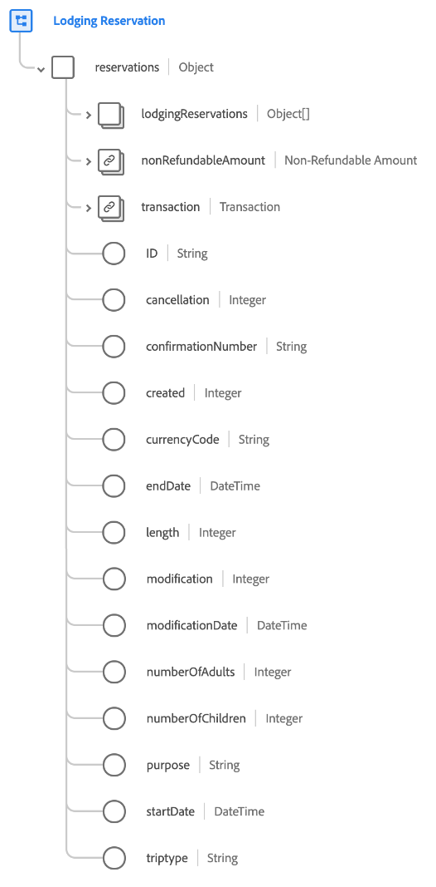

# [!UICONTROL Lodging Reservation] schemafältgrupp

[!UICONTROL Lodging Reservation] är en standardgrupp för schemafält för [[!DNL XDM ExperienceEvent] class](../../classes/experienceevent.md) används för att samla in information om en reservation.

Fältgruppen är ett tillägg till [!UICONTROL Reservation Details] fältgrupp och innehåller alla samma fält under ett enda fält av objekttyp, `reservations`. Förutom dessa allmänna fält [!UICONTROL Lodging Reservation] innehåller `lodgingReservations` array. Den här arrayen med objekt används för att beskriva en eller flera reservationer med egenskaper som är unika för inlämning.

>[!NOTE]
>
>Det här dokumentet innehåller information om `lodgingReservations` array. För information om andra fält som anges i `reservations` objekt, se [[!UICONTROL Reservation Details] fältgruppsreferens](./reservation-details.md).

## `lodgingReservations`

`lodgingReservations` är en array med objekt som representerar en lista med bokningar. Om en bokningshändelse omfattar reservationer på flera olika hotell längs en resa, kan dessa reservationer till exempel anges som enskilda objekt under `lodgingReservations` för en enda händelse.

Strukturen för varje objekt som anges under `lodgingReservations` anges nedan.

| Egenskap | Datatyp | Beskrivning |
| --- | --- | --- |
| `averageDailyPrice` | [[!UICONTROL Currency]](../../data-types/currency.md) | Det genomsnittliga dagspriset för hotellrummet. |
| `lodgingCheckIn` | Objekt | Ett objekt som beskriver incheckningsdetaljer. Innehåller följande värden:<ul><li>`digitalKey`: (Heltal) Anger när en gäst väljer att använda en digital nyckel vid incheckning.</li><li>`earlyCheckInRequested`: (Heltal) Anger när en gäst begär att checkas in tidigare än de normala incheckningstimmarna.</li><li>`lateCheckInRequested`: (Heltal) Anger när en gäst begär att checkas in senare än de normala incheckningstimmarna.</li><li>`noRoomCheckIn`: (Heltal) Det här värdet hämtas när en gäst slutar checka in när det inte finns några rum tillgängliga just nu.</li><li>`oneRoomCheckIn`: (Heltal) Det här värdet hämtas när en gäst slutar checka in när det bara finns ett rum tillgängligt vid den tidpunkten.</li><li>`roomKeys`: (Heltal) Antalet standardrumstangenter som anges vid incheckning.</li><li>`userSelectedRoom`: (Boolean) Anger om gästen valde sitt rum vid incheckning.</li></ul> |
| `rackrate` | [[!UICONTROL Currency]](../../data-types/currency.md) | Kostnaden för en bokning samma dag utan föregående bokning. |
| `ID` | Sträng | Reservationsnumret eller identifieraren. |
| `agentID` | Sträng | Det agent-ID som är kopplat till hotellbokningen. |
| `basePrice` | Sträng | Grundpriset innan några rabatter läggs till. |
| `bookingID` | Sträng | Boknings-ID som hör till hotellbokningen. |
| `cancellation` | Heltal | Det här värdet hämtas när en reservation har annullerats. |
| `checkInDate` | DateTime | Incheckningsdatumet för rumsreservationen. |
| `checkOutDate` | DateTime | Utcheckningsdatumet för rumsreservationen. |
| `confirmationNumber` | Sträng | Reservationsbekräftelsenumret eller identifieraren. |
| `couponCode` | Sträng | En kupongkod kopplad till hotellbokningen. |
| `created` | Heltal | Det här värdet hämtas när en reservation har skapats. |
| `currencyCode` | Sträng | ISO 4217-valutakoden som användes för att göra köpet. |
| `discountPercent` | Dubbel | Rabattprocenten som är associerad med bokningen. |
| `freeCancelation` | Boolean | Anger om rummet har en princip för kostnadsfri annullering. |
| `guestID` | Sträng | Gäst-ID som är associerat med hotellbokningen. |
| `length` | Heltal | Det totala antalet dagar för reservationen. |
| `loyaltyID` | Sträng | Förmånsprogram-ID för gästen som anges i reservationen. |
| `modification` | Heltal | Det här värdet hämtas när en reservation har ändrats. |
| `modificationDate` | DateTime | Tidpunkten när reservationen senast ändrades. |
| `numberOfAdults` | Heltal | Antalet vuxna som är associerade med reservationen. |
| `numberOfChildren` | Heltal | Antalet underordnade som är associerade med reservationen. |
| `numberOfRooms` | Heltal | Antalet rum som är associerade med reservationen. |
| `propertyID` | Sträng | En identifierare för hotellet eller en hotell för bokningen. |
| `propertyName` | Sträng | Namnet på hotellet eller orten för bokningen. |
| `purpose` | Sträng | Syftet med reservationen, vanligtvis antingen affärsmässig eller personlig. |
| `ratePlan` | Sträng | Kursen som rummet såldes på. |
| `refundable` | Boolean | Anger om rummet är återbetalningsbart. |
| `reservationStatus` | Sträng | Reservationens status. |
| `roomAccessibilityType` | Sträng | Rummets hjälpmedelstyp, till exempel mobilitet, hörsel eller annat. |
| `roomCapacity` | Heltal | Antalet personer som hotellrummet innehåller. |
| `roomType` | Sträng | Typ av rum som reserveras. |
| `smoking` | Boolean | Anger om rummet tillåter rökning. |
| `tripType` | Sträng | Anger om reservationen gäller en enkelriktad resa, en rundtur eller en flerstadstrafik. |

{style="table-layout:auto"}

Mer information om fältgruppen finns i den offentliga XDM-databasen:

* [Populerat exempel](https://github.com/adobe/xdm/blob/master/components/fieldgroups/experience-event/industry-verticals/experienceevent-lodging-reservation.example.1.json)
* [Fullständigt schema](https://github.com/adobe/xdm/blob/master/components/fieldgroups/experience-event/industry-verticals/experienceevent-lodging-reservation.schema.json)
