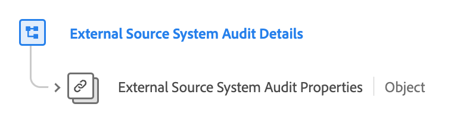

# [!UICONTROL External Source System Audit Details] fältgrupp

[!UICONTROL External Source System Audit Details] är en standardfältgrupp för XDM (Experience Data Model) som utökar kärndatatypen External Source System Audit Attributes genom att referera till dess egenskaper och lägga till sammanhangsbaserade metadata. Detta möjliggör detaljerad spårning och flexibel dataintegrering från externa källor.

| Visningsnamn | Egenskap | Datatyp | Beskrivning |
| -------------------------------------------------| ---------------------------------------- | --------- | --- |
| [!UICONTROL External Source System Audit Details] | `external-source-system-audit-details` | [[!UICONTROL External Source System Audit Attributes]](../../data-types/external-source-system-audit-attributes.md) | The[!UICONTROL External Source System Audit Details]fältgruppen utökar kärndatatypen External Source System Audit Attributes genom att referera till dess egenskaper och lägga till sammanhangsbaserade metadata. Detta underlättar detaljerad spårning av granskningar och flexibel dataintegrering för externa källor, vilket underlättar asynkron infogning av profiler. |

{style="table-layout:auto"}

Mer information om datatypen finns i den offentliga XDM-databasen:

* [Fullständigt schema](https://github.com/adobe/xdm/blob/master/docs/reference/fieldgroups/shared/external-source-system-audit-details.schema.json)