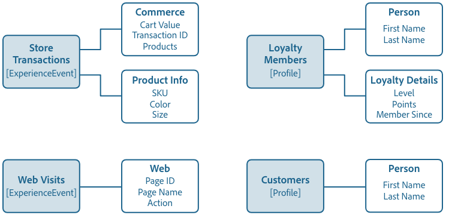

# Grunderna för schemakomposition

Lär dig mer om XDM-scheman (Experience Data Model) och byggstenarna, principerna och de bästa sätten att komponera scheman i Adobe Experience Platform. Allmän information om XDM och hur det används i [!DNL Experience Platform] finns i [XDM-systemöversikt](../home.md).

## Scheman {#understanding-schemas}

Ett schema är en uppsättning regler som representerar och validerar datastrukturen och dataformatet. På en hög nivå ger scheman en abstrakt definition av ett objekt i verkligheten (till exempel en person) och ger en översikt över vilka data som ska inkluderas i varje instans av objektet (till exempel förnamn, efternamn, födelsedag o.s.v.).

Förutom att beskriva datastrukturen, tillämpar scheman begränsningar och förväntningar på data så att de kan valideras när de flyttas mellan olika system. Med dessa standarddefinitioner kan data tolkas på ett enhetligt sätt, oavsett ursprung, och behovet av översättning mellan olika program försvinner.

Experience Platform underhåller denna semantiska normalisering med hjälp av scheman. Scheman är standardmetoden för att beskriva data i Experience Platform, så att alla data som överensstämmer med scheman kan återanvändas i en organisation utan konflikter, eller till och med delas mellan flera organisationer.

XDM-scheman är idealiska för att lagra enorma mängder komplexa data i ett självständigt format. Se avsnitten om [inbäddade objekt](#embedded) och [big data](#big-data) i bilagan till det här dokumentet om du vill ha mer information om hur XDM gör detta.

### Schemabaserade arbetsflöden i Experience Platform {#schema-based-workflows}

Standardisering är ett nyckelkoncept bakom Experience Platform. XDM, som drivs av Adobe, är ett försök att standardisera kundupplevelsedata och definiera standardscheman för kundupplevelsehantering.

Infrastrukturen som Experience Platform bygger på, kallas [!DNL XDM System], underlättar schemabaserade arbetsflöden och innehåller [!DNL Schema Registry], [!DNL Schema Editor], schemadata och tjänstkonsumtionsmönster. Mer information finns i [XDM-systemöversikt](../home.md).

Det finns flera fördelar med att använda scheman i Experience Platform. För det första möjliggör scheman bättre datastyrning och minimering av data, vilket är särskilt viktigt med sekretessbestämmelser. För det andra gör det möjligt att bygga scheman med Adobe standardkomponenter att få användningsklara insikter och använda AI/ML-tjänster med minimala anpassningar. Slutligen tillhandahåller scheman infrastruktur för datautbytesinsikter och effektiv samordning.

## Planera ditt schema {#planning}

Det första steget i att skapa ett schema är att fastställa konceptet, eller det verkliga objektet, som du försöker fånga inom schemat. När du har identifierat konceptet som du försöker beskriva börjar du planera ditt schema genom att tänka på saker som datatypen, potentiella identitetsfält och hur schemat kan utvecklas i framtiden.

### Databeteenden i Experience Platform {#data-behaviors}

Data som är avsedda att användas i Experience Platform är grupperade i två beteendetyper:

* **Registrera data**: Tillhandahåller information om attributen för ett ämne. Ett ämne kan vara en organisation eller individ.
* **Tidsseriedata**: Ger en ögonblicksbild av systemet när en åtgärd vidtas, antingen direkt eller indirekt, av ett postämne.

Alla XDM-scheman beskriver data som kan kategoriseras som post- eller tidsserier. Databeteendet för ett schema definieras av schemats klass, som tilldelas till ett schema när det skapas första gången. XDM-klasser beskrivs mer ingående senare i det här dokumentet.

Både post- och tidsseriescheman innehåller en karta över identiteter (`xdm:identityMap`). Det här fältet innehåller identitetsbeteckningen för ett ämne, som har ritats från fält som markerats som &quot;Identitet&quot; enligt beskrivningen i nästa avsnitt.

### [!UICONTROL Identity] {#identity}

>[!CONTEXTUALHELP]
>id="platform_schemas_identities"
>title="Identiteter i scheman"
>abstract="Identiteter är nyckelfält i ett schema som kan användas för att identifiera ett ämne, till exempel en e-postadress eller ett marknadsförings-ID. Dessa fält används för att skapa identitetsdiagrammet för varje enskild person och för att skapa kundprofiler. Mer information om identiteter i scheman finns i dokumentationen."

Scheman definierar strukturen för data som hämtas in till Experience Platform. Dessa data möjliggör flera tjänster inom plattformen och bidrar till att skapa en enda, enhetlig bild av varje individ. När du utformar scheman bör du tänka på vilka fält som ska markeras som identiteter. De här styr hur profiler sammanfogas över datauppsättningar.

Nyckelfält i dina scheman kan markeras som identiteter för att underlätta med den här processen. Vid datainförsel infogas data i dessa fält i [!UICONTROL Identity Graph] för den aktuella personen. Diagramdata kan sedan nås av [[!DNL Real-Time Customer Profile]](../../profile/home.md) och andra Experience Platform-tjänster för att ge en sammanslagen vy över varje enskild kund.

Fält som oftast markeras som [!UICONTROL Identity] är: e-postadress, telefonnummer, [[!DNL Experience Cloud ID (ECID)]](https://experienceleague.adobe.com/docs/id-service/using/home.html), CRM-ID eller andra unika ID-fält. Överväg alla unika identifierare som är specifika för din organisation, eftersom de kan vara bra fält av typen [!UICONTROL Identity].

Mer information om hur identitetsinformation kan hjälpa dig att leverera digitala upplevelser till dina kunder finns i [Översikt över identitetstjänsten](../../identity-service/home.md). I dokumentet om god praxis för datamodellering finns [tips om hur du använder identiteter när du skapar ett schema](./best-practices.md#data-validation-fields).

Det finns två sätt att skicka identitetsdata till Experience Platform:

1. Lägga till identitetsbeskrivningar i enskilda fält, antingen via [Schemaredigerarens användargränssnitt](../ui/fields/identity.md) eller med [API:t för schemaregister](../api/descriptors.md#create)
2. Använda ett [`identityMap`-fält ](#identityMap)

#### `identityMap` {#identityMap}

`identityMap` är ett mappningsfält som beskriver de olika identitetsvärdena för en individ, tillsammans med deras associerade namnutrymmen. Det här fältet kan användas för att ange identitetsinformation för dina scheman, i stället för att definiera identitetsvärden inom strukturen för själva schemat.

Den största nackdelen med att använda `identityMap` är att identitetsvärden är kapslade och kan vara svårare att arbeta med i verktyg som förväntar sig identitetsfält på den översta nivån, som segmentbyggaren eller vissa integreringar från tredje part.

>[!NOTE]
>
>Ett schema som använder `identityMap` kan användas som ett källschema i en relation, men kan inte användas som ett referensschema. Detta beror på att alla referensscheman måste ha en synlig identitet som kan mappas i ett referensfält i källschemat. Mer information om kraven för käll- och referensscheman finns i användargränssnittsguiden för [relationer](../tutorials/relationship-ui.md).

Identitetskartor kan dock vara användbara om det finns ett varierande antal identiteter för ett schema, eller om du samlar in data från källor som lagrar identiteter tillsammans (till exempel [!DNL Airship] eller Adobe Audience Manager). Dessutom krävs identitetskartor om du använder [Adobe Experience Platform Mobile SDK](https://developer.adobe.com/client-sdks/home/).

Ett exempel på en enkel identitetskarta skulle se ut så här:

```json
"identityMap": {
  "email": [
    {
      "id": "jsmith@example.com",
      "primary": true
    }
  ],
  "ECID": [
    {
      "id": "87098882279810196101440938110216748923",
      "primary": false
    },
    {
      "id": "55019962992006103186215643814973128178",
      "primary": false
    }
  ],
  "CRMID": [
    {
      "id": "2e33192000007456-0365c00000000000",
      "primary": false
    }
  ]
}
```

Som exemplet ovan visar representerar varje nyckel i objektet `identityMap` ett identitetsnamnutrymme. Värdet för varje nyckel är en array med objekt som representerar identitetsvärdena (`id`) för respektive namnutrymme. I [!DNL Identity Service]-dokumentationen finns en [lista över standardnamnutrymmen för identiteter](../../identity-service/troubleshooting-guide.md#standard-namespaces) som känns igen av Adobe-program.

>[!NOTE]
>
>Ett booleskt värde för om värdet är en primär identitet (`primary`) kan också anges för varje identitetsvärde. Du behöver bara ange primära identiteter för scheman som ska användas i [!DNL Real-Time Customer Profile]. Mer information finns i avsnittet [fackliga scheman](#union).

### Principer för schemautveckling {#evolution}

I takt med att de digitala upplevelserna utvecklas måste även de scheman som används för att representera dem finnas kvar. Ett väldesignat schema kan därför anpassas och utvecklas efter behov, utan att det medför destruktiva ändringar i tidigare versioner av schemat.

Eftersom det är viktigt att bibehålla bakåtkompatibiliteten för att utveckla scheman tillämpar Experience Platform en rent additiv versionsprincip. Denna princip säkerställer att alla ändringar av schemat endast resulterar i icke-förstörande uppdateringar och ändringar. **brytningsändringar stöds alltså inte.**

>[!NOTE]
>
>Du kan bara göra en brytningsändring i ett schema om det ännu inte har använts för att importera data till Experience Platform och inte har aktiverats för användning i kundprofilen i realtid. När schemat har använts i [!DNL Experience Platform] måste det dock följa den additiva versionsprincipen.

I följande tabell visas vilka ändringar som stöds vid redigering av scheman, fältgrupper och datatyper:

| Ändringar som stöds | Brytande ändringar (stöds inte) |
| --- | --- |
| <ul><li>Lägga till nya fält i resursen</li><li>Göra ett obligatoriskt fält valfritt</li><li>Nya obligatoriska fält*</li><li>Ändra resursens visningsnamn och beskrivning</li><li>Aktiverar schemats deltagande i profilen</li></ul> | <ul><li>Tar bort tidigare definierade fält</li><li>Byta namn på eller definiera om befintliga fält</li><li>Ta bort eller begränsa fältvärden som tidigare stöds</li><li>Flytta befintliga fält till en annan plats i trädet</li><li>Tar bort schemat</li><li>Inaktivera schemat från att delta i profilen</li><li>Ändra det primära identitetsfältet i ett schema som är aktiverat för profilen och har inkapslade data</li></ul> |

\**Läs avsnittet nedan om du vill veta mer om [hur du ställer in nya obligatoriska fält](#post-ingestion-required-fields).*

### Obligatoriska fält

Enskilda schemafält kan [markeras som obligatoriska](../ui/fields/required.md), vilket innebär att alla inkapslade poster måste innehålla data i dessa fält för att validera. Om du till exempel anger ett schemats primära identitetsfält som obligatoriskt kan du se till att alla inkapslade poster deltar i kundprofilen i realtid. Om du anger ett tidsstämpelfält som obligatoriskt ser du till att alla händelser i tidsserien bevaras kronologiskt.

>[!IMPORTANT]
>
>Oavsett om ett schemafält krävs eller inte, accepterar inte Experience Platform `null` eller tomma värden för inkapslade fält. Om det inte finns något värde för ett visst fält i en post eller händelse, ska nyckeln för det fältet uteslutas från inmatningsnyttolasten.

#### Ange fält som obligatoriska efter intag {#post-ingestion-required-fields}

Om ett fält har använts för att importera data och inte ursprungligen ställdes in som nödvändigt, kan det fältet ha ett null-värde för vissa poster. Om du anger det här fältet som obligatoriskt för postinmatning måste alla framtida poster innehålla ett värde för det här fältet, även om historiska poster kan vara null.

Tänk på följande när du ställer in ett tidigare valfritt fält efter behov:

1. Om du frågar efter historiska data och skriver resultaten i en ny datamängd, kommer vissa rader att misslyckas eftersom de innehåller null-värden för det obligatoriska fältet.
1. Om fältet deltar i [Kundprofil för realtid](../../profile/home.md) och du exporterar data innan du anger det som nödvändigt, kan det vara null för vissa profiler.
1. Du kan använda API:t för schemaregister för att visa en tidsstämplad ändringslogg för alla XDM-resurser i Experience Platform, inklusive nya obligatoriska fält. Mer information finns i guiden för [slutpunkten för granskningsloggen](../api/audit-log.md).

### Scheman och datainmatning

Om du vill importera data till Experience Platform måste du först skapa en datauppsättning. Datauppsättningar är byggstenarna för dataomvandling och spårning för [[!DNL Catalog Service]](../../catalog/home.md), och representerar vanligtvis tabeller eller filer som innehåller inkapslade data. Alla datauppsättningar baseras på befintliga XDM-scheman, som innehåller begränsningar för vad de inmatade data ska innehålla och hur de ska struktureras. Mer information finns i översikten om [Adobe Experience Platform datainmatning](../../ingestion/home.md).

## Bygga block i ett schema {#schema-building-blocks}

Experience Platform använder en dispositionsmetod där standardbyggstenar kombineras för att skapa scheman. Den här metoden främjar återanvändbarheten för befintliga komponenter och driver standardiseringen i hela branschen för att stödja leverantörsscheman och komponenter i [!DNL Experience Platform].

Scheman består av följande formel:

**Klass + schemafältgrupp&amp;stämpel;ast; = XDM-schema**

&amp;ast;Ett schema består av en klass och noll eller flera schemafältgrupper. Det innebär att du kan skapa ett datauppsättningsschema utan att använda fältgrupper alls.

### Klass {#class}

>[!CONTEXTUALHELP]
>id="platform_schemas_class"
>title="Klass"
>abstract="Alla scheman baseras på en enda klass. Klassen definierar schemats beteende och de gemensamma egenskaper som alla scheman baserade på den klassen måste innehålla. Läs dokumentationen om du vill veta mer om hur klasser är inblandade i schemakomposition."

>[!CONTEXTUALHELP]
>id="platform_schemas_class_industries"
>title="Branschtyp"
>abstract="Om du väljer en relevant bransch för din verksamhet kan maskininlärningsmodellen ge bättre datahantering genom att mappa källfälten mer exakt med standardfältgrupper som följer branschstandarder. Detta garanterar att dataintegreringen är anpassad efter era branschspecifika behov och ger mer exakta och relevanta datainsikter."

Dispositionen av ett schema börjar med att tilldela en klass. Klasser definierar de beteendeaspekter av data som schemat kommer att innehålla (post- eller tidsserie). Förutom detta beskriver klasser det minsta antalet gemensamma egenskaper som alla scheman baserade på den klassen behöver innehålla och tillhandahåller ett sätt för att sammanfoga flera kompatibla datamängder.

En schemaklass avgör vilka fältgrupper som är berättigade att användas i schemat. Detta beskrivs mer ingående i [nästa avsnitt](#field-group).

Adobe tillhandahåller flera standardklasser (&quot;core&quot;) för XDM. Två av dessa klasser, [!DNL XDM Individual Profile] och [!DNL XDM ExperienceEvent], krävs för nästan alla Experience Platform-processer längre fram i kedjan. Dessutom kan du skapa egna klasser som beskriver mer specifika användningsfall för organisationen. Anpassade klasser definieras av en organisation när det inte finns några Adobe-definierade huvudklasser tillgängliga som beskriver ett unikt användningsfall.

I följande skärmbild visas hur klasser visas i användargränssnittet i Experience Platform. Eftersom exempelschemat som visas inte innehåller några fältgrupper, kommer alla fält som visas att tillhandahållas av schemaklassen ([!UICONTROL XDM Individual Profile]).

![The [!UICONTROL XDM Individual Profile] within the Schema Editor.](../images/schema-composition/class.png)

Den senaste listan över tillgängliga standard-XDM-klasser finns i [den officiella XDM-databasen](https://github.com/adobe/xdm/tree/master/components/classes). Du kan också läsa guiden [utforska XDM-komponenter](../ui/explore.md) om du hellre vill visa resurser i användargränssnittet.

### Fältgrupp {#field-group}

>[!CONTEXTUALHELP]
>id="platform_schemas_fieldgroup"
>title="Fältgrupp"
>abstract="Fältgrupper är återanvändbara komponenter som gör att du kan utöka scheman med ytterligare attribut. De flesta fältgrupper är bara kompatibla med vissa klasser. Du kan använda standardfältgrupper som definieras av Adobe eller definiera egna fältgrupper manuellt. Läs dokumentationen om du vill veta mer om hur fältgrupper är inblandade i schemakomposition."

>[!CONTEXTUALHELP]
>id="platform_schemas_fieldgroup_requiredFieldgroup"
>title="Obligatorisk fältgrupp"
>abstract="Den här fältgruppen krävs av källan som du använder. Du kan därför inte ta bort den från ditt schema."

En fältgrupp är en återanvändbar komponent som definierar ett eller flera fält som implementerar vissa funktioner, som personlig information, hotellinställningar eller adress. Fältgrupper är avsedda att ingå i ett schema som implementerar en kompatibel klass.

Fältgrupper definierar vilken eller vilka klasser de är kompatibla med, baserat på beteendet för de data de representerar (post- eller tidsserie). Det innebär att inte alla fältgrupper är tillgängliga för användning med alla klasser.

Experience Platform innehåller många vanliga fältgrupper från Adobe, samtidigt som leverantörer kan definiera fältgrupper för sina användare, och enskilda användare kan definiera fältgrupper för sina egna specifika koncept.

Om du till exempel vill hämta information som [!UICONTROL First Name] och [!UICONTROL Home Address] för ditt [!UICONTROL Loyalty Members]-schema, kan du använda standardfältgrupper som definierar de vanliga begreppen. Begrepp som är mer specifika för din organisation (t.ex. kundens kundlojalitetsprogram eller produktattribut) som kanske inte omfattas av standardfältgrupper. I det här fallet måste du definiera en egen fältgrupp för att kunna hämta informationen.

>[!NOTE]
>
>Du rekommenderas att använda standardfältgrupper när det är möjligt i dina scheman, eftersom dessa fält tolkas implicit av Experience Platform tjänster och ger större konsekvens när de används i alla [!DNL Experience Platform] -komponenter.
>
>Fält som tillhandahålls av standardkomponenter (till exempel&quot;Förnamn&quot; och&quot;E-postadress&quot;) innehåller tillagda konnoteringar utöver de grundläggande skalära fälttyperna. De talar om för [!DNL Experience Platform] att alla fält som delar samma datatyp fungerar på samma sätt. Det här beteendet kan betraktas som tillförlitligt oavsett varifrån data kommer eller i vilken [!DNL Experience Platform]-tjänst data används.

Kom ihåg att scheman består av fältgrupper som är &quot;noll eller fler&quot;, vilket innebär att du kan skapa ett giltigt schema utan att använda några fältgrupper alls.

I följande skärmbild visas hur fältgrupper representeras i användargränssnittet i Experience Platform. En enda fältgrupp ([!UICONTROL Demographic Details]) har lagts till i ett schema i det här exemplet, som tillhandahåller en gruppering av fält till schemats struktur.

![Schemaredigeraren med fältgruppen [!UICONTROL Demographic Details] markerad i ett exempelschema.](../images/schema-composition/field-group.png)

Den senaste listan över tillgängliga standardfältgrupper i XDM finns i [den officiella XDM-databasen](https://github.com/adobe/xdm/tree/master/components/fieldgroups). Du kan också läsa guiden [utforska XDM-komponenter](../ui/explore.md) om du hellre vill visa resurser i användargränssnittet.

>[!NOTE]
>
> XDM-standardfältgrupper utvecklas alltid och vissa fältgrupper har tagits bort. Den senaste uppdateringslistan över inaktuella fältgrupper finns i avsnittet [inaktuella fältgrupper](https://github.com/adobe/xdm/tree/master/components/fieldgroups/deprecated) i den officiella XDM-databasen.

### Datatyp {#data-type}

Datatyper används som referensfälttyper i klasser eller scheman på samma sätt som grundläggande litteralfält. Den största skillnaden är att datatyper kan definiera flera delfält på samma sätt som fältgrupper. Den största skillnaden mellan dem är att datatyper kan inkluderas var som helst i ett schema genom att lägga till den som&quot;datatyp&quot; för ett fält. Fältgrupper är bara kompatibla med vissa klasser, men datatyper kan inkluderas i alla överordnade klasser eller fältgrupper.

>[!NOTE]
>
>Om ett fält definieras som en viss datatyp kan du inte skapa samma fält med en annan datatyp i ett annat schema. Begränsningen gäller för hela organisationens klientorganisation.

Experience Platform tillhandahåller ett antal vanliga datatyper som en del av [!DNL Schema Registry] som stöder användning av standardmönster för att beskriva vanliga datastrukturer. Detta förklaras mer ingående i självstudiekurserna [Schemaregister](../tutorials/create-schema-api.md) och blir tydligare när du går igenom stegen för att definiera datatyper.

I följande skärmbild visas hur datatyperna visas i användargränssnittet i Experience Platform. Ett av fälten som tillhandahålls av fältgruppen [!UICONTROL Demographic Details] använder datatypen [!UICONTROL Object], vilket anges av texten efter lodtecknet (`|`) bredvid fältets namn. Den här särskilda datatypen innehåller flera delfält som relaterar till namnet på en enskild person, en konstruktion som kan återanvändas för andra fält där en persons namn måste hämtas.


Den senaste listan över tillgängliga XDM-standarddatatyper finns i [den officiella XDM-databasen](https://github.com/adobe/xdm/tree/master/components/datatypes). Du kan också läsa guiden [utforska XDM-komponenter](../ui/explore.md) om du hellre vill visa resurser i användargränssnittet.

>[!NOTE]
>
> Standarddatatyperna XDM utvecklas alltid och vissa datatyper har tagits bort. Den senaste uppdateringslistan över borttagna datatyper finns i avsnittet [inaktuella datatyper](https://github.com/adobe/xdm/tree/master/components/datatypes/deprecated) i den officiella XDM-databasen.

### Fält {#field}

Ett fält är den mest grundläggande byggstenen i ett schema. Fält innehåller begränsningar för vilken typ av data de kan innehålla genom att definiera en viss datatyp. Dessa grundläggande datatyper definierar ett enskilt fält, medan de [datatyper](#data-type) som tidigare nämnts gör att du kan definiera flera delfält och återanvända samma flerfältstruktur i olika scheman. Förutom att definiera ett fälts&quot;datatyp&quot; som en av de datatyper som definieras i registret, stöder Experience Platform grundläggande skalära typer som:

* Sträng
* Heltal
* Dubbel
* Boolean
* Array
* Objekt

>[!TIP]
>
>Se [bilagan](#objects-v-freeform) för mer information om för- och nackdelar med att använda frihandsfält över objekttypsfält.

Giltiga intervall för dessa skalära typer kan begränsas ytterligare till vissa mönster, format, minimum/maximum eller fördefinierade värden. Med dessa begränsningar kan en mängd mer specifika fälttyper visas, bland annat:

* Enum
* Lång
* Kort
* Byte
* Datum
* Datum-tid
* Karta

>[!NOTE]
>
>Fälttypen &quot;map&quot; tillåter nyckelvärdepar, inklusive flera värden för en enskild nyckel. Kartor finns i standard-XDM-klasser och fältgrupper, men du kan också definiera anpassade kartor. Mer information finns i API-självstudiekursen [definiera anpassade kartfält](../tutorials/custom-fields-api.md#custom-maps) eller i guiden [definiera kartfält i användargränssnittet](../ui/fields/map.md) .

## Kompositionsexempel {#composition-example}

Scheman byggs med en kompositionsmodell och representerar format och struktur för data som ska infogas i [!DNL Experience Platform]. Som tidigare nämnts består dessa scheman av en klass och noll eller flera fältgrupper som är kompatibla med den klassen.

Ett schema som beskriver inköp som görs i en butik kan till exempel kallas [!UICONTROL Store Transactions]. Schemat implementerar klassen [!DNL XDM ExperienceEvent] kombinerat med standardfältgruppen [!UICONTROL Commerce] och en användardefinierad fältgrupp [!UICONTROL Product Info].

Ett annat schema som spårar webbplatstrafiken kan kallas [!UICONTROL Web Visits]. Den implementerar även klassen [!DNL XDM ExperienceEvent], men den här gången kombineras standardfältgruppen [!UICONTROL Web].

Diagrammet nedan visar dessa scheman och fälten från varje fältgrupp. Den innehåller också två scheman baserade på klassen [!DNL XDM Individual Profile], inklusive schemat [!UICONTROL Loyalty Members] som nämndes tidigare i den här guiden.



### Sammanslutning {#union}

I Experience Platform kan du skapa scheman för olika användningsområden, men du kan även se en &quot;union&quot; av scheman för en viss klasstyp. I föregående diagram visas två scheman baserade på klassen XDM ExperienceEvent och två scheman baserade på klassen [!DNL XDM Individual Profile]. Unionen, som visas nedan, samlar fälten i alla scheman som delar samma klass ([!DNL XDM ExperienceEvent] respektive [!DNL XDM Individual Profile]).


Genom att aktivera ett schema för användning med [!DNL Real-Time Customer Profile] inkluderas det i unionen för den klasstypen. [!DNL Profile] levererar robusta, centraliserade profiler med kundattribut och ett tidsstämplat konto för varje händelse som kunden har haft i alla system som är integrerade med [!DNL Experience Platform]. [!DNL Profile] använder unionsvyn för att representera dessa data och ge en helhetsbild av varje enskild kund.

Mer information om hur du arbetar med [!DNL Profile] finns i [Översikt över kundprofiler i realtid](../../profile/home.md).

## Mappa datafiler till XDM-scheman {#mapping-datafiles}

Alla datafiler som importeras till Experience Platform måste överensstämma med strukturen i ett XDM-schema. Mer information om hur du formaterar datafiler så att de överensstämmer med XDM-hierarkier (inklusive exempelfiler) finns i dokumentet om [ETL-omformningar](../../etl/transformations.md). Allmän information om hur du importerar datafiler till Experience Platform finns i [översikten över gruppinhämtning](../../ingestion/batch-ingestion/overview.md).

## Scheman för externa målgrupper

Om du överför målgrupper från externa system till Experience Platform måste du använda följande komponenter för att hämta dem i dina scheman:

* [[!UICONTROL Segment definition] klass](../classes/segment-definition.md): Använd den här standardklassen för att hämta nyckelattribut för en extern segmentdefinition.
* [[!UICONTROL Segment Membership Details] fältgrupp](../field-groups/profile/segmentation.md): Lägg till den här fältgruppen i ditt [!UICONTROL XDM Individual Profile]-schema för att associera kundprofiler med specifika målgrupper.

## Nästa steg

Nu när du förstår grunderna för schemakomposition kan du börja utforska och skapa scheman med [!DNL Schema Registry].

Om du vill granska strukturen för de två grundläggande XDM-klasserna och deras vanliga kompatibla fältgrupper, se följande referensdokumentation:

* [[!DNL XDM Individual Profile]](../classes/individual-profile.md)
* [[!DNL XDM ExperienceEvent]](../classes/experienceevent.md)

[!DNL Schema Registry] används för att komma åt [!DNL Schema Library] i Adobe Experience Platform och tillhandahåller ett användargränssnitt och RESTful API från vilket alla tillgängliga biblioteksresurser är tillgängliga. [!DNL Schema Library] innehåller branschresurser som definierats av Adobe, leverantörsresurser som definierats av Experience Platform partners och klasser, fältgrupper, datatyper och scheman som har disponerats av medlemmar i din organisation.

Om du vill börja komponera schemat med hjälp av användargränssnittet följer du med [schemaredigerarsjälvstudiekursen](../tutorials/create-schema-ui.md) för att skapa det schema för lojalitetsmedlemmar som omnämns i det här dokumentet.

Börja med att läsa [API-utvecklarhandboken ](../api/getting-started.md) för schemat när du vill börja använda [!DNL Schema Registry]-API:t. När du har läst utvecklarhandboken följer du de steg som beskrivs i självstudiekursen [Skapa ett schema med API:t för schemaregistret](../tutorials/create-schema-api.md).

## Bilaga

Följande avsnitt innehåller ytterligare information om principerna för schemakomposition.

### Relationstabeller jämfört med inbäddade objekt {#embedded}

När du arbetar med relationsdatabaser omfattar de effektivaste strategierna att normalisera data eller att ta en enhet och dela upp den i separata delar som sedan visas i flera tabeller. Om du vill läsa data som helhet eller uppdatera entiteten måste läs- och skrivåtgärder utföras för många enskilda tabeller med JOIN.

Genom att använda inbäddade objekt kan XDM-scheman representera komplexa data direkt och lagra dem i självständiga dokument med en hierarkisk struktur. En av de största fördelarna med den här strukturen är att den gör det möjligt att fråga efter data utan att behöva rekonstruera enheten med dyrbara kopplingar till flera deformerade tabeller. Det finns inga hårda begränsningar för hur många nivåer din schemahierarki kan vara.

### Scheman och big data {#big-data}

Moderna digitala system genererar enorma mängder beteendesignaler (transaktionsdata, webbloggar, internet med mera). Dessa stora data ger fantastiska möjligheter att optimera upplevelser, men är svåra att använda på grund av datans storlek och variation. För att få ut mer av informationen måste dess struktur, format och definitioner standardiseras så att de kan behandlas på ett konsekvent och effektivt sätt.

Scheman löser detta problem genom att data kan integreras från flera källor, standardiseras med gemensamma strukturer och definitioner och delas mellan olika lösningar. Detta gör att efterföljande processer och tjänster kan besvara alla typer av frågor som ställs om data. Det går längre än till traditionell datamodellering där alla frågor som ska ställas om data är kända i förväg och data är modellerade för att uppfylla dessa förväntningar.

### Objekt jämfört med frihandsfält {#objects-v-freeform}

Det finns några viktiga faktorer att tänka på när du väljer objekt framför frihandsfält när du utformar scheman:

| Objekt | Frihandsfält |
| --- | --- |
| Ökar kapsling | Mindre eller ingen kapsling |
| Skapar logiska fältgrupperingar | Fält placeras på ad hoc-platser |

{style="table-layout:auto"}

#### Objekt

Fördelarna och nackdelarna med att använda objekt över frihandsfält visas nedan.

**Pros**:

* Objekt används bäst när du vill skapa en logisk gruppering av vissa fält.
* Objekten organiserar schemat på ett mer strukturerat sätt.
* Objekt kan indirekt bidra till att skapa en bra menystruktur i segmentbyggargränssnittet. De grupperade fälten i schemat återspeglas direkt i mappstrukturen som finns i gränssnittet i Segment Builder.

**Kon**:

* Fält blir mer kapslade.
* När du använder [Adobe Experience Platform Query Service](../../query-service/home.md) måste längre referenssträngar anges för frågefält som är kapslade i objekt.

#### Frihandsfält

Fördelarna och nackdelarna med att använda frihandsfält över objekt visas nedan.

**Pros**:

* Frihandsfält skapas direkt under rotobjektet för schemat (`_tenantId`), vilket ökar synligheten.
* Referenssträngar för frihandsfält brukar vara kortare när frågetjänsten används.

**Kon**:

* Platsen för friformsfält i schemat är ad för sig, vilket innebär att de visas i alfabetisk ordning i schemaredigeraren. Detta kan göra att scheman blir mindre strukturerade och liknande friformsfält kan hamna långt åtskilda beroende på deras namn.
