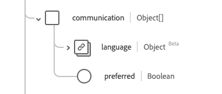

# Datatypen [!UICONTROL Person]

[!UICONTROL Person] är en XDM-datatyp (Standard Experience Data Model) som ger information om en allmän personpost. Den här datatypen skapas enligt specifikationerna för HL7 FHIR version 5.

| Visningsnamn | Egenskap | Datatyp | Beskrivning |
| --- | --- | --- | --- |
| [!UICONTROL Address] | `address` | Array med [[!UICONTROL Address]](../data-types/address.md) | En eller flera adresser för personen. |
| [!UICONTROL Communication] | `communication` | Array med objekt | Ett språk som kan användas för att kommunicera med personen om hans eller hennes hälsa. Mer information finns i avsnittet [nedan](#communication). |
| [!UICONTROL Identifier] | `identifier` | Array med [[!UICONTROL Identifier]](../data-types/identifier.md) | En mänsklig identifierare för den här personen. |
| [!UICONTROL Person Link Details] | `link` | Array med objekt | En länk till en resurs som gäller samma person. Mer information finns i avsnittet [nedan](#link). |
| [!UICONTROL Managing Organization] | `managingOrganization` | [[!UICONTROL Reference]](../data-types/reference.md) | Organisationen som är ansvarig för patientjournalen. |
| [!UICONTROL Marital Status] | `maritalStatus` | [[!UICONTROL Codeable Concept]](../data-types/codeable-concept.md) | En persons civilrättsliga (eller civilrättsliga) status |
| [!UICONTROL Name] | `name` | Array med [[!UICONTROL Human Name]](../data-types/human-name.md) | De namn som är associerade med en person. |
| [!UICONTROL Contact Details] | `telecom` | Matris av [[!UICONTROL Contact Point]] | Kontaktuppgifter till personen. |
| [!UICONTROL Is Active] | `active` | Boolean | Anger om personens post används aktivt. |
| [!UICONTROL Birth Date] | `birthDate` | Datum | Personens födelsedatum. |
| [!UICONTROL Deceased Indicator] | `deceasedBoolean` | Boolean | Anger om personen är avliden eller inte. |
| [!UICONTROL Deceased Date Time] | `deceasedDateTime` | DateTime | Datum och tid för dödsfall om personen avlider. |
| [!UICONTROL Gender] | `gender` | Sträng | Personens könsidentitet. Värdet för den här egenskapen måste vara lika med ett av följande kända enum-värden. <li> `female` </li> <li> `male` </li> <li> `other` </li> <li> `unknown`</li> |

Mer information om datatypen finns i den offentliga XDM-databasen:

* [Populerat exempel](https://github.com/adobe/xdm/blob/master/extensions/industry/healthcare/fhir/datatypes/identifier.example.1.json)
* [Fullständigt schema](https://github.com/adobe/xdm/blob/master/extensions/industry/healthcare/fhir/datatypes/identifier.schema.json)

## `communication` {#communication}

`communication` tillhandahålls som en array med objekt. Strukturen för varje objekt beskrivs nedan.

| Visningsnamn | Egenskap | Datatyp | Beskrivning |
| --- | --- | --- | --- |
| [!UICONTROL Language] | `language` | [[!UICONTROL Codeable concept]](../data-types/codeable-concept.md) | Det språk som kan användas för att kommunicera med personen om hans eller hennes hälsa. |
| [!UICONTROL Is Preferred Language] | `preferred` | Boolean | Anger om språket är det språk de föredrar eller inte. |

## `link` {#link}

`link` tillhandahålls som en array med objekt. Strukturen för varje objekt beskrivs nedan.

| Visningsnamn | Egenskap | Datatyp | Beskrivning |
| --- | --- | --- | --- |
| [!UICONTROL Target] | `target` | [[!UICONTROL Reference]](../data-types/reference.md) | Resursen som den här faktiska personen är associerad med. |
| [!UICONTROL Assurance] | `assurance` | Sträng | Den säkerhetsnivå som är kopplad till länken. Värdena för den här egenskapen måste vara lika med ett eller flera av följande kända enum-värden. <li> `level1` </li> <li> `level2` </li> <li> `level3` </li> <li> `level4` </li> |
