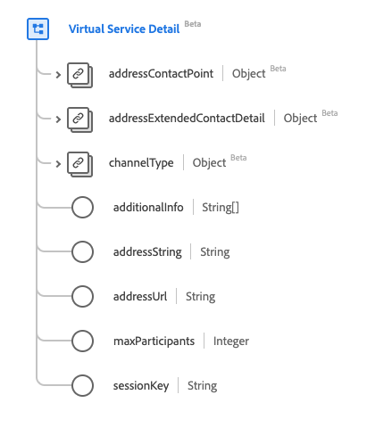

# Datatypen [!UICONTROL Virtual Service Detail]

[!UICONTROL Virtual Service Detail] är en XDM-datatyp (Standard Experience Data Model) som beskriver kontaktinformation för den virtuella tjänsten. Den här datatypen skapas enligt specifikationerna för HL7 FHIR version 5.

| Visningsnamn | Egenskap | Datatyp | Beskrivning |
| --- | --- | --- | --- |
| [!UICONTROL Address Contact Point] | `addressContactPoint` | [[!UICONTROL Contact Point]](../data-types/contact-point.md) | Information om en teknikförmedlad kontaktpunkt som en telefon, fax eller e-post. |
| [!UICONTROL Address Extended Contact Detail] | `addressExtendedContactDetail` | [[!UICONTROL Extended Contact Detail]](../data-types/extended-contact-detail.md) | Utökad kontaktinformation. |
| [!UICONTROL Channel Type] | `channelType` | [[!UICONTROL Coding]](../data-types/coding.md) | Den typ av virtuell tjänst som ska anslutas, till exempel Team, Zoom eller WhatsApp. |
| [!UICONTROL Additional Info] | `additionalInfo` | Array med strängar | Den adress som ska visa alternativ anslutningsinformation, representerad som en URI. |
| [!UICONTROL Address String] | `addressString` | Sträng | Den adress som ska användas för att ansluta till den virtuella tjänsten. |
| [!UICONTROL Address Url] | `addressUrl` | Sträng | Den URL som ska användas för att ansluta till den virtuella tjänsten, representerad som en URI. |
| [!UICONTROL Max Participants] | `maxParticipants` | Heltal | Det maximala antalet deltagare som stöds, med ett minsta värde på `0`. |
| [!UICONTROL Session Key] | `sessionKey` | Sträng | Sessionsnyckeln som krävs för den virtuella tjänsten. |

Mer information om datatypen finns i den offentliga XDM-databasen:

* [Populerat exempel](https://github.com/adobe/xdm/blob/master/extensions/industry/healthcare/fhir/datatypes/simplequantity.example.1.json)
* [Fullständigt schema](https://github.com/adobe/xdm/blob/master/extensions/industry/healthcare/fhir/datatypes/simplequantity.schema.json)
