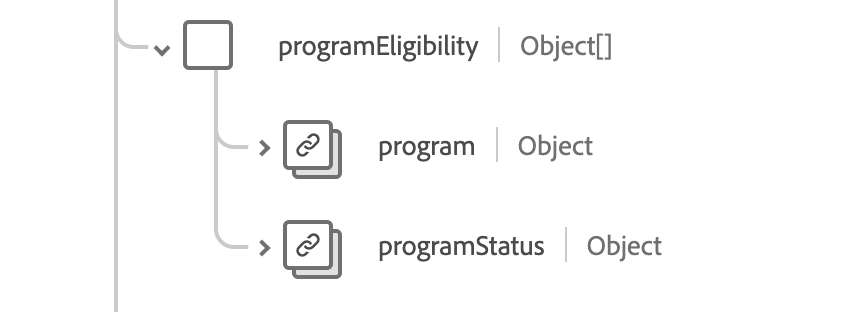

# Schemafältgruppen [!UICONTROL Immunization]

[!UICONTROL Immunization] är en standardschemafältgrupp för [[!DNL XDM Experience Event] klassen](../../../classes/experienceevent.md). Det tillhandahåller ett enskilt objekttypsfält `healthcareImmunization` som hämtar information om immuniseringshändelser.

| Visningsnamn | Egenskap | Datatyp | Beskrivning |
| --- | --- | --- | --- |
| [!UICONTROL Administered Product] | `administeredProduct` | [[!UICONTROL Codeable Reference]](../data-types/codeable-reference.md) | Produkten som administrerades. |
| [!UICONTROL Based On] | `basedOn` | Array med [[!UICONTROL Reference]](../data-types/reference.md) | Den myndighet som immuniseringshändelsen baseras på. |
| [!UICONTROL Dose Quantity] | `doseQuantity` | [[!UICONTROL Simple Quantity]](../data-types/simple-quantity.md) | Mängden administrerat vaccin. |
| [!UICONTROL Encounter] | `encounter` | [[!UICONTROL Reference]](../data-types/reference.md) | Immuniseringen var en del av. |
| [!UICONTROL Funding Source] | `fundingSource` | [[!UICONTROL Codeable Concept]](../data-types/codeable-concept.md) | Vaccinets finansieringskälla. |
| [!UICONTROL Identifier] | `identifier` | Array med [[!UICONTROL Identifier]](../data-types/identifier.md) | Affärsidentifieraren. |
| [!UICONTROL Information Source] | `informationSource` | [[!UICONTROL Codeable Reference]](../data-types/codeable-reference.md) | Anger den rapporterade postens källa. |
| [!UICONTROL Location] | `location` | [[!UICONTROL Reference]](../data-types/reference.md) | Den plats där immuniseringen inträffade. |
| [!UICONTROL Manufacturer] | `manufacturer` | [[!UICONTROL Codeable Reference]](../data-types/codeable-reference.md) | Vaccintillverkaren. |
| [!UICONTROL Note] | `note` | Array med [[!UICONTROL Annotation]](../data-types/annotation.md) | Ytterligare vaccinationsanteckningar. |
| [!UICONTROL Patient] | `patient` | [[!UICONTROL Reference]](../data-types/reference.md) | Vem var immuniserad. |
| [!UICONTROL Batch] | `performer` | Array med objekt | Vem utförde vaccinationshändelsen. Mer information finns i avsnittet [nedan](#performer). |
| [!UICONTROL Program Eligibility] | `programEligibility` | Array med objekt | Patientens rätt till ett specifikt vaccinationsprogram. Mer information finns i avsnittet [nedan](#program-eligibility). |
| [!UICONTROL Protocol Applied] | `protocolApplied` | Array med objekt | Protokollet som tillhandahålls av providern. Mer information finns i avsnittet [nedan](#protocol-applied). |
| [!UICONTROL Reaction] | `reaction` | Array med objekt | Detaljerade uppgifter om en reaktion efter immunisering. Mer information finns i avsnittet [nedan](#reaction). |
| [!UICONTROL Reason] | `reason` | Array med [[!UICONTROL Codeable Reference]](../data-types/codeable-reference.md) | Orsaken till immuniseringen. |
| [!UICONTROL Route] | `route` | [[!UICONTROL Codeable Concept]](../data-types/codeable-concept.md) | Hur vaccinet kom in i kroppen. |
| [!UICONTROL Site] | `site` | [[!UICONTROL Codeable Concept]](../data-types/codeable-concept.md) | Vaccinets placering i kroppen |
| [!UICONTROL Status Reason] | `statusReason` | [[!UICONTROL Codeable Concept]](../data-types/codeable-concept.md) | Orsaken till aktuell status. |
| [!UICONTROL Subpotent Reason] | `subpotentReason` | Array med [[!UICONTROL Codeable Concept]](../data-types/codeable-concept.md) | Anledningen till att vaccinet är subpotent. |
| [!UICONTROL Supporting Information] | `supportingInformation` | Array med [[!UICONTROL Reference]](../data-types/reference.md) | Ytterligare information som stöder immuniseringen. |
| [!UICONTROL Vaccine Code] | `vaccineCode` | [[!UICONTROL Codeable Concept]](../data-types/codeable-concept.md) | Koden för det administrerade vaccinet. |
| [!UICONTROL Expiration Date] | `expirationDate` | Datum | Utgångsdatum för vaccinet. |
| [!UICONTROL Is Subpotent] | `isSubpotent` | Boolean | Indikator för om vaccinet är subpotent. |
| [!UICONTROL Lot Number] | `lotNumber` | Sträng | Vaccinets partinummer. |
| [!UICONTROL Occurence DateTime] | `occurenceDateTime` | DateTime | Datum för vaccinets administrering. |
| [!UICONTROL Occurence String] | `occurenceString` | Sträng | Datum för vaccinets administrering. |
| [!UICONTROL Primary Source] | `primarySource` | Boolean | Anger om data har hämtats från en primär källa. |
| [!UICONTROL Status] | `status` | Sträng | Immuniseringens status. Värdet för den här egenskapen måste vara lika med ett av följande kända enum-värden. <li> `completed` </li> <li> `entered-in-error` </li> <li> `not-done` </li> |

Mer information om fältgruppen finns i den offentliga XDM-databasen:

* [Populerat exempel](https://github.com/adobe/xdm/blob/master/extensions/industry/healthcare/fhir/fieldgroups/immunization.example.1.json)
* [Fullständigt schema](https://github.com/adobe/xdm/blob/master/extensions/industry/healthcare/fhir/fieldgroups/immunization.schema.json)

## `performer` {#performer}

`performer` tillhandahålls som en array med objekt. Strukturen för varje objekt beskrivs nedan.

| Visningsnamn | Egenskap | Datatyp | Beskrivning |
| --- | --- | --- | --- |
| [!UICONTROL Actor] | `actor` | [[!UICONTROL Reference]](../data-types/reference.md) | Den person eller organisation som presterade. |
| [!UICONTROL Function] | `function` | [[!UICONTROL Codeable Concept]](../data-types/codeable-concept.md) | Vilken typ av prestanda gjordes. |

## `programEligibility` {#program-eligibility}

`programEligibility` tillhandahålls som en array med objekt. Strukturen för varje objekt beskrivs nedan.

| Visningsnamn | Egenskap | Datatyp | Beskrivning |
| --- | --- | --- | --- |
| [!UICONTROL Program] | `program` | [[!UICONTROL Codeable Concept]](../data-types/codeable-concept.md) | Det program som berättigande deklareras för. |
| [!UICONTROL Program Status] | `programStatus` | [[!UICONTROL Codeable Concept]](../data-types/codeable-concept.md) | Patientens berättigande till programmet. |

## `protocolApplied` {#protocol-applied}

`protocolApplied` tillhandahålls som en array med objekt. Strukturen för varje objekt beskrivs nedan.

| Visningsnamn | Egenskap | Datatyp | Beskrivning |
| --- | --- | --- | --- |
| [!UICONTROL Authority] | `authority` | [[!UICONTROL Reference]](../data-types/reference.md) | Vem ansvarar för att publicera rekommendationerna. |
| [!UICONTROL Target Disease] | `targetDisease` | Array med [[!UICONTROL Codeable Concept]](../data-types/codeable-concept.md) | Den sjukdom som vaccinet har som mål. |
| [!UICONTROL Dose Number] | `doseNumber` | Sträng | Dosnumret inom serien. |
| [!UICONTROL Series] | `series` | Sträng | Namnet på vaccinserien. |
| [!UICONTROL Series Doses] | `seriesDoses` | Sträng | Rekommenderat antal doser för immunitet. |

## `reaction` {#reaction}

`reaction` tillhandahålls som en array med objekt. Strukturen för varje objekt beskrivs nedan.

| Visningsnamn | Egenskap | Datatyp | Beskrivning |
| --- | --- | --- | --- |
| [!UICONTROL Manifestation] | `manifestation` | [[!UICONTROL Codeable Reference]](../data-types/codeable-concept.md) | Ytterligare information om reaktionen. |
| [!UICONTROL Date] | `date` | DateTime | När reaktionen började. |
| [!UICONTROL Reported] | `reported` | Sträng | Anger om reaktionen var självrapporterad. |
