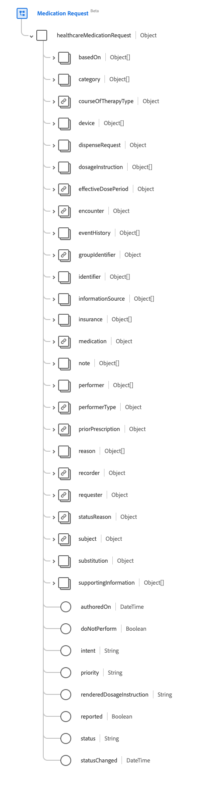
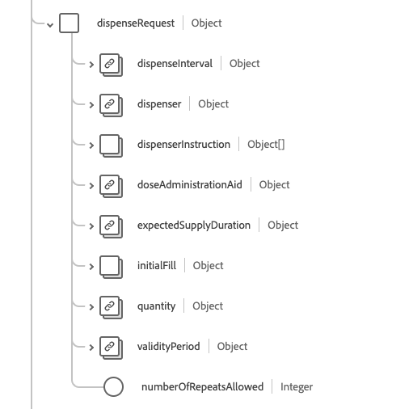

# Schemafältgruppen [!UICONTROL Medication Request]

[!UICONTROL Medication Request] är en standardschemafältgrupp för [[!DNL Medication] klass](../../../classes/medication.md), [[!DNL XDM Individual Profile] klass](../../../classes/individual-profile.md) och [[!DNL Provider class]](../../../classes/provider.md). Det innehåller ett enda fält av objekttyp `healthcareMedicationDispense` som fångar en order eller en begäran om att få tillgång till medicinen samt instruktioner för administrering av medicinen till en patient.

| Visningsnamn | Egenskap | Datatyp | Beskrivning |
| --- | --- | --- | --- |
| [!UICONTROL Based On] | `basedOn` | Array med [[!UICONTROL Reference]](../data-types/reference.md) | Den plan eller begäran som fullföljs av denna medicineringsbegäran. |
| [!UICONTROL Category] | `category` | Array med [[!UICONTROL Codeable Concept]](../data-types/codeable-concept.md) | Kategorisering eller gruppering av läkemedelsbegäran. |
| [!UICONTROL Course Of Therapy Type] | `courseOfTherapyType` | [[!UICONTROL Codeable Concept]](../data-types/codeable-concept.md) | Beskrivningen av det övergripande mönstret för administrering av läkemedlet till patienten. |
| [!UICONTROL Device] | `device` | Array med [[!UICONTROL Codeable Reference]](../data-types/codeable-reference.md) | Typ av anordning som ska användas för administrering av läkemedlet. |
| [!UICONTROL Dispense Request] | `dispenseRequest` | Objekt | Anger de specifika detaljerna i disponeringsbegäran, som ofta kallas läkemedelsorder. Mer information finns i avsnittet [nedan](#dispense-request). |
| [!UICONTROL Dosage Instruction] | `dosageInstructions` | Array med [[!UICONTROL Dosage]](../data-types/dosage.md) | Specifika anvisningar för hur läkemedlet ska användas av patienten. |
| [!UICONTROL Effective Dose Period] | `effectiveDosePeriod` | [[!UICONTROL Period]](../data-types/period.md) | Den period under vilken läkemedlet ska tas. Om det finns flera `dosageInstruction` rader (t.ex. om doserna minskas) är detta det tidigaste datumet och det senaste datumet för doseringsinstruktionerna. |
| [!UICONTROL Encounter] | `encounter` | [[!UICONTROL Reference]](../data-types/reference.md) | Den upptäcktes under vilken begäran skapades. |
| [!UICONTROL Event History] | `eventHistory` | Array med [[!UICONTROL Reference]](../data-types/reference.md) | Länka till register över incidenter som rör begäran om medicinering, t.ex. fullföljning av begäran, tidpunkt för viktiga övergångar eller relevanta uppdateringar. |
| [!UICONTROL Group Identifier] | `groupIdentifier` | [[!UICONTROL Identifier]](../data-types/identifier.md) | En delad identifierare för flera oberoende begäraninstanser som aktiverats av en enda författare. |
| [!UICONTROL Identifier] | `identifier` | Array med [[!UICONTROL Identifier]](../data-types/identifier.md) | Identifierare som är kopplade till medicineringsbegäran som definieras av affärsprocesser och/eller används för att referera till den när en direkt URL-referens till själva resursen inte är lämplig. |
| [!UICONTROL Information Source] | `informationSource` | Array med [[!UICONTROL Reference]](../data-types/reference.md) | Den person eller organisation som tillhandahöll informationen för begäran om källan är någon annan än `requester`. |
| [!UICONTROL Insurance] | `insurance` | Array med [[!UICONTROL Reference]](../data-types/reference.md) | Försäkringsplaner, utvidgning av täckning, förhandstillstånd och/eller förhandsbestämningar som kan behövas för att den begärda tjänsten ska kunna levereras. |
| [!UICONTROL Medication] | `medication` | [[!UICONTROL Codeable Reference]](../data-types/codeable-reference.md) | Identifierar det läkemedel som begärs. Detta bör vara en länk till en resurs som representerar detaljer om medicineringen, eller en kod som identifierar medicineringen. |
| [!UICONTROL Note] | `note` | Array med [[!UICONTROL Annotation]](../data-types/annotation.md) | Ytterligare information om förskrivningen som inte kunde förmedlas av övriga attribut. |
| [!UICONTROL Performer] | `performer` | Array med [[!UICONTROL Reference]](../data-types/reference.md) | Den angivna utföraren av behandlingen/ administrationen av läkemedlet. För enheter är detta det medel som är avsett att administrera läkemedlet. |
| [!UICONTROL Performer Type] | `performerType` | [[!UICONTROL Codeable Concept]](../data-types/codeable-concept.md) | Anger typ av utförare för administrering av läkemedlet. |
| [!UICONTROL Prior Prescription] | `priorPrescription` | [[!UICONTROL Reference]](../data-types/reference.md) | Hänvisningen till en order eller ett recept som ska ersättas av denna begäran. |
| [!UICONTROL Reason] | `reason` | Array med [[!UICONTROL Codeable Reference]](../data-types/reference.md) | Orsaken eller indikationen till beställningen eller inte beställningen av läkemedlet. |
| [!UICONTROL Recorder] | `recorder` | [[!UICONTROL Reference]](../data-types/reference.md) | Den person som angav ordern för en annan persons räkning. |
| [!UICONTROL Requester] | `requester` | [[!UICONTROL Reference]](../data-types/reference.md) | Den person, organisation eller enhet som initierade begäran och ansvarar för aktiveringen. |
| [!UICONTROL Status Reason] | `statusReason` | [[!UICONTROL Codeable Concept]](../data-types/codeable-concept.md) | Orsaken till begärans aktuella tillstånd. |
| [!UICONTROL Subject] | `subject` | [[!UICONTROL Reference]](../data-types/reference.md) | Den person eller grupp som läkemedlet har begärts för. |
| [!UICONTROL Substitution] | `substitution` | Objekt | Anger om en ersättning kan eller inte bör ingå i rabatten. Innehåller tre egenskaper: <li>`allowedBoolean`: Ett booleskt värde som är true om förskrivaren tillåter en ersättning.</li> <li>`allowedCodeableConcept`: Ett [[!UICONTROL Codeable Concept]](../data-types/codeable-concept.md)-värde som tillhandahåller en kod om förskrivaren tillåter en ersättning.</li> <li>`reason`: Ett [[!UICONTROL Codeable Concept]](../data-types/codeable-concept.md)-värde som anger en orsak till ersättningen.</li> |
| [!UICONTROL Supporting Information] | `supportingInformation` | Array med [[!UICONTROL Reference]](../data-types/reference.md) | Information som kan underlätta för patienter att ta medicinen, t. ex. längd och vikt. |
| [!UICONTROL Authored On] | `authoredOn` | DateTime | Datumet (och eventuellt tiden) då receptet skrevs. |
| [!UICONTROL Do Not Perform] | `doNotPerform` | Boolean | En boolesk indikation som är sann är att patienten ska sluta ta (eller inte börja) medicineringen. |
| [!UICONTROL Intent] | `intent` | Sträng | Avsikten med begäran. Värdet för den här egenskapen måste vara lika med ett av följande kända enum-värden. <li> `proposal` </li> <li> `plan` </li> <li> `order` </li> <li> `original-order` </li> <li> `reflex-order` </li> <li> `filler-order` </li> <li> `instance-order` </li> <li> `option` </li> |
| [!UICONTROL Priority] | `priority` | Sträng | Förfrågans prioritet. Värdet för den här egenskapen måste vara lika med ett av följande kända enum-värden. <li> `routine` </li> <li> `urgent` </li> <li> `asap` </li> <li> `stat` </li> |
| [!UICONTROL Rendered Dosage Instruction] | `renderedDosageInstruction` | Sträng | En fullständig representation av dosen finns i alla doseringsanvisningar. Ska användas när flera doseringsanvisningar ingår för att representera komplex dosering såsom dosökning eller nedtrappning. |
| [!UICONTROL Reported] | `reported` | Boolean | Anger om den här posten har hämtats som en sekundär rapporterad post i stället för som en ursprunglig primär sanningskälla. |
| [!UICONTROL Status] | `status` | Sträng | Status för utskänkningen. Värdet för den här egenskapen måste vara lika med ett av följande kända enum-värden. <li> `preperation` </li> <li> `in-progress` </li> <li> `cancelled` </li> <li> `on-hold` </li> <li> `completed` </li> <li> `entered-in-error` </li> <li> `stopped` </li> <li> `declined` </li> <li> `unknown` </li> |
| [!UICONTROL Status Changed] | `statusChanged` | DateTime | Det datum (och eventuellt tid) då statusen för ändrades. |

Mer information om fältgruppen finns i den offentliga XDM-databasen:

* [Populerat exempel](https://github.com/adobe/xdm/blob/master/extensions/industry/healthcare/fhir/fieldgroups/medicationrequest.example.1.json)
* [Fullständigt schema](https://github.com/adobe/xdm/blob/master/extensions/industry/healthcare/fhir/fieldgroups/medicationrequest.schema.json)

## `dispenseRequest` {#dispense-request}

`dispenseRequest` tillhandahålls som en array med objekt. Strukturen för varje objekt beskrivs nedan.

| Visningsnamn | Egenskap | Datatyp | Beskrivning |
| --- | --- | --- | --- |
| [!UICONTROL Dispense Interval] | `dispenseInterval` | [[!UICONTROL Duration]](../data-types/duration.md) | Den kortaste tid som måste förflyta mellan läkemedelsdisponeringar. |
| [!UICONTROL Dispenser] | `dispenser` | [[!UICONTROL Reference]](../data-types/reference.md) | Den avsedda organisation som kommer att ge bort läkemedlet enligt förskrivarens anvisningar. |
| [!UICONTROL Dispenser Instruction] | `dispenserInstruction` | Array med [[!UICONTROL Annotation]](../data-types/annotation.md) | Ytterligare information om sprutan, såsom rådgivning som ska ges till patienten |
| [!UICONTROL Dose Administration Aid] | `doseAdministrationAid` | [[!UICONTROL Codeable Concept]](../data-types/codeable-concept.md) | Information om vilken typ av läkemedelsförpackning som ska tillhandahållas för läkemedelsbehållaren. |
| [!UICONTROL Expected Supply Duration] | `expectedSupplyDuration` | [[!UICONTROL Duration]](../data-types/duration.md) | Den tidsperiod under vilken den levererade produkten förväntas användas, eller hur lång tid utdelningen förväntas ta. |
| [!UICONTROL Initial Fill] | `initialFill` | Objekt | Information för den inledande fyllningen. Innehåller två egenskaper: <li>`quantity`: Ett [[!UICONTROL Simple Quantity]](../data-types/simple-quantity.md)-värde som anger mängden som ska anges under den första utdelningen.</li> <li>`duration`: Ett [[!UICONTROL Duration]](../data-types/duration.md)-värde som anger hur lång tid den första dispensen förväntas ta.</li> |
| [!UICONTROL Quantity] | `quantity` | [[!UICONTROL Simple Quantity]](../data-types/simple-quantity.md) | Det belopp som ska lämnas ut för en fyllning. |
| [!UICONTROL Validity Period] | `validityPeriod` | [[!UICONTROL Period]](../data-types/period.md) | Förskrivningens giltighetsperiod. |
| [!UICONTROL Number Of Repeats Allowed] | `numberOfRepeatsAllowed` | Heltal | Antalet tillåtna påfyllningar, med ett minimivärde på 0. |
