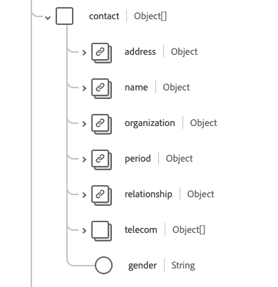

# Schemafältgruppen [!UICONTROL Patient]

[!UICONTROL Patient] är en standardschemafältgrupp för [[!DNL XDM Individual Profile] klassen](../../../classes/individual-profile.md). Det tillhandahåller ett enskilt objekttypsfält `healthcarePatient` som innehåller demografiska och andra administrativa uppgifter om mottagningsvård eller andra hälsorelaterade tjänster för en individ eller djur.

| Visningsnamn | Egenskap | Datatyp | Beskrivning |
| --- | --- | --- | --- |
| [!UICONTROL Address] | `address` | Array med [[!UICONTROL Address]](../data-types/address.md) | Adressinformation för patienten. |
| [!UICONTROL Communication] | `communication` | Array med objekt | Ett språk som kan användas för att kommunicera med patienten om deras hälsa. Mer information finns i avsnittet [nedan](#communication). |
| [!UICONTROL Patient Contacts] | `contact` | Array med objekt | En patientes kontaktgrupp, till exempel en vårdnadshavare, en partner eller en vän. Mer information finns i avsnittet [nedan](#contact). |
| [!UICONTROL General Practitioner] | `generalPractioner` | Array med [[!UICONTROL Reference]](../data-types/reference.md) | Patientens primära vårdgivare. |
| [!UICONTROL Identifier] | `identifier` | Array med [[!UICONTROL Identifier]](../data-types/identifier.md) | En identifierare för patienten. |
| [!UICONTROL Patient Link Details] | `link` | Array med objekt | En länk till en patient eller en släkting som rör samma individ. Mer information finns i avsnittet [nedan](#link). |
| [!UICONTROL Managing Organization] | `managingOrganization` | [[!UICONTROL Reference]](../data-types/reference.md) | Förvaringsorganisationen för patientens register. |
| [!UICONTROL Marital Status] | `maritalStatus` | [[!UICONTROL Codeable Concept]](../data-types/codeable-concept.md) | Patientens civilstånd. |
| [!UICONTROL Name] | `name` | Array med [[!UICONTROL Human name]](../data-types/human-name.md) | Namnet som är associerat med patienten. |
| [!UICONTROL Contact Details] | `telecom` | Array med [[!UICONTROL Contact Point]](../data-types/contact-point.md) | En kontaktinformation, t.ex. ett telefonnummer eller en e-postadress, som patienten kan kontaktas med. |
| [!UICONTROL Is Active] | `active` | Boolean | Anger om patientens journal används aktivt. |
| [!UICONTROL Birth Date] | `birthDate` | Datum | Patientens födelsedatum. |
| [!UICONTROL Deceased Indicator] | `deceasedBoolean` | Boolean | Anger om patienten är avliden eller inte. |
| [!UICONTROL Deceased Date Time] | `deceasedDateTime` | DateTime | Datum och tid för patientens död. |
| [!UICONTROL Gender] | `gender` | Sträng | Personens könsidentitet. Värdet för den här egenskapen måste vara lika med ett av följande kända enum-värden. <li> `female` </li> <li> `male` </li> <li> `other` </li> <li> `unknown`</li> |
| [!UICONTROL Is Part Of Multiple Birth] | `multipleBirthBoolean` | Boolean | Anger om patienten är en del av en flerbörd. |
| [!UICONTROL Birth Number] | `multipleBirthInteger` | Heltal | Födelsenumret i sekvensen. |

Mer information om fältgruppen finns i den offentliga XDM-databasen:

* [Populerat exempel](https://github.com/adobe/xdm/blob/master/extensions/industry/healthcare/fhir/fieldgroups/patient.example.1.json)
* [Fullständigt schema](https://github.com/adobe/xdm/blob/master/extensions/industry/healthcare/fhir/fieldgroups/patient.schema.json)

## `communication` {#communication}

`communication` tillhandahålls som en array med objekt. Strukturen för varje objekt beskrivs nedan.

| Visningsnamn | Egenskap | Datatyp | Beskrivning |
| --- | --- | --- | --- |
| [!UICONTROL Language] | `language` | [[!UICONTROL Codeable Concept]](../data-types/codeable-concept.md) | Det språk som kan användas för att kommunicera med personen om deras hälsa. |
| [!UICONTROL Is Preferred Language] | `preferred` | Boolean | Anger om språket är det språk de föredrar eller inte. |

## `contact` {#contact}

`contact` tillhandahålls som en array med objekt. Strukturen för varje objekt beskrivs nedan.

| Visningsnamn | Egenskap | Datatyp | Beskrivning |
| --- | --- | --- | --- |
| [!UICONTROL Contact Address] | `address` | [[!UICONTROL Address]](../data-types/address.md) | Kontaktpersonens adress. |
| [!UICONTROL Contact Name] | `name` | [[!UICONTROL Human Name]](../data-types/human-name.md) | Kontaktpersonens namn. |
| [!UICONTROL Contact Organization] | `organization` | [[!UICONTROL Reference]](../data-types/reference.md) | Organisationen som är associerad med kontaktpersonen. |
| [!UICONTROL Contact Period] | `period` | [[!UICONTROL Period]](../data-types/period.md) | Den tidsperiod då kontakten användes eller används. |
| [!UICONTROL Relationship'] | `relationship` | [[!UICONTROL Codeable Concept]](../data-types/codeable-concept.md) | Förhållandet mellan patienten och kontaktpersonen. |
| [!UICONTROL Contact Details] | `telecom` | Array med objekt | Kontaktuppgifter för kontaktpersonen. Mer information finns i avsnittet [nedan](#telecom). |
| [!UICONTROL Gender] | `gender` | Sträng | Personens könsidentitet. Värdet för den här egenskapen måste vara lika med ett av följande kända enum-värden. <li> `female` </li> <li> `male` </li> <li> `other` </li> <li> `unknown`</li> |

### `telecom` {#telecom}

`telecom` tillhandahålls som en array med objekt. Strukturen för varje objekt beskrivs nedan.

| Visningsnamn | Egenskap | Datatyp | Beskrivning |
| --- | --- | --- | --- |
| [!UICONTROL Contact Point] | `contactPoint` | [[!UICONTROL Contact point]](../data-types/contact-point.md) | Kontaktuppgifter för personen. |

## `link` {#link}

`link` tillhandahålls som en array med objekt. Strukturen för varje objekt beskrivs nedan.

| Visningsnamn | Egenskap | Datatyp | Beskrivning |
| --- | --- | --- | --- |
| [!UICONTROL Other] | `other` | [[!UICONTROL Reference]](../data-types/reference.md) | En länk till en patient eller en släkting som rör samma individ. |
| [!UICONTROL Type] | `type` | Sträng | Typ av länk mellan de två patientresurserna. |
