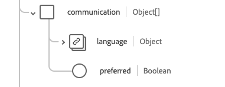

# Schemafältgruppen [!UICONTROL Practioner]

[!UICONTROL Practioner] är en standardschemafältgrupp för [[!DNL XDM Individual Profile] klassen](../../../classes/individual-profile.md) och [[!DNL Provider class]](../../../classes/provider.md). Det tillhandahåller ett enskilt objekttypsfält `healthcarePractioner` som innehåller information om en person som är direkt eller indirekt involverad i etableringen av hälso- och sjukvårdstjänster eller relaterade tjänster.

| Visningsnamn | Egenskap | Datatyp | Beskrivning |
| --- | --- | --- | --- |
| [!UICONTROL Address] | `address` | Array med [[!UICONTROL Address]](../data-types/address.md) | Adress(er) till den eller de verkställande som befinner sig utanför arbetsplatsen, t.ex. en hemadress. |
| [!UICONTROL Communication] | `communication` | Array med objekt | Ett språk som kan användas för att kommunicera med behandlaren. Mer information finns i avsnittet [nedan](#communication) |
| [!UICONTROL Identifier] | `identifier` | Array med [[!UICONTROL Identifier]](../data-types/identifier.md) | En identifierare som gäller för den här personen i den här rollen. |
| [!UICONTROL Name] | `name` | Array med [[!UICONTROL Human Name]](../data-types/human-name.md) | Namnet/namnen som är kopplade till behandlaren. |
| [!UICONTROL Qualification] | `qualification` | Array med objekt | De officiella kvalifikationer, certifieringar, ackrediteringar, utbildning, licenser eller liknande som ger rätt till eller på annat sätt gäller läkarens vård. Mer information finns i avsnittet [nedan](#qualification). |
| [!UICONTROL Contact Details] | `telecom` | Array med [[!UICONTROL Contact Point]](../data-types/contact-point.md) | Kontaktuppgifter till läkaren. |
| [!UICONTROL Active] | `active` | Boolean | Anger om praktikpersonens register används aktivt. |
| [!UICONTROL Birth Date] | `birthDate` | Datum | Dag för läkarens födelse. |
| [!UICONTROL Deceased Indicator] | `deceasedBoolean` | Boolean | Anger om yrkesutövaren är avliden. |
| [!UICONTROL Deceased Date Time] | `deceasedDateTime` | DateTime | Datum och tid för läkarens död. |
| [!UICONTROL Gender] | `gender` | Sträng | Personens könsidentitet. Värdet för den här egenskapen måste vara lika med ett av följande kända enum-värden. <li> `female` </li> <li> `male` </li> <li> `other` </li> <li> `unknown`</li> |

Mer information om fältgruppen finns i den offentliga XDM-databasen:

* [Populerat exempel](https://github.com/adobe/xdm/blob/master/extensions/industry/healthcare/fhir/fieldgroups/practitioner.example.1.json)
* [Fullständigt schema](https://github.com/adobe/xdm/blob/master/extensions/industry/healthcare/fhir/fieldgroups/practitioner.schema.json)

## `communication` {#communication}

`communication` tillhandahålls som en array med objekt. Strukturen för varje objekt beskrivs nedan.

| Visningsnamn | Egenskap | Datatyp | Beskrivning |
| --- | --- | --- | --- |
| [!UICONTROL Language] | `language` | [[!UICONTROL Codeable Concept]](../data-types/codeable-concept.md) | Det språk som kan användas för att kommunicera med personen om deras hälsa. |
| [!UICONTROL Is Preferred Language] | `preferred` | Boolean | Anger om språket är det språk de föredrar eller inte. |

## `qualification` {#qualification}

`qualification` tillhandahålls som en array med objekt. Strukturen för varje objekt beskrivs nedan.

| Visningsnamn | Egenskap | Datatyp | Beskrivning |
| --- | --- | --- | --- |
| [!UICONTROL Code] | `code` | [[!UICONTROL Codeable Concept]](../data-types/codeable-concept.md) | Den kodade representationen av kvalifikationen. |
| [!UICONTROL Identifier] | `identifier` | Array med [[!UICONTROL Identifier]](../data-types/identifier.md) | En identifierare för kvalificeringen. |
| [!UICONTROL Issuer] | `issuer` | [[!UICONTROL Reference]](../data-types/reference.md) | Organisationen som reglerar och utfärdar kvalifikationen. |
| [!UICONTROL Period] | `period` | [[!UICONTROL Period]](../data-types/period.md) | Den period under vilken kvalificeringen är giltig. |
