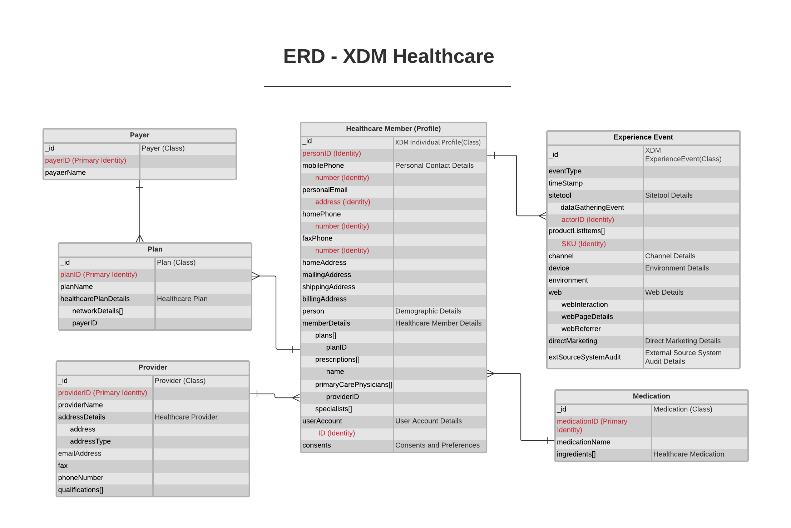

# [!UICONTROL Healthcare] branschdatamodell - ERD

Följande enhetsrelationsdiagram (ERD) representerar en standardiserad datamodell för hälso- och sjukvården. Den europeiska referensdosen presenteras avsiktligt på ett avnormaliserat sätt och med hänsyn till hur data lagras i Adobe Experience Platform.

>[!NOTE]
>
>Den rekommenderade referensmetoden är en rekommendation för hur du ska modellera dina data för det här användningsexemplet. Om du vill använda den här datamodellen i Platform måste du själv skapa de rekommenderade scheman och deras relationer. Mer information finns i guiderna för att hantera [scheman](../../ui/resources/schemas.md) och [relationer](../../tutorials/relationship-ui.md) i användargränssnittet.

Använd följande förklaring för att tolka denna ERD:

* Varje entitet som visas i är baserad på en underliggande [XDM-klass (Experience Data Model)](../composition.md#class).
* Fält som är indragna under ett överordnat fält representerar ett underordnat fält, eller underfält, som tillhör den överordnade fältgruppen.
* De viktigaste fälten för en viss enhet markeras med rött.
* Alla egenskaper som kan användas för att identifiera enskilda kunder markeras som&quot;identitet&quot;, med en av dessa egenskaper markerad som&quot;primär identitet&quot;.
* Enhetsrelationer markeras som icke-beroende eftersom cookie-baserade händelser ofta inte kan avgöra vem eller vilka personer som gjorde transaktionen.

>[!NOTE]
>
>Varje entitet innehåller ett fält av typen &quot;_ID&quot;, som representerar attributet för den unika strängidentifieraren (`_id`) för posten eller händelsen i fråga. Det här fältet används för att spåra den enskilda postens eller händelsens unika karaktär, förhindra dubblering av data och söka efter dessa data i underordnade tjänster. I vissa fall kan `_id` vara en [Universally Unique Identifier (UUID)](https://tools.ietf.org/html/rfc4122) eller [Global Unique Identifier (GUID)](https://docs.microsoft.com/en-us/dotnet/api/system.guid?view=net-5.0).  Det är viktigt att särskilja att **det här fältet inte representerar en identitet som är relaterad till en enskild person**, utan själva dataposten. Identitetsdata som relaterar till en person, händelse eller affärsenhet ska i stället vara begränsade till [identitetsfält](../composition.md#identity) som tillhandahålls av kompatibla fältgrupper.

## [!UICONTROL Healthcare] användningsfall

I följande tabell beskrivs de rekommenderade klasserna och schemafältgrupperna för flera vanliga hälsoanvändningsfall.

| Användningsfall | Rekommenderade klasser och fältgrupper |
| --- | --- |
| Förbättra den digitala värvningen och upplevelsen bland konsumenter som handlar på försäkringar. Exempel: <ul><li>När man öppnar en sida som innehåller allmän information (t.ex. planer, plannamn/nivåer, mediciner, hälsoprogram osv.), förstår man hur de beter sig och vad de letar efter för att skicka reklamkampanjer eller rikta dem mot tredjepartsplattformar med annonser.</li><li>När människor söker efter information om hjärthälsa och vaccin, skicka dem vaccinrelaterad information om hjärthälsa för att skapa varumärkeskänsla eller be dem att boka vacciner.</li></ul> | <ul><li>**[[!UICONTROL XDM Individual Profile]](../../classes/individual-profile.md)**:<ul><li>[[!UICONTROL Healthcare Member Details]](../../field-groups/profile/healthcare-member-details.md)</li><li>Relationsfält har skapats mellan `planID` attribut och scheman som använder klassen [!UICONTROL Plan].</li></ul></li><li>**[[!UICONTROL Payer]](../../classes/payer.md)**</li><li>**[[!UICONTROL Plan]](../../classes/plan.md)**:<ul><li>[[!UICONTROL Healthcare Plan Details]](../../field-groups/plan/healthcare-plan-details.md)</li></ul></li><li>**[[!UICONTROL XDM ExperienceEvent]](../../classes/experienceevent.md)**:<ul><li>[[!UICONTROL Application Details]](../../field-groups/event/application-details.md)</li><li>[[!UICONTROL Sitetool Details]](../../field-groups/event/sitetool-details.md)</li><li>[[!UICONTROL  Campaign Marketing Details]](../../field-groups/event/campaign-marketing-details.md)</li></ul></li></ul> |
| Öka den digitala kundvärvningen genom riktade annonser baserade på tidigare onlinebeteenden och hälsodata. | <ul><li>**[[!UICONTROL XDM Individual Profile]](../../classes/individual-profile.md)**:<ul><li>[[!UICONTROL Healthcare Member Details]](../../field-groups/profile/healthcare-member-details.md)</li></ul></li><li>**[[!UICONTROL Provider]](../../classes/provider.md)**:<ul><li>[[!UICONTROL Healthcare Provider]](../../field-groups/provider/healthcare-provider.md)</li></ul></li><li>**[[!UICONTROL XDM ExperienceEvent]](../../classes/experienceevent.md)**:<ul><li>[[!UICONTROL Web Details]](../../field-groups/event/web-details.md)</li><li>[[!UICONTROL Advertising Details]](../../field-groups/event/advertising-details.md)</li></ul></li></ul> |
| Förbättra registreringen och kontots generering i hälsoplaner genom att spåra marknadsföring av försäkringar via olika kanaler, för att förstå hur en kund fick reda på om ett försäkringsföretag. | <ul><li>**[[!UICONTROL XDM Individual Profile]](../../classes/individual-profile.md)**:<ul><li>[[!UICONTROL Healthcare Member Details]](../../field-groups/profile/healthcare-member-details.md)</li></ul></li><li>**[[!UICONTROL Payer]](../../classes/payer.md)**</li><li>**[[!UICONTROL Plan]](../../classes/plan.md)**:<ul><li>[[!UICONTROL Healthcare Plan Details]](../../field-groups/plan/healthcare-plan-details.md)</li></ul></li><li>**[[!UICONTROL XDM ExperienceEvent]](../../classes/experienceevent.md)**:<ul><li>[[!UICONTROL Web Details]](../../field-groups/event/web-details.md)</li><li>[[!UICONTROL Advertising Details]](../../field-groups/event/advertising-details.md)</li></ul></li></ul> |
| Undvik avbrott i sjukförsäkringsskyddet. | <ul><li>**[[!UICONTROL XDM Individual Profile]](../../classes/individual-profile.md)**:<ul><li>[[!UICONTROL Healthcare Member Details]](../../field-groups/profile/healthcare-member-details.md)</li></ul></li><li>**[[!UICONTROL Plan]](../../classes/plan.md)**:<ul><li>[[!UICONTROL Healthcare Plan Details]](../../field-groups/plan/healthcare-plan-details.md)</li></ul></li></ul> |
| Befordra läkemedelsinformation till leverantörer som använder annonser som är direkt till kunden (DTC). | <ul><li>**[[!UICONTROL XDM Individual Profile]](../../classes/individual-profile.md)**:<ul><li>[[!UICONTROL Healthcare Member Details]](../../field-groups/profile/healthcare-member-details.md)</li></ul></li><li>**[[!UICONTROL Medication]](../../classes/medication.md)**:<ul><li>[[!UICONTROL Healthcare medication]](../../field-groups/medication/healthcare-medication.md)</li></ul></li><li>**[[!UICONTROL XDM ExperienceEvent]](../../classes/experienceevent.md)**:<ul><li>[[!UICONTROL Web Details]](../../field-groups/event/web-details.md)</li><li>[[!UICONTROL Advertising Details]](../../field-groups/event/advertising-details.md)</li></ul></li></ul> |
