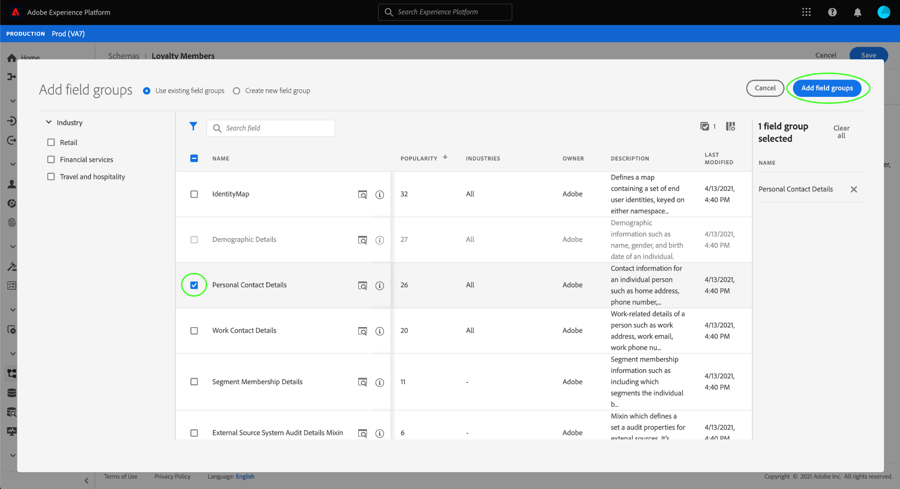

# Skapa ett schema med [!DNL Schema Editor]

Med Adobe Experience Platform användargränssnitt kan du skapa och hantera [!DNL Experience Data Model] (XDM) scheman på en interaktiv visuell arbetsyta som kallas [!DNL Schema Editor]. I den här självstudiekursen beskrivs hur du skapar ett schema med [!DNL Schema Editor].

>[!NOTE]
>
>I demonstrationssyfte handlar stegen i den här självstudiekursen om att skapa ett exempelschema som beskriver medlemmar i ett kundlojalitetsprogram. Du kan använda de här stegen för att skapa ett annat schema för dina egna syften, men vi rekommenderar att du först följer med när du skapar exempelschemat för att lära dig funktionerna i [!DNL Schema Editor].

Om du föredrar att skapa ett schema med [!DNL Schema Registry] API:t börjar i stället med att läsa [[!DNL Schema Registry] utvecklarhandbok](../api/getting-started.md) innan du provar självstudiekursen på [skapa ett schema med API](create-schema-api.md).

## Komma igång

Den här självstudiekursen kräver en fungerande förståelse för de olika aspekter av Adobe Experience Platform som används för att skapa scheman. Innan du börjar med den här självstudiekursen bör du läsa om följande koncept i dokumentationen:

* [[!DNL Experience Data Model (XDM)]](../home.md): Det standardiserade ramverk som [!DNL Platform] organiserar kundupplevelsedata.
   * [Grunderna för schemakomposition](../schema/composition.md): En översikt över XDM-scheman och deras byggstenar, inklusive klasser, schemafältgrupper, datatyper och enskilda fält.
* [[!DNL Real-Time Customer Profile]](../../profile/home.md): Ger en enhetlig konsumentprofil i realtid baserad på aggregerade data från flera källor.

## Öppna [!UICONTROL Schemas] arbetsyta {#browse}

The [!UICONTROL Schemas] arbetsytan i [!DNL Platform] Användargränssnittet ger en visualisering av [!DNL Schema Library], så att du kan visa hur du hanterar de scheman som är tillgängliga för din organisation. Arbetsytan innehåller även [!DNL Schema Editor], arbetsytan som du kan använda för att skapa ett schema genom hela kursen.

Efter inloggning [!DNL Experience Platform], markera **[!UICONTROL Schemas]** i den vänstra navigeringen för att öppna **[!UICONTROL Schemas]** arbetsyta. The **[!UICONTROL Browse]** -fliken visar en lista med scheman (en representation av [!DNL Schema Library]) som du kan visa och anpassa. Listan innehåller namn, typ, klass och beteende (post- eller tidsserie) som schemat baseras på samt datum och tid då schemat senast ändrades.

Se guiden [undersöka befintliga XDM-resurser i användargränssnittet](../ui/explore.md) för mer information.

## Skapa och namnge ett schema {#create}

Välj **[!UICONTROL Create schema]** i det övre högra hörnet av **[!UICONTROL Schemas]** arbetsyta. En listruta visas där du kan välja mellan huvudklasserna [!UICONTROL XDM Individual Profile] och [!UICONTROL XDM ExperienceEvent]. Om dessa klasser inte passar dina syften kan du även välja **[!UICONTROL Browse]** att välja bland andra tillgängliga klasser eller [skapa en ny klass](#create-new-class).

I den här självstudiekursen väljer du **[!UICONTROL XDM Individual Profile]**.

Eftersom du valde en standard-XDM-klass att basera schemat på, kan **[!UICONTROL Add field group]** visas så att du kan börja lägga till fält direkt i schemat. För tillfället väljer du **[!UICONTROL Cancel]** för att stänga dialogrutan.

The [!DNL Schema Editor] visas. Det här är arbetsytan som du kommer att komponera ditt schema på. Ett namnlöst schema skapas automatiskt i **[!UICONTROL Structure]** -delen av arbetsytan när du kommer till redigeraren, tillsammans med standardfälten som ingår i alla scheman baserade på den klassen. Den tilldelade klassen för schemat listas också under **[!UICONTROL Class]** in **[!UICONTROL Composition]** -avsnitt.

>[!NOTE]
>
>Du kan [ändra klassen för ett schema](#change-class) när som helst under den inledande dispositionsprocessen innan schemat har sparats, men detta bör göras med yttersta försiktighet. Fältgrupper är bara kompatibla med vissa klasser. Om du ändrar klassen återställs arbetsytan och alla fält du har lagt till.

Använd fälten till höger om redigeraren för att ange ett visningsnamn och en valfri beskrivning av schemat. När ett namn har angetts uppdateras arbetsytan med det nya namnet på schemat.

Det finns flera viktiga saker att tänka på när du ska bestämma ett namn för schemat:

* Schemanamn ska vara korta och beskrivande så att schemat kan hittas senare.
* Schemanamn måste vara unika, vilket innebär att de också måste vara tillräckligt specifika för att de inte ska återanvändas i framtiden. Om din organisation till exempel har separata lojalitetsprogram för olika varumärken är det klokt att kalla ditt schema&quot;Varumärke A lojalitetsmedlemmar&quot; för att göra det enkelt att skilja på dem från andra lojalitetsrelaterade scheman som du kan definiera senare.
* Du kan också använda schemabeskrivningen för att tillhandahålla ytterligare sammanhangsberoende information om schemat.

I den här självstudiekursen skapas ett schema för att importera data som är relaterade till medlemmarna i ett lojalitetsprogram, och därför heter schemat&quot;Förmånsmedlemmar&quot;.

## Lägg till en fältgrupp {#field-group}

Nu kan du börja lägga till fält i schemat genom att lägga till fältgrupper. En fältgrupp är en grupp med ett eller flera fält som ofta används tillsammans för att beskriva ett visst koncept. I den här självstudiekursen används fältgrupper för att beskriva medlemmarna i bonusprogrammet och samla in viktig information som namn, födelsedag, telefonnummer, adress med mera.

Om du vill lägga till en fältgrupp väljer du **[!UICONTROL Add]** i **[!UICONTROL Field groups]** undersektion.

En ny dialogruta visas med en lista över tillgängliga fältgrupper. Varje fältgrupp är endast avsedd att användas med en viss klass. Därför visas bara fältgrupper som är kompatibla med den klass du valde (i det här fallet visas [!DNL XDM Individual Profile] klass). Om du använder en standard-XDM-klass sorteras listan med fältgrupper på ett intelligent sätt baserat på användningens popularitet.

Om du väljer en fältgrupp i listan visas den i den högra listen. Om du vill kan du markera flera fältgrupper och lägga till var och en i listan i den högra listen innan du bekräftar. Dessutom visas en ikon till höger om den markerade fältgruppen där du kan förhandsgranska strukturen för de fält som den innehåller.

När du förhandsgranskar en fältgrupp visas en detaljerad beskrivning av fältgruppens schema i den högra listen. Du kan även navigera genom fältgruppens fält på den angivna arbetsytan. När du väljer olika fält uppdateras den högra listen så att information om fältet i fråga visas. Välj **[!UICONTROL Back]** när du är klar med förhandsgranskningen för att återgå till dialogrutan för val av fältgrupp.

För den här självstudiekursen väljer du **[!UICONTROL Demographic Details]** fältgrupp och sedan markera **[!UICONTROL Add field group]**.

Arbetsytan för schemat visas igen. The **[!UICONTROL Field groups]** sektioner nu listor &quot;[!UICONTROL Demographic Details]&quot; och **[!UICONTROL Structure]** -avsnittet innehåller fälten från fältgruppen. Du kan välja fältgruppens namn under **[!UICONTROL Field groups]** för att markera specifika fält på arbetsytan.

Den här fältgruppen bidrar med flera fält under namnet på den översta nivån `person` med datatypen &quot;[!UICONTROL Person]&quot;. Den här gruppen med fält beskriver information om en individ, inklusive namn, födelsedatum och kön.

>[!NOTE]
>
>Kom ihåg att fälten kan använda skalära typer (till exempel sträng, heltal, matris eller datum), liksom alla datatyper (en grupp fält som representerar ett gemensamt koncept) som definieras i [!DNL Schema Registry].

Observera att `name` fältet har datatypen &quot;[!UICONTROL Person name]&quot;, vilket innebär att det också beskriver ett vanligt koncept och innehåller namnrelaterade underfält som förnamn, efternamn, titel och suffix.

Markera de olika fälten på arbetsytan för att visa eventuella ytterligare fält som de bidrar till schemastrukturen.

## Lägg till en annan fältgrupp {#field-group-2}

Nu kan du upprepa samma steg för att lägga till en annan fältgrupp. När du visar **[!UICONTROL Add field group]** lägg märke till att[!UICONTROL Demographic Details]&quot;fältgruppen är nedtonad och det går inte att markera kryssrutan intill den. Detta förhindrar att du av misstag duplicerar fältgrupper som du redan har inkluderat i det aktuella schemat.

För den här självstudiekursen väljer du &quot;[!DNL Personal Contact Details]&quot; fältgrupp från dialogrutan och välj **[!UICONTROL Add field group]** för att lägga till den i schemat.

När arbetsytan har lagts till visas den igen. &quot;[!UICONTROL Personal Contact Details]&quot; finns nu listad under **[!UICONTROL Field groups]** i **[!UICONTROL Composition]** och fält för hemadress, mobiltelefon med mera har lagts till under **[!UICONTROL Structure]**.

Liknar `name` de fält du just lade till representerar koncept för flera fält. Till exempel: `homeAddress` har datatypen &quot;[!UICONTROL Postal address]&quot; och `mobilePhone` har datatypen &quot;[!UICONTROL Phone number]&quot;. Du kan markera vart och ett av dessa fält för att expandera dem och visa de ytterligare fält som ingår i datatypen.

## Definiera en anpassad fältgrupp {#define-field-group}

The &quot;[!UICONTROL Loyalty Members]schemat är avsett för att samla in data som är relaterade till medlemmarna i ett lojalitetsprogram, så det kommer att kräva vissa specifika lojalitetsrelaterade fält.

Det finns en standard [!UICONTROL Loyalty Details] fältgrupp som du kan lägga till i schemat för att fånga vanliga fält som är relaterade till ett bonusprogram. Vi rekommenderar att du använder standardfältgrupper för att representera koncept som hämtats in av dina scheman, men strukturen i standardfältgruppen för lojalitet kanske inte kan samla in alla relevanta data för ditt specifika lojalitetsprogram. I det här scenariot kan du välja att definiera en ny anpassad fältgrupp för att hämta fälten i stället.

Öppna **[!UICONTROL Add Field group]** igen, men den här gången väljer **[!UICONTROL Create New Field group]** nära toppen. Du ombeds sedan ange ett visningsnamn och en beskrivning för fältgruppen.

Precis som med klassnamn ska fältgruppsnamnet vara kort och enkelt och beskriva vad fältgruppen kommer att bidra till schemat. Även dessa är unika, så du kommer inte att kunna återanvända namnet och måste därför se till att det är tillräckligt specifikt.

I den här självstudiekursen ger du den nya fältgruppen namnet&quot;Lojalitetsinformation&quot;.

Välj **[!UICONTROL Add field group]** för att gå tillbaka till [!DNL Schema Editor]. &quot;[!UICONTROL Loyalty Details]&quot; ska nu visas under **[!UICONTROL Field groups]** till vänster på arbetsytan, men det finns inga fält som är kopplade till den ännu och därför visas inga nya fält under **[!UICONTROL Structure]**.

## Lägg till fält i fältgruppen {#field-group-fields}

Nu när du har skapat fältgruppen&quot;Förmånsinformation&quot; är det dags att definiera fälten som fältgruppen ska bidra till schemat.

Börja med att markera fältgruppsnamnet i dialogrutan **[!UICONTROL Field groups]** -avsnitt. När du gör det visas fältgruppens egenskaper till höger om redigeraren och en **plus (+)** visas bredvid namnet på schemat under **[!UICONTROL Structure]**.

Välj **plus (+)** ikon bredvid &quot;[!DNL Loyalty Members]&quot; för att skapa en ny nod i strukturen. Den här noden (anropad) `_tenantId` i det här exemplet) representerar din IMS-organisations klient-ID, föregånget av ett understreck. Närvaron av innehavar-ID anger att fälten som du lägger till finns i organisationens namnutrymme.

Fälten som du lägger till är alltså unika för din organisation och kommer att sparas i [!DNL Schema Registry] inom ett specifikt område som är tillgängligt endast för din organisation. Fält som du definierar måste alltid läggas till i klientnamnutrymmet för att förhindra konflikter med namn från andra standardklasser, fältgrupper, datatyper och fält.

I den namngivna noden finns en[!UICONTROL New Field]&quot;. Detta är början på[!UICONTROL Loyalty Details]fältgrupp.

Börja med att skapa en `loyalty` fält med typen &quot;[!UICONTROL Object]&quot; som kommer att användas för dina lojalitetsrelaterade fält. När du är klar väljer du **[!UICONTROL Apply]**.

Ändringarna används och de nyskapade `loyalty` visas. Välj **plus (+)** -ikonen bredvid objektet om du vill lägga till fler lojalitetsrelaterade fält. A &quot;[!UICONTROL New Field]&quot; visas och **[!UICONTROL Field properties]** -avsnittet visas till höger på arbetsytan.

Varje fält kräver följande information:

* **[!UICONTROL Field Name]:** Fältets namn, skrivet i kameraläge. Exempel: loyaltyLevel
* **[!UICONTROL Display Name]:** Fältets namn, skrivet i versaler. Exempel: Lojalitetsnivå
* **[!UICONTROL Type]:** Fältets datatyp. Detta inkluderar grundläggande skalärtyper och alla datatyper som definieras i [!DNL Schema Registry]. Exempel: [!UICONTROL String], [!UICONTROL Integer], [!UICONTROL Boolean], [!UICONTROL Person], [!UICONTROL Address], [!UICONTROL Phone number], osv.
* **[!UICONTROL Description]:** En valfri beskrivning av fältet ska inkluderas, skriven med inledande versal, med högst 200 tecken.

Det första fältet för `Loyalty` objektet kommer att vara en sträng som anropas `loyaltyId`. När det nya fältets typ anges till[!UICONTROL String]&quot;, **[!UICONTROL Field properties]** -avsnittet fylls i med flera alternativ för att tillämpa begränsningar, inklusive standardvärde, format och maximal längd.

Olika begränsningsalternativ är tillgängliga beroende på vilken datatyp som har valts. Sedan `loyaltyId` blir en e-postadress, välj &quot;[!UICONTROL email]&quot; från **[!UICONTROL Format]** nedrullningsbar meny. Välj **[!UICONTROL Apply]** för att tillämpa ändringarna.

## Lägg till fler fält i fältgruppen {#field-group-fields-2}

Nu när du har lagt till `loyaltyId` kan du lägga till ytterligare fält för att hämta lojalitetsrelaterad information som:

* Punkter (heltal)
* Medlem sedan (datum)

Om du vill lägga till varje fält i schemat väljer du **plus (+)** -ikonen bredvid `loyalty` och fylla i den information som krävs.

När det är klart innehåller Loyalty-objektet fält för lojalitets-ID, poäng och medlemssedan.

## Lägg till ett uppräkningsfält i fältgruppen {#enum}

När du definierar fält i [!DNL Schema Editor]Det finns dock ytterligare alternativ som du kan använda för grundläggande fälttyper för att ge ytterligare begränsningar för de data som fältet kan innehålla. Användningsexempel för dessa begränsningar förklaras i följande tabell:

| Begränsning | Beskrivning |
| --- | --- |
| [!UICONTROL Required] | Anger att fältet är obligatoriskt för datainmatning. Alla data som överförs till en datauppsättning som baseras på det här schemat och som inte innehåller det här fältet kommer att misslyckas vid inmatning. |
| [!UICONTROL Array] | Anger att fältet innehåller en array med värden, var och en med den angivna datatypen. Om du till exempel använder den här begränsningen för ett fält med datatypen &quot;[!UICONTROL String]&quot; anger att fältet kommer att innehålla en array med strängar. |
| [!UICONTROL Enum] | Anger att det här fältet måste innehålla ett av värdena från en numrerad lista med möjliga värden. |
| [!UICONTROL Identity] | Anger att det här fältet är ett identitetsfält. Mer information om identitetsfält finns [senare i den här självstudiekursen](#identity-field). |
| [!UICONTROL Relationship] | När schemarelationer kan härledas genom användning av unionsschemat och [!DNL Real-Time Customer Profile]gäller detta endast scheman som delar samma klass. The [!UICONTROL Relationship] -begränsning anger att det här fältet refererar till den primära identiteten för ett schema baserat på en annan klass, vilket innebär en relation mellan de två schemana. Se självstudiekursen om [definiera en relation](./relationship-ui.md) för mer information. |

{style=&quot;table-layout:auto&quot;}

>[!NOTE]
>
>Alla obligatoriska, identitets- eller relationsfält visas i den vänstra listen, vilket gör att du enkelt kan hitta fälten oavsett hur komplexa schemat är.
>
>

För den här självstudiekursen [!DNL "loyalty"] -objektet i schemat kräver ett nytt uppräkningsfält som beskriver kundens&quot;lojalitetsnivå&quot;, där värdet bara kan vara ett av fyra möjliga alternativ. Om du vill lägga till det här fältet i schemat väljer du **plus (+)** -ikonen bredvid `loyalty` objekt och fylla i obligatoriska fält för **[!UICONTROL Field name]** och **[!UICONTROL Display name]**. För **[!UICONTROL Type]**, välj &quot;[!UICONTROL String]&quot;.

Ytterligare kryssrutor visas för fältet när dess typ har valts, inklusive kryssrutor för **[!UICONTROL Array]**, **[!UICONTROL Enum]** och **[!UICONTROL Identity]**.

Välj **[!UICONTROL Enum]** kryssruta för att öppna **[!UICONTROL Enum values]** nedan. Här kan du ange **[!UICONTROL Value]** (i camelCase) och **[!UICONTROL Label]** (ett valfritt, läsvänligt namn i Title Case) för varje godtagbar lojalitetsnivå.

När du har slutfört alla fältegenskaper väljer du **[!UICONTROL Apply]** för att lägga till &quot;[!DNL loyaltyLevel]&quot; till `loyalty` -objekt.

## Konvertera ett flerfältsobjekt till en datatyp {#datatype}

The `loyalty` objektet innehåller nu flera lojalitetsspecifika fält och representerar en gemensam datastruktur som kan vara användbar i andra scheman. The [!DNL Schema Editor] Med kan du enkelt tillämpa återanvändbara flerfältsobjekt genom att konvertera strukturen för dessa objekt till datatyper.

Datatyper möjliggör konsekvent användning av flerfältsstrukturer och ger större flexibilitet än en fältgrupp eftersom de kan användas var som helst inom ett schema. Detta görs genom att ställa in fältets **[!UICONTROL Type]** värdet på alla datatyper som definieras i [!DNL Schema Registry].

Konvertera `loyalty` till en datatyp, markera `loyalty` fält under **[!UICONTROL Structure]** väljer **[!UICONTROL Convert to new data type]** till höger om redigeraren under **[!UICONTROL Field properties]**. En grön pover visas som bekräftar att objektet har konverterats.

Nu när du tittar under **[!UICONTROL Structure]** ser du att `loyalty` fältet har datatypen &quot;[!DNL Loyalty]&quot; och fälten har små låsikoner bredvid sig, vilket anger att de inte längre är enskilda fält utan snarare är en del av datatypen för flera fält.

I ett framtida schema kan du nu tilldela ett fält som[!DNL Loyalty]&quot; och det skulle automatiskt inkludera fält för ID, lojalitetsnivå, medlem sedan och poäng.

>[!NOTE]
>
>Du kan också skapa och redigera anpassade datatyper oberoende av redigeringsscheman. Se guiden [skapa och redigera datatyper](../ui/resources/data-types.md) för mer information.

## Söka efter och filtrera schemafält

Schemat innehåller nu flera fältgrupper förutom de fält som anges i basklassen. När du arbetar med större scheman kan du markera kryssrutorna intill fältgruppsnamnen i den vänstra listen för att filtrera de visade fälten så att de bara visas för de fältgrupper du är intresserad av.

Om du letar efter ett specifikt fält i ditt schema kan du även använda sökfältet för att filtrera visade fält efter namn, oavsett vilken fältgrupp de ingår i.

>[!IMPORTANT]
>
>Sökfunktionen tar hänsyn till alla valda fältgruppsfilter när matchande fält visas. Om sökfrågan inte visar de förväntade resultaten kan du behöva dubbelkontrollera att du inte filtrerar ut relevanta fältgrupper.

## Ange ett schemafält som identitetsfält {#identity-field}

Den standarddatastruktur som scheman ger kan utnyttjas för att identifiera data som tillhör samma individ i flera olika källor, vilket möjliggör olika användningsfall i senare led, som segmentering, rapportering, datavetenskapsanalys med mera. För att sammanfoga data baserat på individuella identiteter måste nyckelfälten markeras som [!UICONTROL Identity] fält inom tillämpliga scheman.

[!DNL Experience Platform] gör det enkelt att ange ett identitetsfält med hjälp av en **[!UICONTROL Identity]** kryssrutan i [!DNL Schema Editor]. Du måste dock bestämma vilket fält som är det bästa alternativet att använda som identitet, baserat på vilken typ av data du har.

Det kan till exempel finnas tusentals lojalitetsprogrammedlemmar som tillhör samma &quot;lojalitetsnivå&quot;, men varje medlem i lojalitetsprogrammet har ett unikt `loyaltyId` (som i det här fallet är den enskilda medlemmens e-postadress). Det faktum att `loyaltyId` är en unik identifierare för varje medlem vilket gör det till en bra kandidat för ett identitetsfält, medan `loyaltyLevel` inte.

>[!IMPORTANT]
>
>Stegen som beskrivs nedan beskriver hur du lägger till en identitetsbeskrivning i ett befintligt schemafält. Som ett alternativ till att definiera identitetsfält i strukturen för själva schemat kan du även använda en `identityMap` fält som ska innehålla identitetsinformation i stället.
>
>Om du tänker använda `identityMap`bör du tänka på att den åsidosätter alla primära identiteter som du lägger till direkt i schemat. Se avsnittet om `identityMap` i [grunderna i guiden för schemakomposition](../schema/composition.md#identityMap) för mer information.

I **[!UICONTROL Structure]** väljer du `loyaltyId` fält och **[!UICONTROL Identity]** kryssrutan visas under **[!UICONTROL Field properties]**. Markera kryssrutan och alternativet för att ange den som **[!UICONTROL Primary identity]** visas. Markera även den här rutan.

>[!NOTE]
>
>Varje schema får endast innehålla ett primärt identitetsfält. När ett schemafält har angetts som primär identitet får du ett felmeddelande om du senare försöker ange ett annat identitetsfält i schemat som primärt.

Sedan måste du ange en **[!UICONTROL Identity namespace]** i listan med fördefinierade namnutrymmen i listrutan. Sedan `loyaltyId` är kundens e-postadress, välj &quot;[!UICONTROL Email]&quot; i listrutan. Välj **[!UICONTROL Apply]** för att bekräfta uppdateringarna av `loyaltyId` fält.

>[!NOTE]
>
>En lista med standardnamnutrymmen och definitioner av dessa finns i [[!DNL Identity Service] dokumentation](../../identity-service/troubleshooting-guide.md#standard-namespaces).

När du har tillämpat ändringen visas ikonen för `loyaltyId` visar en fingeravtryckssymbol som anger att det nu är ett identitetsfält.

Nu kan alla data hämtas till `loyaltyId` ska användas för att identifiera den enskilda personen och sammanfoga en enda bild av kunden. Mer information om att arbeta med identiteter i [!DNL Experience Platform]kan du läsa [[!DNL Identity Service]](../../identity-service/home.md) dokumentation.

## Aktivera schemat för användning i [!DNL Real-Time Customer Profile] {#profile}

[[!DNL Real-Time Customer Profile]](../../profile/home.md) använder identitetsdata i [!DNL Experience Platform] för att ge en helhetsbild av varje enskild kund. Tjänsten bygger robusta 360-gradersprofiler av kundattribut samt tidsstämplade konton för varje interaktion som kunderna har haft i alla system som är integrerade med [!DNL Experience Platform].

För att ett schema ska kunna aktiveras för användning med [!DNL Real-Time Customer Profile]måste den ha en primär identitet definierad. Du får ett felmeddelande om du försöker aktivera ett schema utan att först definiera en primär identitet.

 

Så här aktiverar du schemat &quot;Bonusmedlemmar&quot; för användning i [!DNL Profile], börja med att välja &quot;[!DNL Loyalty Members]&quot; i **[!UICONTROL Structure]** i redigeraren.

Till höger om redigeraren visas information om schemat inklusive visningsnamn, beskrivning och typ. Förutom denna information finns det **[!UICONTROL Profile]** växlingsknapp.

Välj **[!UICONTROL Profile]** och en pover visas, där du ombeds bekräfta att du vill aktivera schemat för [!DNL Profile].

 

>[!WARNING]
>
>När ett schema har aktiverats för [!DNL Real-Time Customer Profile] och sparat kan den inte inaktiveras.

Välj **[!UICONTROL Enable]** för att bekräfta ditt val. Du kan välja **[!UICONTROL Profile]** växla igen för att inaktivera schemat om du vill, men när schemat har sparats samtidigt [!DNL Profile] är aktiverat kan det inte längre inaktiveras.

## Nästa steg och ytterligare resurser

Nu när du är klar med att komponera schemat kan du se hela schemat på arbetsytan. Välj **[!UICONTROL Save]** och schemat sparas i [!DNL Schema Library], så att det blir tillgängligt för [!DNL Schema Registry].

Ditt nya schema kan nu användas för att importera data till [!DNL Platform]. Kom ihåg att när schemat väl har använts för att importera data får endast additiva ändringar göras. Se [grunderna för schemakomposition](../schema/composition.md) för mer information om schemaversion.

Nu kan du följa självstudiekursen på [definiera en schemarelation i användargränssnittet](./relationship-ui.md) om du vill lägga till ett nytt relationsfält i schemat&quot;Förmånsmedlemmar&quot;.

Schemat &quot;Bonusmedlemmar&quot; är också tillgängligt för att visas och hanteras med [!DNL Schema Registry] API. Börja med att läsa [[!DNL Schema Registry API] utvecklarhandbok](../api/getting-started.md).

### Videoresurser

>[!WARNING]
>
>The [!DNL Platform] Gränssnittet som visas i följande videofilmer är inaktuellt. Läs dokumentationen ovan för de senaste skärmbilderna och funktionerna i användargränssnittet.

I följande video visas hur du skapar ett enkelt schema i [!DNL Platform] Gränssnitt.

>[!VIDEO](https://video.tv.adobe.com/v/27012?quality=12&learn=on)

Följande video är tänkt att förstärka din förståelse för att arbeta med fältgrupper och klasser.

>[!VIDEO](https://video.tv.adobe.com/v/27013?quality=12&learn=on)

## Bilaga

Följande avsnitt innehåller ytterligare information om användningen av [!DNL Schema Editor].

### Skapa en ny klass {#create-new-class}

[!DNL Experience Platform] ger flexibilitet att definiera ett schema baserat på en klass som är unik för din organisation. Mer information om hur du skapar en ny klass finns i handboken [skapa och redigera klasser i användargränssnittet](../ui/resources/classes.md#create).

### Ändra klassen för ett schema {#change-class}

Du kan ändra schemaklassen när som helst under den inledande dispositionsprocessen innan schemat har sparats.

>[!WARNING]
>
>Omtilldelning av klassen för ett schema bör göras med extrem försiktighet. Fältgrupper är bara kompatibla med vissa klasser. Om du ändrar klassen återställs arbetsytan och alla fält du har lagt till.

Om du vill lära dig hur du ändrar klassen för ett schema kan du läsa guiden på [hantera scheman i användargränssnittet](../ui/resources/schemas.md).
