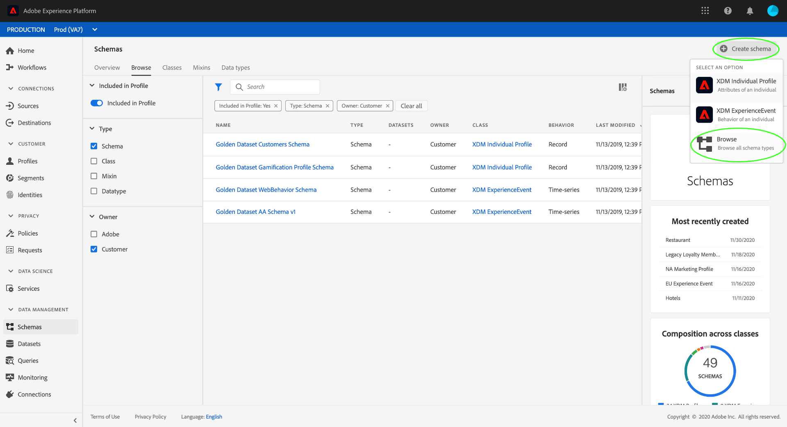
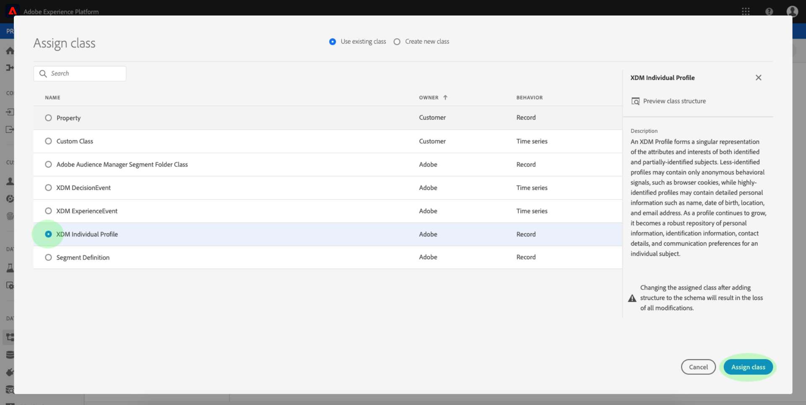

# Skapa ett schema med [!DNL Schema Editor]

Med Adobe Experience Platform användargränssnitt kan du skapa och hantera [!DNL Experience Data Model] (XDM) scheman på en interaktiv visuell arbetsyta som kallas [!DNL Schema Editor]. I den här självstudiekursen beskrivs hur du skapar ett schema med hjälp av [!DNL Schema Editor].

>[!NOTE]
>
>I demonstrationssyfte handlar stegen i den här självstudiekursen om att skapa ett exempelschema som beskriver medlemmar i ett kundlojalitetsprogram. Du kan använda de här stegen för att skapa ett annat schema för dina egna syften, men vi rekommenderar att du först följer med när du skapar exempelschemat för att lära dig funktionerna i [!DNL Schema Editor].

Om du hellre vill skapa ett schema med [!DNL Schema Registry] API:t börjar du med att läsa [[!DNL Schema Registry] utvecklarhandboken](../api/getting-started.md) innan du försöker självstudiekursen om hur du [skapar ett schema med API](create-schema-api.md).

## Komma igång

Den här självstudiekursen kräver en fungerande förståelse för de olika aspekter av Adobe Experience Platform som används för att skapa scheman. Innan du börjar med den här självstudiekursen bör du läsa om följande koncept i dokumentationen:

* [[!DNL Experience Data Model (XDM)]](../home.md): Det standardiserade ramverket som [!DNL Platform] organiserar kundupplevelsedata.
   * [Grundläggande om schemakomposition](../schema/composition.md): En översikt över XDM-scheman och deras byggstenar, inklusive klasser, mixins, datatyper och fält.
* [[!DNL Real-time Customer Profile]](../../profile/home.md): Ger en enhetlig konsumentprofil i realtid baserad på aggregerade data från flera källor.

## Bläddra bland befintliga scheman på [!UICONTROL Schemas] arbetsytan {#browse}

Arbetsytan [!UICONTROL Schemas] i [!DNL Platform] användargränssnittet innehåller en visualisering av [!DNL Schema Library]så att du kan visa hur du hanterar de scheman som är tillgängliga för din organisation. Arbetsytan innehåller också arbetsytan [!DNL Schema Editor]som du kan använda för att skapa ett schema genom hela kursen.

När du har loggat in [!DNL Experience Platform]väljer du **[!UICONTROL Schemas]** i den vänstra navigeringen för att öppna **[!UICONTROL Schemas]** arbetsytan. På **[!UICONTROL Browse]** fliken visas en lista med scheman (en representation av [!DNL Schema Library]) som du kan visa och anpassa. Listan innehåller namn, typ, klass och beteende (post- eller tidsserie) som schemat baseras på samt datum och tid då schemat senast ändrades.

Markera filterikonen bredvid sökfältet om du vill använda filterfunktioner för alla resurser i registret, inklusive klasser, mixins och datatyper. Du kan också filtrera baserat på om resurser ägs av Adobe eller din organisation och om de har aktiverats för användning i [!DNL Real-time Customer Profile].

## Skapa och namnge ett schema {#create}

Om du vill börja komponera ett schema väljer du **[!UICONTROL Create Schema]** i det övre högra hörnet av **[!UICONTROL Schemas]** arbetsytan. En listruta visas där du kan välja mellan huvudklasserna [!UICONTROL XDM Individual Profile] och [!UICONTROL XDM ExperienceEvent]eller bläddra bland andra tillgängliga klasser. I den här självstudiekursen väljer du **[!UICONTROL XDM Individual Profile]**.

Tecknet [!DNL Schema Editor] visas. Det här är arbetsytan som du kommer att komponera ditt schema på. När du kommer till redigeraren skapas ett namnlöst schema automatiskt i arbetsytans **[!UICONTROL Structure]** avsnitt, tillsammans med standardfälten i alla scheman baserade på [!UICONTROL XDM Individual Profile] klassen. Den tilldelade klassen för schemat listas under **[!UICONTROL Class]** i **[!UICONTROL Composition]** avsnittet.

>[!NOTE]
>
>Du kan [ändra schemaklassen](#change-class) när som helst under den inledande dispositionsprocessen innan schemat har sparats, men detta bör göras med yttersta försiktighet. Blandningar är bara kompatibla med vissa klasser, och om du ändrar klassen återställs arbetsytan och alla fält du har lagt till.

Använd fälten till höger om redigeraren för att ange ett visningsnamn och en valfri beskrivning av schemat. När ett namn har angetts uppdateras arbetsytan med det nya namnet på schemat.

Det finns flera viktiga saker att tänka på när du ska bestämma ett namn för schemat:

* Schemanamn ska vara korta och beskrivande så att schemat kan hittas senare.
* Schemanamn måste vara unika, vilket innebär att de också måste vara tillräckligt specifika för att de inte ska återanvändas i framtiden. Om din organisation till exempel har separata lojalitetsprogram för olika varumärken är det klokt att kalla ditt schema&quot;Varumärke A lojalitetsmedlemmar&quot; för att göra det enkelt att skilja på dem från andra lojalitetsrelaterade scheman som du kan definiera senare.
* Du kan också använda schemabeskrivningen för att tillhandahålla ytterligare sammanhangsberoende information om schemat.

I den här självstudiekursen skapas ett schema för att importera data som är relaterade till medlemmarna i ett lojalitetsprogram, och därför heter schemat&quot;Förmånsmedlemmar&quot;.

## Lägga till en blandning {#mixin}

Nu kan du börja lägga till fält i ditt schema genom att lägga till mixar. En blandning är en grupp med ett eller flera fält som ofta används tillsammans för att beskriva ett visst koncept. I den här självstudiekursen används mixins för att beskriva medlemmarna i bonusprogrammet och samla in viktig information som namn, födelsedag, telefonnummer, adress med mera.

Om du vill lägga till en blandning väljer du **[!UICONTROL Add]** i **[!UICONTROL Mixins]** underavsnittet.

En ny dialogruta visas med en lista över tillgängliga mixar. Varje blandning är bara avsedd att användas med en viss klass, och därför visas endast de blandningar som är kompatibla med den klass du valde (i det här fallet [!DNL XDM Individual Profile] klassen).

Om du väljer en blandning i listan visas den i den högra listen. Dessutom visas en ikon till höger om den markerade mixen, som du kan använda för att förhandsgranska strukturen för de fält som den innehåller. Markera **[!UICONTROL Profile Person Details]** blandningen och markera sedan **[!UICONTROL Add Mixin]**.

Arbetsytan för schemat visas igen. I **[!UICONTROL Mixins]** avsnittet visas nu&quot;[!UICONTROL Profile Person Details]&quot; och i avsnittet finns de fält som finns i blandningen **[!UICONTROL Structure]** . Du kan markera namnet på mixen under **[!UICONTROL Mixins]** avsnittet för att markera de specifika fält som finns på arbetsytan.

Den här blandningen bidrar med flera fält under namnet &quot;[!UICONTROL person]&quot; på den översta nivån med datatypen &quot;[!UICONTROL Person]&quot;. Den här gruppen med fält beskriver information om en individ, inklusive namn, födelsedatum och kön.

>[!NOTE]
>
>Kom ihåg att du kan använda skalära typer i fält (till exempel sträng, heltal, matris eller datum), liksom alla datatyper (en grupp fält som representerar ett gemensamt koncept) som definieras i [!DNL Schema Registry].

Observera att&quot;[!UICONTROL name]&quot;-fältet har datatypen&quot;[!UICONTROL Full name]&quot;, vilket innebär att det beskriver ett gemensamt koncept och innehåller namnrelaterade underfält som förnamn, efternamn, titel och suffix.

Markera de olika fälten på arbetsytan för att se eventuella ytterligare fält som de bidrar till schemastrukturen.

## Lägg till ytterligare en blandning {#mixin-2}

Nu kan du upprepa samma steg för att lägga till en annan blandning. När du visar **[!UICONTROL Add Mixin]** dialogrutan den här gången kan du lägga märke till att&quot;[!UICONTROL Profile Person Details]&quot;-mixinen är nedtonad och att alternativknappen bredvid den inte kan markeras. Detta förhindrar att du av misstag duplicerar blandningar som du redan har inkluderat i det aktuella schemat.

Nu kan du lägga till&quot;[!DNL Profile Personal Details" mixin] från dialogrutan.

När arbetsytan har lagts till visas den igen. &quot;[!UICONTROL Profile Personal Details]&quot; visas nu under **[!UICONTROL Mixins]** i **[!UICONTROL Composition]** avsnittet, och fält för hemadress, mobiltelefon med mera har lagts till under **[!UICONTROL Structure]**.

Ungefär som i fältet&quot;[!UICONTROL name]&quot; representerar de fält du just lade till koncept för flera fält. &quot;[!UICONTROL homeAddress]&quot; har till exempel datatypen &quot;[!UICONTROL Address]&quot; och &quot;[!UICONTROL mobilePhone]&quot; har datatypen &quot;[!UICONTROL Phone Number]&quot;. Du kan markera vart och ett av dessa fält för att expandera dem och visa de ytterligare fält som ingår i datatypen.

## Definiera en ny blandning {#define-mixin}

&quot;[!UICONTROL Loyalty Members]&quot;-schemat är avsett för att samla in data som är relaterade till medlemmarna i ett lojalitetsprogram, så det kräver vissa specifika lojalitetsrelaterade fält. Det finns inga standardblandningar som innehåller de nödvändiga fälten, och du måste därför definiera en ny blandning.

När du öppnar dialogrutan väljer du den här gången *[!UICONTROL Add Mixin]* **[!UICONTROL Create New Mixin]**. Du ombeds sedan ange en **[!UICONTROL Display Name]** och **[!UICONTROL Description]** en för din blandning.

Precis som med klassnamn ska mixnamnet vara kort och enkelt och innehålla en beskrivning av vad mixinen kommer att bidra till schemat. Även dessa är unika, så du kan inte återanvända namnet och måste därför se till att det är tillräckligt specifikt.

I den här självstudiekursen anger du den nya blandningen&quot;[!UICONTROL Loyalty Details]&quot;.

Välj **[!UICONTROL Add Mixin]** att gå tillbaka till [!DNL Schema Editor]. &quot;[!UICONTROL Loyalty Details]&quot; ska nu visas under **[!UICONTROL Mixins]** till vänster på arbetsytan, men det finns inga fält som är kopplade till den ännu och därför visas inga nya fält under **[!UICONTROL Structure]**.

## Lägg till fält i mixinen {#mixin-fields}

Nu när du har skapat&quot;[!UICONTROL Loyalty Details]&quot;-blandningen är det dags att definiera de fält som blandningen ska bidra till schemat.

Börja med att markera blandningsnamnet i **[!UICONTROL Mixins]** avsnittet. När du har gjort det visas egenskaperna för mixen till höger om redigeraren och en **[!UICONTROL Add Field]** knapp visas bredvid namnet på schemat under **[!UICONTROL Structure]**.

Välj **[!UICONTROL Add Field]** bredvid&quot;[!DNL Loyalty Members]&quot; för att skapa en ny nod i strukturen. Den här noden (kallas &quot;_tenantId&quot; i det här exemplet) representerar din IMS-organisations klient-ID, föregånget av ett understreck. Närvaron av innehavar-ID anger att fälten som du lägger till finns i organisationens namnutrymme.

Med andra ord är de fält du lägger till unika för din organisation och kommer att sparas i [!DNL Schema Registry] i ett specifikt område som bara är tillgängligt för din organisation. Fält som du definierar måste alltid läggas till i klientnamnutrymmet för att förhindra kollisioner med namn från andra standardklasser, mixins, datatyper och fält.

I den namngivna noden finns ett &quot;[!UICONTROL New Field]&quot;. Detta är början på &quot;[!UICONTROL Loyalty Details]&quot;-mixinen.

Använd kontrollerna till höger i redigeraren och börja med att skapa ett&quot;[!DNL loyalty]&quot;-fält med typen&quot;[!UICONTROL Object]&quot; som ska användas för dina lojalitetsrelaterade fält. När du är klar väljer du **[!UICONTROL Apply]**.

Ändringarna tillämpas och det nyskapade&quot;[!DNL loyalty]&quot; objektet visas. Välj **[!UICONTROL Add Field]** bredvid objektet om du vill lägga till fler lojalitetsrelaterade fält. Ett&quot;[!UICONTROL New Field]&quot; visas och avsnittet visas på den högra sidan av arbetsytan **[!UICONTROL Field Properties]** .

Varje fält kräver följande information:

* **[!UICONTROL Field Name]:** Fältets namn, skrivet i kameraläge. Exempel: loyaltyLevel
* **[!UICONTROL Display Name]:** Fältets namn, skrivet i versaler. Exempel: Lojalitetsnivå
* **[!UICONTROL Type]:** Fältets datatyp. Detta inkluderar grundläggande skalära typer och alla datatyper som definieras i [!DNL Schema Registry]. Exempel: [!UICONTROL string], [!UICONTROL integer], [!UICONTROL boolean], [!UICONTROL Person], [!UICONTROL Address], [!UICONTROL Phone Number]osv.
* **[!UICONTROL Description]:** En valfri beskrivning av fältet ska inkluderas, skriven med inledande versal, med högst 200 tecken.

Det första fältet för [!DNL Loyalty] objektet blir en sträng med namnet &quot;[!DNL loyaltyId]&quot;. När du anger det nya fältets typ till &quot;[!UICONTROL String]&quot; fylls avsnittet i med flera alternativ för att tillämpa begränsningar, till exempel **[!UICONTROL Field Properties]** , **[!UICONTROL Default Value]** och **[!UICONTROL Format]****[!UICONTROL Maximum Length]**.

Olika begränsningsalternativ är tillgängliga beroende på vilken datatyp som har valts. Eftersom&quot;[!DNL loyaltyId]&quot; blir en e-postadress väljer du&quot;[!UICONTROL email]&quot; i **[!UICONTROL Format]** listrutan. Välj **[!UICONTROL Apply]** om du vill använda ändringarna.

## Lägg till fler fält i blandningen {#mixin-fields-2}

Nu när du har lagt till fältet&quot;[!DNL loyaltyId]&quot; kan du lägga till ytterligare fält för att hämta lojalitetsrelaterad information som:

* Punkter (heltal)
* Medlem sedan (datum)

Varje fält läggs till genom att välja **[!UICONTROL Add Field]** på förmånsobjektet och fylla i den obligatoriska informationen.

När det är klart innehåller Loyalty-objektet fält för lojalitets-ID, poäng och medlemssedan.

## Lägg till ett uppräkningsfält i blandningen {#enum}

När du definierar fält i [!DNL Schema Editor]finns det ytterligare alternativ som du kan använda för grundläggande fälttyper för att ge ytterligare begränsningar för de data som fältet kan innehålla. Användningsexempel för dessa begränsningar förklaras i följande tabell:

| Begränsning | Beskrivning |
| --- | --- |
| [!UICONTROL Required] | Anger att fältet är obligatoriskt för datainmatning. Alla data som överförs till en datauppsättning som baseras på det här schemat och som inte innehåller det här fältet kommer att misslyckas vid inmatning. |
| [!UICONTROL Array] | Anger att fältet innehåller en array med värden, var och en med den angivna datatypen. Om du till exempel använder den här begränsningen för ett fält med datatypen &quot;[!UICONTROL String]&quot;, anges att fältet kommer att innehålla en array med strängar. |
| [!UICONTROL Enum] | Anger att det här fältet måste innehålla ett av värdena från en numrerad lista med möjliga värden. |
| [!UICONTROL Identity] | Anger att det här fältet är ett identitetsfält. Mer information om identitetsfält finns [senare i den här självstudiekursen](#identity-field). |
| [!UICONTROL Relationship] | Schemarelationer kan härledas genom användning av unionsschemat och [!DNL Real-time Customer Profile]detta gäller endast scheman som delar samma klass. Begränsningen anger att det här fältet refererar till den primära identiteten för ett schema baserat på en annan klass, vilket innebär en relation mellan de två schemana. [!UICONTROL Relationship] Mer information finns i självstudiekursen om hur du [definierar en relation](./relationship-ui.md) . |

I den här självstudiekursen kräver objektet i schemat ett nytt uppräkningsfält som beskriver kundens&quot;lojalitetsnivå&quot;, där värdet bara kan vara ett av fyra möjliga alternativ. [!DNL "loyalty"] Om du vill lägga till det här fältet i schemat markerar du **[!UICONTROL Add Field]** bredvid&quot;[!DNL loyalty]&quot;-objektet och fyller i de obligatoriska fälten för **[!UICONTROL Field name]** och **[!UICONTROL Display name]**. I **[!UICONTROL Type]** väljer du &quot;[!UICONTROL String]&quot;.

Ytterligare kryssrutor visas för fältet när dess typ har valts, inklusive kryssrutor för **[!UICONTROL Array]**, **[!UICONTROL Enum]** och **[!UICONTROL Identity]**.

Markera **[!UICONTROL Enum]** kryssrutan för att öppna **[!UICONTROL Enum values]** avsnittet nedan. Här kan du ange **[!UICONTROL Value]** (i camelCase) och **[!UICONTROL Label]** (ett valfritt, läsvänligt namn i Title Case) för varje godtagbar lojalitetsnivå.

När du har slutfört alla fältegenskaper väljer du **[!UICONTROL Apply]** att lägga till fältet&quot;[!DNL loyaltyLevel]&quot; i objektet&quot;[!DNL loyalty]&quot;.

## Konvertera ett flerfältsobjekt till en datatyp {#datatype}

Objektet&quot;[!DNL loyalty]&quot; innehåller nu flera lojalitetsspecifika fält och representerar en gemensam datastruktur som kan vara användbar i andra scheman. Med [!DNL Schema Editor] den kan du enkelt tillämpa återanvändbara flerfältsobjekt genom att konvertera strukturen för dessa objekt till datatyper.

Datatyper möjliggör konsekvent användning av flerfältsstrukturer och ger större flexibilitet än en blandning eftersom de kan användas var som helst inom ett schema. Detta görs genom att fältets **[!UICONTROL Type]** värde ställs in på den datatyp som finns definierad i [!DNL Schema Registry].

Om du vill konvertera&quot;[!DNL loyalty]&quot;-objektet till en datatyp, markerar du&quot;[!DNL loyalty]&quot;-fältet under **[!UICONTROL Structure]** och väljer sedan **[!UICONTROL Convert to new data type]** till höger om redigeraren under **[!UICONTROL Field Properties]**. En grön pover visas som bekräftar att objektet har konverterats.

När du nu tittar under **[!UICONTROL Structure]** ser du att datatypen&quot;[!DNL loyalty]&quot; finns i fältet&quot;[!DNL Loyalty]&quot; och att fälten har små låsikoner bredvid sig, vilket anger att de inte längre är enskilda fält utan snarare är en del av datatypen för flera fält.

I ett framtida schema kan du nu tilldela ett fält **[!UICONTROL Type]** av typen &quot;[!DNL Loyalty]&quot; och det skulle automatiskt inkludera fält för ID, lojalitetsnivå, medlem sedan och poäng.

## Ange ett schemafält som identitetsfält {#identity-field}

Den standarddatastruktur som scheman ger kan utnyttjas för att identifiera data som tillhör samma individ i flera olika källor, vilket möjliggör olika användningsfall i senare led, som segmentering, rapportering, datavetenskapsanalys med mera. För att sammanfoga data baserat på individuella identiteter måste nyckelfälten markeras som&quot;[!UICONTROL Identity]&quot;-fält i tillämpliga scheman.

[!DNL Experience Platform] gör det enkelt att ange ett identitetsfält med hjälp av en **[!UICONTROL Identity]** kryssruta i [!DNL Schema Editor]. Du måste dock bestämma vilket fält som är det bästa alternativet att använda som identitet, baserat på vilken typ av data du har.

Det kan till exempel finnas tusentals lojalitetsprogrammedlemmar som tillhör samma &quot;lojalitetsnivå&quot;, men varje medlem i lojalitetsprogrammet har ett unikt &quot;[!DNL loyaltyId]&quot; (som i det här fallet är den enskilda medlemmens e-postadress). Det faktum att&quot;[!DNL loyaltyId]&quot; är en unik identifierare för varje medlem gör det till en bra kandidat för ett identitetsfält, medan&quot;lojalitetsnivå&quot; inte är det.

>[!IMPORTANT]
>
>Stegen som beskrivs nedan beskriver hur du lägger till en identitetsbeskrivning i ett befintligt schemafält. Som ett alternativ till att definiera identitetsfält i strukturen för själva schemat kan du även använda ett `identityMap` fält för att innehålla identitetsinformation i stället.
>
>Om du planerar att använda `identityMap`bör du tänka på att den åsidosätter alla primära identiteter som du lägger till i schemat direkt. Mer information finns i avsnittet om `identityMap` i [grunderna för schemakompositionsguiden](../schema/composition.md#identityMap) .

I **[!UICONTROL Structure]** delen av redigeraren markerar du fältet&quot;[!DNL loyaltyId]&quot; och **[!UICONTROL Identity]** kryssrutan visas under **[!UICONTROL Field Properties]**. Markera kryssrutan och ange att den ska vara som den **[!UICONTROL Primary Identity]** visas. Markera även den här rutan.

Sedan måste du ange ett värde **[!UICONTROL Identity Namespace]** från listan med fördefinierade namnutrymmen i listrutan. Eftersom&quot;[!DNL loyaltyId]&quot; är kundens e-postadress väljer du&quot;[!UICONTROL Email]&quot; i listrutan. Välj **[!UICONTROL Apply]** för att bekräfta uppdateringarna i fältet&quot;[!DNL loyaltyId]&quot;.

>[!NOTE]
>
>En lista med standardnamnutrymmen och definitioner av dessa finns i dokumentationen [för](../../identity-service/troubleshooting-guide.md#standard-namespaces)identitetstjänsten.

Nu kommer alla data som hämtas in i&quot;[!DNL loyaltyId]&quot;-fältet att användas för att identifiera den personen och sammanfoga en enda bild av kunden.

>[!NOTE]
>
>När ett schemafält har angetts som primär identitet får du ett felmeddelande om du senare försöker ange ett annat fält i schemat som primärt. Varje schema får endast innehålla ett primärt identitetsfält.

Mer information om hur du arbetar med identiteter i [!DNL Experience Platform]finns i dokumentationen för [[!DNL Identity Service]](../../identity-service/home.md) .

## Aktivera schemat för användning i [!DNL Real-time Customer Profile] {#profile}

[[!DNL Real-time Customer Profile]](../../profile/home.md) utnyttjar identitetsdata i för [!DNL Experience Platform] att ge en helhetsbild av varje enskild kund. Tjänsten bygger robusta 360-gradersprofiler av kundattribut samt tidsstämplade konton för varje interaktion som kunderna har haft i alla system som är integrerade med [!DNL Experience Platform].

För att ett schema ska kunna aktiveras för användning med [!DNL Real-time Customer Profile]måste en primär identitet ha definierats. Du får ett felmeddelande om du försöker aktivera ett schema utan att först definiera en primär identitet.

 

Om du vill aktivera schemat &quot;Bonusmedlemmar&quot; för användning i [!DNL Profile]börjar du med att välja &quot;[!DNL Loyalty Members]&quot; i **[!UICONTROL Structure]** redigerarens avsnitt.

Till höger om redigeraren visas information om schemat inklusive visningsnamn, beskrivning och typ. Förutom den här informationen finns det en **[!UICONTROL Profile]** växlingsknapp.

Välj **[!UICONTROL Profile]** så visas en portfölj som ber dig bekräfta att du vill aktivera schemat för [!DNL Profile].

>[!WARNING]
>
>När ett schema har aktiverats för [!DNL Real-time Customer Profile] och sparats kan det inte inaktiveras.

Välj **[!UICONTROL Enable]** för att bekräfta ditt val. Om du vill kan du avaktivera schemat genom att välja **[!UICONTROL Profile]** alternativet igen, men när schemat har sparats när det [!DNL Profile] är aktiverat kan det inte längre inaktiveras.

## Nästa steg och ytterligare resurser

Nu när du är klar med att komponera ett &quot;Loyalty Members&quot;-schema kan du se hela schemat på arbetsytan. Välj **[!UICONTROL Save]** så sparas schemat i [!DNL Schema Library]och blir tillgängligt för [!DNL Schema Registry]användaren.

Ditt nya schema kan nu användas för att importera data till [!DNL Platform]. Kom ihåg att när schemat väl har använts för att importera data får endast additiva ändringar göras. Mer information om schemaversion finns i [grunderna för schemakomposition](../schema/composition.md) .

Nu kan du följa självstudiekursen om hur du [definierar en schemarelation i användargränssnittet](./relationship-ui.md) för att lägga till ett nytt relationsfält i schemat&quot;Förmånsmedlemmar&quot;.

Schemat &quot;Förmånsmedlemmar&quot; är också tillgängligt för att visas och hanteras med API:t [!DNL Schema Registry] . Börja med att läsa [[!DNL Schema Registry API] utvecklarhandboken](../api/getting-started.md).

### Videoresurser

>[!WARNING]
>
>Gränssnittet [!DNL Platform] som visas i följande videofilmer är inaktuellt. Läs dokumentationen ovan för de senaste skärmbilderna och funktionerna i användargränssnittet.

I följande video visas hur du skapar ett enkelt schema i [!DNL Platform] användargränssnittet.

>[!VIDEO](https://video.tv.adobe.com/v/27012?quality=12&learn=on)

Följande video är tänkt att förstärka din förståelse för att arbeta med mixiner och klasser.

>[!VIDEO](https://video.tv.adobe.com/v/27013?quality=12&learn=on)

## Bilaga

I följande avsnitt finns ytterligare information om användningen av [!DNL Schema Editor].

### Skapa en ny klass {#create-new-class}

[!DNL Experience Platform] ger flexibilitet att definiera ett schema baserat på en klass som är unik för din organisation.

Markera på **[!UICONTROL Schemas]** arbetsytan **[!UICONTROL Create schema]** och välj sedan **[!UICONTROL Browse]** i listrutan.

En dialogruta visas där du kan välja från en lista med tillgängliga klasser. Välj **[!UICONTROL Create New Class]**. Du kan sedan ge den nya klassen ett **[!UICONTROL Display Name]** (kort, beskrivande, unikt och användarvänligt namn för klassen), ett **[!UICONTROL Description]** och ett **[!UICONTROL Behavior]** (&quot;[!UICONTROL Record]&quot; eller&quot;[!UICONTROL Time Series]&quot;) för de data som schemat ska definiera.

>[!IMPORTANT]
>
>När du skapar ett schema som implementerar en klass som definierats av din organisation, måste du komma ihåg att mixar bara är tillgängliga för användning med kompatibla klasser. Eftersom den klass du definierade är ny finns det inga kompatibla blandningar i listan i dialogrutan *Lägg till mixning* . Du måste i stället markera **[!UICONTROL Create New Mixin]** och definiera en blandning som ska användas med den klassen. Nästa gång du skapar ett schema som implementerar den nya klassen, kommer den mixin som du definierade att listas och vara tillgänglig för användning.

### Ändra klassen för ett schema {#change-class}

Du kan ändra schemaklassen när som helst under den inledande dispositionsprocessen innan schemat har sparats.

>[!WARNING]
>
>Omtilldelning av klassen för ett schema bör göras med extrem försiktighet. Blandningar är bara kompatibla med vissa klasser, och om du ändrar klassen återställs arbetsytan och alla fält du har lagt till.

Om du vill tilldela om en klass väljer du **[!UICONTROL Assign]** till vänster på arbetsytan.

En dialogruta visas med en lista över alla tillgängliga klasser, inklusive alla som definierats av organisationen (ägaren är &quot;[!UICONTROL Customer]&quot;) samt standardklasser som definierats av Adobe.

Välj en klass i listan för att visa dess beskrivning till höger i dialogrutan. Du kan också välja **[!UICONTROL Preview Class Structure]** att visa de fält och metadata som är associerade med klassen. Välj **[!UICONTROL Assign class]** för att fortsätta.

En ny dialogruta öppnas där du ombeds bekräfta att du vill tilldela en ny klass. Bekräfta genom **[!UICONTROL Assign]** att klicka.

När du har bekräftat klassändringen återställs arbetsytan och alla dispositionsförlopp går förlorade.