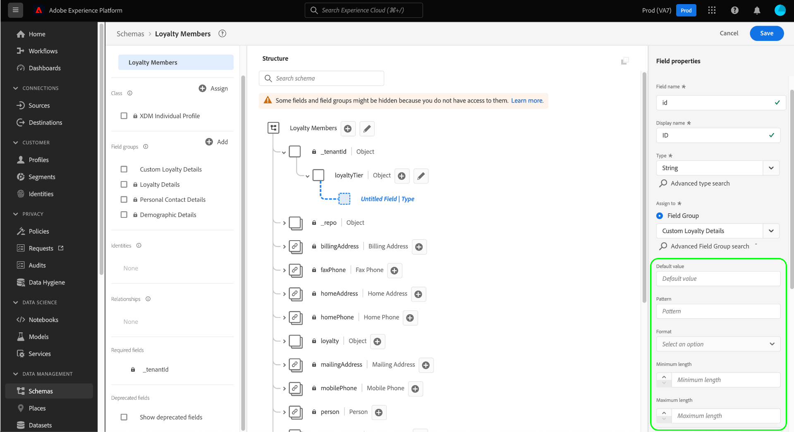
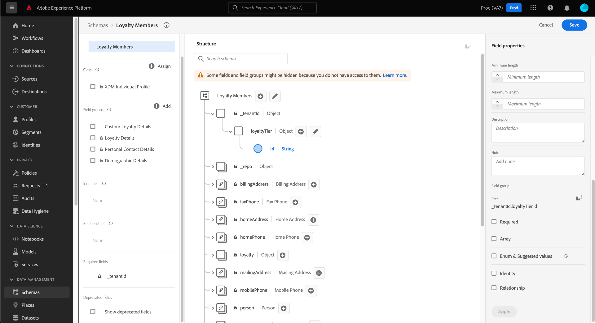
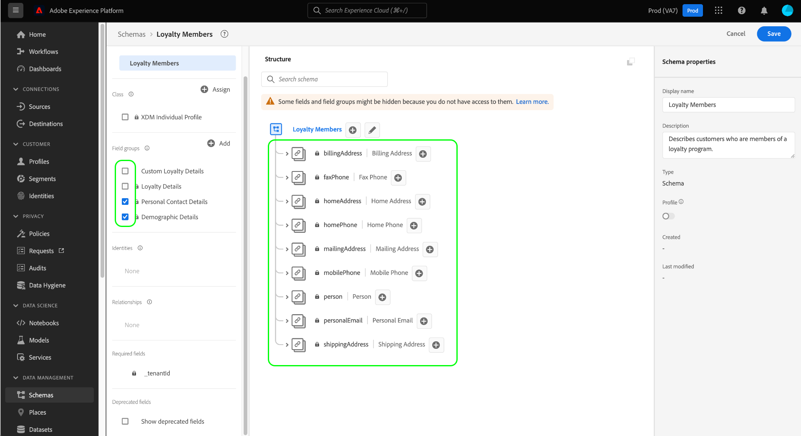

# Skapa ett schema med [!DNL Schema Editor]

Med Adobe Experience Platform användargränssnitt kan du skapa och hantera [!DNL Experience Data Model] (XDM) scheman på en interaktiv visuell arbetsyta som kallas [!DNL Schema Editor]. I den här självstudiekursen beskrivs hur du skapar ett schema med [!DNL Schema Editor].

I demonstrationssyfte handlar stegen i den här självstudien om att skapa ett exempelschema som beskriver medlemmar i ett kundlojalitetsprogram. Du kan använda de här stegen för att skapa ett annat schema för dina egna syften, men vi rekommenderar att du först följer med när du skapar exempelschemat för att lära dig funktionerna i [!DNL Schema Editor].

>[!NOTE]
>
>Om du importerar CSV-data till plattformen kan du [mappa dessa data till ett XDM-schema som skapats av AI-genererade rekommendationer](../../ingestion/tutorials/map-csv/recommendations.md) (för närvarande i beta) utan att behöva skapa schemat manuellt själv.
>
>Om du föredrar att skapa ett schema med [!DNL Schema Registry] API, börja med att läsa [[!DNL Schema Registry] utvecklarhandbok](../api/getting-started.md) innan du provar självstudiekursen på [skapa ett schema med API](create-schema-api.md).

## Komma igång

Den här självstudiekursen kräver en fungerande förståelse för de olika aspekter av Adobe Experience Platform som används för att skapa scheman. Innan du börjar med den här självstudiekursen bör du läsa om följande koncept i dokumentationen:

* [[!DNL Experience Data Model (XDM)]](../home.md): Det standardiserade ramverk som [!DNL Platform] organiserar kundupplevelsedata.
   * [Grunderna för schemakomposition](../schema/composition.md): En översikt över XDM-scheman och deras byggstenar, inklusive klasser, schemafältgrupper, datatyper och enskilda fält.
* [[!DNL Real-Time Customer Profile]](../../profile/home.md): Ger en enhetlig konsumentprofil i realtid baserad på aggregerade data från flera källor.

## Öppna [!UICONTROL Schemas] arbetsyta {#browse}

The [!UICONTROL Schemas] arbetsytan i [!DNL Platform] Gränssnittet ger en visualisering av [!DNL Schema Library], så att du kan visa hur du hanterar de scheman som är tillgängliga för din organisation. Arbetsytan innehåller även [!DNL Schema Editor], arbetsytan som du kan använda för att skapa ett schema genom hela kursen.

Efter inloggning [!DNL Experience Platform], markera **[!UICONTROL Schemas]** i den vänstra navigeringen för att öppna **[!UICONTROL Schemas]** arbetsyta. The **[!UICONTROL Browse]** -fliken visar en lista med scheman (en representation av [!DNL Schema Library]) så att du kan visa och anpassa. Listan innehåller namn, typ, klass och beteende (post- eller tidsserie) som schemat baseras på samt datum och tid då schemat senast ändrades.

Se guiden på [undersöka befintliga XDM-resurser i användargränssnittet](../ui/explore.md) för mer information.

## Skapa och namnge ett schema {#create}

Börja skapa ett schema genom att välja **[!UICONTROL Create schema]** i det övre högra hörnet av **[!UICONTROL Schemas]** arbetsyta.

![The [!UICONTROL Schemas] arbetsyta [!UICONTROL Browse] tabba med [!UICONTROL Create schema] markerad.](../images/tutorials/create-schema/create-schema-button.png)

The [!UICONTROL Create schema] arbetsflödet visas. Välj sedan en basklass för schemat. Du kan välja mellan huvudklasserna i [!UICONTROL XDM Individual Profile] och [!UICONTROL XDM ExperienceEvent], eller [!UICONTROL Other] om dessa klasser inte passar dina syften. The [!UICONTROL Other] kan du antingen [skapa en ny klass](#create-new-class) eller välj bland andra befintliga klasser.

Se [XDM-individuell profil](../classes/individual-profile.md) och [XDM ExperienceEvent](../classes/experienceevent.md) mer information om dessa klasser. I den här självstudiekursen väljer du **[!UICONTROL XDM Individual Profile]** följt av **[!UICONTROL Next]**.

<!-- You can  by selecting either **[!UICONTROL Individual Profile]**, **[!UICONTROL Experience Event]**, or **[!UICONTROL Other]**, followed by **[!UICONTROL Next]** to confirm your choice.  -->

![The [!UICONTROL Create schema] arbetsflöde med [!UICONTROL XDM individual profile] alternativ och [!UICONTROL Next] markerad.](../images/tutorials/create-schema/individual-profile-base-class.png)

När du har valt en klass [!UICONTROL Name and review] visas. I det här avsnittet anger du ett namn och en beskrivning som identifierar ditt schema. Det finns flera viktiga saker att tänka på när du ska bestämma ett namn för schemat:

* Schemanamn ska vara korta och beskrivande så att schemat kan hittas senare.
* Schemanamn måste vara unika, vilket innebär att de också måste vara tillräckligt specifika för att de inte ska återanvändas i framtiden. Om din organisation till exempel har separata lojalitetsprogram för olika varumärken är det klokt att kalla ditt schema&quot;Varumärke A lojalitetsmedlemmar&quot; för att göra det enkelt att skilja på dem från andra lojalitetsrelaterade scheman som du kan definiera senare.
* Du kan också använda schemabeskrivningen för att tillhandahålla ytterligare sammanhangsberoende information om schemat.

I den här självstudiekursen skapas ett schema för att importera data som är relaterade till medlemmarna i ett lojalitetsprogram, och schemat får därför namnet &quot;[!DNL Loyalty Members]&quot;.

&#x200B; Schemats grundstruktur (tillhandahålls av klassen) visas på arbetsytan så att du kan granska och verifiera den valda klass- och schemastrukturen.

Ange ett användarvänligt [!UICONTROL Schema display name] i textfältet. Ange sedan en lämplig beskrivning för att identifiera schemat. När du har granskat schemastrukturen och är nöjd med dina inställningar väljer du **[!UICONTROL Finish]** för att skapa ditt schema.

![The [!UICONTROL Name and review] i [!UICONTROL Create schema] arbetsflöde med [!UICONTROL Schema display name], [!UICONTROL Description]och [!UICONTROL Finish] markerad.](../images/ui/resources/schemas/name-and-review.png)

The [!DNL Schema Editor] visas. Det här är arbetsytan som du kommer att komponera ditt schema på. Det självskrivna schemat skapas automatiskt i **[!UICONTROL Structure]** -delen av arbetsytan när du kommer till redigeraren, tillsammans med standardfälten som ingår i den basklass som du har valt. Den tilldelade klassen för schemat listas också under **[!UICONTROL Class]** in **[!UICONTROL Composition]** -avsnitt.

>[!NOTE]
>
>Du kan uppdatera visningsnamnet och den valfria beskrivningen för schemat från  **[!UICONTROL Schema properties]** sidofält. När ett nytt namn har angetts uppdateras arbetsytan automatiskt med det nya namnet på schemat.

>[!NOTE]
>
>Du kan [ändra klassen för ett schema](#change-class) när som helst under den inledande dispositionsprocessen innan schemat har sparats, men detta bör göras med yttersta försiktighet. Fältgrupper är bara kompatibla med vissa klasser. Om du ändrar klassen återställs arbetsytan och alla fält du har lagt till.

## Lägg till en fältgrupp {#field-group}

Nu kan du börja lägga till fält i schemat genom att lägga till fältgrupper. En fältgrupp är en grupp med ett eller flera fält som ofta används tillsammans för att beskriva ett visst koncept. I den här självstudiekursen används fältgrupper för att beskriva medlemmarna i bonusprogrammet och samla in viktig information som namn, födelsedag, telefonnummer, adress med mera.

Om du vill lägga till en fältgrupp väljer du **[!UICONTROL Add]** i **[!UICONTROL Field groups]** undersektion.

En ny dialogruta visas med en lista över tillgängliga fältgrupper. Varje fältgrupp är endast avsedd att användas med en viss klass. Därför visas bara fältgrupper som är kompatibla med den klass du valde (i det här fallet visas [!DNL XDM Individual Profile] klass). Om du använder en standard-XDM-klass sorteras listan med fältgrupper på ett intelligent sätt baserat på användningens popularitet.

![The [!UICONTROL Add field groups] -dialogrutan.](../images/tutorials/create-schema/field-group-popularity.png)

Du kan välja ett av filtren i den vänstra listen för att begränsa listan med standardfältgrupper till specifika [branscher](../schema/industries/overview.md) som detaljhandel, finansiella tjänster och hälso- och sjukvård.

![The [!UICONTROL Add field groups] dialogrutan med branschfältgrupper markerade.](../images/tutorials/create-schema/industry-field-groups.png)

Om du väljer en fältgrupp i listan visas den i den högra listen. Om du vill kan du markera flera fältgrupper och lägga till var och en i listan i den högra listen innan du bekräftar. Dessutom visas en ikon till höger om den markerade fältgruppen där du kan förhandsgranska strukturen för de fält som gruppen innehåller.

![The [!UICONTROL Add field groups] med den markerade ikonen för förhandsgranskning av fältgrupp markerad.](../images/tutorials/create-schema/preview-field-group-button.png)

När du förhandsgranskar en fältgrupp visas en detaljerad beskrivning av fältgruppens schema i den högra listen. Du kan även navigera genom fältgruppens fält på den angivna arbetsytan. När du väljer olika fält uppdateras den högra listen så att information om fältet i fråga visas. Välj **[!UICONTROL Back]** när du är klar med förhandsgranskningen för att återgå till dialogrutan för val av fältgrupp.

![The [!UICONTROL Preview field group] med fältgruppen för demografiska detaljer förhandsgranskad.](../images/tutorials/create-schema/preview-field-group.png)

För den här självstudiekursen väljer du **[!UICONTROL Demographic Details]** fältgrupp och sedan markera **[!UICONTROL Add field group]**.

![The [!UICONTROL Add field groups] dialogrutan med fältgruppen för demografiska uppgifter markerad och [!UICONTROL Add field groups] markerad.](../images/tutorials/create-schema/demographic-details.png)

Arbetsytan för schemat visas igen. The **[!UICONTROL Field groups]** sektioner nu listor &quot;[!UICONTROL Demographic Details]&quot; och **[!UICONTROL Structure]** -avsnittet innehåller fälten från fältgruppen. Du kan välja fältgruppens namn under **[!UICONTROL Field groups]** för att markera specifika fält på arbetsytan.

>[!NOTE]
>
>I Schemaredigeraren visas standardklasser (som genererats av Adobe) och fältgrupper med hänglåsikonen (. hänglåset visas i den vänstra listen bredvid namnet på klassen eller fältgruppen, samt intill ett fält i schemagrafiken som är en del av en systemgenererad resurs.
>
>

Den här fältgruppen bidrar med flera fält under namnet på den översta nivån `person` med datatypen &quot;[!UICONTROL Person]&quot;. Den här gruppen med fält beskriver information om en individ, inklusive namn, födelsedatum och kön.

>[!NOTE]
>
>Kom ihåg att fälten kan använda skalära typer (till exempel sträng, heltal, matris eller datum), liksom alla datatyper (en grupp fält som representerar ett gemensamt koncept) som definieras i [!DNL Schema Registry].

Observera att `name` fältet har datatypen &quot;[!UICONTROL Full name]&quot;, vilket innebär att det också beskriver ett vanligt koncept och innehåller namnrelaterade underfält som förnamn, efternamn, titel och suffix.

Markera de olika fälten på arbetsytan för att visa eventuella ytterligare fält som de bidrar till schemastrukturen.

## Lägg till fler fältgrupper {#field-group-2}

Nu kan du upprepa samma steg för att lägga till en annan fältgrupp. När du visar **[!UICONTROL Add field group]** lägg märke till att[!UICONTROL Demographic Details]&quot;fältgruppen är nedtonad och det går inte att markera kryssrutan intill den. Detta förhindrar att du av misstag duplicerar fältgrupper som du redan har inkluderat i det aktuella schemat.

Välj standardfältgrupper för den här självstudiekursen **[!UICONTROL Personal Contact Details]** och **[!UICONTROL Loyalty Details]** i listan och välj **[!UICONTROL Add field groups]** för att lägga till dem i schemat.

![The [!UICONTROL Add field groups] dialogruta med två nya fältgrupper markerade och [!UICONTROL Add field groups] markerad.](../images/tutorials/create-schema/more-field-groups.png)

Arbetsytan visas igen med de nya fältgrupperna som listas under **[!UICONTROL Field groups]** i **[!UICONTROL Composition]** och deras sammansatta fält läggs till i schemastrukturen.

## Definiera en anpassad fältgrupp {#define-field-group}

The [!UICONTROL Loyalty Members] schemat är avsett att samla in data som är relaterade till medlemmarna i ett lojalitetsprogram och till standardprogrammet [!UICONTROL Loyalty Details] fältgrupp som du har lagt till i schemat innehåller de flesta av dessa, inklusive programtyp, punkter, kopplingsdatum med mera.

Det kan dock finnas ett scenario där du vill inkludera ytterligare anpassade fält som inte täcks av standardfältgrupper för att uppnå dina användningsfall. Om du vill lägga till anpassade bonusfält har du två alternativ:

1. Skapa en ny anpassad fältgrupp för att hämta dessa fält. Det här är den metod som kommer att beskrivas i den här självstudiekursen.
1. Utöka standarden [!UICONTROL Loyalty Details] fältgrupp med anpassade fält. Detta orsakar [!UICONTROL Loyalty Details] som ska konverteras till en anpassad fältgrupp och den ursprungliga standardfältgruppen kommer inte längre att vara tillgänglig. Se [!UICONTROL Schemas] Användargränssnittsguiden för mer information om [lägga till anpassade fält i strukturen för standardfältgrupper](../ui/resources/schemas.md#custom-fields-for-standard-groups).

Om du vill skapa en ny fältgrupp väljer du **[!UICONTROL Add]** i **[!UICONTROL Field groups]** underavsnitt som tidigare, men den här gången väljer **[!UICONTROL Create New Field group]** i den övre delen av dialogrutan som visas. Du ombeds sedan ange ett visningsnamn och en beskrivning för den nya fältgruppen. I den här självstudiekursen ger du den nya fältgruppen namnet[!DNL Custom Loyalty Details]&quot;, välj **[!UICONTROL Add field groups]**.

![The [!UICONTROL Add field groups] dialogruta med [!UICONTROL Create new field group], [!UICONTROL Display name] och [!UICONTROL Description] markerad.](../images/tutorials/create-schema/create-new-field-group.png)

>[!NOTE]
>
>Precis som med klassnamn ska fältgruppsnamnet vara kort och enkelt och beskriva vad fältgruppen kommer att bidra till schemat. Även dessa är unika, så du kommer inte att kunna återanvända namnet och måste därför se till att det är tillräckligt specifikt.

&quot;[!DNL Custom Loyalty Details]&quot; ska nu visas under **[!UICONTROL Field groups]** till vänster på arbetsytan, men det finns inga fält som är kopplade till den ännu och därför visas inga nya fält under **[!UICONTROL Structure]**.

## Lägg till fält i fältgruppen {#field-group-fields}

Nu när du har skapat[!DNL Custom Loyalty Details]fältgruppen är det dags att definiera de fält som fältgruppen ska bidra till schemat.

Börja med att välja **plus (+)** -ikonen bredvid namnet på schemat på arbetsytan.

An &quot;[!UICONTROL Untitled Field]&quot; visas som platshållare på arbetsytan, och den högra listen uppdateras för att visa konfigurationsalternativen för fältet.

![Schemaredigeraren med en [!UICONTROL Untitled Field] och schemat [!UICONTROL Field properties] markerad.](../images/tutorials/create-schema/untitled-field.png)

I det här scenariot måste schemat ha ett objekttypsfält som beskriver personens aktuella lojalitetsnivå i detalj. Börja skapa en `loyaltyTier` fält med typen &quot;[!UICONTROL Object]&quot; som kommer att användas för dina relaterade fält.

Under **[!UICONTROL Assign to]** måste du välja en fältgrupp som fältet ska tilldelas. Kom ihåg att alla schemafält tillhör antingen en klass eller en fältgrupp, och eftersom schemat använder en standardklass är det enda alternativet att välja en fältgrupp. Börja skriva in namnet[!DNL Custom Loyalty Details]&quot; och välj sedan fältgruppen i listan.

När du är klar väljer du **[!UICONTROL Apply]**.

![Schemaredigeraren med bonusnivåobjektet tillagt i schemat [!UICONTROL Field properties] markerad.](../images/tutorials/create-schema/loyalty-tier-object.png)

Ändringarna används och de nyskapade `loyaltyTier` visas. Eftersom detta är ett anpassat fält kapslas det automatiskt in i ett objekt som namnges efter organisationens klientorganisations-ID, föregånget av ett understreck (`_tenantId` i det här exemplet).

>[!NOTE]
>
>Närvaron av klient-ID-objektet anger att fälten som du lägger till finns i organisationens namnutrymme.
>
>Fälten som du lägger till är alltså unika för din organisation och kommer att sparas i [!DNL Schema Registry] inom ett specifikt område som är tillgängligt endast för din organisation. Fält som du definierar måste alltid läggas till i klientnamnutrymmet för att förhindra konflikter med namn från andra standardklasser, fältgrupper, datatyper och fält.

Välj **plus (+)** -ikonen bredvid `loyaltyTier` -objekt som ska börja läggas till underfält. En ny fältplatshållare visas och **[!UICONTROL Field properties]** -avsnittet visas till höger på arbetsytan.

Varje fält kräver följande information:

* **[!UICONTROL Field Name]:** Fältets namn, helst skrivet i camelCase. Inga blankstegstecken tillåts. Det här namnet används som referens för fältet i koden och i andra program längre fram i kedjan.
   * Exempel: loyaltyLevel
* **[!UICONTROL Display Name]:** Fältets namn, skrivet i versaler. Det här namnet visas på arbetsytan när du visar eller redigerar schemat.
   * Exempel: Lojalitetsnivå
* **[!UICONTROL Type]:** Fältets datatyp. Detta inkluderar grundläggande skalärtyper och alla datatyper som definieras i [!DNL Schema Registry]. Exempel: [!UICONTROL String], [!UICONTROL Integer], [!UICONTROL Boolean], [!UICONTROL Person], [!UICONTROL Address], [!UICONTROL Phone number], osv.
* **[!UICONTROL Description]:** En valfri beskrivning av fältet får innehålla högst 200 tecken.

Det första fältet för `loyaltyTier` objektet blir en sträng som anropas `id`, som representerar ID:t för förmånsmedlemmens aktuella nivå. Nivå-ID är unikt för varje lojalitetsmedlem, eftersom det här företaget anger olika tröskelvärden för lojalitetsskikt för varje kund baserat på olika faktorer. Ställ in det nya fältets typ till[!UICONTROL String]&quot;, och **[!UICONTROL Field properties]** -avsnittet fylls i med flera alternativ för att tillämpa begränsningar, inklusive standardvärde, format och maximal längd. Läs dokumentationen om [bästa praxis för datavalideringsfält](../schema/best-practices.md#data-validation-fields) om du vill veta mer.

Sedan `id` kommer att vara en slumpmässigt genererad friformssträng, inga ytterligare begränsningar krävs. Välj **[!UICONTROL Apply]** för att tillämpa ändringarna.

## Lägg till fler fält i fältgruppen {#field-group-fields-2}

Nu när du har lagt till `id` kan du lägga till ytterligare fält för att hämta information om lojalitetsnivån, till exempel:

* Aktuellt poängtröskelvärde (heltal): Det minsta antalet förmånspunkter som medlemmen måste behålla för att förbli i den aktuella nivån.
* Tröskelvärde för nästa skiktpunkt (heltal): Antalet förmånspoäng som medlemmen måste uppnå för att kunna ta examen vid nästa skikt.
* Giltighetsdatum (datum-tid): Det datum då förmånsmedlemmen anslöt till den här nivån.

Om du vill lägga till varje fält i schemat väljer du **plus (+)** -ikonen bredvid `loyalty` och fylla i den information som krävs.

När det är klart `loyaltyTier` objektet innehåller fält för `id`, `currentThreshold`, `nextThreshold`och `effectiveDate`.

## Lägg till ett uppräkningsfält i fältgruppen {#enum}

När du definierar fält i [!DNL Schema Editor]Det finns dock ytterligare alternativ som du kan använda för grundläggande fälttyper för att ge ytterligare begränsningar för de data som fältet kan innehålla. Användningsexempel för dessa begränsningar förklaras i följande tabell:

| Begränsning | Beskrivning |
| --- | --- |
| [!UICONTROL Required] | Anger att fältet är obligatoriskt för datainmatning. Alla data som överförs till en datauppsättning som baseras på det här schemat och som inte innehåller det här fältet kommer att misslyckas vid inmatning. |
| [!UICONTROL Array] | Anger att fältet innehåller en array med värden, var och en med den angivna datatypen. Använd till exempel den här begränsningen för ett fält med datatypen &quot;[!UICONTROL String]&quot; anger att fältet kommer att innehålla en array med strängar. |
| [!UICONTROL Enum & Suggested Values] | En uppräkning anger att det här fältet måste innehålla ett av värdena från en uppräknad lista med möjliga värden. Du kan också använda det här alternativet om du bara vill visa en lista med föreslagna värden för ett strängfält utan att begränsa fältet till dessa värden. |
| [!UICONTROL Identity] | Anger att fältet är ett identitetsfält. Mer information om identitetsfält finns [senare i denna självstudiekurs](#identity-field). |
| [!UICONTROL Relationship] | När schemarelationer kan härledas genom användning av unionsschemat och [!DNL Real-Time Customer Profile]gäller detta endast scheman som delar samma klass. The [!UICONTROL Relationship] -begränsning anger att det här fältet refererar till den primära identiteten för ett schema baserat på en annan klass, vilket innebär en relation mellan de två schemana. Se självstudiekursen om [definiera en relation](./relationship-ui.md) för mer information. |

{style="table-layout:auto"}

>[!NOTE]
>
>Alla obligatoriska, identitets- eller relationsfält visas i respektive avsnitt i den vänstra listen, vilket gör att du enkelt kan hitta fälten oavsett hur komplexa schemat är.

För den här självstudiekursen `loyaltyTier` -objektet i schemat kräver ett nytt uppräkningsfält som beskriver skiktklassen, där värdet bara kan vara ett av fyra möjliga alternativ. Om du vill lägga till det här fältet i schemat väljer du **plus (+)** -ikonen bredvid `loyaltyTier` objekt och fylla i obligatoriska fält för **[!UICONTROL Field name]** och **[!UICONTROL Display name]**. För **[!UICONTROL Type]**, välj &quot;[!UICONTROL String]&quot;.

![Schemaredigeraren med nivåklassobjektet tillagt och markerat i [!UICONTROL Field properties].](../images/tutorials/create-schema/tier-class-type.png)

Ytterligare kryssrutor visas för fältet när dess typ har valts, inklusive kryssrutor för **[!UICONTROL Array]**, **[!UICONTROL Enum & Suggested Values]**, **[!UICONTROL Identity]** och **[!UICONTROL Relationship]**.

Välj **[!UICONTROL Enum & Suggested Values]** kryssruta och sedan markera **[!UICONTROL Enum]**. Här kan du ange **[!UICONTROL Value]** (i camelCase) och **[!UICONTROL Display Name]** (ett valfritt, läsarvänligt namn i Title Case) för varje godtagbar lojalitetsklass.

När du har slutfört alla fältegenskaper väljer du **[!UICONTROL Apply]** för att lägga till `tierClass` fält till `loyaltyTier` -objekt.

![Egenskaperna för uppräkning och förslag på värden har slutförts med [!UICONTROL Apply] markerad.](../images/tutorials/create-schema/tier-class-enum.png)

## Konvertera ett flerfältsobjekt till en datatyp {#datatype}

The `loyaltyTier` objektet innehåller nu flera fält och representerar en gemensam datastruktur som kan vara användbar i andra scheman. The [!DNL Schema Editor] Med kan du enkelt tillämpa återanvändbara flerfältsobjekt genom att konvertera strukturen för dessa objekt till datatyper.

Datatyper möjliggör konsekvent användning av flerfältsstrukturer och ger större flexibilitet än en fältgrupp eftersom de kan användas var som helst inom ett schema. Detta görs genom att ställa in fältets **[!UICONTROL Type]** värdet på alla datatyper som definieras i [!DNL Schema Registry].

Konvertera `loyaltyTier` till en datatyp, markera `loyaltyTier` på arbetsytan och sedan markera **[!UICONTROL Convert to new data type]** till höger om redigeraren under **[!UICONTROL Field properties]**.

![Schemaredigeraren med objektet loyaltyTier och [!UICONTROL Convert to new data type] markerad.](../images/tutorials/create-schema/convert-data-type.png)

Ett meddelande visas som bekräftar att objektet har konverterats. På arbetsytan ser du nu att `loyaltyTier` fältet har nu en länkikon och den högra listen anger att det har datatypen &quot;[!DNL Loyalty Tier]&quot;.

I ett framtida schema kan du nu tilldela ett fält som[!DNL Loyalty Tier]&quot; och det skulle automatiskt inkludera fält för ID, skiktklass, poängtrösklar och giltighetsdatum.

>[!NOTE]
>
>Du kan också skapa och redigera anpassade datatyper oberoende av redigeringsscheman. Se guiden på [skapa och redigera datatyper](../ui/resources/data-types.md) för mer information.

## Söka efter och filtrera schemafält

Schemat innehåller nu flera fältgrupper förutom de fält som anges i basklassen. När du arbetar med större scheman kan du markera kryssrutorna intill fältgruppsnamnen i den vänstra listen för att filtrera de visade fälten så att de bara visas för de fältgrupper du är intresserad av.

Om du letar efter ett specifikt fält i ditt schema kan du även använda sökfältet för att filtrera visade fält efter namn, oavsett vilken fältgrupp de ingår i.

>[!IMPORTANT]
>
>Sökfunktionen tar hänsyn till alla valda fältgruppsfilter när matchande fält visas. Om sökfrågan inte visar de förväntade resultaten kan du behöva dubbelkontrollera att du inte filtrerar ut relevanta fältgrupper.

## Ange ett schemafält som identitetsfält {#identity-field}

Den standarddatastruktur som scheman ger kan utnyttjas för att identifiera data som tillhör samma individ i flera olika källor, vilket möjliggör olika användningsfall i senare led, som segmentering, rapportering, datavetenskapsanalys med mera. För att sammanfoga data baserat på individuella identiteter måste nyckelfälten markeras som [!UICONTROL Identity] fält inom tillämpliga scheman.

[!DNL Experience Platform] gör det enkelt att ange ett identitetsfält med en **[!UICONTROL Identity]** kryssrutan i [!DNL Schema Editor]. Du måste dock bestämma vilket fält som är det bästa alternativet att använda som identitet, baserat på vilken typ av data du har.

Det kan till exempel finnas tusentals lojalitetsprogrammedlemmar som tillhör samma lojalitetsnivå och flera som delar samma fysiska adress. I det här scenariot anger dock varje medlem i lojalitetsprogrammet sin personliga e-postadress vid registreringen. Eftersom personliga e-postadresser vanligtvis hanteras av en person är fältet `personalEmail.address` (tillhandahålls av [!UICONTROL Personal Contact Details] fältgrupp) är en bra kandidat för ett identitetsfält.

>[!IMPORTANT]
>
>Stegen som beskrivs nedan beskriver hur du lägger till en identitetsbeskrivning i ett befintligt schemafält. Som ett alternativ till att definiera identitetsfält i strukturen för själva schemat kan du även använda en `identityMap` fält som ska innehålla identitetsinformation i stället.
>
>Om du tänker använda `identityMap`bör du tänka på att den åsidosätter alla primära identiteter som du lägger till direkt i schemat. Se avsnittet om `identityMap` i [grunderna i guiden för schemakomposition](../schema/composition.md#identityMap) för mer information.

Välj `personalEmail.address` på arbetsytan och **[!UICONTROL Identity]** kryssrutan visas under **[!UICONTROL Field properties]**. Markera kryssrutan och alternativet för att ange den som **[!UICONTROL Primary identity]** visas. Markera även den här rutan.

>[!NOTE]
>
>Varje schema får endast innehålla ett primärt identitetsfält. När ett schemafält har angetts som primär identitet får du ett felmeddelande om du senare försöker ange ett annat identitetsfält i schemat som primärt.

Sedan måste du ange en **[!UICONTROL Identity namespace]** i listan med fördefinierade namnutrymmen i listrutan. Eftersom det här fältet är kundens e-postadress väljer du &quot;[!UICONTROL Email]&quot; i listrutan. Välj **[!UICONTROL Apply]** för att bekräfta uppdateringarna av `personalEmail.address` fält.

>[!NOTE]
>
>En lista med standardnamnutrymmen och definitioner av dessa finns i [[!DNL Identity Service] dokumentation](../../identity-service/troubleshooting-guide.md#standard-namespaces).

När du har tillämpat ändringen visas ikonen för `personalEmail.address` visar en fingeravtryckssymbol som anger att det nu är ett identitetsfält. Fältet visas även i den vänstra listen under **[!UICONTROL Identities]**.

Nu kan alla data hämtas till `personalEmail.address` ska användas för att identifiera den enskilda personen och sammanfoga en enda bild av kunden. Mer information om att arbeta med identiteter i [!DNL Experience Platform]kan du läsa [[!DNL Identity Service]](../../identity-service/home.md) dokumentation.

## Aktivera schemat för användning i [!DNL Real-Time Customer Profile] {#profile}

[[!DNL Real-Time Customer Profile]](../../profile/home.md) använder identitetsdata i [!DNL Experience Platform] för att ge en helhetsbild av varje enskild kund. Tjänsten bygger robusta 360-gradersprofiler av kundattribut samt tidsstämplade konton för varje interaktion som kunderna har haft i alla system som är integrerade med [!DNL Experience Platform].

För att ett schema ska kunna aktiveras för användning med [!DNL Real-Time Customer Profile]måste den ha en primär identitet definierad. Du får ett felmeddelande om du försöker aktivera ett schema utan att först definiera en primär identitet.

Så här aktiverar du schemat &quot;Bonusmedlemmar&quot; för användning i [!DNL Profile]börjar du med att välja schemanamnet på arbetsytan.

Till höger om redigeraren visas information om schemat, inklusive visningsnamn, beskrivning och typ. Förutom denna information finns det en **[!UICONTROL Profile]** växlingsknapp.

Välj **[!UICONTROL Profile]** och en pover visas, där du ombeds bekräfta att du vill aktivera schemat för [!DNL Profile].

>[!WARNING]
>
>När ett schema har aktiverats för [!DNL Real-Time Customer Profile] och sparat kan den inte inaktiveras.

Välj **[!UICONTROL Enable]** för att bekräfta ditt val. Du kan välja **[!UICONTROL Profile]** växla igen för att inaktivera schemat om du vill, men när schemat har sparats samtidigt [!DNL Profile] är aktiverat kan det inte längre inaktiveras.

## Fler åtgärder {#more}

I Schemaredigeraren kan du också utföra snabba åtgärder för att kopiera JSON-strukturen för schemat eller ta bort schemat. Välj [!UICONTROL More] längst upp i vyn om du vill visa en listruta med snabbåtgärder.

### Ta bort ett schema {#delete-a-schema}

>[!CONTEXTUALHELP]
>id="platform_schemas_delete_profileenabledwithdatasets"
>title="Kan inte ta bort schema"
>abstract="Det går inte att ta bort schemat eftersom det har aktiverats för profilen och har associerade datauppsättningar."

>[!CONTEXTUALHELP]
>id="platform_schemas_delete_profileenablednodatasets"
>title="Kan inte ta bort schema"
>abstract="Det går inte att ta bort schemat eftersom det har aktiverats för profilen."

>[!CONTEXTUALHELP]
>id="platform_schemas_delete_withdatasetsnotprofileenabled"
>title="Kan inte ta bort schema"
>abstract="Schemat kan inte tas bort eftersom det har associerade datauppsättningar."

Ett schema kan tas bort i användargränssnittet från Schemaredigeraren med [!UICONTROL More] och även från schemainformationen i [!UICONTROL Browse] -fliken. Det finns vissa villkor som förhindrar att ett schema tas bort. Ett schema kan inte tas bort om:

* Schemat är aktiverat för profilen.
* Schemat är aktiverat för profilen och har associerade datauppsättningar.
* Schemat har associerade datauppsättningar men har inte aktiverats för profilen.

### Kopiera JSON-struktur {#copy-json-structure}

Välj **[!UICONTROL Copy JSON structure]** för att generera en exportnyttolast för ett schema i schemabiblioteket. Den här åtgärden kopierar JSON-strukturen till Urklipp. Din exporterade JSON kan sedan användas för att importera schemat och alla relaterade resurser till en annan sandlåda eller organisation. Detta gör det enkelt och effektivt att dela och återanvända scheman mellan olika miljöer.

## Nästa steg och ytterligare resurser

Nu när du är klar med att komponera schemat kan du se hela schemat på arbetsytan. Välj **[!UICONTROL Save]** och schemat sparas i [!DNL Schema Library], så att det blir tillgängligt för [!DNL Schema Registry].

Ditt nya schema kan nu användas för att importera data till [!DNL Platform]. Kom ihåg att när schemat väl har använts för att importera data får endast additiva ändringar göras. Se [grunderna för schemakomposition](../schema/composition.md) om du vill ha mer information om schemaversion.

Nu kan du följa självstudiekursen på [definiera en schemarelation i användargränssnittet](./relationship-ui.md) om du vill lägga till ett nytt relationsfält i schemat&quot;Förmånsmedlemmar&quot;.

Schemat &quot;Bonusmedlemmar&quot; är också tillgängligt för att visas och hanteras med [!DNL Schema Registry] API. Börja med att läsa [[!DNL Schema Registry API] utvecklarhandbok](../api/getting-started.md).

### Videoresurser

>[!WARNING]
>
>The [!DNL Platform] Gränssnittet som visas i följande videofilmer är inaktuellt. Läs dokumentationen ovan för de senaste skärmbilderna och funktionerna i användargränssnittet.

I följande video visas hur du skapar ett enkelt schema i [!DNL Platform] Gränssnitt.

>[!VIDEO](https://video.tv.adobe.com/v/27012?quality=12&learn=on)

Följande video är tänkt att förstärka din förståelse för att arbeta med fältgrupper och klasser.

>[!VIDEO](https://video.tv.adobe.com/v/27013?quality=12&learn=on)

## Bilaga

Följande avsnitt innehåller ytterligare information om användningen av [!DNL Schema Editor].

### Skapa en ny klass {#create-new-class}

[!DNL Experience Platform] ger flexibilitet att definiera ett schema baserat på en klass som är unik för din organisation. Mer information om hur du skapar en ny klass finns i handboken [skapa och redigera klasser i användargränssnittet](../ui/resources/classes.md#create).

### Ändra klassen för ett schema {#change-class}

Du kan ändra schemaklassen när som helst under den inledande dispositionsprocessen innan schemat har sparats.

>[!WARNING]
>
>Omtilldelning av klassen för ett schema bör göras med extrem försiktighet. Fältgrupper är bara kompatibla med vissa klasser. Om du ändrar klassen återställs arbetsytan och alla fält du har lagt till.

Om du vill lära dig hur du ändrar klassen för ett schema kan du läsa guiden på [hantera scheman i användargränssnittet](../ui/resources/schemas.md#change-class).
