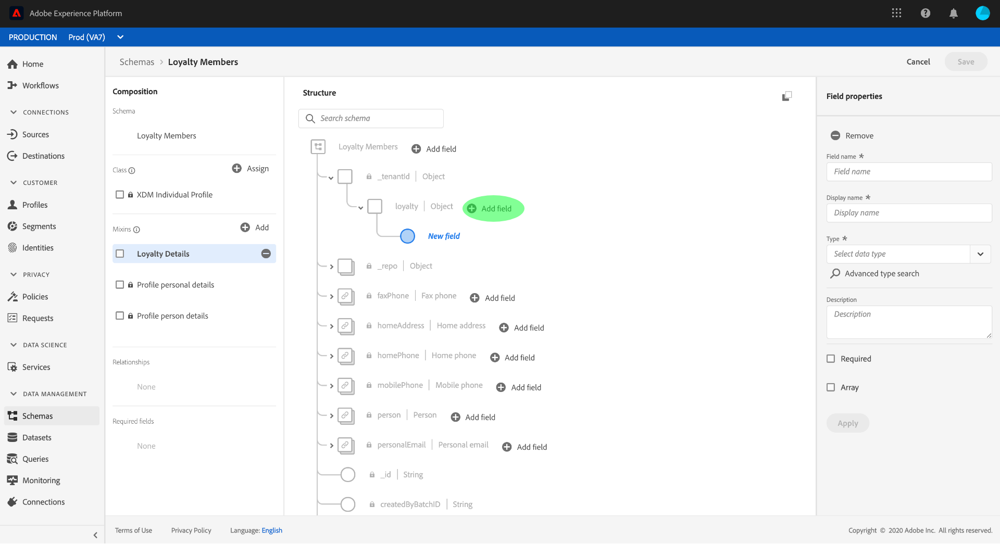

# Skapa ett schema med [!DNL Schema Editor]

Med Adobe Experience Platform användargränssnitt kan du skapa och hantera [!DNL Experience Data Model] (XDM)-scheman i en interaktiv visuell arbetsyta som kallas [!DNL Schema Editor]. I den här självstudien beskrivs hur du skapar ett schema med [!DNL Schema Editor].

>[!NOTE]
>
>I demonstrationssyfte handlar stegen i den här självstudiekursen om att skapa ett exempelschema som beskriver medlemmar i ett kundlojalitetsprogram. Du kan använda de här stegen för att skapa ett annat schema för dina egna syften, men vi rekommenderar att du först följer med när du skapar exempelschemat för att lära dig funktionerna i [!DNL Schema Editor].

Om du hellre vill skapa ett schema med API:t [!DNL Schema Registry] börjar du med att läsa [[!DNL Schema Registry] utvecklarhandboken](../api/getting-started.md) innan du försöker självstudiekursen om att [skapa ett schema med API](create-schema-api.md).

## Komma igång

Den här självstudiekursen kräver en fungerande förståelse för de olika aspekter av Adobe Experience Platform som används för att skapa scheman. Innan du börjar med den här självstudiekursen bör du läsa om följande koncept i dokumentationen:

* [[!DNL Experience Data Model (XDM)]](../home.md): Det standardiserade ramverket som  [!DNL Platform] organiserar kundupplevelsedata.
   * [Grundläggande om schemakomposition](../schema/composition.md): En översikt över XDM-scheman och deras byggstenar, inklusive klasser, mixins, datatyper och fält.
* [[!DNL Real-time Customer Profile]](../../profile/home.md): Ger en enhetlig konsumentprofil i realtid baserad på aggregerade data från flera källor.

## Öppna arbetsytan [!UICONTROL Schemas] {#browse}

Arbetsytan [!UICONTROL Schemas] i gränssnittet för [!DNL Platform] ger en visualisering av [!DNL Schema Library] så att du kan visa hur du hanterar de scheman som är tillgängliga för din organisation. Arbetsytan innehåller också [!DNL Schema Editor], arbetsytan som du kan komponera ett schema på i hela kursen.

När du har loggat in på [!DNL Experience Platform] väljer du **[!UICONTROL Schemas]** i den vänstra navigeringen för att öppna arbetsytan **[!UICONTROL Schemas]**. På fliken **[!UICONTROL Browse]** visas en lista med scheman (en representation av [!DNL Schema Library]) som du kan visa och anpassa. Listan innehåller namn, typ, klass och beteende (post- eller tidsserie) som schemat baseras på samt datum och tid då schemat senast ändrades.

Mer information finns i guiden [utforska befintliga XDM-resurser i användargränssnittet](../ui/explore.md).

## Skapa och namnge ett schema {#create}

Om du vill börja komponera ett schema väljer du **[!UICONTROL Create schema]** i det övre högra hörnet av arbetsytan **[!UICONTROL Schemas]**. En listruta visas där du kan välja mellan huvudklasserna [!UICONTROL XDM Individual Profile] och [!UICONTROL XDM ExperienceEvent]. Om dessa klasser inte passar dina syften kan du även välja **[!UICONTROL Browse]** och välja bland andra tillgängliga klasser eller [skapa en ny klass](#create-new-class).

I den här självstudiekursen väljer du **[!UICONTROL XDM Individual Profile]**.

[!DNL Schema Editor] visas. Det här är arbetsytan som du kommer att komponera ditt schema på. Eftersom du väljer en standard-XDM-klass som schemat ska baseras på skapas ett namnlöst schema automatiskt i **[!UICONTROL Structure]**-avsnittet på arbetsytan när du kommer till redigeraren, tillsammans med standardfälten som ingår i alla scheman som baseras på den klassen. Den tilldelade klassen för schemat listas också under **[!UICONTROL Class]** i **[!UICONTROL Composition]**-avsnittet.

>[!NOTE]
>
>Du kan [ändra klassen för ett schema](#change-class) när som helst under den inledande dispositionsprocessen innan schemat har sparats, men detta bör göras med yttersta försiktighet. Blandningar är bara kompatibla med vissa klasser, och om du ändrar klassen återställs arbetsytan och alla fält du har lagt till.

Använd fälten till höger om redigeraren för att ange ett visningsnamn och en valfri beskrivning av schemat. När ett namn har angetts uppdateras arbetsytan med det nya namnet på schemat.

Det finns flera viktiga saker att tänka på när du ska bestämma ett namn för schemat:

* Schemanamn ska vara korta och beskrivande så att schemat kan hittas senare.
* Schemanamn måste vara unika, vilket innebär att de också måste vara tillräckligt specifika för att de inte ska återanvändas i framtiden. Om din organisation till exempel har separata lojalitetsprogram för olika varumärken är det klokt att kalla ditt schema&quot;Varumärke A lojalitetsmedlemmar&quot; för att göra det enkelt att skilja på dem från andra lojalitetsrelaterade scheman som du kan definiera senare.
* Du kan också använda schemabeskrivningen för att tillhandahålla ytterligare sammanhangsberoende information om schemat.

I den här självstudiekursen skapas ett schema för att importera data som är relaterade till medlemmarna i ett lojalitetsprogram, och därför heter schemat&quot;Förmånsmedlemmar&quot;.

## Lägg till en blandning {#mixin}

Nu kan du börja lägga till fält i ditt schema genom att lägga till mixar. En blandning är en grupp med ett eller flera fält som ofta används tillsammans för att beskriva ett visst koncept. I den här självstudiekursen används mixins för att beskriva medlemmarna i bonusprogrammet och samla in viktig information som namn, födelsedag, telefonnummer, adress med mera.

Om du vill lägga till en blandning väljer du **[!UICONTROL Add]** i underavsnittet **[!UICONTROL Mixins]**.

En ny dialogruta visas med en lista över tillgängliga mixar. Varje blandning är bara avsedd att användas med en viss klass, och därför visas endast de blandningar som är kompatibla med den klass du valde (i det här fallet klassen [!DNL XDM Individual Profile]). Om du använder en standard-XDM-klass sorteras listan med mixar på ett intelligent sätt baserat på användningens popularitet.

Om du väljer en blandning i listan visas den i den högra listen. Du kan markera flera blandningar om du vill, och lägga till dem i listan i den högra listen innan du bekräftar. Dessutom visas en ikon till höger om den markerade mixen, som du kan använda för att förhandsgranska strukturen för de fält som den innehåller.

När du förhandsgranskar en blandning visas en detaljerad beskrivning av den mixins schema i den högra listen. Du kan även navigera genom blandningens fält på den angivna arbetsytan. När du väljer olika fält uppdateras den högra listen så att information om fältet i fråga visas. Välj **[!UICONTROL Back]** när du är klar med förhandsgranskningen för att återgå till dialogrutan för mixmarkering.

I den här självstudiekursen väljer du **[!UICONTROL Demographic Details]**-mixinen och sedan **[!UICONTROL Add mixin]**.

Arbetsytan för schemat visas igen. Avsnittet **[!UICONTROL Mixins]** innehåller nu en lista över [!UICONTROL Demographic Details] och avsnittet **[!UICONTROL Structure]** innehåller fälten som har bidragit med blandningen. Du kan markera namnet på mixen under **[!UICONTROL Mixins]**-avsnittet för att markera de specifika fält som finns på arbetsytan.

Den här blandningen bidrar med flera fält under namnet `person` på den översta nivån med datatypen [!UICONTROL Person]. Den här gruppen med fält beskriver information om en individ, inklusive namn, födelsedatum och kön.

>[!NOTE]
>
>Kom ihåg att fält kan använda skalära typer (till exempel sträng, heltal, matris eller datum), liksom alla datatyper (en grupp fält som representerar ett gemensamt koncept) som definieras i [!DNL Schema Registry].

Observera att fältet `name` har datatypen [!UICONTROL Person name], vilket innebär att det beskriver ett vanligt koncept och innehåller namnrelaterade underfält som förnamn, efternamn, titel och suffix.

Markera de olika fälten på arbetsytan för att visa eventuella ytterligare fält som de bidrar till schemastrukturen.

## Lägg till en annan blandning {#mixin-2}

Nu kan du upprepa samma steg för att lägga till en annan blandning. När du visar dialogrutan **[!UICONTROL Add mixin]** den här gången kan du inte markera kryssrutan bredvid blandningen [!UICONTROL Demographic Details]. Detta förhindrar att du av misstag duplicerar blandningar som du redan har inkluderat i det aktuella schemat.

I den här självstudiekursen väljer du&quot;[!DNL Personal Contact Details]&quot;-mixinen i dialogrutan och sedan **[!UICONTROL Add mixin]** för att lägga till den i schemat.

När arbetsytan har lagts till visas den igen. &quot;[!UICONTROL Personal Contact Details]&quot; visas nu under **[!UICONTROL Mixins]** i **[!UICONTROL Composition]**-avsnittet och fält för hemadress, mobiltelefon med mera har lagts till under **[!UICONTROL Structure]**.

Ungefär som i fältet `name` representerar de fält du just lade till koncept för flera fält. Till exempel har `homeAddress` datatypen [!UICONTROL Postal address] och `mobilePhone` datatypen [!UICONTROL Phone number]. Du kan markera vart och ett av dessa fält för att expandera dem och visa de ytterligare fält som ingår i datatypen.

## Definiera en ny blandning {#define-mixin}

Schemat [!UICONTROL Loyalty Members] är avsett för att samla in data som är relaterade till medlemmarna i ett lojalitetsprogram, så det kräver vissa specifika lojalitetsrelaterade fält. Det finns inga standardblandningar som innehåller de nödvändiga fälten, och du måste därför definiera en ny blandning.

När du öppnar dialogrutan **[!UICONTROL Add Mixin]** väljer du **[!UICONTROL Create New Mixin]**. Du ombeds sedan ange ett visningsnamn och en beskrivning för din blandning.

Precis som med klassnamn ska mixnamnet vara kort och enkelt och innehålla en beskrivning av vad mixinen kommer att bidra till schemat. Även dessa är unika, så du kan inte återanvända namnet och måste därför se till att det är tillräckligt specifikt.

I den här självstudiekursen anger du den nya mixen&quot;Loyalty Details&quot; (Förmånsinformation).

Välj **[!UICONTROL Add mixin]** om du vill återgå till [!DNL Schema Editor]. &quot;[!UICONTROL Loyalty Details]&quot; ska nu visas under **[!UICONTROL Mixins]** till vänster på arbetsytan, men det finns inga fält kopplade till den än och därför visas inga nya fält under **[!UICONTROL Structure]**.

## Lägg till fält i blandningen {#mixin-fields}

Nu när du har skapat blandningen &quot;Loyalty Details&quot; är det dags att definiera de fält som blandningen ska bidra till schemat.

Börja med att markera blandningsnamnet i **[!UICONTROL Mixins]**-avsnittet. När du har gjort det visas blandningens egenskaper till höger om redigeraren och en **plus- (+)**-ikon visas bredvid schemats namn under **[!UICONTROL Structure]**.

Välj ikonen **plus (+)** bredvid [!DNL Loyalty Members] för att skapa en ny nod i strukturen. Den här noden (kallas `_tenantId` i det här exemplet) representerar din IMS-organisations klient-ID, föregånget av ett understreck. Närvaron av innehavar-ID anger att fälten som du lägger till finns i organisationens namnutrymme.

Fälten som du lägger till är alltså unika för din organisation och kommer att sparas i [!DNL Schema Registry] i ett specifikt område som bara är tillgängligt för din organisation. Fält som du definierar måste alltid läggas till i klientnamnutrymmet för att förhindra kollisioner med namn från andra standardklasser, mixins, datatyper och fält.

I den namngivna noden finns en [!UICONTROL New Field]. Detta är början på blandningen [!UICONTROL Loyalty Details].

Använd kontrollerna till höger i redigeraren och börja med att skapa ett `loyalty`-fält med typen [!UICONTROL Object] som ska användas för dina lojalitetsrelaterade fält. När du är klar väljer du **[!UICONTROL Apply]**.

Ändringarna tillämpas och det nyskapade `loyalty`-objektet visas. Välj ikonen **plus (+)** bredvid objektet om du vill lägga till ytterligare lojalitetsrelaterade fält. Ett [!UICONTROL New Field]-avsnitt visas och **[!UICONTROL Field properties]**-avsnittet visas till höger på arbetsytan.

Varje fält kräver följande information:

* **[!UICONTROL Field Name]:** Fältets namn, skrivet med kamelstil. Exempel: loyaltyLevel
* **[!UICONTROL Display Name]:** Fältets namn, skrivet med inledande versal. Exempel: Lojalitetsnivå
* **[!UICONTROL Type]:** Fältets datatyp. Detta inkluderar grundläggande skalära typer och alla datatyper som definieras i [!DNL Schema Registry]. Exempel: [!UICONTROL String], [!UICONTROL Integer], [!UICONTROL Boolean], [!UICONTROL Person], [!UICONTROL Address], [!UICONTROL Phone number] osv.
* **[!UICONTROL Description]:** En valfri beskrivning av fältet ska inkluderas, skriven med inledande versal, med högst 200 tecken.

Det första fältet för `Loyalty`-objektet blir en sträng med namnet `loyaltyId`. När du anger det nya fältets typ till [!UICONTROL String] fylls avsnittet **[!UICONTROL Field properties]** i med flera alternativ för att tillämpa begränsningar, inklusive standardvärde, format och maximal längd.

Olika begränsningsalternativ är tillgängliga beroende på vilken datatyp som har valts. Eftersom `loyaltyId` kommer att vara en e-postadress väljer du [!UICONTROL email] i listrutan **[!UICONTROL Format]**. Välj **[!UICONTROL Apply]** om du vill använda ändringarna.

## Lägg till fler fält i blandningen {#mixin-fields-2}

Nu när du har lagt till fältet `loyaltyId` kan du lägga till ytterligare fält för att hämta lojalitetsrelaterad information som:

* Punkter (heltal)
* Medlem sedan (datum)

Om du vill lägga till varje fält i schemat markerar du ikonen **plus (+)** bredvid `loyalty`-objektet och fyller i den obligatoriska informationen.

När det är klart innehåller Loyalty-objektet fält för lojalitets-ID, poäng och medlemssedan.

## Lägg till ett uppräkningsfält i blandningen {#enum}

När du definierar fält i [!DNL Schema Editor] finns det ytterligare alternativ som du kan använda för grundläggande fälttyper för att tillhandahålla ytterligare begränsningar för de data som fältet kan innehålla. Användningsexempel för dessa begränsningar förklaras i följande tabell:

| Begränsning | Beskrivning |
| --- | --- |
| [!UICONTROL Required] | Anger att fältet är obligatoriskt för datainmatning. Alla data som överförs till en datauppsättning som baseras på det här schemat och som inte innehåller det här fältet kommer att misslyckas vid inmatning. |
| [!UICONTROL Array] | Anger att fältet innehåller en array med värden, var och en med den angivna datatypen. Om du till exempel använder den här begränsningen för ett fält med datatypen [!UICONTROL String] anger det att fältet kommer att innehålla en array med strängar. |
| [!UICONTROL Enum] | Anger att det här fältet måste innehålla ett av värdena från en numrerad lista med möjliga värden. |
| [!UICONTROL Identity] | Anger att det här fältet är ett identitetsfält. Mer information om identitetsfält finns [senare i den här självstudiekursen](#identity-field). |
| [!UICONTROL Relationship] | Schemarelationer kan härledas genom användning av unionsschemat och [!DNL Real-time Customer Profile], men detta gäller endast scheman som delar samma klass. Begränsningen [!UICONTROL Relationship] anger att det här fältet refererar till den primära identiteten för ett schema baserat på en annan klass, vilket innebär en relation mellan de två schemana. Mer information finns i självstudiekursen om [hur du definierar en relation](./relationship-ui.md). |

>[!NOTE]
>
>Alla obligatoriska, identitets- eller relationsfält visas i den vänstra listen, vilket gör att du enkelt kan hitta fälten oavsett hur komplexa schemat är.
>
>

I den här självstudiekursen kräver [!DNL "loyalty"]-objektet i schemat ett nytt uppräkningsfält som beskriver kundens&quot;lojalitetsnivå&quot;, där värdet bara kan vara ett av fyra möjliga alternativ. Om du vill lägga till det här fältet i schemat väljer du ikonen **plus (+)** bredvid objektet `loyalty` och fyller i de obligatoriska fälten för **[!UICONTROL Field name]** och **[!UICONTROL Display name]**. För **[!UICONTROL Type]** väljer du [!UICONTROL String].

Ytterligare kryssrutor visas för fältet när dess typ har valts, inklusive kryssrutor för **[!UICONTROL Array]**, **[!UICONTROL Enum]** och **[!UICONTROL Identity]**.

Markera kryssrutan **[!UICONTROL Enum]** för att öppna avsnittet **[!UICONTROL Enum values]** nedan. Här kan du ange **[!UICONTROL Value]** (i camelCase) och **[!UICONTROL Label]** (ett valfritt, läsvänligt namn i Title Case) för varje godtagbar lojalitetsnivå.

När du har slutfört alla fältegenskaper väljer du **[!UICONTROL Apply]** för att lägga till fältet [!DNL loyaltyLevel] i `loyalty`-objektet.

## Konvertera ett flerfältsobjekt till en datatyp {#datatype}

Objektet `loyalty` innehåller nu flera lojalitetsspecifika fält och representerar en gemensam datastruktur som kan vara användbar i andra scheman. Med [!DNL Schema Editor] kan du enkelt tillämpa återanvändbara flerfältsobjekt genom att konvertera strukturen för dessa objekt till datatyper.

Datatyper möjliggör konsekvent användning av flerfältsstrukturer och ger större flexibilitet än en blandning eftersom de kan användas var som helst inom ett schema. Detta görs genom att ställa in fältets **[!UICONTROL Type]**-värde på den datatyp som definieras i [!DNL Schema Registry].

Om du vill konvertera `loyalty`-objektet till en datatyp väljer du fältet `loyalty` under **[!UICONTROL Structure]** och väljer sedan **[!UICONTROL Convert to new data type]** till höger om redigeraren under **[!UICONTROL Field properties]**. En grön pover visas som bekräftar att objektet har konverterats.

När du nu tittar under **[!UICONTROL Structure]** ser du att fältet `loyalty` har datatypen [!DNL Loyalty] och att fälten har små låsikoner bredvid sig, vilket anger att de inte längre är enskilda fält utan snarare är en del av datatypen för flera fält.

I ett framtida schema kan du nu tilldela ett fält som typen [!DNL Loyalty] och det skulle automatiskt inkludera fält för ID, lojalitetsnivå, medlem sedan och poäng.

>[!NOTE]
>
>Du kan också skapa och redigera anpassade datatyper oberoende av redigeringsscheman. Mer information finns i guiden [skapa och redigera datatyper](../ui/resources/data-types.md).

## Söka efter och filtrera schemafält

Schemat innehåller nu flera blandningar utöver de fält som anges i basklassen. När du arbetar med större scheman kan du markera kryssrutorna intill namnen i den vänstra listen för att filtrera de visade fälten så att de bara innehåller de som finns i de mixar du är intresserad av.

Om du letar efter ett visst fält i ditt schema kan du även använda sökfältet för att filtrera visade fält efter namn, oavsett vilken blandning de anges under.

>[!IMPORTANT]
>
>Sökfunktionen tar hänsyn till alla valda blandningsfilter när matchande fält visas. Om sökfrågan inte visar de förväntade resultaten kan du behöva dubbelkontrollera att du inte filtrerar bort relevanta blandningar.

## Ange ett schemafält som identitetsfält {#identity-field}

Den standarddatastruktur som scheman ger kan utnyttjas för att identifiera data som tillhör samma individ i flera olika källor, vilket möjliggör olika användningsfall i senare led, som segmentering, rapportering, datavetenskapsanalys med mera. För att sammanfoga data baserat på enskilda identiteter måste nyckelfält markeras som [!UICONTROL Identity]-fält inom tillämpliga scheman.

[!DNL Experience Platform] gör det enkelt att markera ett identitetsfält med hjälp av en  **[!UICONTROL Identity]** kryssruta i  [!DNL Schema Editor]. Du måste dock bestämma vilket fält som är det bästa alternativet att använda som identitet, baserat på vilken typ av data du har.

Det kan till exempel finnas tusentals lojalitetsprogrammedlemmar som tillhör samma &quot;lojalitetsnivå&quot;, men varje medlem i bonusprogrammet har en unik `loyaltyId` (som i det här fallet är den enskilda medlemmens e-postadress). Det faktum att `loyaltyId` är en unik identifierare för varje medlem gör det till en bra kandidat för ett identitetsfält, medan `loyaltyLevel` inte är det.

>[!IMPORTANT]
>
>Stegen som beskrivs nedan beskriver hur du lägger till en identitetsbeskrivning i ett befintligt schemafält. Som ett alternativ till att definiera identitetsfält i strukturen för själva schemat kan du även använda ett `identityMap`-fält för att innehålla identitetsinformation i stället.
>
>Om du tänker använda `identityMap` bör du tänka på att den åsidosätter alla primära identiteter som du lägger till i schemat direkt. Mer information finns i avsnittet `identityMap` i [grunderna i schemakompositionsguiden](../schema/composition.md#identityMap).

I avsnittet **[!UICONTROL Structure]** i redigeraren markerar du fältet `loyaltyId` och kryssrutan **[!UICONTROL Identity]** visas under **[!UICONTROL Field properties]**. Markera rutan och alternativet att ange detta som **[!UICONTROL Primary identity]** visas. Markera även den här rutan.

>[!NOTE]
>
>Varje schema får endast innehålla ett primärt identitetsfält. När ett schemafält har angetts som primär identitet får du ett felmeddelande om du senare försöker ange ett annat identitetsfält i schemat som primärt.

Sedan måste du ange **[!UICONTROL Identity namespace]** i listan med fördefinierade namnutrymmen i listrutan. Eftersom `loyaltyId` är kundens e-postadress väljer du [!UICONTROL Email] i listrutan. Välj **[!UICONTROL Apply]** för att bekräfta uppdateringarna i fältet `loyaltyId`.

>[!NOTE]
>
>En lista med standardnamnutrymmen och definitioner av dem finns i [[!DNL Identity Service] dokumentationen](../../identity-service/troubleshooting-guide.md#standard-namespaces).

När du har tillämpat ändringen visas en fingeravtryckssymbol med ikonen för `loyaltyId`, vilket anger att det nu är ett identitetsfält.

Nu kommer alla data som hämtas in i `loyaltyId`-fältet att användas för att identifiera den personen och sammanfoga en enda vy av kunden. Mer information om hur du arbetar med identiteter i [!DNL Experience Platform] finns i [[!DNL Identity Service]](../../identity-service/home.md)-dokumentationen.

## Aktivera schemat för användning i [!DNL Real-time Customer Profile] {#profile}

[[!DNL Real-time Customer Profile]](../../profile/home.md) utnyttjar identitetsdata i  [!DNL Experience Platform] för att ge en helhetsbild av varje enskild kund. Tjänsten bygger robusta 360-gradersprofiler av kundattribut samt tidsstämplade konton för varje interaktion som kunderna har haft i alla system som är integrerade med [!DNL Experience Platform].

För att ett schema ska kunna aktiveras för användning med [!DNL Real-time Customer Profile] måste en primär identitet ha definierats. Du får ett felmeddelande om du försöker aktivera ett schema utan att först definiera en primär identitet.

 

Om du vill aktivera schemat &quot;Förmånsmedlemmar&quot; för användning i [!DNL Profile] börjar du med att välja [!DNL Loyalty Members] i **[!UICONTROL Structure]**-delen av redigeraren.

Till höger om redigeraren visas information om schemat inklusive visningsnamn, beskrivning och typ. Förutom den här informationen finns det en alternativknapp för **[!UICONTROL Profile]**.

Välj **[!UICONTROL Profile]** så visas en pover som ber dig bekräfta att du vill aktivera schemat för [!DNL Profile].

 

>[!WARNING]
>
>När ett schema har aktiverats för [!DNL Real-time Customer Profile] och sparats kan det inte inaktiveras.

Välj **[!UICONTROL Enable]** för att bekräfta ditt val. Om du vill kan du välja att inaktivera schemat genom att välja alternativet **[!UICONTROL Profile]** igen, men när schemat har sparats när [!DNL Profile] är aktiverat kan det inte längre inaktiveras.

## Nästa steg och ytterligare resurser

Nu när du är klar med att komponera schemat kan du se hela schemat på arbetsytan. Välj **[!UICONTROL Save]** så sparas schemat i [!DNL Schema Library] så att det blir tillgängligt för [!DNL Schema Registry].

Ditt nya schema kan nu användas för att importera data till [!DNL Platform]. Kom ihåg att när schemat väl har använts för att importera data får endast additiva ändringar göras. Mer information om schemaversion finns i [grunderna för schemakomposition](../schema/composition.md).

Nu kan du följa självstudiekursen om att [definiera en schemarelation i användargränssnittet](./relationship-ui.md) för att lägga till ett nytt relationsfält i schemat &quot;Loyalty Members&quot;.

Schemat &quot;Förmånsmedlemmar&quot; är också tillgängligt för att visas och hanteras med API:t [!DNL Schema Registry]. Börja med att läsa [[!DNL Schema Registry API] utvecklarhandboken](../api/getting-started.md) när du vill börja arbeta med API:t.

### Videoresurser

>[!WARNING]
>
>Användargränssnittet [!DNL Platform] som visas i följande videofilmer är inaktuellt. Läs dokumentationen ovan för de senaste skärmbilderna och funktionerna i användargränssnittet.

I följande video visas hur du skapar ett enkelt schema i användargränssnittet för [!DNL Platform].

>[!VIDEO](https://video.tv.adobe.com/v/27012?quality=12&learn=on)

Följande video är tänkt att förstärka din förståelse för att arbeta med mixiner och klasser.

>[!VIDEO](https://video.tv.adobe.com/v/27013?quality=12&learn=on)

## Bilaga

I följande avsnitt finns ytterligare information om användningen av [!DNL Schema Editor].

### Skapa en ny klass {#create-new-class}

[!DNL Experience Platform] ger flexibilitet att definiera ett schema baserat på en klass som är unik för din organisation. Mer information om hur du skapar en ny klass finns i handboken [skapa och redigera klasser i användargränssnittet](../ui/resources/classes.md#create).

### Ändra klassen för ett schema {#change-class}

Du kan ändra schemaklassen när som helst under den inledande dispositionsprocessen innan schemat har sparats.

>[!WARNING]
>
>Omtilldelning av klassen för ett schema bör göras med extrem försiktighet. Blandningar är bara kompatibla med vissa klasser, och om du ändrar klassen återställs arbetsytan och alla fält du har lagt till.

Mer information om hur du ändrar klassen för ett schema finns i guiden om att hantera scheman i användargränssnittet[.](../ui/resources/schemas.md)