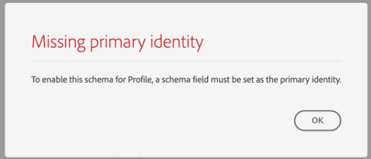

# Skapa ett schema med [!DNL Schema Editor]

Med Adobe Experience Platform användargränssnitt kan du skapa och hantera [!DNL Experience Data Model] (XDM)-scheman på en interaktiv visuell arbetsyta som kallas [!DNL Schema Editor]. I den här självstudien beskrivs hur du skapar ett schema med [!DNL Schema Editor].

I demonstrationssyfte handlar stegen i den här självstudien om att skapa ett exempelschema som beskriver medlemmar i ett kundlojalitetsprogram. Du kan använda de här stegen för att skapa ett annat schema för dina egna syften, men vi rekommenderar att du först följer med när du skapar exempelschemat för att lära dig funktionerna i [!DNL Schema Editor].

>[!NOTE]
>
>Om du importerar CSV-data till plattformen kan du [mappa dessa data till ett XDM-schema som skapats av AI-genererade rekommendationer](../../ingestion/tutorials/map-csv/recommendations.md) (som för närvarande finns i beta) utan att behöva skapa schemat manuellt.
>
>Om du föredrar att skapa ett schema med API:t [!DNL Schema Registry] börjar du med att läsa [[!DNL Schema Registry] utvecklarhandboken](../api/getting-started.md) innan du provar självstudiekursen om hur du [skapar ett schema med API:t](create-schema-api.md).

## Komma igång

Den här självstudiekursen kräver en fungerande förståelse för de olika aspekter av Adobe Experience Platform som används för att skapa scheman. Innan du börjar med den här självstudiekursen bör du läsa om följande koncept i dokumentationen:

* [[!DNL Experience Data Model (XDM)]](../home.md): Det standardiserade ramverket som [!DNL Platform] organiserar kundupplevelsedata med.
   * [Grundläggande om schemakomposition](../schema/composition.md): En översikt över XDM-scheman och deras byggstenar, inklusive klasser, schemafältgrupper, datatyper och enskilda fält.
* [[!DNL Real-Time Customer Profile]](../../profile/home.md): Tillhandahåller en enhetlig konsumentprofil i realtid baserad på aggregerade data från flera källor.

## Öppna arbetsytan [!UICONTROL Schemas] {#browse}

Arbetsytan [!UICONTROL Schemas] i användargränssnittet för [!DNL Platform] ger en visualisering av [!DNL Schema Library] så att du kan visa hur du hanterar de scheman som är tillgängliga för din organisation. Arbetsytan innehåller också [!DNL Schema Editor], arbetsytan som du kan komponera ett schema på i hela den här självstudiekursen.

När du har loggat in på [!DNL Experience Platform] väljer du **[!UICONTROL Schemas]** i den vänstra navigeringen för att öppna arbetsytan i **[!UICONTROL Schemas]**. På fliken **[!UICONTROL Browse]** visas en lista med scheman (en representation av [!DNL Schema Library]) som du kan visa och anpassa. Listan innehåller namn, typ, klass och beteende (post- eller tidsserie) som schemat baseras på samt datum och tid då schemat senast ändrades.

Mer information finns i guiden [Utforska befintliga XDM-resurser i användargränssnittet](../ui/explore.md).

## Skapa och namnge ett schema {#create}

Om du vill börja komponera ett schema väljer du **[!UICONTROL Create schema]** i det övre högra hörnet av arbetsytan i **[!UICONTROL Schemas]**.

![Fliken [!UICONTROL Schemas] arbetsyta [!UICONTROL Browse] med [!UICONTROL Create schema] markerad.](../images/tutorials/create-schema/create-schema-button.png)

Dialogrutan [!UICONTROL Create a schema] visas. I den här dialogrutan kan du välja att antingen skapa ett schema manuellt genom att lägga till fält och fältgrupper, eller så kan du överföra en CSV-fil och använda ML-algoritmer för att generera ett schema. Välj ett arbetsflöde för att skapa schema i dialogrutan.

### Manuell eller ML-assisterad schemagenerering {#manual-or-assisted}

Om du vill lära dig hur du kan använda en ML-algoritm för att rekommendera en schemastruktur baserad på en överförd fil kan du läsa [guiden ](../ui/ml-assisted-schema-creation.md) för att skapa schema med maskininlärningsstöd. Den här användargränssnittshandboken fokuserar på det manuella arbetsflödet.

### Välja en basklass {#choose-a-class}

Arbetsflödet [!UICONTROL Create schema] visas. Välj sedan en basklass för schemat. Du kan välja mellan huvudklasserna för [!UICONTROL XDM Individual Profile] och [!UICONTROL XDM ExperienceEvent], eller [!UICONTROL Other] om dessa klasser inte passar dina syften. Med klassalternativet [!UICONTROL Other] kan du antingen [skapa en ny klass](#create-new-class) eller välja bland andra befintliga klasser.

Mer information om de här klasserna finns i dokumentationen för [[!UICONTROL XDM individual profile]](../classes/individual-profile.md) och [[!UICONTROL XDM ExperienceEvent]](../classes/experienceevent.md). I den här självstudien väljer du **[!UICONTROL XDM Individual Profile]** följt av **[!UICONTROL Next]**.

![Arbetsflödet [!UICONTROL Create schema] med alternativen [!UICONTROL XDM individual profile] och [!UICONTROL Next] markerade.](../images/tutorials/create-schema/individual-profile-base-class.png)

### Namn och granskning {#name-and-review}

När du har valt en klass visas avsnittet [!UICONTROL Name and review]. I det här avsnittet anger du ett namn och en beskrivning som identifierar ditt schema. Det finns flera viktiga saker att tänka på när du ska bestämma ett namn för schemat:

* Schemanamn ska vara korta och beskrivande så att schemat kan hittas senare.
* Schemanamn måste vara unika, vilket innebär att de också måste vara tillräckligt specifika för att de inte ska återanvändas i framtiden. Om din organisation till exempel har separata lojalitetsprogram för olika varumärken är det klokt att kalla ditt schema&quot;Varumärke A lojalitetsmedlemmar&quot; för att göra det enkelt att skilja på dem från andra lojalitetsrelaterade scheman som du kan definiera senare.
* Du kan också använda schemabeskrivningen för att tillhandahålla ytterligare sammanhangsberoende information om schemat.

I den här självstudiekursen skapas ett schema för att importera data som är relaterade till medlemmarna i ett lojalitetsprogram, och schemat har därför namnet [!DNL Loyalty Members].

&#x200B; Schemats grundstruktur (tillhandahålls av klassen) visas på arbetsytan så att du kan granska och verifiera den valda klass- och schemastrukturen.

Ange en [!UICONTROL Schema display name] som är användarvänlig i textfältet. Ange sedan en lämplig beskrivning för att identifiera schemat. När du har granskat din schemastruktur och är nöjd med dina inställningar väljer du **[!UICONTROL Finish]** för att skapa ditt schema.

![Avsnittet [!UICONTROL Name and review] i arbetsflödet [!UICONTROL Create schema] med [!UICONTROL Schema display name], [!UICONTROL Description] och [!UICONTROL Finish] markerade.](../images/ui/resources/schemas/name-and-review.png)

### Skapa ditt schema {#compose-your-schema}

[!DNL Schema Editor] visas. Det här är arbetsytan som du kommer att komponera ditt schema på. Det självskrivna schemat skapas automatiskt i **[!UICONTROL Structure]**-delen av arbetsytan när du kommer till redigeraren, tillsammans med standardfälten som ingår i den basklass som du valde. Den tilldelade klassen för schemat listas också under **[!UICONTROL Class]** i avsnittet **[!UICONTROL Composition]**.

>[!NOTE]
>
>Du kan uppdatera visningsnamnet och den valfria beskrivningen för schemat från sidofältet **[!UICONTROL Schema properties]**. När ett nytt namn har angetts uppdateras arbetsytan automatiskt med det nya namnet på schemat.

>[!NOTE]
>
>Du kan [ändra klassen för ett schema](#change-class) när som helst under den inledande dispositionsprocessen innan schemat har sparats, men detta bör göras med yttersta försiktighet. Fältgrupper är bara kompatibla med vissa klasser. Om du ändrar klassen återställs arbetsytan och alla fält du har lagt till.

## Lägg till en fältgrupp {#field-group}

Nu kan du börja lägga till fält i schemat genom att lägga till fältgrupper. En fältgrupp är en grupp med ett eller flera fält som ofta används tillsammans för att beskriva ett visst koncept. I den här självstudiekursen används fältgrupper för att beskriva medlemmarna i bonusprogrammet och samla in viktig information som namn, födelsedag, telefonnummer, adress med mera.

Om du vill lägga till en fältgrupp väljer du **[!UICONTROL Add]** i underavsnittet **[!UICONTROL Field groups]**.

En ny dialogruta visas med en lista över tillgängliga fältgrupper. Varje fältgrupp är endast avsedd att användas med en viss klass. Därför visas bara fältgrupper som är kompatibla med den klass du valde (i det här fallet klassen [!DNL XDM Individual Profile]) i dialogrutan. Om du använder en standard-XDM-klass sorteras listan med fältgrupper på ett intelligent sätt baserat på användningens popularitet.

![Dialogrutan [!UICONTROL Add field groups].](../images/tutorials/create-schema/field-group-popularity.png)

Du kan välja ett av filtren i den vänstra listen om du vill begränsa listan över standardfältgrupper till specifika [branscher](../schema/industries/overview.md) som detaljhandel, finansiella tjänster och hälso- och sjukvård.

![Dialogrutan [!UICONTROL Add field groups] med branschfältgrupper markerade.](../images/tutorials/create-schema/industry-field-groups.png)

Om du väljer en fältgrupp i listan visas den i den högra listen. Om du vill kan du markera flera fältgrupper och lägga till var och en i listan i den högra listen innan du bekräftar. Dessutom visas en ikon till höger om den markerade fältgruppen där du kan förhandsgranska strukturen för de fält som gruppen innehåller.

![Dialogrutan [!UICONTROL Add field groups] med den markerade ikonen för förhandsgranskning av fältgrupp är markerad.](../images/tutorials/create-schema/preview-field-group-button.png)

När du förhandsgranskar en fältgrupp visas en detaljerad beskrivning av fältgruppens schema i den högra listen. Du kan även navigera genom fältgruppens fält på den angivna arbetsytan. När du väljer olika fält uppdateras den högra listen så att information om fältet i fråga visas. Välj **[!UICONTROL Back]** när du är klar med förhandsgranskningen för att återgå till dialogrutan för fältgruppsval.

![Dialogrutan [!UICONTROL Preview field group] med fältgruppen för demografiska detaljer förhandsvisad.](../images/tutorials/create-schema/preview-field-group.png)

För den här självstudiekursen väljer du fältgruppen **[!UICONTROL Demographic Details]** och sedan **[!UICONTROL Add field group]**.

![Dialogrutan [!UICONTROL Add field groups] med fältgruppen för demografiska detaljer markerad och [!UICONTROL Add field groups] markerad.](../images/tutorials/create-schema/demographic-details.png)

Arbetsytan för schemat visas igen. Avsnittet **[!UICONTROL Field groups]** innehåller nu en lista över [!UICONTROL Demographic Details] och avsnittet **[!UICONTROL Structure]** innehåller fälten från fältgruppen. Du kan markera fältgruppens namn under avsnittet **[!UICONTROL Field groups]** för att markera de specifika fält som finns på arbetsytan.

>[!NOTE]
>
>I Schemaredigeraren visas standardklasser (som genererats av Adobe) och fältgrupper med hänglåsikonen (. hänglåset visas i den vänstra listen bredvid namnet på klassen eller fältgruppen, samt intill ett fält i schemagrafiken som är en del av en systemgenererad resurs.
>
>

Den här fältgruppen bidrar med flera fält under namnet `person` på den översta nivån med datatypen [!UICONTROL Person]. Den här gruppen med fält beskriver information om en individ, inklusive namn, födelsedatum och kön.

>[!NOTE]
>
>Kom ihåg att du kan använda skalära typer i fält (till exempel sträng, heltal, matris eller datum), liksom alla datatyper (en grupp fält som representerar ett gemensamt koncept) som definieras i [!DNL Schema Registry].

Observera att fältet `name` har datatypen [!UICONTROL Full name], vilket innebär att det beskriver ett vanligt koncept och innehåller namnrelaterade underfält som förnamn, efternamn, titel och suffix.

Markera de olika fälten på arbetsytan för att visa eventuella ytterligare fält som de bidrar till schemastrukturen.

## Lägg till fler fältgrupper {#field-group-2}

Nu kan du upprepa samma steg för att lägga till en annan fältgrupp. När du visar dialogrutan **[!UICONTROL Add field group]** den här gången kan du lägga märke till att fältgruppen [!UICONTROL Demographic Details] är nedtonad och att kryssrutan bredvid den inte kan markeras. Detta förhindrar att du av misstag duplicerar fältgrupper som du redan har inkluderat i det aktuella schemat.

För den här självstudien väljer du standardfältgrupperna **[!UICONTROL Personal Contact Details]** och **[!UICONTROL Loyalty Details]** i listan och sedan **[!UICONTROL Add field groups]** för att lägga till dem i schemat.

![Dialogrutan [!UICONTROL Add field groups] med två nya fältgrupper markerade och [!UICONTROL Add field groups] markerade.](../images/tutorials/create-schema/more-field-groups.png)

Arbetsytan visas igen med de tillagda fältgrupperna som listas under **[!UICONTROL Field groups]** i avsnittet **[!UICONTROL Composition]** och deras sammansatta fält läggs till i schemastrukturen.

## Definiera en anpassad fältgrupp {#define-field-group}

Schemat [!UICONTROL Loyalty Members] är avsett att samla in data som är relaterade till medlemmarna i ett lojalitetsprogram, och standardfältgruppen [!UICONTROL Loyalty Details] som du har lagt till i schemat innehåller de flesta av dessa, inklusive programtypen, punkter, kopplingsdatum och mycket annat.

Det kan dock finnas ett scenario där du vill inkludera ytterligare anpassade fält som inte täcks av standardfältgrupper för att uppnå dina användningsfall. Om du vill lägga till anpassade bonusfält har du två alternativ:

1. Skapa en ny anpassad fältgrupp för att hämta dessa fält. Det här är den metod som kommer att beskrivas i den här självstudiekursen.
1. Utöka standardfältgruppen [!UICONTROL Loyalty Details] med anpassade fält. Detta gör att [!UICONTROL Loyalty Details] konverteras till en anpassad fältgrupp och den ursprungliga standardfältgruppen kommer inte längre att vara tillgänglig. Mer information om hur du [lägger till anpassade fält i strukturen för standardfältgrupper](../ui/resources/schemas.md#custom-fields-for-standard-groups) finns i användargränssnittshandboken för [!UICONTROL Schemas].

Om du vill skapa en ny fältgrupp väljer du **[!UICONTROL Add]** i underavsnittet **[!UICONTROL Field groups]** som tidigare, men den här gången väljer du **[!UICONTROL Create New Field group]** i den övre delen av dialogrutan som visas. Du ombeds sedan ange ett visningsnamn och en beskrivning för den nya fältgruppen. I den här självstudiekursen ger du den nya fältgruppen namnet [!DNL Custom Loyalty Details] och väljer sedan **[!UICONTROL Add field groups]**.

![Dialogrutan [!UICONTROL Add field groups] med [!UICONTROL Create new field group], [!UICONTROL Display name] och [!UICONTROL Description] markerade.](../images/tutorials/create-schema/create-new-field-group.png)

>[!NOTE]
>
>Precis som med klassnamn ska fältgruppsnamnet vara kort och enkelt och beskriva vad fältgruppen kommer att bidra till schemat. Även dessa är unika, så du kommer inte att kunna återanvända namnet och måste därför se till att det är tillräckligt specifikt.

[!DNL Custom Loyalty Details] ska nu visas under **[!UICONTROL Field groups]** till vänster på arbetsytan, men det finns inga fält som är kopplade till den än och därför visas inga nya fält under **[!UICONTROL Structure]**.

## Lägg till fält i fältgruppen {#field-group-fields}

Nu när du har skapat fältgruppen [!DNL Custom Loyalty Details] är det dags att definiera fälten som fältgruppen ska bidra till schemat.

Börja med att markera ikonen **plus (+)** bredvid schemanamnet på arbetsytan.

En [!UICONTROL Untitled Field]-platshållare visas på arbetsytan och den högra listen uppdateras för att visa konfigurationsalternativen för fältet.

![Schemaredigeraren med [!UICONTROL Untitled Field] och schemat [!UICONTROL Field properties] markerat.](../images/tutorials/create-schema/untitled-field.png)

I det här scenariot måste schemat ha ett objekttypsfält som beskriver personens aktuella lojalitetsnivå i detalj. Använd kontrollerna i den högra listen och börja skapa ett `loyaltyTier`-fält med typen [!UICONTROL Object] som ska användas för dina relaterade fält.

Under **[!UICONTROL Assign to]** måste du välja en fältgrupp att tilldela fältet till. Kom ihåg att alla schemafält tillhör antingen en klass eller en fältgrupp, och eftersom schemat använder en standardklass är det enda alternativet att välja en fältgrupp. Börja skriva in namnet [!DNL Custom Loyalty Details] och välj sedan fältgruppen i listan.

När du är klar väljer du **[!UICONTROL Apply]**.

![Schemaredigeraren med bonusnivåobjektet tillagt i schemat [!UICONTROL Field properties] markerat.](../images/tutorials/create-schema/loyalty-tier-object.png)

Ändringarna tillämpas och det `loyaltyTier`-objekt som skapades visas. Eftersom det här är ett anpassat fält kapslas det automatiskt i ett objekt som namnges efter organisationens klientorganisations-ID, föregånget av ett understreck (`_tenantId` i det här exemplet).

>[!NOTE]
>
>Närvaron av klient-ID-objektet anger att fälten som du lägger till finns i organisationens namnutrymme.
>
>Fälten som du lägger till är alltså unika för din organisation och kommer att sparas i [!DNL Schema Registry] i ett specifikt område som bara är tillgängligt för din organisation. Fält som du definierar måste alltid läggas till i klientnamnutrymmet för att förhindra konflikter med namn från andra standardklasser, fältgrupper, datatyper och fält.

Välj ikonen **plus (+)** bredvid objektet `loyaltyTier` för att börja lägga till underfält. En ny fältplatshållare visas och avsnittet **[!UICONTROL Field properties]** visas till höger på arbetsytan.

Varje fält kräver följande information:

* **[!UICONTROL Field Name]:** Fältets namn, helst skrivet i camelCase. Inga blankstegstecken tillåts. Det här namnet används som referens för fältet i koden och i andra program längre fram i kedjan.
   * Exempel: loyaltyLevel
* **[!UICONTROL Display Name]:** Fältets namn, skrivet med inledande versal. Det här namnet visas på arbetsytan när du visar eller redigerar schemat.
   * Exempel: Lojalitetsnivå
* **[!UICONTROL Type]:** Fältets datatyp. Detta inkluderar grundläggande skalära typer och alla datatyper som definieras i [!DNL Schema Registry]. Exempel: [!UICONTROL String], [!UICONTROL Integer], [!UICONTROL Boolean], [!UICONTROL Person], [!UICONTROL Address], [!UICONTROL Phone number] osv.
* **[!UICONTROL Description]:** En valfri beskrivning av fältet får innehålla högst 200 tecken.

Det första fältet för objektet `loyaltyTier` blir en sträng med namnet `id` som representerar ID:t för förmånsmedlemmens aktuella nivå. Nivå-ID är unikt för varje lojalitetsmedlem, eftersom det här företaget anger olika tröskelvärden för lojalitetsskikt för varje kund baserat på olika faktorer. Ange det nya fältets typ till [!UICONTROL String], och avsnittet **[!UICONTROL Field properties]** fylls i med flera alternativ för att tillämpa begränsningar, inklusive standardvärde, format och maximal längd. Mer information finns i dokumentationen om [bästa praxis för datavalideringsfält](../schema/best-practices.md#data-validation-fields).

Eftersom `id` kommer att vara en slumpmässigt genererad friformssträng behövs inga ytterligare begränsningar. Välj **[!UICONTROL Apply]** om du vill tillämpa ändringarna.

## Lägg till fler fält i fältgruppen {#field-group-fields-2}

Nu när du har lagt till fältet `id` kan du lägga till ytterligare fält för att hämta information om lojalitetsnivån, till exempel:

* Aktuellt poängtröskelvärde (heltal): Det minsta antalet förmånspunkter som medlemmen måste behålla för att förbli i den aktuella nivån.
* Tröskelvärde för nästa skiktpunkt (heltal): Antalet förmånspoäng som medlemmen måste uppnå för att kunna ta examen vid nästa skikt.
* Giltighetsdatum (datum-tid): Det datum då förmånsmedlemmen anslöt till den här nivån.

Om du vill lägga till varje fält i schemat markerar du ikonen **plus (+)** bredvid objektet `loyalty` och fyller i den obligatoriska informationen.

När det är klart innehåller objektet `loyaltyTier` fält för `id`, `currentThreshold`, `nextThreshold` och `effectiveDate`.

## Lägg till ett uppräkningsfält i fältgruppen {#enum}

När du definierar fält i [!DNL Schema Editor] finns det ytterligare alternativ som du kan tillämpa på grundläggande fälttyper för att tillhandahålla ytterligare begränsningar för de data som fältet kan innehålla. Användningsexempel för dessa begränsningar förklaras i följande tabell:

| Begränsning | Beskrivning |
| --- | --- |
| [!UICONTROL Required] | Anger att fältet är obligatoriskt för datainmatning. Alla data som överförs till en datauppsättning som baseras på det här schemat och som inte innehåller det här fältet kommer att misslyckas vid inmatning. |
| [!UICONTROL Array] | Anger att fältet innehåller en array med värden, var och en med den angivna datatypen. Om du till exempel använder den här begränsningen för ett fält med datatypen [!UICONTROL String] anger det att fältet kommer att innehålla en matris med strängar. |
| [!UICONTROL Enum & Suggested Values] | En uppräkning anger att det här fältet måste innehålla ett av värdena från en uppräknad lista med möjliga värden. Du kan också använda det här alternativet om du bara vill visa en lista med föreslagna värden för ett strängfält utan att begränsa fältet till dessa värden. |
| [!UICONTROL Identity] | Anger att fältet är ett identitetsfält. Mer information om identitetsfält ges [senare i den här självstudiekursen](#identity-field). |
| [!UICONTROL Relationship] | Schemarelationer kan härledas genom användning av unionsschemat och [!DNL Real-Time Customer Profile], men detta gäller endast scheman som delar samma klass. Begränsningen [!UICONTROL Relationship] anger att det här fältet refererar till den primära identiteten för ett schema baserat på en annan klass, vilket innebär en relation mellan de två schemana. Mer information finns i självstudiekursen [Definiera en relation](./relationship-ui.md). |

{style="table-layout:auto"}

>[!NOTE]
>
>Alla obligatoriska, identitets- eller relationsfält visas i respektive avsnitt i den vänstra listen, vilket gör att du enkelt kan hitta fälten oavsett hur komplexa schemat är.

I den här självstudien kräver objektet `loyaltyTier` i schemat ett nytt uppräkningsfält som beskriver klassen tier, där värdet bara kan vara ett av fyra möjliga alternativ. Om du vill lägga till det här fältet i schemat markerar du ikonen **plus (+)** bredvid objektet `loyaltyTier` och fyller i de obligatoriska fälten för **[!UICONTROL Field name]** och **[!UICONTROL Display name]**. För **[!UICONTROL Type]** väljer du [!UICONTROL String].

![Schemaredigeraren med nivåklassobjektet tillagt och markerat i [!UICONTROL Field properties].](../images/tutorials/create-schema/tier-class-type.png)

Ytterligare kryssrutor visas för fältet när dess typ har valts, inklusive kryssrutor för **[!UICONTROL Array]**, **[!UICONTROL Enum & Suggested Values]**, **[!UICONTROL Identity]** och **[!UICONTROL Relationship]**.

Markera kryssrutan **[!UICONTROL Enum & Suggested Values]** och välj sedan **[!UICONTROL Enum]**. Här kan du ange **[!UICONTROL Value]** (i camelCase) och **[!UICONTROL Display Name]** (ett valfritt, läsvänligt namn i Title Case) för varje godtagbar lojalitetsklass.

När du har slutfört alla fältegenskaper väljer du **[!UICONTROL Apply]** för att lägga till fältet `tierClass` i objektet `loyaltyTier`.

![Uppräkningen och föreslå fältegenskaper som har slutförts med [!UICONTROL Apply] markerat.](../images/tutorials/create-schema/tier-class-enum.png)

## Konvertera ett flerfältsobjekt till en datatyp {#datatype}

Objektet `loyaltyTier` innehåller nu flera fält och representerar en gemensam datastruktur som kan vara användbar i andra scheman. Med [!DNL Schema Editor] kan du enkelt tillämpa återanvändbara flerfältsobjekt genom att konvertera strukturen för dessa objekt till datatyper.

Datatyper möjliggör konsekvent användning av flerfältsstrukturer och ger större flexibilitet än en fältgrupp eftersom de kan användas var som helst inom ett schema. Detta görs genom att ställa in fältets **[!UICONTROL Type]**-värde på värdet för alla datatyper som definieras i [!DNL Schema Registry].

Om du vill konvertera objektet `loyaltyTier` till en datatyp markerar du fältet `loyaltyTier` på arbetsytan och väljer sedan **[!UICONTROL Convert to new data type]** till höger om redigeraren under **[!UICONTROL Field properties]**.

![Schemaredigeraren med objektet loyaltyTier och [!UICONTROL Convert to new data type] markerat.](../images/tutorials/create-schema/convert-data-type.png)

Ett meddelande visas som bekräftar att objektet har konverterats. På arbetsytan ser du nu att fältet `loyaltyTier` nu har en länkikon och att den högra listen anger att den har datatypen [!DNL Loyalty Tier].

I ett framtida schema kan du nu tilldela ett fält som typen [!DNL Loyalty Tier] och det skulle automatiskt inkludera fält för ID, skiktklass, poängtrösklar och giltighetsdatum.

>[!NOTE]
>
>Du kan också skapa och redigera anpassade datatyper oberoende av redigeringsscheman. Mer information finns i guiden om [att skapa och redigera datatyper](../ui/resources/data-types.md).

## Söka efter och filtrera schemafält

Schemat innehåller nu flera fältgrupper förutom de fält som anges i basklassen. När du arbetar med större scheman kan du markera kryssrutorna intill fältgruppsnamnen i den vänstra listen för att filtrera de visade fälten så att de bara visas för de fältgrupper du är intresserad av.

Om du letar efter ett specifikt fält i ditt schema kan du även använda sökfältet för att filtrera visade fält efter namn, oavsett vilken fältgrupp de ingår i.

>[!IMPORTANT]
>
>Sökfunktionen tar hänsyn till alla valda fältgruppsfilter när matchande fält visas. Om sökfrågan inte visar de förväntade resultaten kan du behöva dubbelkontrollera att du inte filtrerar ut relevanta fältgrupper.

## Ange ett schemafält som identitetsfält {#identity-field}

Den standarddatastruktur som scheman ger kan utnyttjas för att identifiera data som tillhör samma individ i flera olika källor, vilket möjliggör olika användningsfall i senare led, som segmentering, rapportering, datavetenskapsanalys med mera. För att sammanfoga data baserat på enskilda identiteter måste nyckelfält markeras som [!UICONTROL Identity] fält i tillämpliga scheman.

[!DNL Experience Platform] gör det enkelt att ange ett identitetsfält med hjälp av en **[!UICONTROL Identity]**-kryssruta i [!DNL Schema Editor]. Du måste dock bestämma vilket fält som är det bästa alternativet att använda som identitet, baserat på vilken typ av data du har.

Det kan till exempel finnas tusentals lojalitetsprogrammedlemmar som tillhör samma lojalitetsnivå och flera som delar samma fysiska adress. I det här scenariot anger dock varje medlem i lojalitetsprogrammet sin personliga e-postadress vid registreringen. Eftersom personliga e-postadresser vanligtvis hanteras av en person är fältet `personalEmail.address` (tillhandahålls av fältgruppen [!UICONTROL Personal Contact Details]) en bra kandidat för ett identitetsfält.

>[!IMPORTANT]
>
>Stegen som beskrivs nedan beskriver hur du lägger till en identitetsbeskrivning i ett befintligt schemafält. Som ett alternativ till att definiera identitetsfält i strukturen för själva schemat kan du även använda ett `identityMap`-fält för att innehålla identitetsinformation i stället.
>
>Om du planerar att använda `identityMap` bör du tänka på att den åsidosätter alla primära identiteter som du lägger till i schemat direkt. Mer information finns i avsnittet om `identityMap` i [grunderna i schemakompositionsguiden](../schema/composition.md#identityMap).

Markera fältet `personalEmail.address` på arbetsytan och kryssrutan **[!UICONTROL Identity]** visas under **[!UICONTROL Field properties]**. Markera kryssrutan och alternativet att ange att **[!UICONTROL Primary identity]** ska visas. Markera även den här rutan.

>[!NOTE]
>
>Varje schema får endast innehålla ett primärt identitetsfält. När ett schemafält har angetts som primär identitet får du ett felmeddelande om du senare försöker ange ett annat identitetsfält i schemat som primärt.

Därefter måste du ange **[!UICONTROL Identity namespace]** i listan med fördefinierade namnutrymmen i listrutan. Eftersom det här fältet är kundens e-postadress väljer du [!UICONTROL Email] i listrutan. Välj **[!UICONTROL Apply]** för att bekräfta uppdateringarna av fältet `personalEmail.address`.

>[!NOTE]
>
>En lista med standardnamnutrymmen och definitioner av dem finns i [[!DNL Identity Service] dokumentationen](../../identity-service/troubleshooting-guide.md#standard-namespaces).

När du har tillämpat ändringen visas en fingeravtryckssymbol med ikonen för `personalEmail.address`, vilket anger att det nu är ett identitetsfält. Fältet visas även i den vänstra listen under **[!UICONTROL Identities]**.

Nu kommer alla data som hämtas in till fältet `personalEmail.address` att användas för att identifiera den enskilda personen och sammanfoga en enda vy av den kunden. Läs [[!DNL Identity Service]](../../identity-service/home.md)-dokumentationen om du vill veta mer om hur du arbetar med identiteter i [!DNL Experience Platform].

## Aktivera schemat för användning i [!DNL Real-Time Customer Profile] {#profile}

[[!DNL Real-Time Customer Profile]](../../profile/home.md) utnyttjar identitetsdata i [!DNL Experience Platform] för att ge en helhetsbild av varje enskild kund. Tjänsten bygger robusta 360-gradersprofiler av kundattribut samt tidsstämplade konton för varje interaktion som kunderna har haft i alla system som är integrerade med [!DNL Experience Platform].

För att ett schema ska kunna aktiveras för användning med [!DNL Real-Time Customer Profile] måste en primär identitet ha definierats. Du får ett felmeddelande om du försöker aktivera ett schema utan att först definiera en primär identitet.

Om du vill aktivera schemat &quot;Förmånsmedlemmar&quot; för användning i [!DNL Profile] börjar du med att välja schemanamnet på arbetsytan.

Till höger om redigeraren visas information om schemat, inklusive visningsnamn, beskrivning och typ. Förutom den här informationen finns det en **[!UICONTROL Profile]**-växlingsknapp.

Välj **[!UICONTROL Profile]** så visas en portfölj som ber dig bekräfta att du vill aktivera schemat för [!DNL Profile].

>[!WARNING]
>
>När ett schema har aktiverats för [!DNL Real-Time Customer Profile] och sparats kan det inte inaktiveras.

Välj **[!UICONTROL Enable]** för att bekräfta ditt val. Om du vill kan du avaktivera schemat genom att välja **[!UICONTROL Profile]**-växeln igen, men när schemat har sparats när [!DNL Profile] är aktiverat kan det inte längre inaktiveras.

## Fler åtgärder {#more}

I Schemaredigeraren kan du också utföra snabba åtgärder för att kopiera JSON-strukturen för schemat eller ta bort schemat. Välj [!UICONTROL More] högst upp i vyn om du vill visa en listruta med snabbåtgärder.

### Ta bort ett schema {#delete-a-schema}

>[!CONTEXTUALHELP]
>id="platform_schemas_delete_profileenabledwithdatasets"
>title="Kan inte ta bort schema"
>abstract="Det går inte att ta bort schemat eftersom det har aktiverats för profilen och har associerade datauppsättningar."

>[!CONTEXTUALHELP]
>id="platform_schemas_delete_profileenablednodatasets"
>title="Kan inte ta bort schema"
>abstract="Det går inte att ta bort schemat eftersom det har aktiverats för profilen."

>[!CONTEXTUALHELP]
>id="platform_schemas_delete_withdatasetsnotprofileenabled"
>title="Kan inte ta bort schema"
>abstract="Schemat kan inte tas bort eftersom det har associerade datauppsättningar."

Ett schema kan tas bort inom användargränssnittet från schemaredigeraren med hjälp av [!UICONTROL More]-åtgärder och även från schemainformationen på fliken [!UICONTROL Browse]. Det finns vissa villkor som förhindrar att ett schema tas bort. Ett schema kan inte tas bort om:

* Schemat är aktiverat för profilen.
* Schemat är aktiverat för profilen och har associerade datauppsättningar.
* Schemat har associerade datauppsättningar men har inte aktiverats för profilen.

### Kopiera JSON-struktur {#copy-json-structure}

Välj **[!UICONTROL Copy JSON structure]** om du vill generera en exportnyttolast för ett schema i schemabiblioteket. Den här åtgärden kopierar JSON-strukturen till Urklipp. Din exporterade JSON kan sedan användas för att importera schemat och alla relaterade resurser till en annan sandlåda eller organisation. Detta gör det enkelt och effektivt att dela och återanvända scheman mellan olika miljöer.

## Nästa steg och ytterligare resurser

Nu när du är klar med att komponera schemat kan du se hela schemat på arbetsytan. Välj **[!UICONTROL Save]** så sparas schemat i [!DNL Schema Library] så att det blir tillgängligt för [!DNL Schema Registry].

Ditt nya schema kan nu användas för att importera data till [!DNL Platform]. Kom ihåg att när schemat väl har använts för att importera data får endast additiva ändringar göras. Mer information om schemaversion finns i [Grunderna för schemakomposition](../schema/composition.md).

Nu kan du följa självstudiekursen om att [definiera en schemarelation i användargränssnittet](./relationship-ui.md) för att lägga till ett nytt relationsfält i schemat&quot;Förmånsmedlemmar&quot;.

Schemat &quot;Förmånsmedlemmar&quot; är också tillgängligt för att visas och hanteras med API:t [!DNL Schema Registry]. Börja med att läsa [[!DNL Schema Registry API] utvecklarhandboken](../api/getting-started.md) för att börja arbeta med API:t.

### Videoresurser

>[!WARNING]
>
>Användargränssnittet [!DNL Platform] som visas i följande videofilmer är inaktuellt. Läs dokumentationen ovan för de senaste skärmbilderna och funktionerna i användargränssnittet.

I följande video visas hur du skapar ett enkelt schema i användargränssnittet för [!DNL Platform].

>[!VIDEO](https://video.tv.adobe.com/v/27012?quality=12&learn=on)

Följande video är tänkt att förstärka din förståelse för att arbeta med fältgrupper och klasser.

>[!VIDEO](https://video.tv.adobe.com/v/27013?quality=12&learn=on)

## Bilaga

I följande avsnitt finns ytterligare information om användningen av [!DNL Schema Editor].

### Skapa en ny klass {#create-new-class}

[!DNL Experience Platform] ger flexibilitet att definiera ett schema baserat på en klass som är unik för din organisation. Mer information om hur du skapar en ny klass finns i handboken [Skapa och redigera klasser i användargränssnittet](../ui/resources/classes.md#create).

### Ändra klassen för ett schema {#change-class}

Du kan ändra schemaklassen när som helst under den inledande dispositionsprocessen innan schemat har sparats.

>[!WARNING]
>
>Omtilldelning av klassen för ett schema bör göras med extrem försiktighet. Fältgrupper är bara kompatibla med vissa klasser. Om du ändrar klassen återställs arbetsytan och alla fält du har lagt till.

Mer information om hur du ändrar klassen för ett schema finns i handboken [Hantera scheman i användargränssnittet](../ui/resources/schemas.md#change-class).
