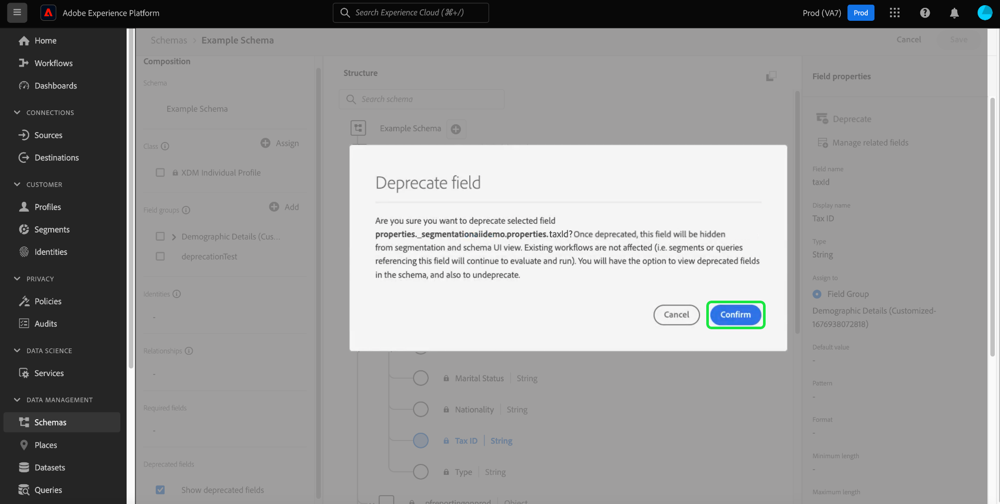

# Ta bort ett XDM-fält i användargränssnittet

Experience Data Model (XDM) ger er flexibiliteten att hantera er datamodell när era affärsbehov ändras genom att ta bort schemafält efter att data har inhämtats. Oönskade fält kan vara inaktuella för att ta bort dem från användargränssnittsvyn och även dölja dem för användargränssnitten längre ned. En kryssruta i Schemaredigeraren gör det enkelt att visa inaktuella fält och, om det behövs, även ta bort inaktuella.

Eftersom inaktuella fält döljs för användargränssnittet som standard effektiviserar detta ditt schema i Schemaredigeraren och förhindrar att oönskade fält läggs till i underordnade beroenden som segmentbyggaren, resedesignern och så vidare. Borttagning av fält är också bakåtkompatibelt. Andra system som använder inaktuella fält, t.ex. segment och frågor, fortsätter att utvärdera dem som de ska. Om ett inaktuellt fält används i ett befintligt segment behandlas det normalt, vilket innebär att fältet visas som förväntat i segmentbyggarbetsytan eller utvärderas baserat på data som finns i de inaktuella fälten. Detta är en fast ändring som inte påverkar befintliga dataflöden negativt.

>[!NOTE]
>
>Innan data hämtas till ett schema kan du ta bort onödiga fältgrupper. Läs dokumentationen om [ta bort en fältgrupp från ett schema](../ui/resources/schemas.md#remove-fields) för mer information.

När data har importerats till ditt schema kan du inte längre ta bort fält från schemat utan att göra brytningsändringar. I det här fallet kan du ta bort ett oönskat fält i ett schema eller en anpassad resurs genom att använda [Schemaredigerare](./create-schema-ui.md) eller [API för schemaregister](https://developer.adobe.com/experience-platform-apis/references/schema-registry/).

I det här dokumentet beskrivs hur du ersätter fält för olika XDM-resurser med Schemaredigeraren i användargränssnittet i Experience Platform. Anvisningar om hur du tar bort ett XDM-fält med API:t finns i självstudiekursen om [ta bort ett XDM-fält med API:t för schemaregister](./field-deprecation-api.md).

## Föråldrade ett fält {#deprecate}

Om du vill ta bort ett anpassat fält går du till Schemaredigeraren för det schema som du vill redigera. Markera fältet som du vill ta bort från [!UICONTROL Structure] del av arbetsytan, följt av **[!UICONTROL Deprecate]** från [!UICONTROL Field Properties].

En dialogruta visas där du kan bekräfta dina val och meddela dig att fältet kommer att tas bort från användargränssnittsvyn i unionsschemat och döljas för användargränssnitten längre fram i kedjan. Slutför åtgärden genom att välja **[!UICONTROL Confirm]**.

Fältet har nu tagits bort från gränssnittsvyn.

>[!NOTE]
>
>När det är föråldrat visas inte längre inaktuella användargränssnitt, som kontrollpaneler för segment, Customer Journey Analytics och Adobe Journey Optimizer, som en del av arbetsflödet. Det underordnade användargränssnittet har dock möjlighet att visa borttagna fält om det behövs och fortsätta att behandla det borttagna fältet som vanligt. Mer information finns i respektive dokumentation. Frågor och segment som använder det borttagna fältet fortsätter att fungera som förväntat.

## Visa inaktuella fält {#show-deprecated}

Om du vill visa tidigare inaktuella fält navigerar du till det relevanta schemat i Schemaredigeraren. Välj **[!UICONTROL Show deprecated fields]** kryssrutan i [!UICONTROL Composition] på arbetsytan.

Det borttagna fältet visas nu i gränssnittsvyn. Välj **[!UICONTROL Save]** för att bekräfta inställningarna.

## Ej inaktuella fält {#undeprecate-fields}

Ångra ett inaktuellt fält först [visa det inaktuella fältet](#show-deprecated) enligt beskrivningen ovan väljer du det borttagna fältet i redigerarens [!UICONTROL Structure] -avsnitt. Nästa, välj **[!UICONTROL Undeprecate]** från [!UICONTROL Field properties] sidebar följt av **[!UICONTROL Save]**.

The [!UICONTROL Undeprecate field] visas. Bekräfta ändringarna genom att välja **[!UICONTROL Confirm]**.

![The [!UICONTROL Undeprecate field] med Bekräfta markerat.](../images/tutorials/field-deprecation/undeprecate-field-dialog.png)

Fältet visas nu som standard i användargränssnittsvyn och även i senare användargränssnitt. Nu kan du välja att ta bort fältet igen.

## Nästa steg

I det här dokumentet beskrivs hur XDM-fält skrivs ut med hjälp av gränssnittet i Schemaredigeraren. Mer information om hur du konfigurerar fält för anpassade resurser finns i handboken [definiera XDM-fält i API](./custom-fields-api.md). Mer information om hur du hanterar beskrivningar finns i [slutpunktshandbok för beskrivningar](../api/descriptors.md).
