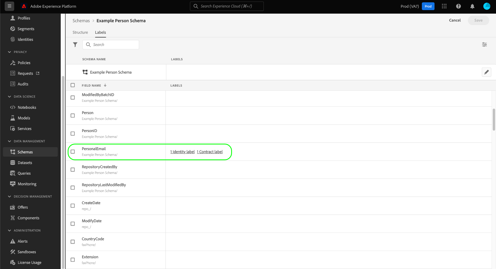

# Hantera dataanvändningsetiketter för ett schema

>[!IMPORTANT]
>
>Schemabaserad märkning ingår i [attributbaserad åtkomstkontroll](../../access-control/abac/overview.md), som för närvarande är tillgänglig i en begränsad version för USA-baserade vårdkunder. Den här funktionen kommer att vara tillgänglig för alla Adobe Real-time Customer Data Platform-kunder när den släpps helt.

Alla data som hämtas till Adobe Experience Platform begränsas av XDM-scheman (Experience Data Model). Dessa data kan vara föremål för användarbegränsningar som fastställts av din organisation eller av juridiska bestämmelser. För att ta hänsyn till detta kan du med hjälp av plattformen begränsa användningen av vissa datauppsättningar och fält genom att använda [dataanvändningsetiketter](../../data-governance/labels/overview.md).

En etikett som används i ett schemafält anger de användningsprinciper som gäller för data i det specifika fältet.

Etiketter kan användas på enskilda scheman och fält i dessa scheman. När etiketter används direkt i ett schema sprids dessa etiketter till alla befintliga och framtida datauppsättningar som baseras på det schemat.

Dessutom sprids alla fältetiketter som du lägger till i ett schema till alla andra scheman som använder samma fält från en delad klass eller fältgrupp. Detta bidrar till att säkerställa att användningsreglerna för liknande fält är konsekventa i hela datamodellen.

I den här självstudiekursen beskrivs stegen för hur du lägger till etiketter i ett schema med Schemaredigeraren i plattformsgränssnittet.

## Komma igång

Handboken kräver en fungerande förståelse av följande komponenter i Adobe Experience Platform:

* [[!DNL Experience Data Model (XDM) System]](../home.md): Det standardiserade ramverket som [!DNL Experience Platform] organiserar kundupplevelsedata med.
   * [Schemaredigeraren](../ui/overview.md): Lär dig hur du skapar och hanterar scheman och andra resurser i plattformsgränssnittet.
* [[!DNL Adobe Experience Platform Data Governance]](../../data-governance/home.md): Tillhandahåller infrastrukturen för att framtvinga dataanvändningsbegränsningar för plattformsåtgärder, med hjälp av principer som definierar vilka marknadsföringsåtgärder som kan (eller inte kan) utföras på märkta data.

## Välj ett schema eller fält som etiketter ska läggas till i {#select-schema-field}

>[!CONTEXTUALHELP]
>id="platform_schemas_editgovernancelabels"
>title="Redigera styrningsetiketter"
>abstract="Tillämpa en etikett på ett schemafält för att ange de användningsprinciper som gäller för data i det specifika fältet."

Om du vill lägga till etiketter måste du först [välja ett befintligt schema att redigera](../ui/resources/schemas.md#edit) eller [skapa ett nytt schema](../ui/resources/schemas.md#create) för att visa dess struktur i Schemaredigeraren.

Om du vill redigera etiketterna för ett enskilt fält kan du markera fältet på arbetsytan och sedan välja **[!UICONTROL Manage access]** i den högra listen.

>[!IMPORTANT]
>
>Högst 300 etiketter kan användas i alla scheman.

Du kan också markera fliken **[!UICONTROL Labels]**, välja önskat fält i listan och välja **[!UICONTROL Apply Access and Data Governance Labels]** i den högra listen.

![Välj ett fält på fliken [!UICONTROL Labels] ](../images/tutorials/labels/select-field-on-labels-tab.png)

Om du vill redigera etiketterna för hela schemat markerar du kryssrutan under filterikonen på fliken **[!UICONTROL Labels]**. Detta markerar alla tillgängliga fält i schemat. Välj sedan **[!UICONTROL Apply Access and Data Governance Labels]** i den högra listen.

![Välj schemanamnet på fliken [!UICONTROL Labels] ](../images/tutorials/labels/select-schema-on-labels-tab.png)

>[!NOTE]
>
>Ett meddelande om ansvarsfriskrivning visas när du för första gången försöker redigera etiketterna för ett schema eller fält och förklarar hur etikettanvändningen påverkar underordnade åtgärder beroende på organisationens principer. Välj **[!UICONTROL Proceed]** om du vill fortsätta redigera.
>
>

## Redigera etiketterna för schemat eller fältet {#edit-labels}

En dialogruta visas där du kan redigera etiketterna för det markerade fältet. Om du har valt ett enskilt fält av objekttyp visas de delfält som de tillämpade etiketterna ska sprida sig till i den högra listen.

>[!NOTE]
>
>Om du redigerar fält för hela schemat listas inte de tillämpliga fälten i den högra listen och schemanamnet visas i stället.

Använd den visade listan för att välja de etiketter som du vill lägga till i schemat eller fältet. När etiketter väljs uppdateras avsnittet **[!UICONTROL Applied labels]** så att etiketterna som har valts hittills visas.

Om du vill filtrera de visade etiketterna efter typ väljer du önskad kategori i den vänstra listen. Om du vill skapa en ny anpassad etikett väljer du **[!UICONTROL Create label]**.

När du är nöjd med de valda etiketterna väljer du **[!UICONTROL Save]** för att använda dem i fältet eller schemat.

Fliken **[!UICONTROL Labels]** visas igen och visar de etiketter som används för schemat.

## Nästa steg

I den här guiden beskrivs hur du hanterar etiketter för dataanvändning för scheman och fält. Information om hur du hanterar dataanvändningsetiketter, inklusive hur du lägger till dem i specifika datauppsättningar i stället för på schemanivå, finns i [användargränssnittshandboken för dataanvändningsetiketter](../../data-governance/labels/user-guide.md).
