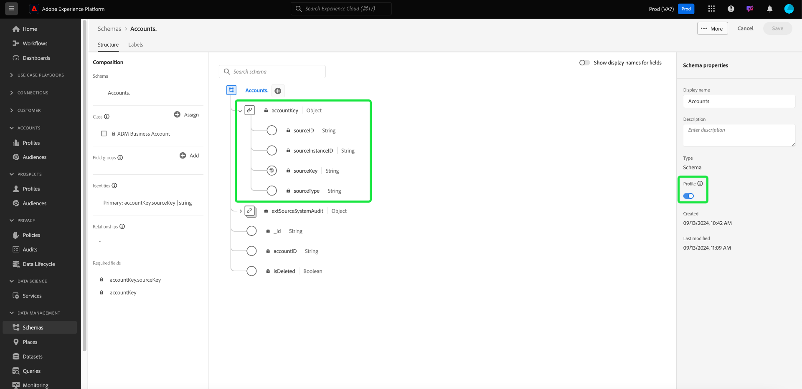
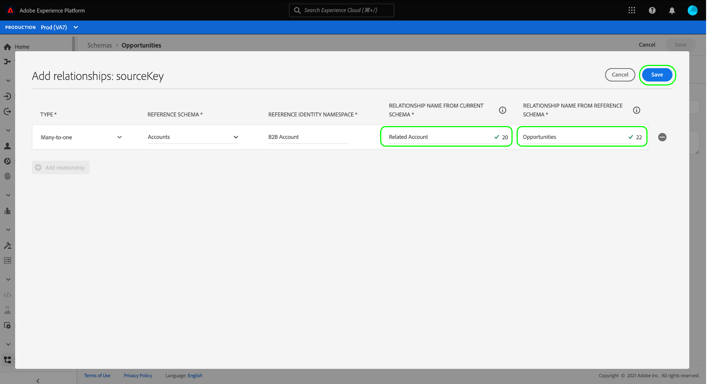
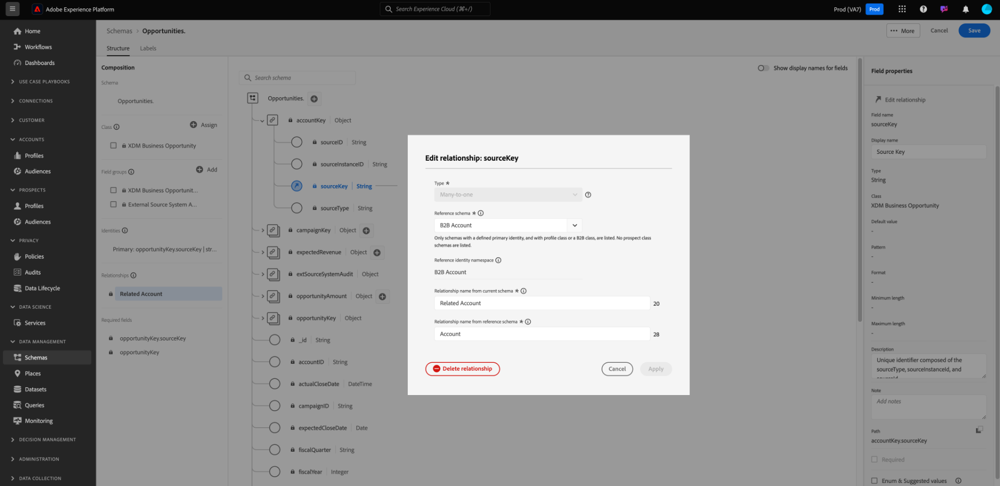

# Definiera en många-till-ett-relation mellan två scheman i Real-time Customer Data Platform B2B Edition {#relationship-b2b}

>[!CONTEXTUALHELP]
>id="platform_xdm_b2b_reference_schema"
>title="Referensschema"
>abstract="Välj det schema som du vill skapa en relation med. Beroende på schemats klass kan den även ha befintliga relationer med andra enheter i B2B-kontexten. Läs dokumentationen för att lära dig hur B2B-schemaklasser relaterar till varandra."

Adobe Real-time Customer Data Platform B2B Edition innehåller flera Experience Data Model-klasser (XDM) som samlar in grundläggande B2B-datatabeller, bland annat [konton](../classes/b2b/business-account.md), [möjligheter](../classes/b2b/business-opportunity.md), [kampanjer](../classes/b2b/business-campaign.md). Genom att skapa scheman som baseras på dessa klasser och aktivera dem för användning i [kundprofilen i realtid](../../profile/home.md), kan du sammanfoga data från olika källor till en enhetlig representation som kallas ett unionsschema.

Unionsscheman kan dock bara innehålla fält som hämtats av scheman som delar samma klass. Det är här som schemarelationer kommer in. Genom att implementera relationer i dina B2B-scheman kan du beskriva hur dessa affärsenheter relaterar till varandra och kan inkludera attribut från flera klasser i fall där segmentering sker nedåt.

I följande diagram visas ett exempel på hur de olika B2B-klasserna kan relatera till varandra i en grundläggande implementering:

I den här självstudiekursen beskrivs stegen för att definiera ett många-till-ett-förhållande mellan två scheman i Real-Time CDP B2B Edition.

>[!NOTE]
>
>Om du inte använder Real-time Customer Data Platform B2B Edition eller vill skapa en 1:1-relation läser du i guiden om [att skapa en 1:1-relation](./relationship-ui.md) i stället.
>
>I den här självstudiekursen fokuseras på hur du manuellt skapar relationer mellan B2B-scheman i plattformsgränssnittet. Om du hämtar in data från en B2B-källanslutning kan du använda ett verktyg för automatisk generering för att skapa nödvändiga scheman, identiteter och relationer i stället. I källdokumentationen för B2B-namnutrymmen och scheman finns mer information om [att använda verktyget för automatisk generering](../../sources/connectors/adobe-applications/marketo/marketo-namespaces.md).

## Komma igång

Den här självstudiekursen kräver en fungerande förståelse av [!DNL XDM System] och Schemaredigeraren i [!DNL Experience Platform]-gränssnittet. Läs följande dokumentation innan du börjar den här självstudiekursen:

* [XDM-system i Experience Platform](../home.md): En översikt över XDM och dess implementering i [!DNL Experience Platform].
* [Grunderna i schemakomposition](../schema/composition.md): En introduktion av byggstenarna i XDM-scheman.
* [Skapa ett schema med  [!DNL Schema Editor]](create-schema-ui.md): En självstudiekurs som beskriver grunderna i hur du skapar och redigerar scheman i användargränssnittet.

## Definiera en källa och ett referensschema

Du förväntas redan ha skapat de två scheman som ska definieras i relationen. I demonstrationssyfte skapar den här självstudien en relation mellan affärsmöjligheter (som definieras i ett [!DNL Opportunities]-schema) och deras associerade företagskonto (som definieras i ett [!DNL Accounts]-schema).

Schemarelationer representeras av ett dedikerat fält i ett **källschema** som refererar till det primära identitetsfältet i ett **referensschema**. I de följande stegen fungerar [!DNL Opportunities] som källschema, medan [!DNL Accounts] fungerar som referensschema.

### Identiteter i B2B-relationer

>[!CONTEXTUALHELP]
>id="platform_xdm_b2b_identity_namespace"
>title="Namnutrymme för referensidentitet"
>abstract="Namnutrymmet (typen) för referensschemats primära identitetsfält. Referensschemat måste ha ett etablerat primärt identitetsfält för att kunna delta i en relation. Mer information om identiteter i B2B-relationer finns i dokumentationen."

För att en relation ska kunna upprättas måste referensschemat ha en definierad primär identitet. När du anger en primär identitet för en B2B-enhet bör du tänka på att strängbaserade enhets-ID:n kan överlappa om du samlar in dem över olika system eller platser, vilket kan leda till datakonflikter i Platform.

För att ta hänsyn till detta innehåller alla standardklasser B2B nyckelfält som överensstämmer med datatypen [[!UICONTROL B2B Source] ](../data-types/b2b-source.md). Den här datatypen innehåller fält för en strängidentifierare för B2B-enheten tillsammans med annan sammanhangsberoende information om identifierarens källa. Ett av dessa fält, `sourceKey`, sammanfogar värdena för de andra fälten i datatypen för att skapa en helt unik identifierare för entiteten. Det här fältet ska alltid användas som primär identitet för B2B-entitetsscheman.

>[!NOTE]
>
>När [anger ett XDM-fält som en identitet](../ui/fields/identity.md) måste du ange ett identitetsnamnutrymme för att definiera identiteten under. Detta kan vara ett standardnamnutrymme från Adobe eller ett anpassat namnutrymme som definieras av din organisation. I praktiken är namnutrymmet helt enkelt en kontextuell sträng och kan anges till vilket värde som helst, förutsatt att det är användbart för din organisation för att kategorisera identitetstypen. Mer information finns i översikten för [identitetsnamnutrymmen](../../identity-service/features/namespaces.md).

I följande avsnitt beskrivs strukturen för varje schema som används i den här självstudiekursen innan en relation har definierats. Observera var de primära identiteterna har definierats i schemastrukturen och vilka anpassade namnutrymmen de använder.

### Schema för affärsmöjligheter

Källschemat [!DNL Opportunities] baseras på klassen [!UICONTROL XDM Business Opportunity]. Ett av fälten som tillhandahålls av klassen, `opportunityKey`, fungerar som identifierare för schemat. Fältet `sourceKey` under objektet `opportunityKey` anges som schemats primära identitet under ett anpassat namnområde med namnet [!DNL B2B Opportunity].

Som framgår av **[!UICONTROL Field Properties]** har det här schemat aktiverats för användning i [!DNL Real-Time Customer Profile].

### [!DNL Accounts]-schema

Referensschemat [!DNL Accounts] baseras på klassen [!UICONTROL XDM Account]. Fältet `accountKey` på rotnivå innehåller det `sourceKey` som fungerar som dess primära identitet under ett anpassat namnområde med namnet [!DNL B2B Account]. Det här schemat har också aktiverats för användning i profilen.

## Definiera ett relationsfält för källschemat {#relationship-field}

>[!CONTEXTUALHELP]
>id="platform_xdm_b2b_relationship_name_current"
>title="Relationsnamn från aktuellt schema"
>abstract="En etikett som beskriver relationen från det aktuella schemat till referensschemat (till exempel Relaterat konto). Den här etiketten används i profil och segmentering för att ge kontext till data från relaterade B2B-enheter. Mer information om hur du skapar B2B-schemarelationer finns i dokumentationen."

>[!CONTEXTUALHELP]
>id="platform_xdm_b2b_relationship_name_reference"
>title="Relationsnamn från referensschema"
>abstract="En etikett som beskriver relationen från referensschemat till det aktuella schemat (till exempel Relaterade affärsmöjligheter). Den här etiketten används i profil och segmentering för att ge kontext till data från relaterade B2B-enheter. Mer information om hur du skapar B2B-schemarelationer finns i dokumentationen."

För att kunna definiera en relation mellan två scheman måste källschemat ha ett dedikerat fält som anger den primära identiteten för referensschemat. StandardB2B-klasser innehåller dedikerade källnyckelfält för vanliga affärsföretag. Klassen [!UICONTROL XDM Business Opportunity] innehåller till exempel källnyckelfält för ett relaterat konto (`accountKey`) och en relaterad kampanj (`campaignKey`). Du kan emellertid också lägga till andra [!UICONTROL B2B Source]-fält i schemat genom att använda anpassade fältgrupper om du behöver fler än standardkomponenterna.

>[!NOTE]
>
>För närvarande kan endast många-till-ett- och en-till-en-relationer definieras från ett källschema till ett referensschema. För en-till-många-relationer måste du definiera relationsfältet i schemat som representerar&quot;många&quot;.

Om du vill ange ett relationsfält markerar du fältet i fråga på arbetsytan, följt av **[!UICONTROL Add relationship]** i sidofältet [!UICONTROL Schema properties]. För schemat [!DNL Opportunities] är det här fältet `accountKey.sourceKey` eftersom målet är att upprätta en många-till-ett-relation med ett konto.

Dialogrutan [!UICONTROL Add relationship] visas. Använd den här dialogrutan för att ange relationsinformation. Relationstypen är inställd på **[!UICONTROL Many-to-one]** som standard.

Under **[!UICONTROL Reference Schema]** använder du sökfältet eller listrutemenyn för att hitta namnet på referensschemat. När du markerar referensschemats namn uppdateras fältet **[!UICONTROL Reference Identity Namespace]** automatiskt till namnområdet för referensschemats primära identitet.

>[!NOTE]
>
>Listan med tillgängliga referensscheman filtreras så att den endast innehåller lämpliga scheman. Scheman **måste** ha en tilldelad primär identitet och vara antingen en B2B-klass eller en individuell profilklass. Scheman för klassen Prospect kan inte ha relationer.

Under **[!UICONTROL Relationship Name From Current Schema]** och **[!UICONTROL Relationship Name From Reference Schema]** anger du egna namn för relationen i sammanhanget för käll- respektive referensscheman. När du är klar väljer du **[!UICONTROL Apply]** för att bekräfta ändringarna och spara relationen.

>[!NOTE]
>
>Relationsnamn får innehålla högst 35 tecken.

Arbetsytan visas igen med relationsfältet markerat med det egna namn du angav tidigare. Relationsnamnet visas även i den vänstra listen för enkel referens.

Om du visar referensschemats struktur visas relationsmarkören bredvid schemats primära identitetsfält och i den vänstra listen.

## Redigera en B2B-schemarelation {#edit-schema-relationship}

När en schemarelation har etablerats väljer du relationsfältet i källschemat följt av **[!UICONTROL Edit relationship]**.

>[!NOTE]
>
>Om du vill visa alla associerade relationer väljer du det primära identitetsfältet i referensschemat följt av [!UICONTROL View relationships].
>{width="100" zoomable="yes"}

Dialogrutan [!UICONTROL Edit relationship] visas. I den här dialogrutan kan du ändra referensschemat och relationsnamnen eller ta bort relationen. Det går inte att ändra relationstypen många-till-en.

För att upprätthålla dataintegriteten och undvika avbrott i segmenteringen och andra processer bör du tänka på följande när du hanterar schemarelationer med länkade datauppsättningar:

* Undvik att ta bort relationer direkt om ett schema är associerat med en datauppsättning, eftersom detta kan påverka segmenteringen negativt. Ta i stället bort den associerade datauppsättningen innan du tar bort relationen.
* Du kan inte ändra referensschemat utan att först ta bort den befintliga relationen. Detta bör dock göras med försiktighet, eftersom borttagning av en relation med en associerad datauppsättning kan få oönskade konsekvenser.
* Om du lägger till nya relationer till ett schema med befintliga länkade datauppsättningar kanske det inte fungerar som det ska och kan leda till potentiella konflikter.

## Filtrera och söka efter relationer {#filter-and-search}

Du kan filtrera och söka efter specifika relationer inom dina scheman från fliken [!UICONTROL Relationships] på arbetsytan i [!UICONTROL Schemas]. Du kan använda den här vyn för att snabbt hitta och hantera dina relationer. Läs dokumentet om [att utforska schemaresurser](../ui/explore.md#lookup) för detaljerade instruktioner om filtreringsalternativen.

## Nästa steg

Genom att följa den här självstudiekursen har du skapat en många-till-ett-relation mellan två scheman med hjälp av [!DNL Schema Editor]. När data har importerats med datauppsättningar som baseras på dessa scheman och data har aktiverats i datalagret för profilen, kan du använda attribut från båda scheman för [användning av segmentering i flera klasser](../../rtcdp/segmentation/b2b.md).
