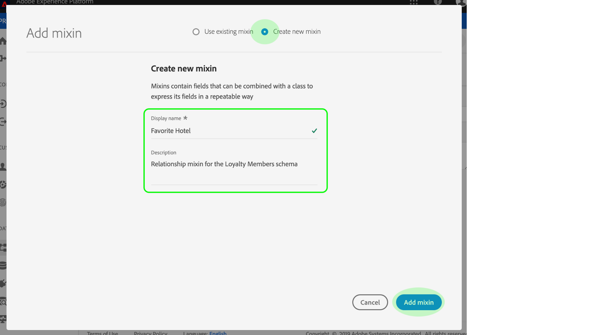
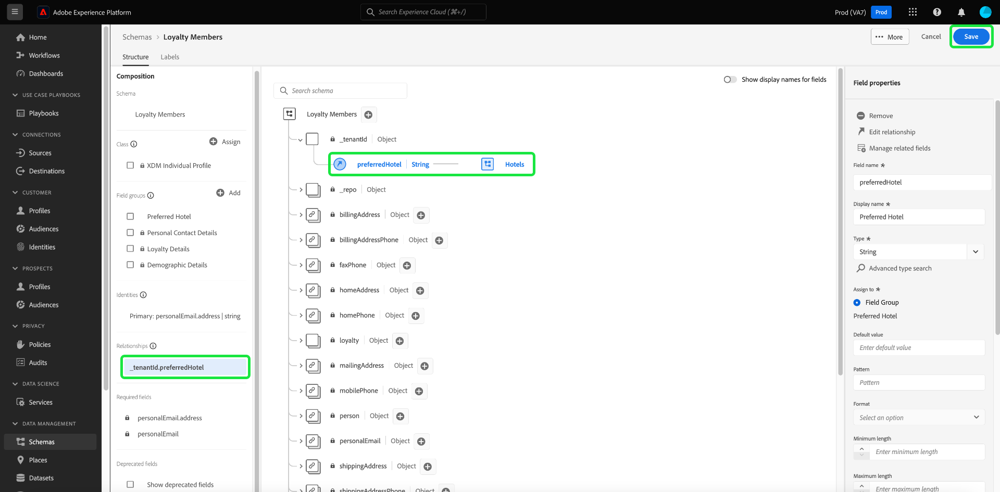

# Definiera en relation mellan två scheman med [!DNL Schema Editor]

Möjligheten att förstå relationen mellan era kunder och deras interaktioner med ert varumärke i olika kanaler är en viktig del av Adobe Experience Platform. Genom att definiera dessa relationer inom strukturen för era [!DNL Experience Data Model] (XDM) scheman kan ni få komplexa insikter i era kunddata.

Schemarelationer kan härledas genom användning av unionsschemat och [!DNL Real-time Customer Profile]detta gäller endast scheman som delar samma klass. Om du vill upprätta en relation mellan två scheman som tillhör olika klasser måste ett dedikerat relationsfält läggas till i ett källschema, som refererar till identiteten för ett målschema.

I det här dokumentet finns en självstudiekurs för att definiera en relation mellan två scheman med hjälp av Schemaredigeraren i [!DNL Experience Platform] användargränssnittet. Anvisningar om hur du definierar schemarelationer med API:t finns i självstudiekursen om hur du [definierar en relation med API:t](relationship-api.md)för schemaregister.

## Komma igång

Den här självstudiekursen kräver en fungerande förståelse av [!DNL XDM System] och Schemaredigeraren i [!DNL Experience Platform] användargränssnittet. Läs följande dokumentation innan du börjar den här självstudiekursen:

* [XDM System i Experience Platform](../home.md): En översikt över XDM och dess implementering i [!DNL Experience Platform].
* [Grundläggande om schemakomposition](../schema/composition.md): En introduktion av byggstenarna i XDM-scheman.
* [Skapa ett schema med [!DNL Schema Editor]](create-schema-ui.md): En självstudiekurs som handlar om grunderna för att arbeta med [!DNL Schema Editor].

## Definiera en källa och ett målschema

Du förväntas redan ha skapat de två scheman som ska definieras i relationen. I demonstrationssyfte skapar den här självstudiekursen en relation mellan medlemmar i en organisations lojalitetsprogram (definieras i ett&quot;[!DNL Loyalty Members]&quot; schema) och deras favorithotell (definieras i ett&quot;[!DNL Hotels]&quot; schema).

>[!IMPORTANT]
>
>För att upprätta en relation måste båda scheman ha definierade primära identiteter och aktiveras för [!DNL Real-time Customer Profile]. Se avsnittet om [aktivering av ett schema för användning i profil](./create-schema-ui.md#profile) i självstudiekursen för att skapa schema om du behöver hjälp med att konfigurera scheman därefter.

Schemarelationer representeras av ett dedikerat fält i ett **källschema** som refererar till ett annat fält i ett **målschema**. I de följande stegen blir &quot;[!DNL Loyalty Members]&quot; källschemat, medan &quot;[!DNL Hotels]&quot; fungerar som målschema.

I följande avsnitt beskrivs strukturen för varje schema som används i den här självstudiekursen innan en relation har definierats.

### [!DNL Loyalty Members] schema

Källschemat&quot;[!DNL Loyalty Members]&quot; baseras på [!DNL XDM Individual Profile] klassen och är det schema som skapades i självstudiekursen för att [skapa ett schema i användargränssnittet](create-schema-ui.md). Det innehåller ett `loyalty` objekt under `_tenantId` namnutrymmet, som innehåller flera lojalitetsspecifika fält. Ett av dessa fält, `loyaltyId`, fungerar som primär identitet för schemat under [!UICONTROL Email] namnutrymmet. Så som visas under **[!UICONTROL Schema Properties]** har schemat aktiverats för användning i [!DNL Real-time Customer Profile].

### [!DNL Hotels] schema

Målschemat&quot;[!DNL Hotels]&quot; baseras på en anpassad&quot;[!DNL Hotels]&quot; klass och innehåller fält som beskriver ett hotell. Fältet fungerar som `hotelId` primär identitet för schemat under ett anpassat `hotelId` namnutrymme. Precis som [!DNL Loyalty Members] schemat har schemat även aktiverats för [!DNL Real-time Customer Profile].

## Skapa en relationsblandning

>[!NOTE]
>
>Det här steget krävs bara om källschemat inte har ett dedikerat strängtypsfält som ska användas som referens till målschemat. Om det här fältet redan är definierat i källschemat går du vidare till nästa steg när du [definierar ett relationsfält](#relationship-field).

För att kunna definiera en relation mellan två scheman måste källschemat ha ett dedikerat fält som ska användas som referens till målschemat. Du kan lägga till det här fältet i källschemat genom att skapa en ny blandning.

Börja med att markera **[!UICONTROL Add]** i **[!UICONTROL Mixins]** avsnittet.

Dialogrutan [!UICONTROL Add Mixin] visas. Här väljer du **[!UICONTROL Create new mixin]**. I textfälten som visas anger du ett visningsnamn och en beskrivning för den nya blandningen. Välj **[!UICONTROL Add mixin]** när du är klar.

 

Arbetsytan visas igen med&quot;[!DNL Favorite Hotel]&quot; i **[!UICONTROL Mixins]** avsnittet. Markera namnet på mixen och välj sedan **[!UICONTROL Add field]** bredvid `Loyalty Members` fältet på rotnivå.

Ett nytt fält visas på arbetsytan under `_tenantId` namnutrymmet. Under **[!UICONTROL Field properties]** anger du ett fältnamn och ett visningsnamn för fältet och anger dess typ till &quot;[!UICONTROL String]&quot;.

När du är klar väljer du **[!UICONTROL Apply]**.

Det uppdaterade `favoriteHotel` fältet visas på arbetsytan. Välj **[!UICONTROL Save]** att slutföra ändringarna av schemat.

## Definiera ett relationsfält för källschemat {#relationship-field}

När ett dedikerat referensfält har definierats i källschemat kan du ange det som ett relationsfält.

Markera `favoriteHotel` fältet på arbetsytan och rulla sedan nedåt under **[!UICONTROL Field properties]** tills **[!UICONTROL Relationship]** kryssrutan visas. Markera kryssrutan för att visa de parametrar som krävs för att konfigurera ett relationsfält.

Markera listrutan för **[!UICONTROL Reference schema]** och välj målschema för relationen (&quot;[!DNL Hotels]&quot; i det här exemplet). Om målschemat är aktiverat för [!DNL Profile], ställs **[!UICONTROL Reference identity namespace]** fältet automatiskt in på namnområdet för målschemats primära identitet. Om schemat inte har någon primär identitet definierad, måste du manuellt välja det namnutrymme som du vill använda i listrutan. Välj **[!UICONTROL Apply]** när du är klar.

Fältet är nu markerat som en relation på arbetsytan och visar målschemats namn och referensidentitetsnamn. `favoriteHotel` Välj **[!UICONTROL Save]** att spara ändringarna och slutföra arbetsflödet.

## Nästa steg

I den här självstudiekursen har du skapat en 1:1-relation mellan två scheman med hjälp av [!DNL Schema Editor]. Anvisningar om hur du definierar relationer med API:t finns i självstudiekursen om hur du [definierar en relation med API:t](relationship-api.md)för schemaregister.