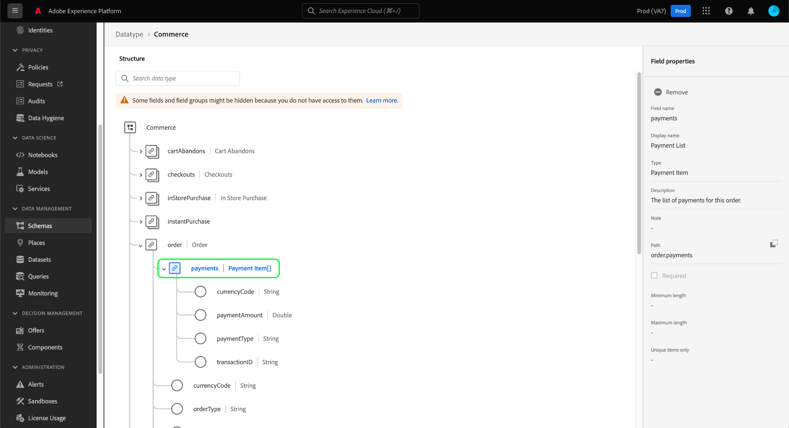

# Utforska XDM-resurser i användargränssnittet

I Adobe Experience Platform lagras alla XDM-resurser (Experience Data Model) i [!DNL Schema Library], inklusive standardresurser från Adobe och anpassade resurser som definierats av din organisation. I användargränssnittet för Experience Platform kan du visa strukturen och fälten för befintliga scheman, klasser, mixin och datatyper i [!DNL Schema Library]. Detta är särskilt användbart när du planerar och förbereder för dataöverföring, eftersom användargränssnittet ger information om de förväntade datatyperna och användningsexemplen för varje fält som tillhandahålls av dessa XDM-resurser.

Den här självstudiekursen beskriver stegen för att utforska befintliga scheman, klasser, blandningar och datatyper i användargränssnittet för Experience Platform.

## Söka efter en XDM-resurs {#lookup}

Välj **[!UICONTROL Schemas]** i den vänstra navigeringen i plattformsgränssnittet. På arbetsytan [!UICONTROL Schemas] finns en **[!UICONTROL Browse]**-flik där du kan utforska alla befintliga XDM-resurser i organisationen, tillsammans med ytterligare dedikerade flikar där du specifikt kan utforska **[!UICONTROL Classes]**, **[!UICONTROL Mixins]** och **[!UICONTROL Data types]**.

På fliken [!UICONTROL Browse] kan du använda filterikonen () för att visa kontroller i den vänstra listen för att begränsa listade resultat.

Om du till exempel vill filtrera listan så att endast standarddatatyper som tillhandahålls av Adobe visas, väljer du **[!UICONTROL Datatype]** och **[!UICONTROL Adobe]** under avsnitten **[!UICONTROL Type]** respektive **[!UICONTROL Owner]**.

Med växlingsknappen **[!UICONTROL Included in Profile]** kan du filtrera resultat så att endast resurser som används i scheman som har aktiverats för användning i [Kundprofil för realtid](../../profile/home.md) visas.

Du kan även använda sökfältet för att begränsa resultaten ytterligare. När du söker efter en term representerar de översta objekten resurser vars namn matchar sökfrågan. Under **[!UICONTROL Standard Fields]** listas alla resurser som innehåller fält som matchar frågan. På så sätt kan du söka efter XDM-resurser baserat på vilken typ av data de innehåller, utan att först behöva veta namnet på resursen.

När du har hittat resursen som du vill utforska väljer du resursens namn i listan för att visa dess struktur på arbetsytan.

## Utforska en XDM-resurs på arbetsytan {#explore}

När du har valt en resurs öppnas dess struktur på arbetsytan.

Alla objekttypsfält som innehåller underegenskaper komprimeras som standard när de först visas på arbetsytan. Om du vill visa underegenskaperna för ett fält markerar du ikonen bredvid namnet.

### Systemgenererade fält {#system-fields}

Vissa fältnamn har ett understreck som `_repo` och `_id`. Dessa representerar platshållare för fält som systemet automatiskt genererar och tilldelar när data hämtas.

Därför bör de flesta av dessa fält uteslutas från datastrukturen när de hämtas till Platform. Det huvudsakliga undantaget för den här regeln är fältet [`_{TENANT_ID}`](../api/getting-started.md#know-your-tenant_id), som alla XDM-fält som skapas under din organisation måste namnges under.

### Datatyper {#data-types}

För varje fält som visas på arbetsytan visas dess motsvarande datatyp bredvid namnet, vilket i en snabbtitt anger vilken typ av data som fältet förväntar sig för inmatning.

Alla datatyper som läggs till med hakparenteser (`[]`) representerar en array med den aktuella datatypen. En datatyp på **[!UICONTROL String]\[]** anger till exempel att fältet förväntar sig en array med strängvärden. Datatypen **[!UICONTROL Payment Item]\[]** anger en array med objekt som överensstämmer med datatypen [!UICONTROL Payment Item].

Om ett matrisfält baseras på en objekttyp kan du markera dess ikon på arbetsytan för att visa de förväntade attributen för varje matrisobjekt.

### [!UICONTROL Field properties] {#field-properties}

När du markerar namnet på ett fält på arbetsytan uppdateras den högra listen till att visa information om det fältet under **[!UICONTROL Field properties]**. Detta kan bland annat innehålla en beskrivning av fältets avsedda användningsfall, standardvärden, mönster, format, oavsett om fältet är obligatoriskt eller inte.

Om fältet som du inspekterar är ett uppräkningsfält, visar den högra listen även de värden som fältet förväntar sig att ta emot.

### Identitetsfält {#identity}

När du inspekterar scheman som innehåller identitetsfält visas dessa fält i den vänstra listen under den klass eller blandning som tillhandahåller dem till schemat. Markera namnet på identitetsfältet i den vänstra listen för att visa fältet på arbetsytan, oavsett hur djupt det är kapslat.

Identitetsfält markeras på arbetsytan med en fingeravtrycksikon (). Om du väljer identitetsfältets namn kan du visa ytterligare information, till exempel [identitetsnamnrymden](../../identity-service/namespaces.md) och huruvida fältet är den primära identiteten för schemat eller inte.

>[!NOTE]
>
>Mer information om identitetsfält och deras relation med underordnade plattformstjänster finns i guiden [definiera identitetsfält](./fields/identity.md).

### Relationsfält {#relationship}

Om du inspekterar ett schema som innehåller ett relationsfält visas fältet i den vänstra listen under **[!UICONTROL Relationships]**. Markera relationsfältets namn i den vänstra listen för att visa fältet på arbetsytan, oavsett hur djupt det är kapslat.

Relationsfält markeras också unikt på arbetsytan och visar namnet på målschemat som fältet refererar till. Om du väljer relationsfältets namn kan du visa identitetsnamnområdet för målschemats primära identitet i den högra listen.

>[!NOTE]
>
>Mer information om hur du använder relationer i XDM-scheman finns i självstudiekursen [skapa en relation i användargränssnittet](../tutorials/create-schema-ui.md).

## Nästa steg

I det här dokumentet beskrivs hur du utforskar befintliga XDM-resurser i användargränssnittet i Experience Platform. Mer information om de olika funktionerna i arbetsytan [!UICONTROL Schemas] och [!DNL Schema Editor] finns i översikten för arbetsytan [[!UICONTROL Schemas]](./overview.md).