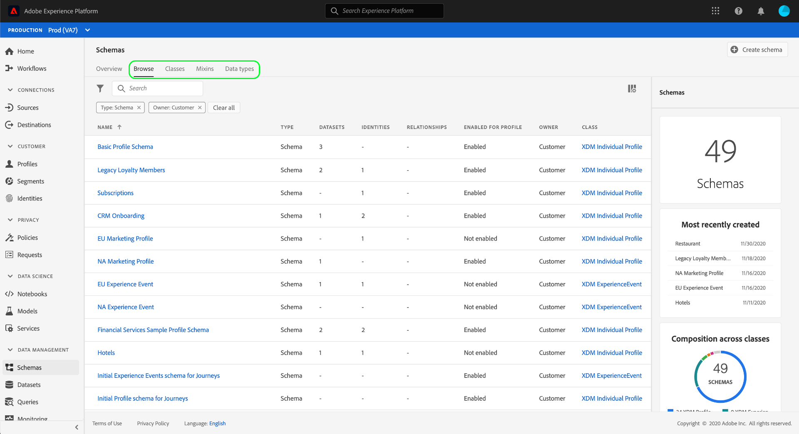
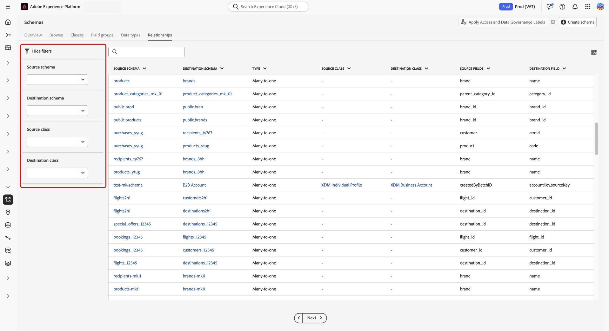
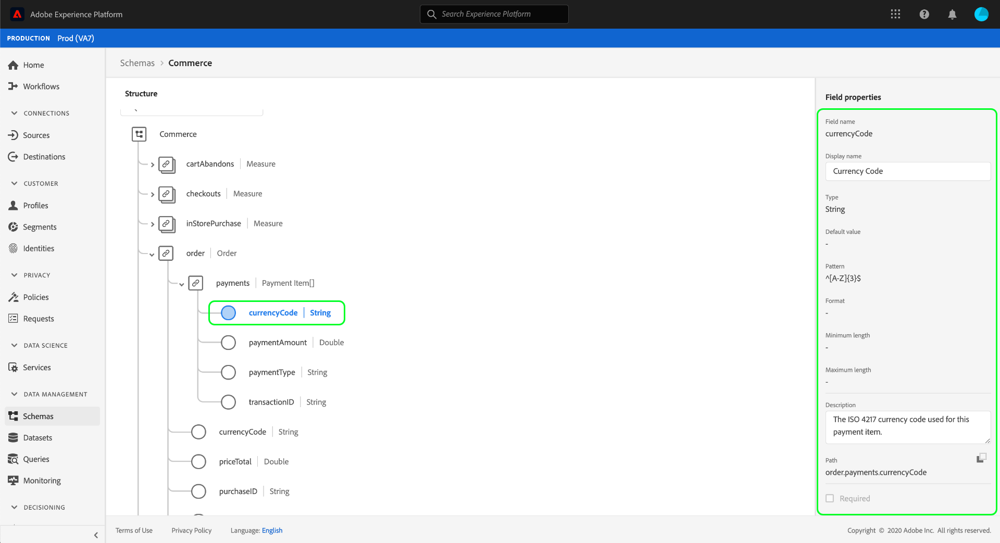
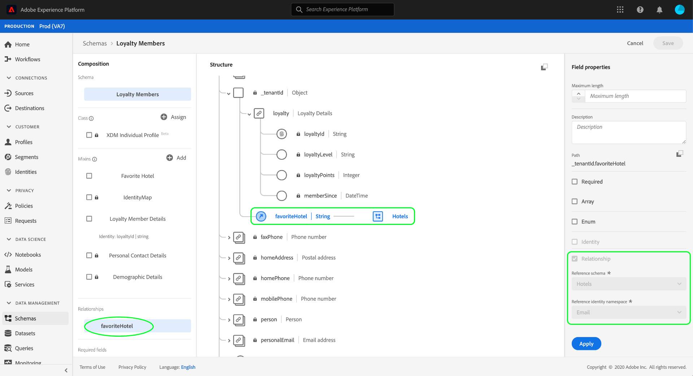
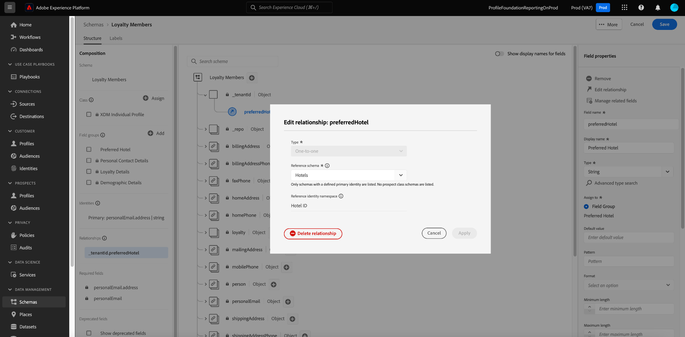

# Utforska schemaresurser i användargränssnittet

I Adobe Experience Platform lagras alla XDM-schemaresurser (Experience Data Model) i [!DNL Schema Library], inklusive standardresurser från Adobe och anpassade resurser som definierats av din organisation. I Experience Platform-gränssnittet kan du visa strukturen och fälten för befintliga scheman, klasser, fältgrupper eller datatyper i [!DNL Schema Library]. Detta är särskilt användbart när du planerar och förbereder för dataöverföring, eftersom användargränssnittet ger information om de förväntade datatyperna och användningsexemplen för varje fält som tillhandahålls av dessa XDM-resurser.

Den här självstudiekursen beskriver stegen för att utforska befintliga scheman, klasser, fältgrupper och datatyper i Experience Platform användargränssnitt.

## Söka efter en schemaresurs {#lookup}

I Experience Platform-gränssnittet väljer du **[!UICONTROL Schemas]** i den vänstra navigeringen. På arbetsytan [!UICONTROL Schemas] finns en **[!UICONTROL Browse]**-flik som du kan använda för att utforska alla scheman i organisationen, tillsammans med ytterligare dedikerade flikar för utforska **[!UICONTROL Classes]**, **[!UICONTROL Field groups]**, **[!UICONTROL Data types]** och **[!UICONTROL Relationships]**.

Filterikonen () visar kontroller i den vänstra listen för att begränsa listade resultat. Resursfilter är tillgängliga för scheman och relationer på flikarna **[!UICONTROL Browse]** och **[!UICONTROL Relationships]**.

På fliken [!UICONTROL Browse] i arbetsytan [!UICONTROL Schemas] kan du filtrera schemalagret. Använd växlingsknappen **[!UICONTROL Included in Profile]** om du bara vill visa scheman som har aktiverats för användning i [Kundprofil för realtid](../../profile/home.md). Använd växlingsknappen **[!UICONTROL Show adhoc schemas]** för att filtrera listan med scheman som skapats med fält som namngetts för att endast användas av en enskild datauppsättning.

![Fliken [!UICONTROL Schemas] Arbetsyta [!UICONTROL Browse] med filterpanelen markerad.](../images/ui/explore/filters.png)

På fliken [!UICONTROL Relationship] i arbetsytan [!UICONTROL Schemas] kan du filtrera listan över relationer baserat på fyra kriterier. Filtren innehåller [!UICONTROL Source schema], [!UICONTROL Destination schema], [!UICONTROL Source class] och [!UICONTROL Destination class]. Tabellen nedan innehåller en beskrivning av filtren.

| Filter | Beskrivning |
|-----------------------------------|------------|
| [!UICONTROL Source schema] | Om du vill visa alla relationer där det valda schemat är startpunkt eller källa, väljer du ett schema i listrutan [!UICONTROL Source schema]. |
| [!UICONTROL Destination schema] | Om du vill visa alla relationer där det valda schemat är målet eller målet, väljer du ett schema i listrutan [!UICONTROL Destination schema]. |
| [!UICONTROL Source class] | Om du vill filtrera relationer baserat på den inledande schemats klass väljer du en klass i listrutan [!UICONTROL Source class]. |
| [!UICONTROL Destination class] | Om du vill visa relationer som slutar med scheman för en viss klass väljer du en klass i listrutan [!UICONTROL Destination class]. |

{style="table-layout:auto"}

Du kan även använda sökfältet för att begränsa resultaten ytterligare.

Resurserna som visas i sökresultaten ordnas först efter matchningar av titel och sedan efter matchningar av beskrivning. Ju fler ord som matchar i någon av dessa kategorier, desto högre visas resursen i listan.

När du har hittat resursen som du vill utforska väljer du resursens namn i listan för att visa dess struktur på arbetsytan.

## Hantera scheman, klasser, fältgrupper och datatyper: åtgärder och borttagning {#xdm-resource-actions}

Använd det här avsnittet när du behöver hantera eller ta bort XDM-resurser, eller när en åtgärd (till exempel ta bort) inte är tillgänglig och du behöver förstå varför.

### Var du hittar åtgärder (textbunden eller detaljsida) {#where-to-find-actions}

Om du vill utföra åtgärder som att ta bort, exportera eller kopiera en resurs använder du någon av följande startpunkter:

På flikarna **[!UICONTROL Browse]**, **[!UICONTROL Classes]**, **[!UICONTROL Field groups]** och **[!UICONTROL Data types]** finns hanteringsåtgärder på två platser:

- **Inline i tabellen**: Varje resursrad innehåller en åtgärdsmeny (till exempel **[!UICONTROL …]**) som ger direktåtkomst till tillgängliga åtgärder.

- **Resursdetaljvy**: Om du vill komma åt fullständiga åtgärder i detaljvyn måste du välja en **anpassad (innehavardefinierad)**-resurs. Standardresurser (som tillhandahålls av Adobe) har begränsade åtgärder och visar inte alternativ som Ta bort, Kopiera JSON-struktur eller Lägg till i paket. Välj en anpassad resurs i lagret för att öppna dess detaljvy och använd sedan menyn **[!UICONTROL More]** i sidhuvudet för att få tillgång till samma tillgängliga åtgärder.

Dessa åtgärder är konsekventa över båda startpunkterna för de resurstyper som stöds (scheman, klasser, fältgrupper och datatyper).

### Tillgängliga åtgärder {#available-actions}

Beroende på resurstypen och dina behörigheter kan följande åtgärder vara tillgängliga:

- **[!UICONTROL Delete]** - Ta bort en anpassad resurs permanent från organisationen (när begränsningarna tillåter det). Om borttagning blockeras, se [Begränsningar](#delete-constraints).
- **[!UICONTROL Download sample file]** - Generera en exempeldatafil baserat på resursstrukturen. Steg för steg: [Generera XDM-exempeldata](./sample.md).
- **[!UICONTROL Copy JSON structure]** - Kopiera resursdefinitionen i JSON-format för återanvändning, export eller inspektion. Steg för steg: [Exportera XDM-scheman](./export.md).
- **[!UICONTROL Add to package]** - Inkludera resursen i ett sandlådepaket för export eller import över sandlådor. Steg för steg: [Exportera objekt till ett paket](../../sandboxes/ui/sandbox-tooling.md#export-objects).

Följande gäller för olika resurstyper:

- Alla åtgärder ovan kan vara tillgängliga för **anpassade (innehavardefinierade)**-scheman, klasser, fältgrupper och datatyper.
- För klasser, fältgrupper och datatyper i **standard (Adobe-definierad)**:
   - Endast **[!UICONTROL Download sample file]** är tillgängligt.
   - **Delete**, **Kopiera JSON-struktur** och **Lägg till i paket** är inte tillgängliga.

### Ta bort beteende {#delete-behavior}

Använd åtgärden **[!UICONTROL Delete]** när du vill ta bort en anpassad resurs som inte längre behövs.

>[!IMPORTANT]
>
> Om du tar bort en resurs permanent tas den bort från organisationen och kan inte ångras. Vissa resurser kan inte tas bort på grund av användning, behörigheter eller systembegränsningar.

Så här tar du bort en resurs:

1. Leta reda på resursen i tabellen eller öppna dess detaljvy.
2. Välj åtgärdsmenyn (**[!UICONTROL …]** eller **[!UICONTROL More]**).
3. Välj **[!UICONTROL Delete]**.
4. Bekräfta åtgärden i dialogrutan genom att välja **[!UICONTROL Delete]** igen.

Resursen tas bort permanent från organisationen när den har bekräftats.

Om det inte går att ta bort en resurs visas alternativet inaktiverat med ett verktygstips som förklarar varför åtgärden inte kan utföras.

### Begränsningar (datauppsättning, profil, RBAC, klientorganisation kontra global) {#delete-constraints}

Om en åtgärd som **[!UICONTROL Delete]** inte är tillgänglig eller inaktiverad beror det vanligtvis på något av följande:

- **Behörigheter (RBAC)**: Du måste ha den behörighet som krävs (till exempel **[!UICONTROL Manage Schemas]**) för att kunna utföra hanteringsåtgärder. Om behörigheter saknas visas funktionsmakron som inaktiverade med verktygstips. Mer information om hur behörigheter konfigureras finns i [översikt över användargränssnittet för åtkomstkontroll](../../access-control/ui/overview.md).

- **Datauppsättningsassociation**: Det går inte att ta bort resurser som används av en eller flera datauppsättningar (till exempel scheman som är kopplade till datauppsättningar). Information om hur du identifierar och tar bort datauppsättningsberoenden finns i [Ta bort en datauppsättning](../../catalog/datasets/user-guide.md#delete).

- **Profilaktivering**: Det går inte att ta bort scheman som har aktiverats för kundprofilen i realtid. Mer information om hur profilaktiveringen påverkar ditt schema finns i [Planering för kundprofilaktivering i realtid](../schema/profile-enablement-planning.md).

- **Klientorganisationen kontra globala resurser**: Klientdefinierade (anpassade) resurser kan tas bort (beroende på begränsningar), medan standardklasser, fältgrupper och datatyper (som tillhandahålls av Adobe) inte kan tas bort.

Dessa begränsningar återspeglas direkt i användargränssnittet. När en åtgärd inte är tillgänglig visas den som inaktiverad och innehåller ett verktygstips som förklarar den specifika begränsningen.

Om du inte kan ta bort en resurs går du igenom villkoren ovan för att avgöra om du behöver uppdatera behörigheter, ta bort beroenden eller justera datamodellen.

Ytterligare arbetsflöden för schemaredigering på arbetsytan finns i [Skapa och redigera scheman i gränssnittet](./resources/schemas.md).

## Utforska en XDM-resurs på arbetsytan {#explore}

När du har valt en resurs öppnas dess struktur på arbetsytan.

Alla objekttypsfält som innehåller underegenskaper komprimeras som standard när de först visas på arbetsytan. Om du vill visa underegenskaperna för ett fält markerar du ikonen bredvid namnet.

### Standardklass och fältgruppsindikator {#standard-class-and-field-group-indicator}

I Schemaredigeraren visas standardklasser (Adobe-genererade) och fältgrupper med hänglåsikonen (. hänglåset visas i den vänstra listen bredvid namnet på klassen eller fältgruppen, samt intill ett fält i schemagrafiken som är en del av en systemgenererad resurs.

Mer information finns i [Lägg till anpassade fält i standardfältgrupper](./resources/schemas.md) -dokumentationen. Du kan inte redigera en standardklass.

### Systemgenererade fält {#system-fields}

Vissa fältnamn har ett understreck som `_repo` och `_id`. Dessa representerar platshållare för fält som systemet automatiskt genererar och tilldelar när data hämtas.

Därför bör de flesta av dessa fält uteslutas från datastrukturen vid import till Experience Platform. Det huvudsakliga undantaget för den här regeln är fältet [`_{TENANT_ID}` ](../api/getting-started.md#know-your-tenant_id), som alla XDM-fält som skapats under din organisation måste namnges under.

### Datatyper {#data-types}

För varje fält som visas på arbetsytan visas dess motsvarande datatyp bredvid namnet, vilket i en snabbtitt anger vilken typ av data som fältet förväntar sig för inmatning.

Alla datatyper som läggs till med hakparenteser (`[]`) representerar en matris med den aktuella datatypen. En datatyp på **[!UICONTROL String]\[]** anger till exempel att en matris med strängvärden förväntas för fältet. Datatypen **[!UICONTROL Payment Item]\[]** anger en array med objekt som överensstämmer med datatypen [!UICONTROL Payment Item].

Om ett matrisfält baseras på en objekttyp kan du markera dess ikon på arbetsytan för att visa de förväntade attributen för varje matrisobjekt.

### [!UICONTROL Field properties] {#field-properties}

När du markerar namnet på ett fält på arbetsytan uppdateras den högra listen så att information om det fältet visas under **[!UICONTROL Field properties]**. Detta kan bland annat innehålla en beskrivning av fältets avsedda användningsfall, standardvärden, mönster, format, oavsett om fältet är obligatoriskt eller inte.

Om fältet som du inspekterar är ett uppräkningsfält, visar den högra listen även de värden som fältet förväntar sig att ta emot.

### Identitetsfält {#identity}

När du inspekterar scheman som innehåller identitetsfält visas dessa fält i den vänstra listen under den klass eller fältgrupp som tillhandahåller dem till schemat. Markera namnet på identitetsfältet i den vänstra listen för att visa fältet på arbetsytan, oavsett hur djupt det är kapslat.

Identitetsfält markeras på arbetsytan med en fingeravtrycksikon (). Om du väljer identitetsfältets namn kan du visa ytterligare information som [identitetsnamnområdet](../../identity-service/features/namespaces.md) och om fältet är den primära identiteten för schemat eller inte.

>[!NOTE]
>
>Mer information om identitetsfält och deras relation med underordnade Experience Platform-tjänster finns i guiden [Definiera identitetsfält](./fields/identity.md).

### Relationsfält {#relationship}

Om du inspekterar ett schema som innehåller ett relationsfält visas fältet i den vänstra listen under **[!UICONTROL Relationships]**. Markera relationsfältets namn i den vänstra listen för att visa fältet på arbetsytan, oavsett hur djupt det är kapslat. Relationsfält markeras också unikt på arbetsytan och visar namnet på referensschemat som fältet länkar till. För organisationer med B2B-funktioner kan anpassade relationsnamn skrivas och visas på arbetsytan i dessa fall.

Om du vill visa identitetsnamnområdet för referensschemats primära identitet markerar du relationsfältet och sedan **[!UICONTROL Edit relationship]** i sidofältet [!UICONTROL Field properties]. Parametrarna för relationen visas i dialogrutan [!UICONTROL Edit relationship] som visas.

Mer information om hur du använder relationer i XDM-scheman finns i självstudiekursen [Skapa en relation i användargränssnittet](../tutorials/relationship-ui.md).

## Nästa steg

I det här dokumentet beskrivs hur du utforskar befintliga XDM-resurser i Experience Platform användargränssnitt. Mer information om de olika funktionerna på arbetsytan [!UICONTROL Schemas] och [!DNL Schema Editor] finns i [[!UICONTROL Schemas]-arbetsytans översikt](./overview.md).
