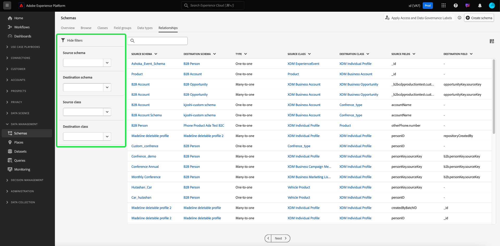

# Utforska schemaresurser i användargränssnittet

I Adobe Experience Platform lagras alla XDM-schemaresurser (Experience Data Model) i [!DNL Schema Library], inklusive standardresurser från Adobe och anpassade resurser som definierats av din organisation. I Experience Platform-gränssnittet kan du visa strukturen och fälten för befintliga scheman, klasser, fältgrupper eller datatyper i [!DNL Schema Library]. Detta är särskilt användbart när du planerar och förbereder för dataöverföring, eftersom användargränssnittet ger information om de förväntade datatyperna och användningsexemplen för varje fält som tillhandahålls av dessa XDM-resurser.

Den här självstudiekursen beskriver stegen för att utforska befintliga scheman, klasser, fältgrupper och datatyper i Experience Platform användargränssnitt.

## Söka efter en schemaresurs {#lookup}

I Experience Platform-gränssnittet väljer du **[!UICONTROL Schemas]** i den vänstra navigeringen. På arbetsytan [!UICONTROL Schemas] finns en **[!UICONTROL Browse]**-flik som du kan använda för att utforska alla scheman i organisationen, tillsammans med ytterligare dedikerade flikar för utforska **[!UICONTROL Classes]**, **[!UICONTROL Field groups]**, **[!UICONTROL Data types]** och **[!UICONTROL Relationships]**.

Filterikonen () visar kontroller i den vänstra listen för att begränsa listade resultat. Resursfilter är tillgängliga för scheman och relationer på flikarna **[!UICONTROL Browse]** och **[!UICONTROL Relationships]**.

På fliken [!UICONTROL Browse] i arbetsytan [!UICONTROL Schemas] kan du filtrera schemalagret. Använd växlingsknappen **[!UICONTROL Included in Profile]** om du bara vill visa scheman som har aktiverats för användning i [Kundprofil för realtid](../../profile/home.md). Använd växlingsknappen **[!UICONTROL Show adhoc schemas]** för att filtrera listan med scheman som skapats med fält som namngetts för att endast användas av en enskild datauppsättning.

![Fliken [!UICONTROL Schemas] Arbetsyta [!UICONTROL Browse] med filterpanelen markerad.](../images/ui/explore/filters.png)

På fliken [!UICONTROL Relationship] i arbetsytan [!UICONTROL Schemas] kan du filtrera listan över relationer baserat på fyra kriterier. Filtren innehåller [!UICONTROL Source schema], [!UICONTROL Destination schema], [!UICONTROL Source class] och [!UICONTROL Destination class]. Tabellen nedan innehåller en beskrivning av filtren.

| Filter | Beskrivning |
|-----------------------------------|------------|
| [!UICONTROL Source schema] | Om du vill visa alla relationer där det valda schemat är startpunkt eller källa, väljer du ett schema i listrutan [!UICONTROL Source schema]. |
| [!UICONTROL Destination schema] | Om du vill visa alla relationer där det valda schemat är målet eller målet, väljer du ett schema i listrutan [!UICONTROL Destination schema]. |
| [!UICONTROL Source class] | Om du vill filtrera relationer baserat på den inledande schemats klass väljer du en klass i listrutan [!UICONTROL Source class]. |
| [!UICONTROL Destination class] | Om du vill visa relationer som slutar med scheman för en viss klass väljer du en klass i listrutan [!UICONTROL Destination class]. |

{style="table-layout:auto"}

Du kan även använda sökfältet för att begränsa resultaten ytterligare.

Resurserna som visas i sökresultaten ordnas först efter matchningar av titel och sedan efter matchningar av beskrivning. Ju fler ord som matchar i någon av dessa kategorier, desto högre visas resursen i listan.

När du har hittat resursen som du vill utforska väljer du resursens namn i listan för att visa dess struktur på arbetsytan.

## Utforska en XDM-resurs på arbetsytan {#explore}

När du har valt en resurs öppnas dess struktur på arbetsytan.

Alla objekttypsfält som innehåller underegenskaper komprimeras som standard när de först visas på arbetsytan. Om du vill visa underegenskaperna för ett fält markerar du ikonen bredvid namnet.

### Standardklass och fältgruppsindikator {#standard-class-and-field-group-indicator}

I Schemaredigeraren visas standardklasser (Adobe-genererade) och fältgrupper med hänglåsikonen (. hänglåset visas i den vänstra listen bredvid namnet på klassen eller fältgruppen, samt intill ett fält i schemagrafiken som är en del av en systemgenererad resurs.

Mer information finns i [Lägg till anpassade fält i standardfältgrupper](./resources/schemas.md) -dokumentationen. Du kan inte redigera en standardklass.

### Systemgenererade fält {#system-fields}

Vissa fältnamn har ett understreck som `_repo` och `_id`. Dessa representerar platshållare för fält som systemet automatiskt genererar och tilldelar när data hämtas.

Därför bör de flesta av dessa fält uteslutas från datastrukturen vid import till Experience Platform. Det huvudsakliga undantaget för den här regeln är fältet [`_{TENANT_ID}` ](../api/getting-started.md#know-your-tenant_id), som alla XDM-fält som skapats under din organisation måste namnges under.

### Datatyper {#data-types}

För varje fält som visas på arbetsytan visas dess motsvarande datatyp bredvid namnet, vilket i en snabbtitt anger vilken typ av data som fältet förväntar sig för inmatning.

Alla datatyper som läggs till med hakparenteser (`[]`) representerar en matris med den aktuella datatypen. En datatyp på **[!UICONTROL String]\[]** anger till exempel att en matris med strängvärden förväntas för fältet. Datatypen **[!UICONTROL Payment Item]\[]** anger en array med objekt som överensstämmer med datatypen [!UICONTROL Payment Item].

Om ett matrisfält baseras på en objekttyp kan du markera dess ikon på arbetsytan för att visa de förväntade attributen för varje matrisobjekt.

### [!UICONTROL Field properties] {#field-properties}

När du markerar namnet på ett fält på arbetsytan uppdateras den högra listen så att information om det fältet visas under **[!UICONTROL Field properties]**. Detta kan bland annat innehålla en beskrivning av fältets avsedda användningsfall, standardvärden, mönster, format, oavsett om fältet är obligatoriskt eller inte.

Om fältet som du inspekterar är ett uppräkningsfält, visar den högra listen även de värden som fältet förväntar sig att ta emot.

### Identitetsfält {#identity}

När du inspekterar scheman som innehåller identitetsfält visas dessa fält i den vänstra listen under den klass eller fältgrupp som tillhandahåller dem till schemat. Markera namnet på identitetsfältet i den vänstra listen för att visa fältet på arbetsytan, oavsett hur djupt det är kapslat.

Identitetsfält markeras på arbetsytan med en fingeravtrycksikon (). Om du väljer identitetsfältets namn kan du visa ytterligare information som [identitetsnamnområdet](../../identity-service/features/namespaces.md) och om fältet är den primära identiteten för schemat eller inte.

>[!NOTE]
>
>Mer information om identitetsfält och deras relation med underordnade Experience Platform-tjänster finns i guiden [Definiera identitetsfält](./fields/identity.md).

### Relationsfält {#relationship}

Om du inspekterar ett schema som innehåller ett relationsfält visas fältet i den vänstra listen under **[!UICONTROL Relationships]**. Markera relationsfältets namn i den vänstra listen för att visa fältet på arbetsytan, oavsett hur djupt det är kapslat. Relationsfält markeras också unikt på arbetsytan och visar namnet på referensschemat som fältet länkar till. För organisationer med B2B-funktioner kan anpassade relationsnamn skrivas och visas på arbetsytan i dessa fall.

Om du vill visa identitetsnamnområdet för referensschemats primära identitet markerar du relationsfältet och sedan **[!UICONTROL Edit relationship]** i sidofältet [!UICONTROL Field properties]. Parametrarna för relationen visas i dialogrutan [!UICONTROL Edit relationship] som visas.

Mer information om hur du använder relationer i XDM-scheman finns i självstudiekursen [Skapa en relation i användargränssnittet](../tutorials/relationship-ui.md).

## Nästa steg

I det här dokumentet beskrivs hur du utforskar befintliga XDM-resurser i Experience Platform användargränssnitt. Mer information om de olika funktionerna på arbetsytan [!UICONTROL Schemas] och [!DNL Schema Editor] finns i [[!UICONTROL Schemas]-arbetsytans översikt](./overview.md).
