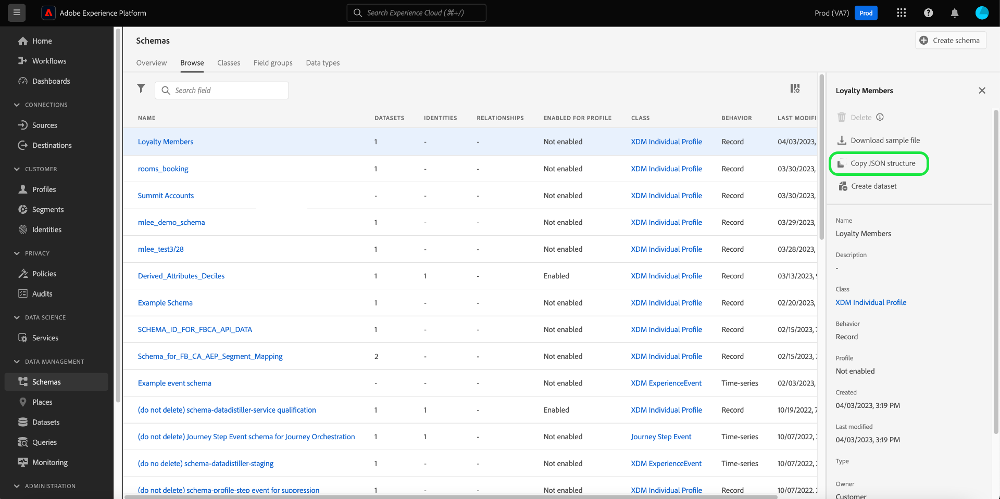

# Exportera XDM-scheman i användargränssnittet

Alla resurser i schemabiblioteket finns i en specifik sandlåda i en IMS-organisation. I vissa fall kanske du vill dela XDM-resurser (Experience Data Model) mellan sandlådor och IMS-organisationer.

För att tillgodose detta behov kan du med arbetsytan [!UICONTROL Schemas] i Adobe Experience Platform UI generera en exportnyttolast för vilket schema som helst i schemabiblioteket. Denna nyttolast kan sedan användas i ett anrop till API:t för schemaregister för att importera schemat (och alla beroende resurser) till en målsandlåda och IMS-organisation.

>[!NOTE]
>
>Du kan också använda API:t för schemaregister för att exportera andra resurser utöver scheman, inklusive klasser, mixins och datatyper. Mer information finns i guiden för [export-/importslutpunkterna](../api/export-import.md).

## Förutsättningar

Med plattformsgränssnittet kan du exportera XDM-resurser, men du måste använda API:t för schemaregister för att importera dessa resurser till andra sandlådor eller IMS-organisationer för att slutföra arbetsflödet. Om du vill ha viktig information om obligatoriska autentiseringshuvuden innan du följer den här guiden läser du i guiden [komma igång med API:t för schemaregistret](../api/getting-started.md).

## Generera en exportnyttolast

Välj **[!UICONTROL Schemas]** i den vänstra navigeringen i plattformsgränssnittet. I arbetsytan [!UICONTROL Schemas] letar du reda på schemat som du vill exportera och öppnar det i mappen [!DNL Schema Editor].

>[!TIP]
>
>Mer information om hur du hittar den XDM-resurs du söker finns i guiden [utforska XDM-resurser](./explore.md).

När du har öppnat schemat väljer du ikonen **[!UICONTROL Copy JSON]** () i arbetsytans övre högra hörn.



Detta kopierar en JSON-nyttolast till Urklipp, som genereras baserat på schemastrukturen. För schemat [!DNL Loyalty Members] som visas ovan genereras följande JSON:

```json
[
  {
    "$id": "https://ns.adobe.com/<XDM_TENANTID_PLACEHOLDER>/mixins/9ecfd881d0053568d277b792e4d24c6b70ffa7782bd31265",
    "meta:altId": "_<XDM_TENANTID_PLACEHOLDER>.mixins.9ecfd881d0053568d277b792e4d24c6b70ffa7782bd31265",
    "meta:resourceType": "mixins",
    "version": "1.0",
    "title": "Loyalty details",
    "type": "object",
    "description": "",
    "definitions": {
      "customFields": {
        "type": "object",
        "properties": {
          "_<XDM_TENANTID_PLACEHOLDER>": {
            "type": "object",
            "properties": {
              "loyalty": {
                "title": "Loyalty",
                "description": "",
                "type": "object",
                "isRequired": false,
                "required": [
                  
                ],
                "properties": {
                  "loyaltyId": {
                    "title": "Loyalty ID",
                    "description": "",
                    "type": "string",
                    "isRequired": false,
                    "required": [
                      
                    ],
                    "meta:xdmType": "string"
                  },
                  "memberSince": {
                    "title": "Member Since",
                    "description": "",
                    "type": "string",
                    "isRequired": false,
                    "required": [
                      
                    ],
                    "format": "date",
                    "meta:xdmType": "date"
                  },
                  "points": {
                    "title": "Points",
                    "description": "",
                    "type": "integer",
                    "isRequired": false,
                    "required": [
                      
                    ],
                    "meta:xdmType": "int"
                  },
                  "loyaltyLevel": {
                    "title": "Loyalty Level",
                    "description": "",
                    "type": "string",
                    "isRequired": false,
                    "required": [
                      
                    ],
                    "enum": [
                      "platinum",
                      "gold",
                      "silver",
                      "bronze"
                    ],
                    "meta:enum": {
                      "platinum": "Platinum",
                      "gold": "Gold",
                      "silver": "Silver",
                      "bronze": "Bronze"
                    },
                    "meta:xdmType": "string"
                  }
                },
                "meta:xdmType": "object"
              }
            },
            "meta:xdmType": "object"
          }
        },
        "meta:xdmType": "object"
      }
    },
    "allOf": [
      {
        "$ref": "#/definitions/customFields",
        "type": "object",
        "meta:xdmType": "object"
      }
    ],
    "meta:extensible": true,
    "meta:abstract": true,
    "meta:intendedToExtend": [
      
    ],
    "meta:xdmType": "object",
    "meta:sandboxId": "1bd86660-c5da-11e9-93d4-6d5fc3a66a8e",
    "meta:sandboxType": "production"
  },
  {
    "$id": "https://ns.adobe.com/<XDM_TENANTID_PLACEHOLDER>/schemas/1e5a739ded8fd1d766a0e06e881a38031874dddd1c7020ad",
    "meta:altId": "_<XDM_TENANTID_PLACEHOLDER>.schemas.1e5a739ded8fd1d766a0e06e881a38031874dddd1c7020ad",
    "meta:resourceType": "schemas",
    "version": "1.4",
    "title": "Loyalty Members",
    "type": "object",
    "description": "Describes customers who are members of a loyalty program.",
    "allOf": [
      {
        "$ref": "https://ns.adobe.com/xdm/context/profile",
        "type": "object",
        "meta:xdmType": "object"
      },
      {
        "$ref": "https://ns.adobe.com/xdm/context/profile-person-details",
        "type": "object",
        "meta:xdmType": "object"
      },
      {
        "$ref": "https://ns.adobe.com/xdm/context/profile-personal-details",
        "type": "object",
        "meta:xdmType": "object"
      },
      {
        "$ref": "https://ns.adobe.com/<XDM_TENANTID_PLACEHOLDER>/mixins/9ecfd881d0053568d277b792e4d24c6b70ffa7782bd31265",
        "type": "object",
        "meta:xdmType": "object"
      },
      {
        "$ref": "https://ns.adobe.com/xdm/mixins/profile-consents",
        "type": "object",
        "meta:xdmType": "object"
      }
    ],
    "meta:extensible": false,
    "meta:abstract": false,
    "meta:extends": [
      "https://ns.adobe.com/xdm/context/profile-person-details",
      "https://ns.adobe.com/xdm/context/profile-personal-details",
      "https://ns.adobe.com/xdm/common/auditable",
      "https://ns.adobe.com/xdm/data/record",
      "https://ns.adobe.com/xdm/context/profile",
      "https://ns.adobe.com/<XDM_TENANTID_PLACEHOLDER>/mixins/9ecfd881d0053568d277b792e4d24c6b70ffa7782bd31265",
      "https://ns.adobe.com/xdm/mixins/profile-consents"
    ],
    "meta:xdmType": "object",
    "meta:class": "https://ns.adobe.com/xdm/context/profile",
    "meta:sandboxId": "1bd86660-c5da-11e9-93d4-6d5fc3a66a8e",
    "meta:sandboxType": "production",
    "meta:immutableTags": [
      
    ]
  }
]
```

Nyttolasten består av en array där varje arrayobjekt är ett objekt som representerar en anpassad XDM-resurs som ska exporteras. I exemplet ovan ingår den anpassade blandningen [!DNL Loyalty details] och schemat [!DNL Loyalty Members]. Alla huvudresurser som används av schemat inkluderas inte i exporten eftersom dessa resurser är tillgängliga i alla sandlådor och IMS-organisationer.

Observera att varje instans av organisationens klientorganisations-ID visas som `<XDM_TENANTID_PLACEHOLDER>` i nyttolasten. Dessa platshållare ersätts automatiskt med rätt innehavar-ID-värde beroende på var du importerar schemat i nästa steg.

## Importera resursen med API:t

När du har kopierat export-JSON för schemat kan du använda det som nyttolast för en POST-begäran till `/import`-slutpunkten i API:t för schemaregistret. I avsnittet [Importera en XDM-resurs i API](../api/export-import.md#import) finns mer information om hur du konfigurerar anropet för att skicka schemat till önskad IMS-organisation och sandlåda.

## Nästa steg

Genom att följa den här guiden har du exporterat ett XDM-schema till en annan IMS-organisation eller sandlåda. Mer information om funktionerna i gränssnittet [!UICONTROL Schemas] finns i översikten [[!UICONTROL Schemas] för användargränssnittet](./overview.md).