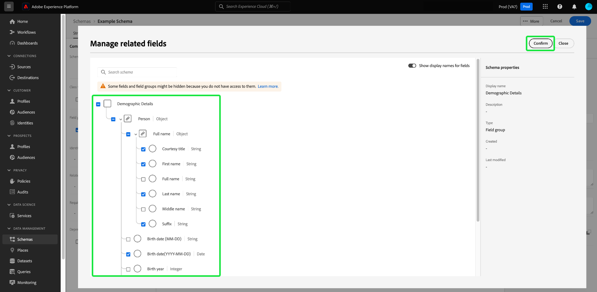

# Fältbaserade arbetsflöden i Schemaredigeraren

Adobe Experience Platform tillhandahåller en robust uppsättning standardiserade [fältgrupper](../schema/composition.md#field-group) som kan användas i XDM-scheman (Experience Data Model). Strukturen och semantiken bakom dessa fältgrupper är noga anpassade för att uppfylla ett stort antal användningsfall för segmentering och andra applikationer längre fram i kedjan av plattformar. Du kan också definiera egna fältgrupper för att tillgodose unika affärsbehov.

När du lägger till en fältgrupp i ett schema, ärver schemat alla fält i gruppen. Du kan nu lägga till enskilda fält i schemat utan att behöva ta med andra fält från den associerade fältgruppen som du kanske inte använder.

Den här guiden beskriver olika metoder för att lägga till enskilda fält i ett schema i plattformsgränssnittet.

## Förhandskrav

I den här självstudien förutsätts att du är bekant med [kompositionen för XDM-scheman](../schema/composition.md) och hur du använder Schemaredigeraren i plattformsgränssnittet. Om du vill följa med i utvecklingen bör du påbörja processen med att [skapa ett nytt schema](./resources/schemas.md) och tilldela det till en standardklass innan du fortsätter med den här guiden.

## Ta bort fält som lagts till från standardfältgrupper {#remove-field-group}

När du har lagt till en standardfältgrupp i ett schema kan du ta bort alla standardfält som du inte behöver.

>[!NOTE]
>
>Om du tar bort fält från en standardfältgrupp påverkas endast schemat som du arbetar med och inte själva fältgruppen. Om du tar bort standardfält i ett schema är dessa fält fortfarande tillgängliga i alla andra scheman som använder samma fältgrupp.

I följande exempel har standardfältgruppen **[!UICONTROL Demographic Details]** lagts till i ett schema. Om du vill ta bort ett enskilt fält, till exempel `maritalStatus`, markerar du fältet på arbetsytan och väljer sedan **[!UICONTROL Remove]** i den högra listen.

Om det finns flera fält som du vill ta bort kan du hantera fältgruppen som helhet. Markera ett fält som tillhör gruppen på arbetsytan och välj sedan **[!UICONTROL Manage related fields]** i den högra listen.

En dialogruta visas med strukturen för fältgruppen i fråga. Härifrån kan du använda de angivna kryssrutorna för att markera eller avmarkera de fält som du behöver. Välj **[!UICONTROL Confirm]** när du är nöjd.

Arbetsytan visas igen med endast de markerade fälten i schemastrukturen.

## Lägga till standardfält direkt i ett schema

Du kan lägga till fält från standardfältgrupper direkt i ett schema utan att först behöva känna till deras motsvarande fältgrupp. Om du vill lägga till ett standardfält i ett schema väljer du plusikonen (**+**) bredvid schemats namn på arbetsytan. En **[!UICONTROL Untitled Field]**-platshållare visas i schemastrukturen och de högra uppdateringarna för att visa kontroller för att konfigurera fältet.

Under **[!UICONTROL Field name]** börjar du skriva namnet på fältet som du vill lägga till. Systemet söker automatiskt efter standardfält som matchar frågan och listar dem under **[!UICONTROL Recommended Standard Fields]**, inklusive de fältgrupper som de tillhör.

Vissa standardfält har samma namn, men strukturen kan variera beroende på vilken fältgrupp de kommer ifrån. Om ett standardfält är kapslat i ett överordnat objekt i fältgruppsstrukturen, kommer det överordnade fältet också att inkluderas i schemat om det underordnade fältet läggs till.

Välj förhandsvisningsikonen () bredvid ett standardfält om du vill visa strukturen för fältgruppen och förstå hur den kan kapslas. Om du vill lägga till standardfältet i schemat väljer du plusikonen ().

Arbetsytan uppdateras för att visa det standardfält som lagts till i schemat, inklusive alla överordnade fält som är kapslade i fältgruppsstrukturen. Namnet på fältgruppen visas också under **[!UICONTROL Field groups]** i den vänstra listen. Om du vill lägga till fler fält från samma fältgrupp väljer du **[!UICONTROL Manage related fields]** i den högra listen.

## Lägga till anpassade fält direkt i ett schema

På samma sätt som arbetsflödet för standardfält kan du även lägga till egna anpassade fält direkt i ett schema.

Om du vill lägga till fält på rotnivån för ett schema väljer du plusikonen (**+**) bredvid schemats namn på arbetsytan. En **[!UICONTROL Untitled Field]**-platshållare visas i schemastrukturen och de högra uppdateringarna för att visa kontroller för att konfigurera fältet.

Börja skriva in namnet på det fält som du vill lägga till så börjar systemet automatiskt att söka efter matchande standardfält. Om du vill skapa ett nytt anpassat fält i stället väljer du det översta alternativet som lagts till med **([!UICONTROL New Field])**.

Här anger du ett visningsnamn och en datatyp för fältet. Under **[!UICONTROL Assign field group]** måste du välja en fältgrupp för det nya fältet som ska kopplas. Börja skriva in namnet på fältgruppen, och om du tidigare har [skapat anpassade fältgrupper](./resources/field-groups.md#create) visas de i listrutan. Du kan också skriva ett unikt namn i fältet för att skapa en ny fältgrupp i stället.

>[!WARNING]
>
>Om du väljer en befintlig anpassad fältgrupp kommer alla andra scheman som använder den fältgruppen också att ärva det nya fältet när du har sparat ändringarna. Därför bör du bara markera en befintlig fältgrupp om du vill använda den här typen av spridning. Annars bör du välja att skapa en ny anpassad fältgrupp i stället.

När du är klar väljer du **[!UICONTROL Apply]**.

Det nya fältet läggs till på arbetsytan och namnges under ditt [klientorganisations-ID](../api/getting-started.md#know-your-tenant_id) för att undvika konflikter med standard-XDM-fält. Fältgruppen som du har associerat det nya fältet med visas även under **[!UICONTROL Field groups]** i den vänstra listen.

>[!NOTE]
>
>Resten av fälten i den valda anpassade fältgruppen tas som standard bort från schemat. Om du vill lägga till några av dessa fält i schemat markerar du ett fält som tillhör gruppen och väljer sedan **[!UICONTROL Manage related fields]** i den högra listen.

### Lägga till anpassade fält i strukturen för standardfältgrupper

Om schemat du arbetar med har ett objekttypsfält från en standardfältgrupp, kan du lägga till egna anpassade fält till det standardobjektet. Markera plusikonen (**+**) bredvid objektets rot.

>[!IMPORTANT]
>
>Alla fält som läggs till i en fältgrupp i ett schema visas också i alla andra scheman som använder samma fältgrupp.

Mer information om hur du lägger till anpassade fält finns i [Skapa och redigera scheman i användargränssnittsguiden](./resources/schemas.md#custom-fields-for-standard-groups).

## Nästa steg

I den här guiden beskrivs de nya fältbaserade arbetsflödena för Schemaredigeraren i plattformsgränssnittet. Mer information om hur du hanterar scheman i användargränssnittet finns i [användargränssnittsöversikt](./overview.md).
