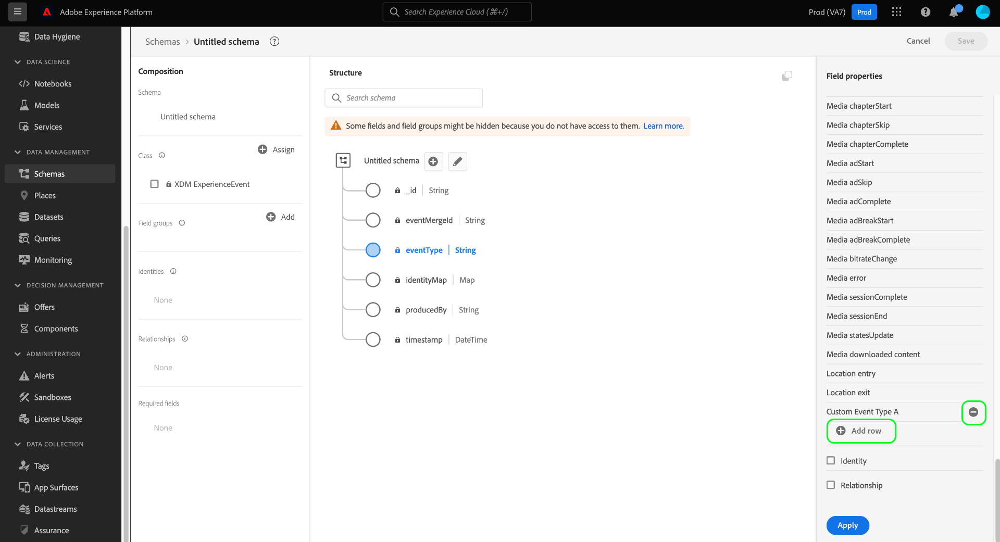

# Definiera uppräkningar och föreslagna värden i användargränssnittet {#enums-and-suggested-values}

>[!CONTEXTUALHELP]
>id="platform_xdm_enum_suggestedvalue"
>title="Uppräkning och föreslagna värden"
>abstract="An **Enum** begränsar ett strängfält så att endast data som matchar en fördefinierad uppsättning värden kan importeras. Varje begränsning kan tilldelas en **Visningsnamn** som fyller i attributlistrutor i segmenteringsgränssnittet. **Föreslagna värden** för ett fält inte begränsa inträngning och endast avgöra vilka visningsnamn som visas i Segmentering. Om du har flera scheman som delar ett fält som tillhör en gemensam klass eller fältgrupp, och du definierar olika uppräkningar eller föreslagna värden för det fältet mellan varje schema, sammanfogas dessa värden och läggs till i unionsschemat."

I Experience Data Model (XDM) kan ett strängfält få en fördefinierad uppsättning godkända eller föreslagna värden för att bättre kontrollera vilka värden som hämtas till det fältet eller hur det fungerar i segmenteringen.

An **enum** begränsar de värden som kan importeras för ett strängfält till en fördefinierad uppsättning. Om du försöker importera data till ett uppräkningsfält och värdet inte matchar någon av dem som definierats i konfigurationen, nekas intag.

I motsats till enum lägger du till **föreslagna värden** till ett strängfält begränsar inte de värden som kan importeras. Föreslagna värden påverkar i stället vilka fördefinierade värden som är tillgängliga i [Segmenteringsgränssnitt](../../../segmentation/ui/overview.md) när strängfältet inkluderas som ett attribut.

När [definiera ett nytt fält](./overview.md#define) i Adobe Experience Platform användargränssnitt och ange typen till [!UICONTROL String]kan du definiera [enum](#enum) eller [föreslagna värden](#suggested-values) för det fältet.

## Definiera en uppräkning {#enum}

Välj **[!UICONTROL Enums and Suggested Values]** väljer **[!UICONTROL Enums]**. Ytterligare kontroller visas, så att du kan ange värdebegränsningar för uppräkningen. Om du vill lägga till en begränsning väljer du **[!UICONTROL Add row]**.

Under **[!UICONTROL Value]** måste du ange det exakta värdet som du vill begränsa fältet till. Du kan även ange en användarvänlig **[!UICONTROL Display Name]** för begränsningen, vilket påverkar hur värdet kommer att representeras i segmenteringen.

Fortsätt använda **[!UICONTROL Add row]** om du vill lägga till önskade begränsningar och valfria etiketter i uppräkningen, eller markera ikonen Ta bort () bredvid en rad som lagts till tidigare för att ta bort den. När du är klar väljer du **[!UICONTROL Apply]** för att tillämpa ändringarna i schemat.

Arbetsytan uppdateras för att återspegla ändringarna. När du utforskar det här schemat i framtiden kan du visa och redigera begränsningarna för uppräkningsfältet i den högra listen.

## Definiera föreslagna värden {#suggested-values}

Välj **[!UICONTROL Enums and Suggested Values]** väljer **[!UICONTROL Suggested Values]** om du vill att fler kontroller ska visas. Här väljer du **[!UICONTROL Add row]** om du vill lägga till föreslagna värden.

Under **[!UICONTROL Display Name]** -kolumnen anger du ett användarvänligt namn för värdet som du vill att det ska visas i segmenteringsgränssnittet. Om du vill lägga till fler föreslagna värden väljer du **[!UICONTROL Add row]** och upprepa processen efter behov. Om du vill ta bort en rad som lagts till tidigare väljer du  bredvid raden i fråga.

När du är klar väljer du **[!UICONTROL Apply]** för att tillämpa ändringarna i schemat.

>[!NOTE]
>
>Det finns en fördröjning på ungefär fem minuter för ett fälts uppdaterade föreslagna värden som ska återspeglas i segmenteringsgränssnittet.

### Hantera föreslagna värden för standardfält

Vissa fält från standard-XDM-komponenter innehåller egna föreslagna värden, till exempel `eventType` från [[!UICONTROL XDM ExperienceEvent] class](../../classes/experienceevent.md). Du kan skapa ytterligare föreslagna värden för ett standardfält, men du kan inte ändra eller ta bort föreslagna värden som inte har definierats av organisationen. När du visar ett standardfält i användargränssnittet visas de föreslagna värdena, men de är skrivskyddade.

Om du vill lägga till nya föreslagna värden för ett standardfält väljer du **[!UICONTROL Add row]**. Om du vill ta bort ett föreslaget värde som tidigare lagts till av organisationen väljer du  bredvid raden i fråga.

<!-- ### Removing suggested values for standard fields

Only suggested values that you define can be removed from a standard field. Existing suggested values can be disabled so that they no longer appear in the segmentation dropdown, but they cannot be removed outright.

For example, consider a profile schema where the a suggested value for the standard `person.gender` field is disabled:

In this example, the display name "[!UICONTROL Non-specific]" is now disabled from being shown in the segmentation dropdown list. However, the value `non_specific` is still part of the list of enumerated fields and is therefore still allowed on ingestion. In other words, you cannot disable the actual enum value for the standard field as it would go against the principle of only allowing changes that make a field less restrictive.

See the [section below](#evolution) for more information on the rules for updating enums and suggested values for existing schema fields. -->

## Utvecklingsregler för enum och föreslagna värden {#evolution}

När ett schema med ett uppräkningsfält har använts för att importera data till plattformen, måste alla ytterligare ändringar som görs i schemadefinitionen överensstämma med de data som redan finns i systemet. I allmänhet kan ändringar som görs i ett befintligt fält bara göra det fältet **mindre** restriktiv. Ett fält kan inte göras mer restriktivt än det redan är.

När det gäller enum och föreslagna värden gäller följande regler för postinmatning:

* Du **KAN** lägga till föreslagna värden för standardfält och anpassade fält med befintliga föreslagna värden.
* Du **KAN** ta bort föreslagna värden från anpassade fält med befintliga föreslagna värden.
* Du **KAN** lägga till nya uppräkningsvärden för ett befintligt anpassat uppräkningsfält.
* Du **KAN** ändra uppräkningsvärdena för ett anpassat fält till endast föreslagna värden eller konvertera det till en sträng utan uppräkning eller föreslagna värden. **Det går inte att ångra den här växeln när den har använts.**
* Du **KAN INTE** ta bort uppräkningar eller föreslagna värden från standardfält.
* Du **KAN INTE** lägg till uppräkningsvärden i ett fält utan befintlig uppräkning.
* Du **KAN INTE** tar bort färre än alla befintliga uppräkningsvärden för ett anpassat fält.
* Du **KAN INTE** växla från föreslagna värden till en uppräkning.

## Sammanfoga regler för uppräkningar och föreslagna värden {#merging}

Om flera scheman använder samma uppräkningsfält med olika konfigurationer, och dessa scheman ingår i en union, gäller vissa regler när det gäller hur uppräkningsskillnader avstäms. De exakta reglerna beror på om scheman refererar till samma standardfält (som `eventType`) eller om de refererar till samma anpassade fältsökväg i olika fältgrupper.

Om samma standardfält refereras:

* Ytterligare föreslagna värden är **BIFOGAD** i unionen.
* Uppdateringar av de föreslagna värdena för samma uppräkningsnyckel är **UPPDATERAD** i unionen.

Om samma anpassade fältsökväg refereras i olika fältgrupper:

* Ytterligare föreslagna värden är **BIFOGAD** i unionen.
* Om samma ytterligare föreslagna värde definieras i mer än ett schema är dessa värden **SAMMANSLAGNA** i unionen. Med andra ord visas inte samma föreslagna värde två gånger efter sammanslagningen.

## Valideringsbegränsningar

På grund av nuvarande systembegränsningar finns det två fall där en uppräkning inte valideras av systemet vid intag:

1. Uppräkningen definieras på en [matrisfält](./array.md).
1. Uppräkningen definieras mer än en nivå djupt i schemahierarkin.

## Nästa steg

I den här handboken beskrivs hur du definierar enum och föreslagna värden för strängfält i användargränssnittet. Mer information om hur du hanterar uppräkningar och föreslagna värden med API:t för schemaregister finns i följande [självstudiekurs](../../tutorials/suggested-values.md).

Så här definierar du andra XDM-fälttyper i [!DNL Schema Editor], se översikten på [definiera fält i användargränssnittet](./overview.md#special).
