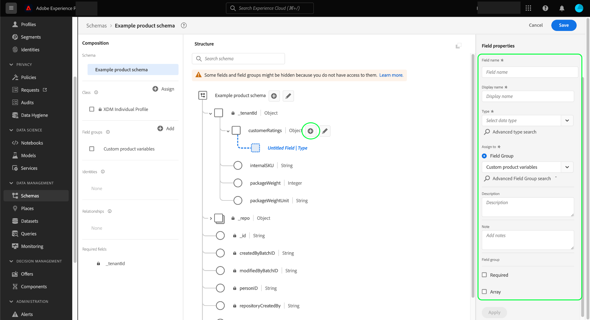

# Definiera objektfält i användargränssnittet

Med Adobe Experience Platform kan ni helt anpassa strukturen för era anpassade Experience Data Model-klasser (XDM), mixins och datatyper. För att kunna ordna och kapsla relaterade fält i anpassade XDM-resurser kan du definiera objekttypsfält som kan innehålla ytterligare underfält.

När [du definierar ett nytt fält](./overview.md#define) i Adobe Experience Platform användargränssnitt använder du listrutan **[!UICONTROL Type]** och väljer [!UICONTROL Object] i listan.

Välj **[!UICONTROL Apply]** om du vill lägga till objektet i schemat. Arbetsytan uppdateras för att visa det nya fältet med datatypen [!UICONTROL Object], inklusive kontroller för att redigera och lägga till underfält till objektet.

Om du vill lägga till ett underfält väljer du ikonen **plus (+)** bredvid objektfältet på arbetsytan. Ett nytt fält visas under objektet, med kontroller för att konfigurera delfältet i den högra listen.

När du har konfigurerat underfältet och valt **[!UICONTROL Apply]** kan du fortsätta lägga till fält i objektet på samma sätt. Du kan också lägga till underfält som själva är objekt, så att du kan kapsla in fält så djupt du vill.

När du är klar med att skapa objektet kanske du vill återanvända dess struktur i olika klasser och blandningar. I det här fallet kan du välja att konvertera objektet till en datatyp. Mer information finns i avsnittet [konvertera objekt till datatyper](../resources/data-types.md#convert) i användargränssnittsguiden för datatyper.

## Nästa steg

I den här handboken beskrivs hur du definierar ett objektfält i användargränssnittet. I översikten [definierar fält i användargränssnittet](./overview.md#special) finns mer information om hur du definierar andra XDM-fälttyper i [!DNL Schema Editor].
