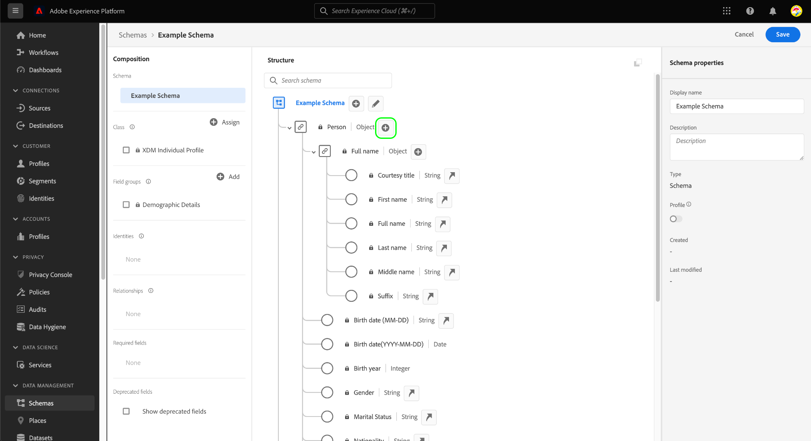

# Definiera XDM-fält i användargränssnittet

Med [!DNL Schema Editor] i Adobe Experience Platform användargränssnitt kan du definiera egna fält i anpassade Experience Data Model-klasser (XDM) och -blandningar. Den här guiden beskriver stegen för att definiera XDM-fält i användargränssnittet, inklusive tillgängliga konfigurationsalternativ för varje fälttyp.

## Förutsättningar

Handboken kräver en fungerande förståelse för XDM System. Se [XDM-översikten](../../home.md) för en introduktion till XDM-rollen i ekosystemet Experience Platform och [grunderna i schemakomposition](../../schema/composition.md) för att lära dig hur klasser och blandningar bidrar till fält i XDM-scheman.

Även om det inte krävs för den här guiden rekommenderar vi att du också följer självstudiekursen om [disposition av ett schema i användargränssnittet](../../tutorials/create-schema-ui.md) för att bekanta dig med de olika funktionerna i [!DNL Schema Editor].

## Välj en resurs att lägga till fält i {#select-resource}

Om du vill definiera nya XDM-fält i användargränssnittet måste du först öppna ett schema i [!DNL Schema Editor]. Beroende på vilka scheman som är tillgängliga i [!DNL Schema Library] kan du välja att [skapa ett nytt schema](../resources/schemas.md#create) eller [välja ett befintligt schema att redigera](../resources/schemas.md#edit).

När du har [!DNL Schema Editor] öppet använder du den vänstra listen för att välja den klass eller blandning som du vill definiera fält för. Om resursen är en anpassad resurs som definieras av din organisation visas kontroller för att lägga till eller redigera fält på arbetsytan. Dessa kontroller visas intill schemats namn, liksom alla objekttypsfält som har definierats under den valda klassen eller mixin.

>[!NOTE]
>
>Om den klass eller mixin du väljer är en huvudresurs som tillhandahålls av Adobe kan den inte redigeras och därför visas inte kontrollerna ovan. Om schemat som du vill lägga till fält i baseras på en XDM-huvudklass och inte innehåller några anpassade mixiner, kan du [skapa en ny mixin](../resources/mixins.md#create) som du i stället kan lägga till i schemat.

Om du vill lägga till ett nytt fält i resursen väljer du ikonen **plus (+)** bredvid schemats namn på arbetsytan, eller bredvid det objekttypsfält som du vill definiera fältet under.

## Definiera ett fält för en resurs {#define}

När du har valt ikonen **plus (+)** visas ett **[!UICONTROL New field]** på arbetsytan, som finns i ett rotnivåobjekt som har ett namn som är kopplat till ditt unika klient-ID (visas som `_tenantId` i exemplet nedan). Alla fält som läggs till i ett schema via anpassade klasser och blandningar placeras automatiskt i det här namnutrymmet för att förhindra konflikter med andra fält från klasser och blandningar som tillhandahålls av Adobe.

I den högra listen under **[!UICONTROL Field properties]** kan du konfigurera informationen för de nya fälten. Följande information krävs för varje fält:

| Fältegenskap | Beskrivning |
| --- | --- |
| [!UICONTROL Field name] | Ett unikt, beskrivande namn för fältet. Observera att fältets namn inte kan ändras när schemat har sparats.  Namnet ska helst skrivas i camelCase. Den kan innehålla alfanumeriska tecken, bindestreck eller understreck, men **får inte** börja med ett understreck.<ul><li>**Korrekt**:  `fieldName`</li><li>**Godtagbart:** `field_name2`,  `Field-Name`,  `field-name_3`</li><li>**Felaktigt**:  `_fieldName`</li></ul> |
| [!UICONTROL Display name] | Ett användarvänligt fältnamn. |
| [!UICONTROL Type] | Den typ av data som fältet innehåller. I den här listrutan kan du välja en av de [standardskalära typerna](../../schema/field-constraints.md) som stöds av XDM, eller en av de flerfälttyper [som har definierats i [!DNL Schema Registry].](../resources/data-types.md)  Du kan också välja  **[!UICONTROL Advanced type search]** att söka efter och filtrera befintliga datatyper och enklare hitta den önskade typen. |

Du kan även ange ett valfritt, läsbart **[!UICONTROL Description]** till fältet för att ge mer kontext till fältets avsedda användningsfall.

>[!NOTE]
>
>Beroende på vilken **[!UICONTROL Type]** du har valt för fältet kan ytterligare konfigurationskontroller visas i den högra listen. Mer information om dessa kontroller finns i avsnittet [typspecifika fältegenskaper](#type-specific-properties).
>
>Den högra listen innehåller även kryssrutor för att ange särskilda fälttyper. Mer information finns i avsnittet [speciella fälttyper](#special).

När du har konfigurerat fältet väljer du **[!UICONTROL Apply]**.

Arbetsytan uppdateras för att visa fältets namn och typ, och den högra listen visar nu fältets sökväg förutom dess andra egenskaper.

Du kan fortsätta följa stegen ovan för att lägga till fler fält i schemat. När schemat har sparats sparas även dess basklass och mixins om några ändringar har gjorts i dem.

>[!NOTE]
>
>Alla ändringar du gör i mixins eller klassen för ett schema kommer att återspeglas i alla andra scheman som använder dem.

## Typspecifika fältegenskaper {#type-specific-properties}

När du definierar ett nytt fält kan ytterligare konfigurationsalternativ visas i den högra listen beroende på vilken **[!UICONTROL Type]** du väljer för fältet. I följande tabell visas de här extra fältegenskaperna tillsammans med deras kompatibla typer:

| Fältegenskap | Kompatibla typer | Beskrivning |
| --- | --- | --- |
| [!UICONTROL Default value] | [!UICONTROL String], [!UICONTROL Double], [!UICONTROL Long], [!UICONTROL Integer], [!UICONTROL Short], [!UICONTROL Byte], [!UICONTROL Boolean] | Ett standardvärde som tilldelas det här fältet om inget annat värde anges under importen. Värdet måste överensstämma med fältets valda typ. |
| [!UICONTROL Pattern] | [!UICONTROL String] | Ett [reguljärt uttryck](https://developer.mozilla.org/en-US/docs/Web/JavaScript/Guide/Regular_Expressions) som värdet för det här fältet måste uppfylla för att accepteras vid förtäring. |
| [!UICONTROL Format] | [!UICONTROL String] | Välj i en lista över fördefinierade format för strängar som värdet måste överensstämma med. Tillgängliga format: <ul><li>[[!UICONTROL date-time]](https://tools.ietf.org/html/rfc3339)</li><li>[[!UICONTROL email]](https://tools.ietf.org/html/rfc2822)</li><li>[[!UICONTROL hostname]](https://tools.ietf.org/html/rfc1123#page-13)</li><li>[[!UICONTROL ipv4]](https://tools.ietf.org/html/rfc791)</li><li>[[!UICONTROL ipv6]](https://tools.ietf.org/html/rfc2460)</li><li>[[!UICONTROL uri]](https://tools.ietf.org/html/rfc3986)</li><li>[[!UICONTROL uri-reference]](https://tools.ietf.org/html/rfc3986#section-4.1)</li><li>[[!UICONTROL url-template]](https://tools.ietf.org/html/rfc6570)</li><li>[[!UICONTROL json-pointer]](https://tools.ietf.org/html/rfc6901)</li></ul> |
| [!UICONTROL Minimum length] | [!UICONTROL String] | Det minsta antalet tecken som strängen måste innehålla för att värdet ska accepteras vid förtäring. |
| [!UICONTROL Maximum length] | [!UICONTROL String] | Det maximala antal tecken som strängen måste innehålla för att värdet ska accepteras vid förtäring. |
| [!UICONTROL Minimum value] | [!UICONTROL Double] | Det lägsta värdet för Double som ska accepteras vid förtäring. Om det inmatade värdet exakt matchar det som anges här, accepteras värdet. |
| [!UICONTROL Maximum value] | [!UICONTROL Double] | Det högsta värdet för Double som ska accepteras vid intag. Om det inmatade värdet exakt matchar det som anges här, accepteras värdet. |
| [!UICONTROL Exclusive minimum value] | [!UICONTROL Double] | Det högsta värdet för Double som ska accepteras vid intag. Om det inmatade värdet exakt matchar det som anges här, avvisas värdet. |
| [!UICONTROL Exclusive maximum value] | [!UICONTROL Double] | Det högsta värdet för Double som ska accepteras vid intag. Om det inmatade värdet exakt matchar det som anges här, avvisas värdet. |

## Speciella fälttyper {#special}

Den högra listen innehåller flera kryssrutor för att ange speciella roller för det markerade fältet. Användningsexempel för vissa av dessa alternativ inbegriper viktiga överväganden som rör er datamodelleringsstrategi och hur ni tänker använda plattformstjänster längre fram i kedjan.

Mer information om dessa specialtyper finns i följande dokumentation:

* [[!UICONTROL Required]](./required.md)
* [[!UICONTROL Array]](./array.md)
* [[!UICONTROL Enum]](./enum.md)
* [[!UICONTROL Identity]](./identity.md) (Endast tillgängligt för strängfält)
* [[!UICONTROL Relationship]](./relationship.md) (Endast tillgängligt för strängfält)

Även om det inte är en speciell fälttyp rekommenderar vi att du går till guiden [definierar objekttypsfält](./object.md) för att lära dig mer om hur du definierar kapslade underfält om schemastrukturen används.

## Nästa steg

Den här guiden ger en översikt över hur du definierar XDM-fält i användargränssnittet. Kom ihåg att fält bara kan läggas till i scheman med hjälp av klasser och blandningar. Mer information om hur du hanterar de här resurserna i användargränssnittet finns i guiderna för att skapa och redigera [klasser](../resources/classes.md) och [mixiner](../resources/mixins.md).

Mer information om funktionerna för arbetsytan [!UICONTROL Schemas] finns i översikten för arbetsytan [[!UICONTROL Schemas]](../overview.md).