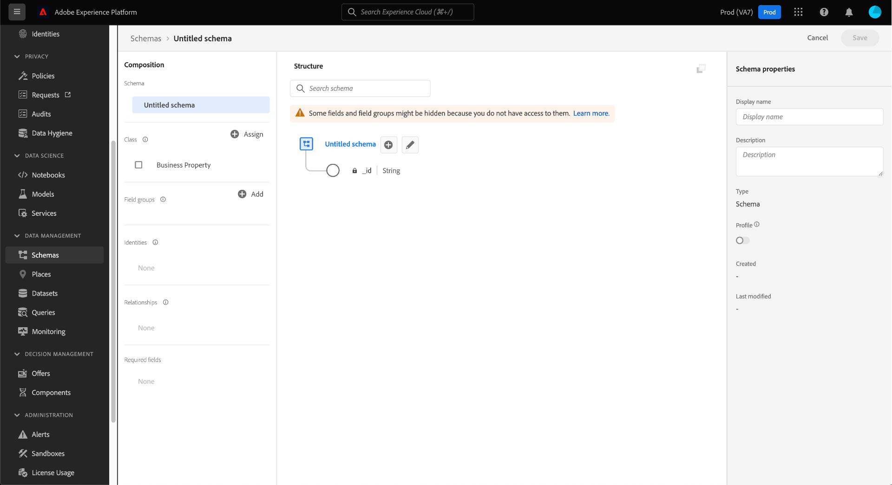
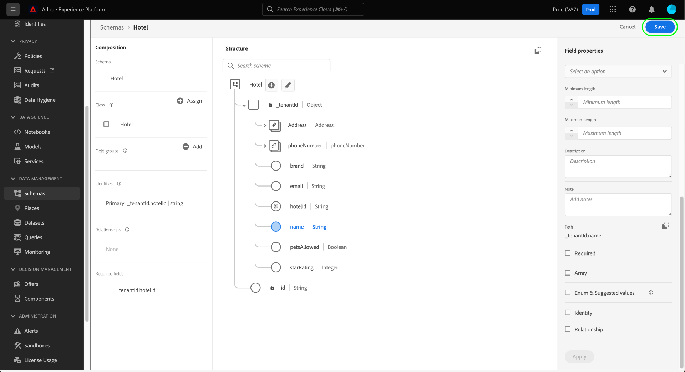

# Skapa och redigera klasser i användargränssnittet

I Experience Data Model (XDM) definierar klasser de beteendeaspekter av data som ett schema ska innehålla (post- eller tidsserie). Förutom detta beskriver klasser det minsta antalet gemensamma egenskaper som alla scheman baserade på den klassen behöver innehålla och tillhandahåller ett sätt för att sammanfoga flera kompatibla datamängder.

Adobe tillhandahåller flera standard-XDM-klasser (&quot;core&quot;), inklusive [!DNL XDM Individual Profile] och [!DNL XDM ExperienceEvent]. Förutom dessa huvudklasser kan du även skapa egna anpassade klasser som beskriver mer specifika användningsfall för organisationen.

Det här dokumentet innehåller en översikt över hur du skapar, redigerar och hanterar anpassade klasser i Adobe Experience Platform-gränssnittet.

## Förutsättningar

Handboken kräver en fungerande förståelse för XDM System. Se [XDM-översikten](../../home.md) för en introduktion till XDM-rollen i ekosystemet Experience Platform och [grunderna i schemakomposition](../../schema/composition.md) för att lära dig hur klasser bidrar till XDM-scheman.

Även om det inte krävs för den här guiden rekommenderar vi att du också följer självstudiekursen om [disposition av ett schema i användargränssnittet](../../tutorials/create-schema-ui.md) för att bekanta dig med de olika funktionerna i [!DNL Schema Editor].

## Skapa en ny klass {#create}

Välj **[!UICONTROL Create schema]** på arbetsytan **[!UICONTROL Schemas]** och välj sedan **[!UICONTROL Browse]** i listrutan.

En dialogruta visas där du kan välja från en lista med tillgängliga klasser. Välj **[!UICONTROL Create new class]** högst upp i dialogrutan. Du kan sedan ge den nya klassen ett visningsnamn (ett kort, beskrivande, unikt och användarvänligt namn för klassen), en beskrivning och ett beteende för de data som schemat ska definiera (&quot;[!UICONTROL Record]&quot; eller &quot;[!UICONTROL Time-series]&quot;).

När du är klar väljer du **[!UICONTROL Assign class]**.

[!DNL Schema Editor] visas och visar ett nytt schema på arbetsytan som är baserat på den anpassade klass som du just skapade. Eftersom inga fält har lagts till i klassen ännu innehåller schemat bara ett `_id`-fält, som representerar den systemgenererade unika identifieraren som automatiskt tillämpas på alla resurser i [!DNL Schema Registry].

>[!IMPORTANT]
>
>När du skapar ett schema som implementerar en klass som definierats av din organisation, måste du komma ihåg att mixar bara är tillgängliga för användning med kompatibla klasser. Eftersom klassen som du definierade är ny finns det inga kompatibla blandningar i listan i dialogrutan **[!UICONTROL Add mixin]**. Du måste i stället [skapa nya mixins](./mixins.md#create) som kan användas med den klassen. Nästa gång du skapar ett schema som implementerar den nya klassen kommer de mixar som du har definierat att listas och vara tillgängliga för användning.

Nu kan du börja [lägga till fält i klassen](#add-fields), som delas av alla scheman som använder klassen.

## Redigera en befintlig klass {#edit}

>[!NOTE]
>
>Endast anpassade klasser som definierats av din organisation kan redigeras och anpassas helt. För huvudklasser som definieras av Adobe kan bara visningsnamnen för deras fält redigeras inom kontexten för enskilda scheman. Mer information finns i avsnittet [redigera visningsnamn för schemafält](./schemas.md#display-names).
>
>När en anpassad klass har sparats och använts vid dataanvändningen kan endast additiva ändringar göras i den därefter. Mer information finns i [reglerna för schemautveckling](../../schema/composition.md#evolution).

Om du vill redigera en befintlig klass väljer du fliken **[!UICONTROL Browse]** och väljer sedan namnet på ett schema som använder den klass som du vill redigera.

>[!TIP]
>
>Du kan använda arbetsytans sök- och filtreringsfunktioner för att enklare hitta schemat. Mer information finns i guiden [utforska XDM-resurser](../explore.md).

[!DNL Schema Editor] visas med schemats struktur på arbetsytan. Nu kan du börja [lägga till fält i klassen](#add-fields).

## Lägga till fält i en klass {#add-fields}

När du har ett schema med en anpassad klass öppen i [!UICONTROL Schema Editor] kan du börja lägga till fält i klassen. Om du vill lägga till ett nytt fält väljer du ikonen **plus (+)** bredvid schemats namn.

>[!IMPORTANT]
>
>Kom ihåg att alla fält som du lägger till i en klass används i alla scheman som använder den klassen. Du bör därför noga tänka på vilka fält som är användbara i alla schemaanvändningsfall. Om du funderar på att lägga till ett fält som bara kan visa användning i vissa scheman under den här klassen, kanske du vill lägga till det i dessa scheman genom att [skapa en blandning](./mixins.md#create) i stället.

En **[!UICONTROL New field]** visas på arbetsytan och den högra listen uppdateras för att visa kontroller för att konfigurera fältets egenskaper. Se guiden [definiera fält i användargränssnittet](../fields/overview.md#define) för specifika steg om hur du konfigurerar och lägger till fältet i klassen.

Fortsätt att lägga till så många fält som behövs för klassen. När du är klar väljer du **[!UICONTROL Save]** för att spara både schemat och klassen.

Om du tidigare har skapat scheman som använder den här klassen visas de nya fälten automatiskt i dessa scheman.

## Ändra klassen för ett schema {#schema}

Du kan ändra schemaklassen när som helst under den inledande skapandeprocessen innan det har sparats. Mer information finns i guiden [skapa och redigera scheman](./schemas.md#change-class).

## Nästa steg

I det här dokumentet beskrivs hur du skapar och redigerar klasser med hjälp av användargränssnittet för plattformen. Mer information om funktionerna för arbetsytan [!UICONTROL Schemas] finns i översikten för arbetsytan [[!UICONTROL Schemas]](../overview.md).

Mer information om hur du hanterar klasser med hjälp av API:t [!DNL Schema Registry] finns i [handboken om klassers slutpunkter](../../api/classes.md).