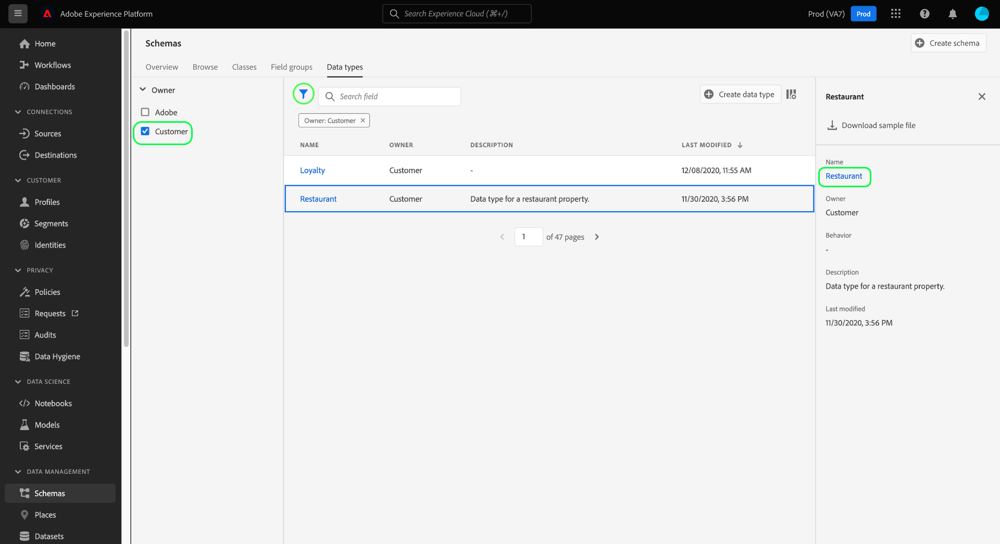
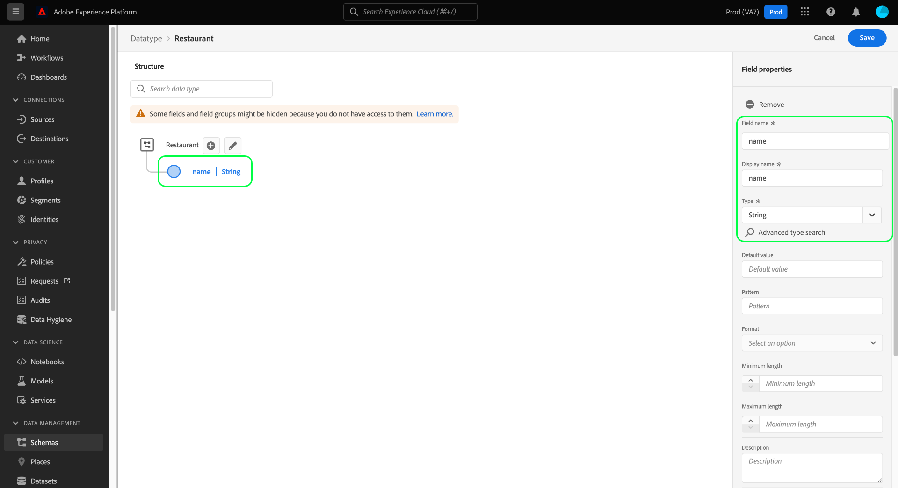

# Skapa och redigera datatyper med användargränssnittet

I Experience Data Model (XDM) används datatyper som referenstypfält i klasser eller blandningar på samma sätt som grundläggande litteralfält, med den största skillnaden är att datatyper kan definiera flera delfält. Även om de liknar blandningar i genom att de medger konsekvent användning av en struktur med flera fält, är datatyperna mer flexibla eftersom de kan inkluderas var som helst i schemastrukturen medan mixar bara kan läggas till på rotnivån.

Adobe Experience Platform har många standarddatatyper som kan användas för ett stort antal vanliga användningsfall för upplevelsehantering. Men du kan också definiera egna anpassade datatyper för att tillgodose dina unika affärsbehov.

I den här självstudiekursen beskrivs stegen för att skapa och redigera anpassade datatyper i användargränssnittet för plattformen.

## Förutsättningar

Handboken kräver en fungerande förståelse för XDM System. Se [XDM-översikten](../../home.md) för en introduktion till XDM-rollen i ekosystemet Experience Platform och [grunderna i schemakomposition](../../schema/composition.md) för hur datatyper bidrar till XDM-scheman.

Även om det inte krävs för den här guiden rekommenderar vi att du också följer självstudiekursen om [disposition av ett schema i användargränssnittet](../../tutorials/create-schema-ui.md) för att bekanta dig med de olika funktionerna i [!DNL Schema Editor].

## Öppna [!DNL Schema Editor] för en datatyp

I plattformsgränssnittet väljer du **[!UICONTROL Schemas]** i den vänstra navigeringen för att öppna arbetsytan [!UICONTROL Schemas] och väljer sedan fliken **[!UICONTROL Data types]**. En lista över tillgängliga datatyper visas, inklusive de som definieras av Adobe samt de som skapats av din organisation.

Här finns två alternativ:

- [Skapa en ny datatyp](#create)
- [Välj en befintlig datatyp att redigera](#edit)

### Skapa en ny datatyp {#create}

Välj **[!UICONTROL Create data type]** på fliken **[!UICONTROL Data types]**.

[!DNL Schema Editor] visas med den aktuella strukturen för den nya datatypen på arbetsytan. Till höger om redigeraren kan du ange ett visningsnamn och en valfri beskrivning av datatypen. Se till att du anger ett unikt och koncist namn för din datatyp, eftersom det är så det identifieras när du lägger till den i ett schema.

I den här självstudien skapas en datatyp som beskriver en restaurangegenskap, så datatypen får visningsnamnet &quot;Restaurant&quot;.

Härifrån kan du hoppa fram till [nästa avsnitt](#add-fields) för att börja lägga till fält till den nya datatypen.

### Redigera en befintlig datatyp

Endast anpassade datatyper som definieras av din organisation kan redigeras. Om du vill begränsa den visade listan väljer du filterikonen () för att visa kontroller för filtrering baserat på [!UICONTROL Owner]. Välj **[!UICONTROL Customer]** om du bara vill visa anpassade datatyper som ägs av din organisation.

Välj den datatyp som du vill redigera i listan för att öppna den högra listen och visa information om datatypen. Markera namnet på datatypen i den högra listen för att öppna dess struktur i [!DNL Schema Editor].

## Lägg till fält i datatypen {#add-fields}

Om du vill börja lägga till fält i datatypen väljer du ikonen **plus (+)** bredvid rotnivåfältet på arbetsytan. Ett nytt fält visas nedan och den högra listen uppdateras för att visa kontroller för det nya fältet.

Använd kontrollerna i den högra listen för att konfigurera information om det nya fältet. Se guiden [definiera fält i användargränssnittet](../fields/overview.md#define) för specifika steg om hur du konfigurerar och lägger till fältet till datatypen.

Datatypen Restaurant kräver ett strängfält som representerar restaurangens namn. Därför är [!UICONTROL Field name] inställt som &quot;name&quot; och [!UICONTROL Type] som &quot;[!UICONTROL String]&quot;. Välj **[!UICONTROL Apply]** om du vill använda ändringarna i fältet.

Fortsätt lägga till fler fält till datatypen efter behov. Datatypen Restaurant har nu ytterligare fält för märke, sittplatskapacitet och golvutrymme.

Förutom grundläggande fält kan du även kapsla in ytterligare datatyper i din anpassade datatyp. Datatypen Restaurant kräver till exempel ett fält som representerar egenskapens fysiska adress. I det här scenariot kan du lägga till ett nytt adressfält som tilldelas standarddatatypen [!UICONTROL Postal address].

Detta visar hur flexibla datatyper kan vara när det gäller att beskriva dina data: datatyper kan använda fält som också är datatyper, som i sin tur kan innehålla fler datatyper, osv. På så sätt kan du abstrahera och återanvända vanliga datamönster i hela XDM-scheman, vilket gör det enklare att representera komplexa datastrukturer.

När du har lagt till fält till datatypen väljer du **[!UICONTROL Save]** för att spara ändringarna och lägga till datatypen i [!DNL Schema Library].

## Lägg till datatypen i en klass eller blandning

När du har skapat en datatyp kan du börja använda den i dina scheman. Eftersom XDM-scheman består av en klass och noll eller flera blandningar, kan fält som tillhandahålls av en datatyp inte läggas till direkt i ett schema. De måste i stället ingå i en klass eller en blandning.

Börja med att följa stegen som ingår i [att lägga till ett fält i en klass](./classes.md#add-fields) eller [lägga till ett fält i en blandning](./mixins.md#add-fields). När du väljer **[!UICONTROL Type]** för det nya fältet väljer du namnet på datatypen i listrutan.

## Konvertera ett flerfältsobjekt till en datatyp {#convert}

När du skapar ett fält av objekttyp med flera delfält i [!DNL Schema Editor] kan du konvertera det fältet till en datatyp så att du kan använda samma fältstruktur i en annan klass eller kombination.

Om du vill konvertera ett fält av objekttyp till en datatyp, markerar du fältet på arbetsytan. Innan du konverterar fältet måste du se till att **[!UICONTROL Display name]** är en beskrivning av de data som objektet kommer att innehålla, eftersom detta blir namnet på datatypen. När du är redo att konvertera fältet väljer du **[!UICONTROL Convert to new data type]** i den högra listen.

Arbetsytan uppdaterar datatypen för fältet från [!UICONTROL Object] till den nya datatypen. Underfälten har också små låsikoner bredvid sig, vilket anger att de inte längre är enskilda fält utan snarare är en del av datatypen för flera fält. Den här strukturen kan nu återanvändas i andra klasser och blandningar genom att välja den här datatypen i listrutan **[!UICONTROL Type]** när du definierar ett nytt fält.

## Nästa steg

I den här handboken beskrivs hur du skapar och redigerar datatyper med hjälp av användargränssnittet för plattformen. Mer information om funktionerna för arbetsytan [!UICONTROL Schemas] finns i översikten för arbetsytan [[!UICONTROL Schemas]](../overview.md).

Mer information om hur du hanterar datatyper med hjälp av API:t [!DNL Schema Registry] finns i [slutpunktshandboken för datatyper](../../api/data-types.md).
