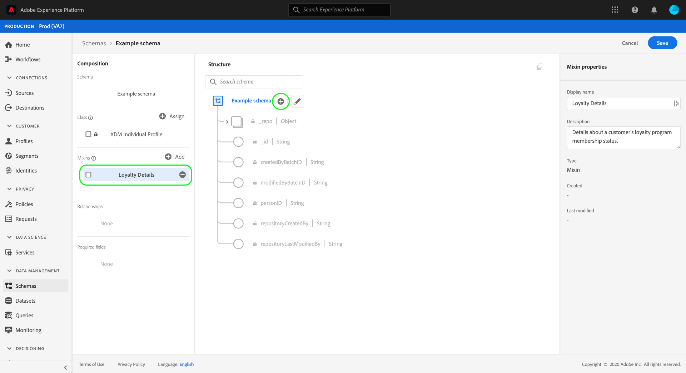
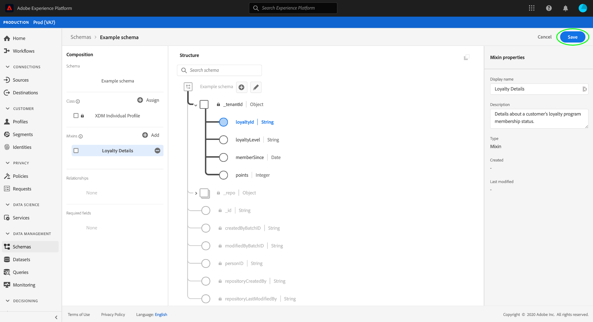

# Skapa och redigera blandningar i användargränssnittet

I Experience Data Model (XDM) är mixar återanvändbara komponenter som definierar ett eller flera fält som implementerar vissa funktioner, som personlig information, hotellinställningar eller adress. Mixer är avsedda att ingå i ett schema som implementerar en kompatibel klass.

En mixin definierar vilka klasser den är kompatibel med, baserat på beteendet hos de data som mixinen representerar (post- eller tidsserie). Det innebär att inte alla blandningar finns tillgängliga för användning med alla klasser.

Adobe Experience Platform har många standardblandningar som täcker ett stort antal användningsområden för marknadsföring. Men du kan också skapa och redigera egna anpassade blandningar för att definiera ytterligare koncept som är relaterade till ditt företag i dina XDM-scheman. Den här guiden ger en översikt över hur du skapar, redigerar och hanterar anpassade blandningar för din organisation i användargränssnittet för plattformen.

## Förutsättningar

Handboken kräver en fungerande förståelse för XDM System. Se [XDM-översikten](../../home.md) för en introduktion till XDM-rollen i ekosystemet Experience Platform och [grunderna i schemakomposition](../../schema/composition.md) för hur mixar bidrar till XDM-scheman.

Även om det inte krävs för den här guiden rekommenderar vi att du också följer självstudiekursen om [disposition av ett schema i användargränssnittet](../../tutorials/create-schema-ui.md) för att bekanta dig med de olika funktionerna i [!DNL Schema Editor].

## Skapa en ny blandning {#create}

Om du vill skapa en ny mixin måste du först välja ett schema som den mixinen ska läggas till i. Du kan välja att [skapa ett nytt schema](./schemas.md#create) eller [välja ett befintligt schema att redigera](./schemas.md#edit).

När du har schemat öppet i [!DNL Schema Editor] väljer du **[!UICONTROL Add]** bredvid avsnittet [!UICONTROL Mixins] i den vänstra listen.

En dialogruta med en lista över befintliga mixar för din organisation visas. Välj **[!UICONTROL Create new mixin]** längst upp i dialogrutan. Här kan du ange en **[!UICONTROL Display name]** och **[!UICONTROL Description]** för mixinen. När du är klar väljer du **[!UICONTROL Add mixin]**.

[!DNL Schema Editor] visas igen med den nya blandningen i den vänstra listen. Eftersom det här är en helt ny blandning innehåller den för närvarande inga fält till schemat och arbetsytan ändras därför inte. Nu kan du börja [lägga till fält i blandningen](#add-fields).

## Redigera en befintlig blandning {#edit}

>[!NOTE]
>
>Endast egna blandningar som definierats av din organisation kan redigeras och anpassas helt. För kärnblandningar som definieras av Adobe kan bara visningsnamnen för deras fält redigeras inom kontexten för enskilda scheman. Mer information finns i avsnittet [redigera visningsnamn för schemafält](./schemas.md#display-names).
>
>När en anpassad blandning har sparats och använts i ett schema för dataintag, kan endast additiva ändringar göras i blandningen därefter. Mer information finns i [reglerna för schemautveckling](../../schema/composition.md#evolution).

Om du vill redigera en befintlig blandning måste du först öppna ett schema som använder blandningen i [!DNL Schema Editor]. Du kan [välja ett befintligt schema att redigera](./schemas.md#edit), eller [skapa ett nytt schema](./schemas.md#create) och lägga till den aktuella mixen.

När du har öppnat schemat i redigeraren kan du börja [lägga till fält i mixin](#add-fields).

## Lägg till fält i en blandning {#add-fields}

Om du vill lägga till fält i en blandning i [!DNL Schema Editor] börjar du med att markera mixens namn i den vänstra listen och sedan väljer du ikonen **plus (+)** bredvid schemats namn på arbetsytan.

En **[!UICONTROL New field]** visas på arbetsytan och den högra listen uppdateras för att visa kontroller för att konfigurera fältets egenskaper. Se guiden [definiera fält i användargränssnittet](../fields/overview.md#define) för specifika steg om hur du konfigurerar och lägger till fältet i blandningen.

Fortsätt lägga till så många fält som behövs för blandningen. När du är klar väljer du **[!UICONTROL Save]** för att spara både schemat och mixinen.

Om samma blandning redan används i andra scheman visas de nya fälten automatiskt i dessa scheman.

## Nästa steg

I den här handboken beskrivs hur du skapar och redigerar blandningar med hjälp av användargränssnittet för plattformen. Mer information om funktionerna för arbetsytan [!UICONTROL Schemas] finns i översikten för arbetsytan [[!UICONTROL Schemas]](../overview.md).

Mer information om hur du hanterar blandningar med API:t [!DNL Schema Registry] finns i [slutpunktshandboken för mixins](../../api/mixins.md).