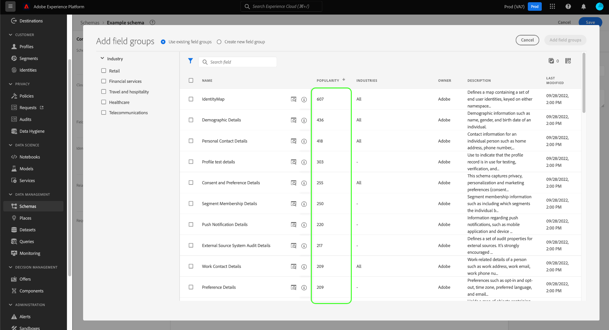

# Skapa och redigera scheman i användargränssnittet

Den här guiden ger en översikt över hur du skapar, redigerar och hanterar XDM-scheman (Experience Data Model) för din organisation i Adobe Experience Platform användargränssnitt.

>[!IMPORTANT]
>
>XDM-scheman är extremt anpassningsbara, och därför kan stegen som krävs för att skapa ett schema variera beroende på vilken typ av data du vill att schemat ska hämta. Det innebär att det här dokumentet endast omfattar de grundläggande interaktioner du kan göra med scheman i användargränssnittet, och att relaterade steg som att anpassa klasser, schemafältgrupper, datatyper och fält inte tas med.
>
>Om du vill få en genomgång av hur du skapar scheman kan du följa med i [självstudiekurs om att skapa scheman](../../tutorials/create-schema-ui.md) för att skapa ett komplett exempelschema och bekanta dig med de många funktionerna i [!DNL Schema Editor].

## Förutsättningar

Handboken kräver en fungerande förståelse för XDM System. Se [XDM - översikt](../../home.md) en introduktion till XDM:s roll i Experience Platform-ekosystemet, och [grunderna för schemakomposition](../../schema/composition.md) för en översikt över hur scheman är uppbyggda.

## Skapa ett nytt schema {#create}

I [!UICONTROL Schemas] arbetsyta, välja **[!UICONTROL Create schema]** i det övre högra hörnet. I listrutan som visas kan du välja mellan **[!UICONTROL XDM Individual Profile]** och **[!UICONTROL XDM ExperienceEvent]** som basklass för schemat. Du kan också välja **[!UICONTROL Browse]** att välja i den fullständiga listan över tillgängliga klasser, eller [skapa en ny anpassad klass](./classes.md#create) i stället.

När du har valt en klass visas [!DNL Schema Editor] visas och schemats grundstruktur (tillhandahålls av klassen) visas på arbetsytan. Härifrån kan du använda rätt spår för att lägga till en **[!UICONTROL Display name]** och **[!UICONTROL Description]** för schemat.

Nu kan du börja skapa schemats struktur genom att [lägga till schemafältgrupper](#add-field-groups).

## Redigera ett befintligt schema {#edit}

>[!NOTE]
>
>När ett schema har sparats och använts vid datainmatning kan endast additiva ändringar göras. Se [regler för schemautveckling](../../schema/composition.md#evolution) för mer information.

Om du vill redigera ett befintligt schema väljer du **[!UICONTROL Browse]** och markera sedan namnet på schemat som du vill redigera.

>[!TIP]
>
>Du kan använda arbetsytans sök- och filtreringsfunktioner för att enklare hitta schemat. Se guiden [utforska XDM-resurser](../explore.md) för mer information.

När du har valt ett schema visas [!DNL Schema Editor] visas med schemats struktur på arbetsytan. Nu kan du [lägg till fältgrupper](#add-field-groups) till schemat, [redigera fältvisningsnamn](#display-names), eller [redigera befintliga anpassade fältgrupper](./field-groups.md#edit) om schemat använder något.

## Lägga till fältgrupper i ett schema {#add-field-groups}

>[!NOTE]
>
>I det här avsnittet beskrivs hur du lägger till befintliga fältgrupper i ett schema. Om du vill skapa en ny anpassad fältgrupp läser du i guiden [skapa och redigera fältgrupper](./field-groups.md#create) i stället.

När du har öppnat ett schema i [!DNL Schema Editor]kan du lägga till fält i schemat med hjälp av fältgrupper. Börja genom att välja **[!UICONTROL Add]** bredvid **[!UICONTROL Field groups]** till vänster.

En dialogruta visas med en lista över fältgrupper som du kan välja för schemat. Eftersom fältgrupper endast är kompatibla med en klass, visas endast de fältgrupper som är associerade med schemats valda klass. Som standard sorteras listade fältgrupper baserat på hur populära de är i din organisation.

Om du känner till den allmänna aktiviteten eller affärsområdet för de fält som du vill lägga till, väljer du en eller flera av de vertikala kategorierna i den vänstra listen för att filtrera den visade listan med fältgrupper.

>[!NOTE]
>
>Mer information om de bästa metoderna för branschspecifik datamodellering i XDM finns i dokumentationen om [branschdatamodeller](../../schema/industries/overview.md).

Du kan också använda sökfältet för att hitta den fältgrupp du vill använda. Fältgrupper vars namn matchar frågan visas högst upp i listan. Under **[!UICONTROL Standard Fields]** visas fältgrupper som innehåller fält som beskriver önskade dataattribut.

Markera kryssrutan bredvid namnet på den fältgrupp som du vill lägga till i schemat. Du kan markera flera fältgrupper i listan, där varje markerad fältgrupp visas i den högra listen.

>[!TIP]
>
>För alla fältgrupper i listan kan du hovra eller fokusera på informationsikonen () för att visa en kort beskrivning av den typ av data som fältgruppen hämtar. Du kan också välja förhandsvisningsikonen () för att visa strukturen för fälten som fältgruppen tillhandahåller innan du bestämmer dig för att lägga till den i schemat.

När du har valt fältgrupper väljer du **[!UICONTROL Add field groups]** för att lägga till dem i schemat.

The [!DNL Schema Editor] visas igen med fälten som tillhandahålls av fältgruppen och som visas på arbetsytan.

## Aktivera ett schema för kundprofil i realtid {#profile}

[Kundprofil i realtid](../../../profile/home.md) sammanfogar data från olika källor för att skapa en komplett bild av varje enskild kund. Om du vill att de data som hämtas av ett schema ska delta i processen måste du aktivera schemat för användning i [!DNL Profile].

>[!IMPORTANT]
>
>För att aktivera ett schema för [!DNL Profile]måste ett primärt identitetsfält ha definierats. Se guiden [definiera identitetsfält](../fields/identity.md) för mer information.

Aktivera schemat genom att först markera schemats namn i den vänstra listen och sedan välja **[!UICONTROL Profile]** till höger.

En pover visas som varnar om att när ett schema väl har aktiverats och sparats kan det inte inaktiveras. Välj **[!UICONTROL Enable]** för att fortsätta.

Arbetsytan visas igen med [!UICONTROL Profile] växla aktiverat.

>[!IMPORTANT]
>
>Eftersom schemat ännu inte har sparats är detta inget returtecken om du ändrar dig angående att låta schemat delta i kundprofilen i realtid: När du har sparat ett aktiverat schema kan det inte längre inaktiveras. Välj **[!UICONTROL Profile]** växla igen för att inaktivera schemat.

Avsluta processen genom att välja **[!UICONTROL Save]** för att spara schemat.

Schemat är nu aktiverat för användning i kundprofilen i realtid. När Platform samlar in data i datauppsättningar som baseras på det här schemat, kommer dessa data att införlivas i dina sammanställda profildata.

## Redigera visningsnamn för schemafält {#display-names}

När du har tilldelat en klass och lagt till fältgrupper till ett schema kan du redigera visningsnamnen för alla fält i schemat, oavsett om dessa fält har tillhandahållits av standard eller anpassade XDM-resurser.

>[!NOTE]
>
>Tänk på att visningsnamnen för fält som tillhör standardklasser eller fältgrupper bara kan redigeras i ett specifikt schema. Om du ändrar visningsnamnet för ett standardfält i ett schema påverkas alltså inte andra scheman som använder samma associerade klass eller fältgrupp.
>
>När du ändrar visningsnamnen för ett schemas fält återspeglas dessa ändringar omedelbart i befintliga datauppsättningar som baseras på det schemat.

Om du vill redigera visningsnamnet för ett schemafält markerar du fältet på arbetsytan. Ange det nya namnet under **[!UICONTROL Display name]**.

Välj **[!UICONTROL Apply]** till höger och arbetsytan uppdateras för att visa fältets nya visningsnamn. Välj **[!UICONTROL Save]** för att tillämpa ändringarna i schemat.

## Ändra en schemaklass {#change-class}

Du kan ändra schemaklassen när som helst under den inledande dispositionsprocessen innan schemat har sparats.

>[!WARNING]
>
>Omtilldelning av klassen för ett schema bör göras med extrem försiktighet. Fältgrupper är bara kompatibla med vissa klasser. Om du ändrar klassen återställs arbetsytan och alla fält du har lagt till.

Om du vill tilldela om en klass väljer du **[!UICONTROL Assign]** till vänster på arbetsytan.

En dialogruta visas med en lista över alla tillgängliga klasser, inklusive alla som definierats av organisationen (ägaren är[!UICONTROL Customer]&quot;) samt standardklasser som definieras av Adobe.

Välj en klass i listan för att visa dess beskrivning till höger i dialogrutan. Du kan också välja **[!UICONTROL Preview class structure]** om du vill visa de fält och metadata som är associerade med klassen. Välj **[!UICONTROL Assign class]** för att fortsätta.

En ny dialogruta öppnas där du ombeds bekräfta att du vill tilldela en ny klass. Välj **[!UICONTROL Assign]** för att bekräfta.

När du har bekräftat klassändringen återställs arbetsytan och alla dispositionsförlopp går förlorade.

## Nästa steg

Det här dokumentet innehåller grunderna för att skapa och redigera scheman i plattformsgränssnittet. Vi rekommenderar att du granskar [självstudiekurs om att skapa scheman](../../tutorials/create-schema-ui.md) för ett omfattande arbetsflöde för att skapa ett komplett schema i användargränssnittet, inklusive att skapa anpassade fältgrupper och datatyper för unika användningsfall.

Mer information om funktionerna i [!UICONTROL Schemas] arbetsytan, se [[!UICONTROL Schemas] arbetsyta - översikt](../overview.md).

Så här hanterar du scheman i [!DNL Schema Registry] API, se [slutpunktshandbok för scheman](../../api/schemas.md).
