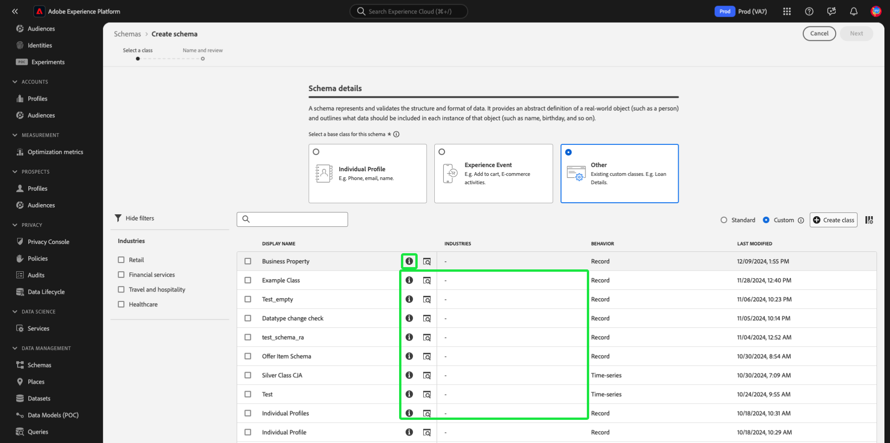

# Skapa och redigera scheman i användargränssnittet {#create-edit-schemas-in-ui}

Den här guiden ger en översikt över hur du skapar, redigerar och hanterar XDM-scheman (Experience Data Model) för din organisation i Adobe Experience Platform användargränssnitt.

>[!IMPORTANT]
>
>XDM-scheman är extremt anpassningsbara, och därför kan stegen som krävs för att skapa ett schema variera beroende på vilken typ av data du vill att schemat ska hämta. Det innebär att det här dokumentet endast omfattar de grundläggande interaktioner du kan göra med scheman i användargränssnittet, och att relaterade steg som att anpassa klasser, schemafältgrupper, datatyper och fält inte tas med.
>
>Om du vill få en genomgång av schemaskapandet kan du följa med i självstudiekursen [för att skapa scheman](../../tutorials/create-schema-ui.md) och skapa ett fullständigt exempelschema och bekanta dig med de många funktionerna i [!DNL Schema Editor].

## Förhandskrav {#prerequisites}

Handboken kräver en fungerande förståelse för XDM System. Se [XDM-översikten](../../home.md) för en introduktion till XDM-rollen i Experience Platform-ekosystemet och [grunderna i schemakomposition](../../schema/composition.md) för en översikt över hur scheman är uppbyggda.

## Skapa ett nytt schema {#create}

Välj [!UICONTROL Schemas] i det övre högra hörnet på arbetsytan **[!UICONTROL Create schema]**. Listrutan Välj schematyp visas med alternativ för [!UICONTROL Standard] eller [!UICONTROL Model-based] scheman.

![Arbetsytan Scheman med [!UICONTROL Create Schema] markerad och listrutan Välj schematyp visas](../../images/ui/resources/schemas/create-schema.png).

## Skapa ett modellbaserat schema {#create-model-based-schema}

>[!AVAILABILITY]
>
>Data Mirror och modellbaserade scheman är tillgängliga för innehavare av Adobe Journey Optimizer **samordnade kampanjer**. De är också tillgängliga som en **begränsad version** för Customer Journey Analytics-användare, beroende på din licens och aktivering av funktioner. Kontakta din Adobe-representant för att få åtkomst.

Välj **[!UICONTROL Model-based]** om du vill definiera strukturerade, modellbaserade scheman med detaljerad kontroll över poster. Modellbaserade scheman stöder primär nyckelkontroll, versionshantering på postnivå och relationer på schemanivå via primära och externa nycklar. De är också optimerade för inkrementellt intag med hjälp av registrering av ändringsdata och har stöd för flera datamodeller som används i Campaign Orchestration, Data Distiller och B2B-implementeringar.

Mer information finns i översikten [Data Mirror](../../data-mirror/overview.md) eller [Modellbaserat schema](../../schema/model-based.md) .

### Skapa manuellt {#create-manually}

>[!AVAILABILITY]
>
>DDL-filöverföring är bara tillgängligt för innehavare av Adobe Journey Optimizer Orchestrated-kampanjlicenser. Gränssnittet kan se annorlunda ut.

Dialogrutan **[!UICONTROL Create a model-based schema]** visas. Du kan välja antingen **[!UICONTROL Create manually]** eller [**[!UICONTROL Upload DDL file]**](#upload-ddl-file) för att definiera schemastrukturen.

I dialogrutan **[!UICONTROL Create a model-based schema]** väljer du **[!UICONTROL Create manually]** och sedan **[!UICONTROL Next]**.

Sidan **[!UICONTROL Model-based schema details]** visas. Ange ett visningsnamn för schemat och en valfri beskrivning och välj sedan **[!UICONTROL Finish]** för att skapa schemat.

![Modellbaserad schemainformationsvy med [!UICONTROL Schema display name], [!UICONTROL Description] och [!UICONTROL Finish] markerade.](../../images/ui/resources/schemas/relational-details.png)

Schemaredigeraren öppnas med en tom arbetsyta för att definiera schemastrukturen. Du kan lägga till fält som vanligt.

#### Lägg till ett versionsidentifierarfält {#add-version-identifier}

Om du vill aktivera versionshantering och ha stöd för datainhämtning från ändringsdata måste du ange ett fält för versionsidentifierare i ditt schema. Välj plusikonen () bredvid schemanamnet för att lägga till ett nytt fält.

Ange ett fältnamn som `updateSequence` och välj datatypen **[!UICONTROL DateTime]** eller **[!UICONTROL Number]**.

Aktivera kryssrutan **[!UICONTROL Version Identifier]** i den högra listen och markera sedan **[!UICONTROL Apply]** för att bekräfta fältet.

>[!IMPORTANT]
>
>Ett modellbaserat schema måste innehålla ett fält för versionsidentifierare för att kunna hantera uppdateringar på postnivå och ändring av datainhämtning.

Om du vill definiera relationer väljer du **[!UICONTROL Add Relationship]** i Schemaredigeraren för att skapa primära/externa nyckelrelationer på schemanivå. Mer information finns i självstudiekursen om att [lägga till relationer på schemanivå](../../tutorials/relationship-ui.md#relationship-field).

Fortsätt sedan till [definiera primärnycklar](../fields/identity.md#define-a-identity-field) och [lägg till ytterligare fält](#add-field-groups) efter behov. Mer information om hur du aktiverar registrering av ändringsdata i Experience Platform-källor finns i [handboken om registrering av ändringsdata](../../../sources/tutorials/api/change-data-capture.md).

>[!NOTE]
>
>När fältet [!UICONTROL Type] har sparats i sidofältet [!UICONTROL  Schema properties] anger det att det är ett [!UICONTROL Model-based]-schema. Detta visas även i sidofältet med detaljer i vyn för schemalager.
>>

### Överföra en DDL-fil {#upload-ddl-file}

>[!AVAILABILITY]
>
>DDL-filöverföring är bara tillgängligt för innehavare av Adobe Journey Optimizer Orchestrated-kampanjlicenser.

Använd det här arbetsflödet för att definiera schemat genom att överföra en DDL-fil. I dialogrutan **[!UICONTROL Create a model-based schema]** väljer du **[!UICONTROL Upload DDL file]** och drar sedan en lokal DDL-fil från systemet eller väljer **[!UICONTROL Choose files]**. Experience Platform validerar schemat och visar en grön bockmarkering om filöverföringen lyckas. Välj **[!UICONTROL Next]** för att bekräfta överföringen.

![Dialogrutan Skapa ett modellbaserat schema med [!UICONTROL Upload DDL file] markerat och [!UICONTROL Next] markerat.](../../images/ui/resources/schemas/upload-ddl-file.png)

Dialogrutan [!UICONTROL Select entities and fields to import] visas så att du kan förhandsgranska schemat. Granska schemastrukturen och använd alternativknapparna och kryssrutorna för att se till att varje entitet har en primär nyckel och versionsidentifierare angiven.

>[!IMPORTANT]
>
>Tabellstrukturen måste innehålla en **primärnyckel** och en **versionsidentifierare**, till exempel ett `updateSequence`-fält av typen datetime eller number.
>
>För import av ändringsdata krävs även en särskild kolumn med namnet `_change_request_type` av typen String för att aktivera inkrementell bearbetning. Det här fältet anger typen av dataändring (till exempel `u` (upsert) eller `d` (delete)).

Kontrollkolumner som `_change_request_type` lagras inte i schemat och visas inte i den slutliga schemastrukturen trots att de krävs vid inmatning. Om allt ser korrekt ut väljer du **[!UICONTROL Done]** för att skapa schemat.

>[!NOTE]
>
>Den största filstorlek som stöds för en DDL-överföring är 10 MB.

![Modellbaserad schemagranskningsvy med importerade fält visade och [!UICONTROL Finish] markerade.](../../images/ui/resources/schemas/entities-and-files-to-inport.png)

Schemat öppnas i Schemaredigeraren där du kan justera strukturen innan du sparar.

Fortsätt sedan till [lägg till ytterligare fält](#add-field-groups) och [lägg till ytterligare schemanivårelationer](../../tutorials/relationship-ui.md#relationship-field) efter behov.

Mer information om hur du aktiverar registrering av ändringsdata i Experience Platform-källor finns i [handboken om registrering av ändringsdata](../../../sources/tutorials/api/change-data-capture.md).

## Skapa standardschema {#standard-based-creation}

Om du väljer Standardschematyp på den nedrullningsbara menyn Välj schematyp visas dialogrutan [!UICONTROL Create a schema]. I den här dialogrutan kan du välja att antingen skapa ett schema manuellt genom att lägga till fält och fältgrupper, eller så kan du överföra en CSV-fil och använda ML-algoritmer för att generera ett schema. Välj ett arbetsflöde för att skapa schema i dialogrutan.

### [!BADGE Skapa scheman manuellt eller med ML-stöd i Beta]{type=Informative} {#manual-or-assisted}

Mer information om hur du kan använda en ML-algoritm för att rekommendera en schemastruktur baserad på en csv-fil finns i [handboken ](../ml-assisted-schema-creation.md) som hjälper dig att skapa scheman. Den här användargränssnittshandboken fokuserar på det manuella arbetsflödet.

### Manuell schemagenerering {#manual-creation}

Arbetsflödet [!UICONTROL Create schema] visas. Du kan välja en basklass för schemat genom att välja antingen **[!UICONTROL Individual Profile]**, **[!UICONTROL Experience Event]** eller **[!UICONTROL Other]** följt av **[!UICONTROL Next]** för att bekräfta ditt val. Mer information om de här klasserna finns i dokumentationen för [[!UICONTROL XDM individual profile]](../../classes/individual-profile.md) och [[!UICONTROL XDM ExperienceEvent]](../../classes/experienceevent.md).

![Arbetsflödet [!UICONTROL Create schema] med tre klassalternativ och [!UICONTROL Next] markerat.](../../images/ui/resources/schemas/schema-class-options.png)

När du väljer **[!UICONTROL Other]** visas en lista med tillgängliga klasser. Härifrån kan du bläddra bland och filtrera befintliga klasser.

![Arbetsflödet [!UICONTROL Create schema] med [!UICONTROL Other] markerat i avsnittet [!UICONTROL Schema details].](../../images/ui/resources/schemas/other-schema-details.png)

Markera en alternativknapp om du vill filtrera klasserna baserat på om de är anpassade eller standardklasser. Du kan även filtrera tillgängliga resultat baserat på bransch eller söka efter en viss klass med hjälp av sökfältet.

![Arbetsflödet [!UICONTROL Create schema] med sökfältet, [!UICONTROL Custom] och [!UICONTROL Industries] markerat.](../../images/ui/resources/schemas/filter-and-search.png)

Det finns info- och förhandsgranskningsikoner för varje klass som kan hjälpa dig att bestämma vilken klass som ska användas. Informationsikonen () öppnar en dialogruta som innehåller en beskrivning av klassen och den bransch som den är associerad med.

Ikonen för förhandsgranskning () öppnar en förhandsvisningsdialogruta för klassen som innehåller ett schemaritecken och dess egenskaper.

Markera en rad för att välja en klass och välj sedan **[!UICONTROL Next]** för att bekräfta ditt val.

![Arbetsflödet [!UICONTROL Create schema] med en klass vald från tabellen med tillgängliga klasser och [!UICONTROL Next] markerad.](../../images/ui/resources/schemas/select-class.png)

När du har valt en klass visas avsnittet [!UICONTROL Name and review]. I det här avsnittet anger du ett namn och en beskrivning som identifierar ditt schema. &#x200B;Schemats grundstruktur (tillhandahålls av klassen) visas på arbetsytan så att du kan granska och verifiera den valda klassen och schemastrukturen.

Ange en [!UICONTROL Schema display name] som är användarvänlig i textfältet. Ange sedan en lämplig beskrivning för att identifiera schemat. När du har granskat din schemastruktur och är nöjd med dina inställningar väljer du **[!UICONTROL Finish]** för att skapa ditt schema.

![Avsnittet [!UICONTROL Name and review] i arbetsflödet [!UICONTROL Create schema] med [!UICONTROL Schema display name], [!UICONTROL Description] och [!UICONTROL Finish] markerade.](../../images/ui/resources/schemas/name-and-review.png)

Schemaredigeraren visas med schemats struktur på arbetsytan. Om du vill kan du nu börja [lägga till fält i klassen](../../ui/resources/classes.md#add-fields).

## Redigera ett befintligt schema {#edit}

>[!NOTE]
>
>När ett schema har sparats och använts vid datainmatning kan endast additiva ändringar göras. Mer information finns i [reglerna för schemautveckling](../../schema/composition.md#evolution).

Om du vill redigera ett befintligt schema väljer du fliken **[!UICONTROL Browse]** och markerar sedan namnet på schemat som du vill redigera. Du kan även använda sökfältet för att begränsa listan med tillgängliga alternativ.

>[!TIP]
>
>Du kan använda arbetsytans sök- och filtreringsfunktioner för att enklare hitta schemat. Mer information finns i guiden [Utforska XDM-resurser](../explore.md).

När du har valt ett schema visas [!DNL Schema Editor] med schemats struktur på arbetsytan. Du kan nu [lägga till fältgrupper](#add-field-groups) i schemat (eller [lägga till enskilda fält](#add-individual-fields) från dessa grupper), [redigera fältvisningsnamn](#display-names) eller [redigera befintliga anpassade fältgrupper](./field-groups.md#edit) om schemat använder några.

## Fler åtgärder {#more}

I Schemaredigeraren kan du även utföra snabba åtgärder för att kopiera JSON-strukturen för schemat eller ta bort schemat om det inte har aktiverats för kundprofilen i realtid eller har associerade datauppsättningar. Välj [!UICONTROL More] högst upp i vyn om du vill visa en listruta med snabbåtgärder.

Med strukturfunktionen Kopiera JSON kan du se hur en exempelnyttolast skulle se ut när du fortfarande skapar schemat och dina dataledningar. Det är särskilt användbart i situationer där det finns komplexa objektmappningsstrukturer i schemat, till exempel en identitetskarta.

## Växla visningsnamn {#display-name-toggle}

För enkelhetens skull kan du växla mellan de ursprungliga fältnamnen och de mer läsbara visningsnamnen i Schemaredigeraren. Tack vare den här flexibiliteten blir det enklare att hitta och redigera dina scheman. Växlingsknappen finns längst upp till höger i vyn Schemaredigeraren.

>[!NOTE]
>
>Ändringen från fältnamn till visningsnamn är helt kosmetisk och påverkar inte längre några resurser längre fram i kedjan.

![Schemaredigeraren med [!UICONTROL Show display names for fields] markerat.](../../images/ui/resources/schemas/display-name-toggle.png)

Visningsnamnen för standardfältgrupper genereras av systemet men kan anpassas enligt beskrivningen i avsnittet [visningsnamn](#display-names). Visningsnamn visas i flera olika gränssnittsvyer, inklusive mappning och förhandsvisningar av datauppsättningar. Standardinställningen är inaktiverad och fältnamnen visas med sina ursprungliga värden.

## Lägga till fältgrupper i ett schema {#add-field-groups}

>[!NOTE]
>
>I det här avsnittet beskrivs hur du lägger till befintliga fältgrupper i ett schema. Om du vill skapa en ny anpassad fältgrupp läser du i handboken [Skapa och redigera fältgrupper](./field-groups.md#create) i stället.

När du har öppnat ett schema i [!DNL Schema Editor] kan du lägga till fält i schemat med hjälp av fältgrupper. Börja genom att välja **[!UICONTROL Add]** bredvid **[!UICONTROL Field groups]** i den vänstra listen.

![Schemaredigeraren med [!UICONTROL Add] från avsnittet [!UICONTROL Field groups] markerat.](../../images/ui/resources/schemas/add-field-group-button.png)

En dialogruta visas med en lista över fältgrupper som du kan välja för schemat. Eftersom fältgrupper endast är kompatibla med en klass, visas endast de fältgrupper som är associerade med schemats valda klass. Som standard sorteras listade fältgrupper baserat på hur populära de är i din organisation.

![Dialogrutan [!UICONTROL Add field groups] är markerad med kolumnen [!UICONTROL Popularity] markerad.](../../images/ui/resources/schemas/field-group-popularity.png)

Om du känner till den allmänna aktiviteten eller affärsområdet för de fält som du vill lägga till, väljer du en eller flera av de branschlodräta kategorierna i den vänstra listen för att filtrera den visade listan med fältgrupper.

![Dialogrutan [!UICONTROL Add field groups] är markerad med filtren [!UICONTROL Industry] och kolumnen [!UICONTROL Industry] markerad.](../../images/ui/resources/schemas/industry-filter.png)

>[!NOTE]
>
>Mer information om de effektivaste strategierna för branschspecifik datamodellering i XDM finns i dokumentationen om [branschdatamodeller](../../schema/industries/overview.md).

Du kan också använda sökfältet för att hitta den fältgrupp du vill använda. Fältgrupper vars namn matchar frågan visas högst upp i listan. Under **[!UICONTROL Standard Fields]** visas fältgrupper som innehåller fält som beskriver önskade dataattribut.

![Dialogrutan [!UICONTROL Add field groups] med sökfunktionen [!UICONTROL Standard fields] markerad.](../../images/ui/resources/schemas/field-group-search.png)

Markera kryssrutan bredvid namnet på den fältgrupp som du vill lägga till i schemat. Du kan markera flera fältgrupper i listan, där varje markerad fältgrupp visas i den högra listen.

![Dialogrutan [!UICONTROL Add field groups] med markeringsfunktionen för kryssrutor markerad.](../../images/ui/resources/schemas/add-field-group.png)

>[!TIP]
>
>För alla fältgrupper i listan kan du hovra eller fokusera på informationsikonen () om du vill visa en kort beskrivning av den typ av data som fältgruppen hämtar. Du kan också markera förhandsvisningsikonen () för att visa strukturen för fälten som fältgruppen tillhandahåller innan du bestämmer dig för att lägga till den i schemat.

När du har valt fältgrupper väljer du **[!UICONTROL Add field groups]** för att lägga till dem i schemat.

![Dialogrutan [!UICONTROL Add field groups] med fältgrupper markerade och markerade [!UICONTROL Add field groups].](../../images/ui/resources/schemas/add-field-group-finish.png)

[!DNL Schema Editor] visas igen med fältgruppstillhandahållna fält som visas på arbetsytan.

![[!DNL Schema Editor] med ett exempelschema visas.](../../images/ui/resources/schemas/field-groups-added.png)

>[!NOTE]
>
>I Schemaredigeraren anges standardklasser (Adobe-genererade) och fältgrupper med hänglåsikonen . hänglåset visas i den vänstra listen bredvid namnet på klassen eller fältgruppen, samt intill ett fält i schemagrafiken som är en del av en systemgenererad resurs.
>
>

När du har lagt till en fältgrupp i ett schema kan du [ta bort befintliga fält](#remove-fields) eller [lägga till nya anpassade fält](#add-fields) i dessa grupper, beroende på dina behov.

### Ta bort fält som lagts till från fältgrupper {#remove-fields}

När du har lagt till en fältgrupp i ett schema kan du antingen ta bort fält globalt från fältgruppen eller dölja dem lokalt från det aktuella schemat. Att förstå skillnaden mellan dessa åtgärder är avgörande för att undvika oönskade schemaändringar.

>[!IMPORTANT]
>
>Om du väljer **[!UICONTROL Remove]** tas fältet bort från själva fältgruppen, vilket påverkar *alla* scheman som använder den fältgruppen.
>>Använd inte det här alternativet om du inte vill **ta bort fältet från alla scheman som innehåller fältgruppen**.

Om du vill ta bort ett fält från fältgruppen markerar du det på arbetsytan och väljer **[!UICONTROL Remove]** på den högra listen. I det här exemplet visas fältet `taxId` från gruppen **[!UICONTROL Demographic Details]**.

![[!DNL Schema Editor] med [!UICONTROL Remove] markerat. Den här åtgärden tar bort ett enskilt fält.](../../images/ui/resources/schemas/remove-single-field.png)

Om du vill dölja flera fält från ett schema utan att ta bort dem från själva fältgruppen använder du alternativet **[!UICONTROL Manage related fields]**. Markera ett fält i gruppen på arbetsytan och välj sedan **[!UICONTROL Manage related fields]** i den högra listen.

![[!DNL Schema Editor] med [!UICONTROL Manage related fields] markerat.](../../images/ui/resources/schemas/manage-related-fields.png)

En dialogruta med fältgruppens struktur visas. Använd kryssrutorna för att markera eller avmarkera de fält som du vill inkludera.

![Dialogrutan [!UICONTROL Manage related fields] med markerade fält och [!UICONTROL Confirm] markerat.](../../images/ui/resources/schemas/select-fields.png)

Välj **[!UICONTROL Confirm]** om du vill uppdatera arbetsytan och spegla de valda fälten.

### Fältbeteende vid borttagning eller borttagning av fält {#field-removal-deprecation-behavior}

Använd tabellen nedan för att förstå omfattningen av varje åtgärd.

| Åtgärd | Gäller endast aktuellt schema | Ändrar fältgrupp | Påverkar andra scheman | Beskrivning |
|--------------------------|--------------------------------|----------------------|-----------------------|-------------|
| **Ta bort fält** | Nej | Ja | Ja | Tar bort fältet från fältgruppen. Detta tar bort den från alla scheman som använder den gruppen. |
| **Hantera relaterade fält** | Ja | Nej | Nej | Döljer endast fält från det aktuella schemat. Fältgruppen ändras inte. |
| **Föråldrat fält** | Nej | Ja | Ja | Markerar fältet som inaktuellt i fältgruppen. Den är inte längre tillgänglig för användning i något schema. |

>[!NOTE]
>
>Detta beteende är konsekvent i både postbaserade och händelsebaserade scheman.

### Lägg till anpassade fält i fältgrupper {#add-fields}

När du har lagt till en fältgrupp i ett schema kan du definiera ytterligare fält för den gruppen. Alla fält som läggs till i en fältgrupp i ett schema visas emellertid också i alla andra scheman som använder samma fältgrupp.

Om ett anpassat fält dessutom läggs till i en standardfältgrupp, kommer den fältgruppen att konverteras till en anpassad fältgrupp och den ursprungliga standardfältgruppen kommer inte längre att vara tillgänglig.

Om du vill lägga till ett anpassat fält i en standardfältgrupp finns mer information i avsnittet [nedan](#custom-fields-for-standard-groups). Om du lägger till fält i en anpassad fältgrupp, se avsnittet [Redigera anpassade fältgrupper](./field-groups.md) i gränssnittshandboken för fältgrupper.

Om du inte vill ändra någon befintlig fältgrupp kan du [skapa en ny anpassad fältgrupp](./field-groups.md#create) och definiera ytterligare fält i stället.

## Lägga till enskilda fält i ett schema {#add-individual-fields}

Med Schemaredigeraren kan du lägga till enskilda fält direkt i ett schema om du inte vill lägga till en hel fältgrupp för ett visst användningsfall. Du kan [lägga till enskilda fält från standardfältgrupper](#add-standard-fields) eller [lägga till egna anpassade fält](#add-custom-fields) i stället.

>[!IMPORTANT]
>
>Även om schemaredigeraren tillåter att du lägger till enskilda fält direkt i ett schema, ändrar detta inte det faktum att alla fält i ett XDM-schema måste anges av dess klass eller en fältgrupp som är kompatibel med den klassen. Som framgår av avsnitten nedan är alla enskilda fält fortfarande kopplade till en klass eller fältgrupp som ett nyckelsteg när de läggs till i ett schema.

### Lägg till standardfält {#add-standard-fields}

Du kan lägga till fält från standardfältgrupper direkt i ett schema utan att först behöva känna till deras motsvarande fältgrupp. Om du vill lägga till ett standardfält i ett schema väljer du plusikonen (**+**) bredvid schemats namn på arbetsytan. En **[!UICONTROL Untitled Field]**-platshållare visas i schemastrukturen och de högra uppdateringarna för att visa kontroller för att konfigurera fältet.

Under **[!UICONTROL Field name]** börjar du skriva namnet på fältet som du vill lägga till. Systemet söker automatiskt efter standardfält som matchar frågan och listar dem under **[!UICONTROL Recommended Standard Fields]**, inklusive de fältgrupper som de tillhör.

Vissa standardfält har samma namn, men strukturen kan variera beroende på vilken fältgrupp de kommer ifrån. Om ett standardfält är kapslat i ett överordnat objekt i fältgruppsstrukturen, kommer det överordnade fältet också att inkluderas i schemat om det underordnade fältet läggs till.

Välj förhandsvisningsikonen () bredvid ett standardfält om du vill visa strukturen för fältgruppen och förstå hur den kan kapslas. Om du vill lägga till standardfältet i schemat väljer du plusikonen ().

Arbetsytan uppdateras för att visa det standardfält som lagts till i schemat, inklusive alla överordnade fält som är kapslade i fältgruppsstrukturen. Namnet på fältgruppen visas också under **[!UICONTROL Field groups]** i den vänstra listen. Om du vill lägga till fler fält från samma fältgrupp väljer du **[!UICONTROL Manage related fields]** i den högra listen.

### Lägg till anpassade fält {#add-custom-fields}

På samma sätt som arbetsflödet för standardfält kan du även lägga till egna anpassade fält direkt i ett schema.

Om du vill lägga till fält på rotnivån för ett schema väljer du plusikonen (**+**) bredvid schemats namn på arbetsytan. En **[!UICONTROL Untitled Field]**-platshållare visas i schemastrukturen och de högra uppdateringarna för att visa kontroller för att konfigurera fältet.

Börja skriva in namnet på det fält som du vill lägga till så börjar systemet automatiskt att söka efter matchande standardfält. Om du vill skapa ett nytt anpassat fält i stället väljer du det översta alternativet som lagts till med **([!UICONTROL New Field])**.

När du har angett ett visningsnamn och en datatyp för fältet är nästa steg att tilldela fältet till en överordnad XDM-resurs. Om schemat använder en anpassad klass kan du välja att [lägga till fältet i den tilldelade klassen](#add-to-class) eller en [fältgrupp](#add-to-field-group) i stället. Om schemat använder en standardklass kan du bara tilldela ett anpassat fält till en fältgrupp.

#### Tilldela fältet till en anpassad fältgrupp {#add-to-field-group}

>[!NOTE]
>
>I det här avsnittet beskrivs bara hur du tilldelar fältet till en anpassad fältgrupp. Om du vill utöka en standardfältgrupp med det nya anpassade fältet i stället läser du avsnittet [Lägga till anpassade fält i standardfältgrupper](#custom-fields-for-standard-groups).

Under **[!UICONTROL Assign to]** väljer du **[!UICONTROL Field Group]**. Om schemat använder en standardklass är detta det enda tillgängliga alternativet och markeras som standard.

Sedan måste du välja en fältgrupp för det nya fältet som ska kopplas. Börja skriva in namnet på fältgruppen i den angivna textinmatningen. Om du har befintliga anpassade fältgrupper som matchar indata visas de i listrutan. Du kan också skriva ett unikt namn för att skapa en ny fältgrupp i stället.

>[!WARNING]
>
>Om du väljer en befintlig anpassad fältgrupp kommer alla andra scheman som använder den fältgruppen också att ärva det nya fältet när du har sparat ändringarna. Därför bör du bara markera en befintlig fältgrupp om du vill använda den här typen av spridning. Annars bör du välja att skapa en ny anpassad fältgrupp i stället.

När du har valt fältgruppen i listan väljer du **[!UICONTROL Apply]**.

Det nya fältet läggs till på arbetsytan och namnges under ditt [klientorganisations-ID](../../api/getting-started.md#know-your-tenant_id) för att undvika konflikter med standard-XDM-fält. Fältgruppen som du har associerat det nya fältet med visas även under **[!UICONTROL Field groups]** i den vänstra listen.

>[!NOTE]
>
>Resten av fälten i den valda anpassade fältgruppen tas som standard bort från schemat. Om du vill lägga till några av dessa fält i schemat markerar du ett fält som tillhör gruppen och väljer sedan **[!UICONTROL Manage related fields]** i den högra listen.

#### Tilldela fältet till en anpassad klass {#add-to-class}

Under **[!UICONTROL Assign to]** väljer du **[!UICONTROL Class]**. Indatafältet nedan ersätts med namnet på det aktuella schemats anpassade klass, vilket anger att det nya fältet kommer att tilldelas den här klassen.

![Det [!UICONTROL Class]-alternativ som väljs för den nya fälttilldelningen.](../../images/ui/resources/schemas/assign-field-to-class.png)

Fortsätt konfigurera fältet efter behov och välj **[!UICONTROL Apply]** när du är klar.

![[!UICONTROL Apply] väljs för det nya fältet.](../../images/ui/resources/schemas/assign-field-to-class-apply.png)

Det nya fältet läggs till på arbetsytan och namnges under ditt [klientorganisations-ID](../../api/getting-started.md#know-your-tenant_id) för att undvika konflikter med standard-XDM-fält. Om du väljer klassnamnet i den vänstra listen visas det nya fältet som en del av klassens struktur.

### Lägga till anpassade fält i strukturen för standardfältgrupper {#custom-fields-for-standard-groups}

Om schemat du arbetar med har ett objekttypsfält från en standardfältgrupp, kan du lägga till egna anpassade fält till det standardobjektet.

>[!WARNING]
>
>Alla fält som läggs till i en fältgrupp i ett schema visas också i alla andra scheman som använder samma fältgrupp. Om ett anpassat fält dessutom läggs till i en standardfältgrupp, kommer den fältgruppen att konverteras till en anpassad fältgrupp och den ursprungliga standardfältgruppen kommer inte längre att vara tillgänglig.
>
>Om du deltar i betaversionen av den här funktionen får du en dialogruta som informerar dig om vilka standardfältgrupper du tidigare har anpassat. När du har valt **[!UICONTROL Acknowledge]** konverteras resurserna i listan till anpassade fältgrupper.
>
>

Börja med att markera plusikonen (**+**) bredvid roten för objektet som tillhandahålls av standardfältgruppen.

Ett varningsmeddelande visas som uppmanar dig att bekräfta om du vill konvertera standardfältgruppen. Välj **[!UICONTROL Continue creating field group]** om du vill fortsätta.

Arbetsytan visas igen med en namnlös platshållare för det nya fältet. Observera att namnet på standardfältgruppen har lagts till med &quot;([!UICONTROL Extended])&quot; för att ange att den har ändrats från den ursprungliga versionen. Använd kontrollerna i den högra listen för att definiera fältets egenskaper.

När du har gjort ändringarna visas det nya fältet under ditt innehavar-ID-namnutrymme i standardobjektet. Det här kapslade namnutrymmet förhindrar konflikter mellan fält och namn inom själva fältgruppen för att undvika att bryta ändringar i andra scheman som använder samma fältgrupp.

## Aktivera ett schema för kundprofil i realtid {#profile}

>[!CONTEXTUALHELP]
>id="platform_schemas_enableforprofile"
>title="Aktivera ett schema för profil"
>abstract="När ett schema har aktiverats för profilen, deltar alla datauppsättningar som skapats från det här schemat i kundprofilen i realtid, som sammanfogar data från olika källor för att skapa en fullständig bild av varje kund. När ett schema används för att importera data till profilen kan det inte inaktiveras. Mer information finns i dokumentationen."

[Kundprofil i realtid](../../../profile/home.md) sammanfogar data från olika källor för att skapa en fullständig bild av varje enskild kund. Om du vill att data som har hämtats av ett schema ska kunna delta i den här processen måste du aktivera schemat för användning i [!DNL Profile].

>[!IMPORTANT]
>
>Om du vill aktivera ett schema för [!DNL Profile] måste ett primärt identitetsfält ha definierats. Mer information finns i handboken [Definiera identitetsfält](../fields/identity.md).

Om du vill aktivera schemat börjar du med att markera schemats namn i den vänstra listen och väljer sedan alternativet **[!UICONTROL Profile]** i den högra listen.

En pover visas som varnar om att när ett schema väl har aktiverats och sparats kan det inte inaktiveras. Välj **[!UICONTROL Enable]** om du vill fortsätta.

Arbetsytan visas igen när växlingen [!UICONTROL Profile] är aktiverad.

>[!IMPORTANT]
>
>Eftersom schemat inte har sparats ännu är detta inget returtecken om du ändrar dig angående att låta schemat delta i kundprofilen i realtid: när du har sparat ett aktiverat schema kan det inte längre inaktiveras. Välj **[!UICONTROL Profile]**-växeln igen för att inaktivera schemat.

Om du vill slutföra processen väljer du **[!UICONTROL Save]** för att spara schemat.

Schemat är nu aktiverat för användning i kundprofilen i realtid. När Experience Platform infogar data i datauppsättningar som baseras på det här schemat, kommer dessa data att införlivas i dina sammanställda profildata.

## Redigera visningsnamn för schemafält {#display-names}

När du har tilldelat en klass och lagt till fältgrupper till ett schema kan du redigera visningsnamnen för alla fält i schemat, oavsett om dessa fält har tillhandahållits av standard eller anpassade XDM-resurser.

>[!NOTE]
>
>Tänk på att visningsnamnen för fält som tillhör standardklasser eller fältgrupper bara kan redigeras i ett specifikt schema. Om du ändrar visningsnamnet för ett standardfält i ett schema påverkas alltså inte andra scheman som använder samma associerade klass eller fältgrupp.
>
>När du ändrar visningsnamnen för ett schemas fält återspeglas dessa ändringar omedelbart i befintliga datauppsättningar som baseras på det schemat.

Ändra fältnamnen till visningsnamnen genom att aktivera **[!UICONTROL Show display names for fields]**. Om du vill redigera visningsnamnet för ett schemafält markerar du fältet på arbetsytan. Ange det nya namnet under **[!UICONTROL Display name]** i den högra listen.

Välj **[!UICONTROL Apply]** i den högra listen så uppdateras arbetsytan till att visa fältets nya visningsnamn. Välj **[!UICONTROL Save]** om du vill använda ändringarna i schemat.

## Ändra en schemaklass {#change-class}

Du kan ändra schemaklassen när som helst under den inledande dispositionsprocessen innan schemat har sparats.

>[!WARNING]
>
>Omtilldelning av klassen för ett schema bör göras med extrem försiktighet. Fältgrupper är bara kompatibla med vissa klasser. Om du ändrar klassen återställs arbetsytan och alla fält du har lagt till.

Om du vill tilldela om en klass väljer du **[!UICONTROL Assign]** till vänster på arbetsytan.

En dialogruta visas med en lista över alla tillgängliga klasser, inklusive alla som definierats av din organisation (ägaren är [!UICONTROL Customer]) samt standardklasser som definierats av Adobe.

Välj en klass i listan för att visa dess beskrivning till höger i dialogrutan. Du kan också välja **[!UICONTROL Preview class structure]** om du vill visa de fält och metadata som är associerade med klassen. Välj **[!UICONTROL Assign class]** om du vill fortsätta.

En ny dialogruta öppnas där du ombeds bekräfta att du vill tilldela en ny klass. Bekräfta genom att välja **[!UICONTROL Assign]**.

När du har bekräftat klassändringen återställs arbetsytan och alla dispositionsförlopp går förlorade.

## Nästa steg {#next-steps}

Det här dokumentet innehåller grunderna för att skapa och redigera scheman i Experience Platform användargränssnitt. Vi rekommenderar starkt att du går igenom självstudiekursen [för att skapa scheman](../../tutorials/create-schema-ui.md) för ett omfattande arbetsflöde för att skapa ett fullständigt schema i användargränssnittet, inklusive att skapa anpassade fältgrupper och datatyper för unika användningsfall.

Mer information om funktionerna för arbetsytan [!UICONTROL Schemas] finns i översikten för arbetsytan [[!UICONTROL Schemas] ](../overview.md).

Mer information om hur du hanterar scheman i [!DNL Schema Registry] API finns i [schemas slutpunktshandbok](../../api/schemas.md).
