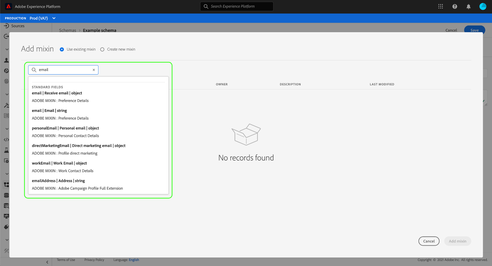

# Skapa och redigera scheman i användargränssnittet

Den här guiden ger en översikt över hur du skapar, redigerar och hanterar XDM-scheman (Experience Data Model) för din organisation i Adobe Experience Platform användargränssnitt.

>[!IMPORTANT]
>
>XDM-scheman är extremt anpassningsbara och därför kan stegen som krävs för att skapa ett schema variera beroende på vilken typ av data som ska hämtas. Det innebär att det här dokumentet endast omfattar de grundläggande interaktioner du kan göra med scheman i användargränssnittet, och att relaterade steg som att anpassa klasser, blandningar, datatyper och fält inte tas med.
>
>Om du vill få en genomgång av hur du skapar scheman kan du följa med i [självstudiekursen](../../tutorials/create-schema-ui.md) för att skapa ett fullständigt exempelschema och bekanta dig med de många funktionerna i [!DNL Schema Editor].

## Förutsättningar

Handboken kräver en fungerande förståelse för XDM System. Se [XDM-översikten](../../home.md) för en introduktion till XDM-rollen i ekosystemet Experience Platform och [grunderna i schemakomposition](../../schema/composition.md) för en översikt över hur scheman är uppbyggda.

## Skapa ett nytt schema {#create}

Välj **[!UICONTROL Create schema]** i det övre högra hörnet på arbetsytan [!UICONTROL Schemas]. I listrutan som visas kan du välja mellan **[!UICONTROL XDM Individual Profile]** och **[!UICONTROL XDM ExperienceEvent]** som basklass för schemat. Du kan också välja **[!UICONTROL Browse]** om du vill välja från den fullständiga listan med tillgängliga klasser eller [skapa en ny anpassad klass](./classes.md#create) i stället.

När du har valt en klass visas [!DNL Schema Editor] och schemats grundstruktur (tillhandahålls av klassen) på arbetsytan. Härifrån kan du använda den högra listen för att lägga till en **[!UICONTROL Display name]** och **[!UICONTROL Description]** för schemat.

Nu kan du börja skapa schemastrukturen genom att [lägga till mixins](#add-mixins).

## Redigera ett befintligt schema {#edit}

>[!NOTE]
>
>När ett schema har sparats och använts vid datainmatning kan endast additiva ändringar göras. Mer information finns i [reglerna för schemautveckling](../../schema/composition.md#evolution).

Om du vill redigera ett befintligt schema väljer du fliken **[!UICONTROL Browse]** och markerar sedan namnet på schemat som du vill redigera.

>[!TIP]
>
>Du kan använda arbetsytans sök- och filtreringsfunktioner för att enklare hitta schemat. Mer information finns i guiden [utforska XDM-resurser](../explore.md).

När du har valt ett schema visas [!DNL Schema Editor] med schemats struktur på arbetsytan. Du kan nu [lägga till mixar](#add-mixins) i schemat, [redigera fältvisningsnamn](#display-names) eller [redigera befintliga anpassade mixar](./mixins.md#edit) om schemat använder några.

## Lägg till blandningar i ett schema {#add-mixins}

>[!NOTE]
>
>I det här avsnittet beskrivs hur du lägger till befintliga blandningar i ett schema. Om du vill skapa en ny anpassad blandning läser du i guiden [skapa och redigera mixiner](./mixins.md#create) i stället.

När du har öppnat ett schema i [!DNL Schema Editor] kan du lägga till fält i schemat med hjälp av mixins. Starta genom att välja **[!UICONTROL Add]** bredvid **[!UICONTROL Mixins]** i den vänstra listen.

En dialogruta visas med en lista över mixar som du kan välja för schemat. Eftersom mixiner bara är kompatibla med en klass visas bara de mixar som är associerade med schemats valda klass. Som standard sorteras listade blandningar baserat på hur populära de är i din organisation.

Du kan använda sökfältet för att hitta den blandning du vill använda. Blandningar vars namn matchar frågan visas högst upp i listan. Under **[!UICONTROL Standard Fields]** visas blandningar som innehåller fält som beskriver önskade dataattribut.

Markera kryssrutan bredvid namnet på den blandning som du vill lägga till i schemat. Du kan välja flera blandningar i listan, där varje vald blandning visas i den högra listen.

>[!TIP]
>
>För alla listade blandningar kan du hovra eller fokusera på informationsikonen () för att visa en kort beskrivning av den typ av data som blandningen hämtar. Du kan också markera förhandsvisningsikonen () för att visa strukturen för de fält som blandningen tillhandahåller innan du bestämmer dig för att lägga till den i schemat.

När du har valt dina mixiner väljer du **[!UICONTROL Add mixin]** för att lägga till dem i schemat.

[!DNL Schema Editor] visas igen med de blandade fälten som visas på arbetsytan.

## Aktivera ett schema för kundprofil i realtid {#profile}

[Kundprofiler i realtid ](../../../profile/home.md) sammanför data från olika källor för att skapa en komplett bild av varje enskild kund. Om du vill att data som har hämtats in av ett schema ska delta i den här processen måste du aktivera schemat för användning i [!DNL Profile].

>[!IMPORTANT]
>
>Om du vill aktivera ett schema för [!DNL Profile] måste det ha ett primärt identitetsfält definierat. Mer information finns i guiden [definiera identitetsfält](../fields/identity.md).

Om du vill aktivera schemat börjar du med att markera schemats namn i den vänstra listen och väljer sedan alternativet **[!UICONTROL Profile]** i den högra listen.

En pover visas som varnar om att när ett schema väl har aktiverats och sparats kan det inte inaktiveras. Välj **[!UICONTROL Enable]** om du vill fortsätta.

Arbetsytan visas igen när växlingen [!UICONTROL Profile] är aktiverad.

>[!IMPORTANT]
>
>Eftersom schemat ännu inte har sparats är detta inget returtecken om du ändrar dig angående att låta schemat delta i kundprofilen i realtid: När du har sparat ett aktiverat schema kan det inte längre inaktiveras. Välj alternativet **[!UICONTROL Profile]** igen för att inaktivera schemat.

Slutför processen genom att välja **[!UICONTROL Save]** och spara schemat.

Schemat är nu aktiverat för användning i kundprofilen i realtid. När Platform samlar in data i datauppsättningar som baseras på det här schemat, kommer dessa data att införlivas i dina sammanställda profildata.

## Redigera visningsnamn för schemafält {#display-names}

När du har tilldelat en klass och lagt till mixar i ett schema kan du redigera visningsnamnen för alla fält i schemat, oavsett om dessa fält har tillhandahållits av standard eller anpassade XDM-resurser.

>[!NOTE]
>
>Tänk på att visningsnamnen för fält som tillhör standardklasser eller mixiner bara kan redigeras i ett specifikt schema. Om du ändrar visningsnamnet för ett standardfält i ett schema påverkas alltså inte andra scheman som använder samma associerade klass eller blandning.

Om du vill redigera visningsnamnet för ett schemafält markerar du fältet på arbetsytan. Ange det nya namnet under **[!UICONTROL Display name]** i den högra listen.

Välj **[!UICONTROL Apply]** i den högra listen så uppdateras arbetsytan till att visa fältets nya visningsnamn. Välj **[!UICONTROL Save]** om du vill använda ändringarna i schemat.

## Ändra ett schemas klass {#change-class}

Du kan ändra schemaklassen när som helst under den inledande dispositionsprocessen innan schemat har sparats.

>[!WARNING]
>
>Omtilldelning av klassen för ett schema bör göras med extrem försiktighet. Blandningar är bara kompatibla med vissa klasser, och om du ändrar klassen återställs arbetsytan och alla fält du har lagt till.

Om du vill tilldela om en klass väljer du **[!UICONTROL Assign]** till vänster på arbetsytan.

En dialogruta visas med en lista över alla tillgängliga klasser, inklusive alla som definierats av organisationen (ägaren är &quot;[!UICONTROL Customer]&quot;) samt standardklasser som definierats av Adobe.

Välj en klass i listan för att visa dess beskrivning till höger i dialogrutan. Du kan också välja **[!UICONTROL Preview class structure]** om du vill visa de fält och metadata som är associerade med klassen. Välj **[!UICONTROL Assign class]** om du vill fortsätta.

En ny dialogruta öppnas där du ombeds bekräfta att du vill tilldela en ny klass. Bekräfta genom att välja **[!UICONTROL Assign]**.

När du har bekräftat klassändringen återställs arbetsytan och alla dispositionsförlopp går förlorade.

## Nästa steg

Det här dokumentet innehåller grunderna för att skapa och redigera scheman i plattformsgränssnittet. Vi rekommenderar att du går igenom självstudiekursen [för att skapa scheman](../../tutorials/create-schema-ui.md) för ett omfattande arbetsflöde för att skapa ett fullständigt schema i användargränssnittet, inklusive att skapa anpassade mixiner och datatyper för unika användningsfall.

Mer information om funktionerna för arbetsytan [!UICONTROL Schemas] finns i översikten för arbetsytan [[!UICONTROL Schemas]](../overview.md).

Mer information om hur du hanterar scheman i [!DNL Schema Registry] API:t finns i [schemas slutpunktshandbok](../../api/schemas.md).