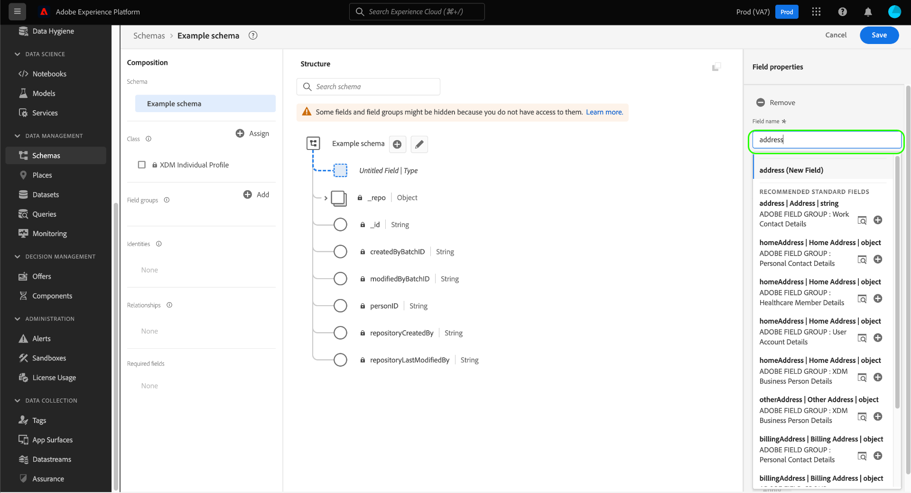
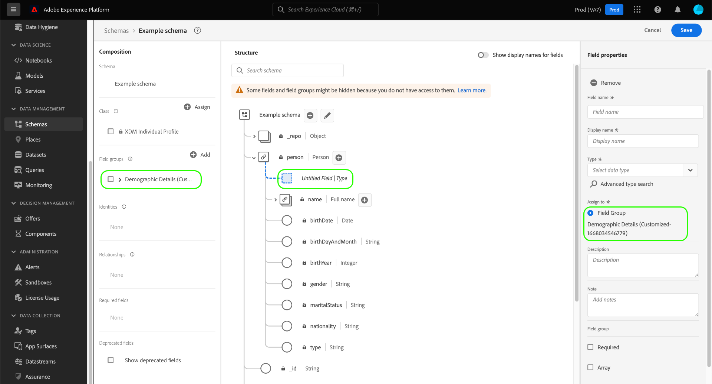

# Skapa och redigera scheman i användargränssnittet

Den här guiden ger en översikt över hur du skapar, redigerar och hanterar XDM-scheman (Experience Data Model) för din organisation i Adobe Experience Platform användargränssnitt.

>[!IMPORTANT]
>
>XDM-scheman är extremt anpassningsbara, och därför kan stegen som krävs för att skapa ett schema variera beroende på vilken typ av data du vill att schemat ska hämta. Det innebär att det här dokumentet endast omfattar de grundläggande interaktioner du kan göra med scheman i användargränssnittet, och att relaterade steg som att anpassa klasser, schemafältgrupper, datatyper och fält inte tas med.
>
>Om du vill få en genomgång av hur du skapar schemat följer du med [självstudiekurs om att skapa scheman](../../tutorials/create-schema-ui.md) för att skapa ett komplett exempelschema och bekanta dig med de många funktionerna i [!DNL Schema Editor].

## Förutsättningar

Handboken kräver en fungerande förståelse för XDM System. Se [XDM - översikt](../../home.md) en introduktion till XDM:s roll i Experience Platform-ekosystemet, och [grunderna för schemakomposition](../../schema/composition.md) för en översikt över hur scheman är uppbyggda.

## Skapa ett nytt schema {#create}

>[!NOTE]
>
>I det här avsnittet beskrivs hur du manuellt skapar ett nytt schema i användargränssnittet. Om du importerar CSV-data till plattformen kan du välja att [mappa dessa data till ett XDM-schema som skapats av AI-genererade rekommendationer](../../../ingestion/tutorials/map-csv/recommendations.md) (för närvarande i beta) utan att behöva skapa schemat manuellt själv.

I [!UICONTROL Schemas] arbetsyta, välja **[!UICONTROL Create schema]** längst upp till höger.

![Arbetsytan Scheman med [!UICONTROL Create Schema] markerad.](../../images/ui/resources/schemas/create-schema.png)

The [!UICONTROL Create schema] arbetsflödet visas. Du kan välja en basklass för schemat genom att välja antingen **[!UICONTROL Individual Profile]**, **[!UICONTROL Experience Event]**, eller **[!UICONTROL Other]**, följt av **[!UICONTROL Next]** för att bekräfta ditt val. Se [XDM-individuell profil](../../classes/individual-profile.md) och [XDM ExperienceEvent](../../classes/experienceevent.md) mer information om dessa klasser.

![The [!UICONTROL Create schema] arbetsflöde med tre klassalternativ och [!UICONTROL Next] markerad.](../../images/ui/resources/schemas/schema-class-options.png)

När du har valt en klass [!UICONTROL Name and review] visas. I det här avsnittet anger du ett namn och en beskrivning som identifierar ditt schema. &#x200B;Schemats grundstruktur (tillhandahålls av klassen) visas på arbetsytan så att du kan granska och verifiera den valda klassen och schemastrukturen.

Ange ett användarvänligt [!UICONTROL Schema display name] i textfältet. Ange sedan en lämplig beskrivning för att identifiera schemat. När du har granskat schemastrukturen och är nöjd med dina inställningar väljer du **[!UICONTROL Finish]** för att skapa ditt schema.

![The [!UICONTROL Name and review] i [!UICONTROL Create schema] arbetsflöde med [!UICONTROL Schema display name], [!UICONTROL Description]och [!UICONTROL Finish] markerad.](../../images/ui/resources/schemas/name-and-review.png)

The [!UICONTROL Schema] [!UICONTROL Browse] visas. Ditt nyligen skapade schema är nu tillgängligt för redigering i [!DNL Schema Editor] och visas i listan med tillgängliga scheman.

Nu kan du börja skapa schemats struktur genom att [lägga till schemafältgrupper](#add-field-groups) i [!DNL Schema Editor].

## Redigera ett befintligt schema {#edit}

>[!NOTE]
>
>När ett schema har sparats och använts vid datainmatning kan endast additiva ändringar göras. Se [regler för schemautveckling](../../schema/composition.md#evolution) för mer information.

Om du vill redigera ett befintligt schema väljer du **[!UICONTROL Browse]** och markera sedan namnet på schemat som du vill redigera. Du kan även använda sökfältet för att begränsa listan med tillgängliga alternativ.

>[!TIP]
>
>Du kan använda arbetsytans sök- och filtreringsfunktioner för att enklare hitta schemat. Se guiden på [utforska XDM-resurser](../explore.md) för mer information.

När du har valt ett schema visas [!DNL Schema Editor] visas med schemats struktur på arbetsytan. Nu kan du [lägg till fältgrupper](#add-field-groups) till schemat (eller [lägg till enskilda fält](#add-individual-fields) från dessa grupper), [redigera fältvisningsnamn](#display-names), eller [redigera befintliga anpassade fältgrupper](./field-groups.md#edit) om schemat använder något.

## Växla visningsnamn {#display-name-toggle}

För enkelhetens skull kan du växla mellan de ursprungliga fältnamnen och de mer läsbara visningsnamnen i Schemaredigeraren. Tack vare den här flexibiliteten blir det enklare att hitta och redigera dina scheman. Växlingsknappen finns längst upp till höger i vyn Schemaredigeraren.

>[!NOTE]
>
>Ändringen från fältnamn till visningsnamn är helt kosmetisk och påverkar inte längre några resurser längre fram i kedjan.

![Schemaredigeraren med [!UICONTROL Show display names for fields] markerad.](../../images/ui/resources/schemas/display-name-toggle.png)

Visningsnamnen för standardfältgrupper genereras av systemet men kan anpassas enligt beskrivningen i [visningsnamn](#display-names) -avsnitt. Visningsnamn visas i flera olika gränssnittsvyer, inklusive mappning och förhandsvisningar av datauppsättningar. Standardinställningen är inaktiverad och fältnamnen visas med sina ursprungliga värden.

## Lägga till fältgrupper i ett schema {#add-field-groups}

>[!NOTE]
>
>I det här avsnittet beskrivs hur du lägger till befintliga fältgrupper i ett schema. Om du vill skapa en ny anpassad fältgrupp läser du i guiden [skapa och redigera fältgrupper](./field-groups.md#create) i stället.

När du har öppnat ett schema i [!DNL Schema Editor]kan du lägga till fält i schemat med hjälp av fältgrupper. Börja genom att välja **[!UICONTROL Add]** nästa **[!UICONTROL Field groups]** till vänster.

![Schemaredigeraren med [!UICONTROL Add] från [!UICONTROL Field groups] -avsnittet markerat.](../../images/ui/resources/schemas/add-field-group-button.png)

En dialogruta visas med en lista över fältgrupper som du kan välja för schemat. Eftersom fältgrupper endast är kompatibla med en klass, visas endast de fältgrupper som är associerade med schemats valda klass. Som standard sorteras listade fältgrupper baserat på hur populära de är i din organisation.

![The [!UICONTROL Add field groups] visas med [!UICONTROL Popularity] kolumn markerad.](../../images/ui/resources/schemas/field-group-popularity.png)

Om du känner till den allmänna aktiviteten eller affärsområdet för de fält som du vill lägga till, väljer du en eller flera av de branschlodräta kategorierna i den vänstra listen för att filtrera den visade listan med fältgrupper.

![The [!UICONTROL Add field groups] visas med [!UICONTROL Industry] filter och [!UICONTROL Industry] kolumn markerad.](../../images/ui/resources/schemas/industry-filter.png)

>[!NOTE]
>
>Mer information om de bästa metoderna för branschspecifik datamodellering i XDM finns i dokumentationen om [branschdatamodeller](../../schema/industries/overview.md).

Du kan också använda sökfältet för att hitta den fältgrupp du vill använda. Fältgrupper vars namn matchar frågan visas högst upp i listan. Under **[!UICONTROL Standard Fields]** visas fältgrupper som innehåller fält som beskriver önskade dataattribut.

![The [!UICONTROL Add field groups] med [!UICONTROL Standard fields] sökfunktionen markerad.](../../images/ui/resources/schemas/field-group-search.png)

Markera kryssrutan bredvid namnet på den fältgrupp som du vill lägga till i schemat. Du kan markera flera fältgrupper i listan, där varje markerad fältgrupp visas i den högra listen.

![The [!UICONTROL Add field groups] med markeringsfunktionen markerad.](../../images/ui/resources/schemas/add-field-group.png)

>[!TIP]
>
>För alla fältgrupper i listan kan du hovra eller fokusera på informationsikonen () om du vill visa en kort beskrivning av den typ av data som fältgruppen hämtar. Du kan också välja förhandsvisningsikonen () för att visa strukturen för fälten som fältgruppen tillhandahåller innan du bestämmer dig för att lägga till den i schemat.

När du har valt fältgrupper väljer du **[!UICONTROL Add field groups]** för att lägga till dem i schemat.

![The [!UICONTROL Add field groups] dialogruta med fältgrupper markerade och [!UICONTROL Add field groups] markerad.](../../images/ui/resources/schemas/add-field-group-finish.png)

The [!DNL Schema Editor] visas igen med fälten som tillhandahålls av fältgruppen och som visas på arbetsytan.

![The [!DNL Schema Editor] när ett exempelschema visas.](../../images/ui/resources/schemas/field-groups-added.png)

När du har lagt till en fältgrupp i ett schema kan du välja att [ta bort befintliga fält](#remove-fields) eller [lägg till nya anpassade fält](#add-fields) till de grupperna, beroende på dina behov.

### Ta bort fält som lagts till från fältgrupper {#remove-fields}

När du har lagt till en fältgrupp i ett schema kan du ta bort fält som du inte behöver.

>[!NOTE]
>
>Om du tar bort fält från en fältgrupp påverkas bara schemat som du arbetar med och påverkar inte själva fältgruppen. Om du tar bort fält i ett schema är dessa fält fortfarande tillgängliga i alla andra scheman som använder samma fältgrupp.

I följande exempel är standardfältgruppen **[!UICONTROL Demographic Details]** har lagts till i ett schema. Ta bort ett enskilt fält som `taxId`markerar du fältet på arbetsytan och väljer **[!UICONTROL Remove]** i rätt spår.

![The [!DNL Schema Editor] med [!UICONTROL Remove] markerad. Den här åtgärden tar bort ett enskilt fält.](../../images/ui/resources/schemas/remove-single-field.png)

Om det finns flera fält som du vill ta bort kan du hantera fältgruppen som helhet. Markera ett fält som tillhör gruppen på arbetsytan och välj sedan **[!UICONTROL Manage related fields]** i rätt spår.

![The [!DNL Schema Editor] med [!UICONTROL Manage related fields] markerad.](../../images/ui/resources/schemas/manage-related-fields.png)

En dialogruta visas med strukturen för fältgruppen i fråga. Härifrån kan du använda de angivna kryssrutorna för att markera eller avmarkera de fält som du behöver. När du är nöjd väljer du **[!UICONTROL Confirm]**.

![The [!UICONTROL Manage related fields] dialogruta med markerade fält och [!UICONTROL Confirm] markerad.](../../images/ui/resources/schemas/select-fields.png)

Arbetsytan visas igen med endast de markerade fälten i schemastrukturen.

### Lägg till anpassade fält i fältgrupper {#add-fields}

När du har lagt till en fältgrupp i ett schema kan du definiera ytterligare fält för den gruppen. Alla fält som läggs till i en fältgrupp i ett schema visas emellertid också i alla andra scheman som använder samma fältgrupp.

Om ett anpassat fält dessutom läggs till i en standardfältgrupp, kommer den fältgruppen att konverteras till en anpassad fältgrupp och den ursprungliga standardfältgruppen kommer inte längre att vara tillgänglig.

Om du vill lägga till ett anpassat fält i en standardfältgrupp, se [avsnitt nedan](#custom-fields-for-standard-groups) för specifika instruktioner. Om du lägger till fält i en anpassad fältgrupp, se avsnittet om [redigera anpassade fältgrupper](./field-groups.md) i fältgruppsguiden för användargränssnitt.

Om du inte vill ändra några fältgrupper kan du [skapa en ny anpassad fältgrupp](./field-groups.md#create) om du vill definiera ytterligare fält i stället.

## Lägga till enskilda fält i ett schema {#add-individual-fields}

Med Schemaredigeraren kan du lägga till enskilda fält direkt i ett schema om du inte vill lägga till en hel fältgrupp för ett visst användningsfall. Du kan [lägga till enskilda fält från standardfältgrupper](#add-standard-fields) eller [lägga till egna fält](#add-custom-fields) i stället.

>[!IMPORTANT]
>
>Även om schemaredigeraren tillåter att du lägger till enskilda fält direkt i ett schema, ändrar detta inte det faktum att alla fält i ett XDM-schema måste anges av dess klass eller en fältgrupp som är kompatibel med den klassen. Som framgår av avsnitten nedan är alla enskilda fält fortfarande kopplade till en klass eller fältgrupp som ett nyckelsteg när de läggs till i ett schema.

### Lägg till standardfält {#add-standard-fields}

Du kan lägga till fält från standardfältgrupper direkt i ett schema utan att först behöva känna till deras motsvarande fältgrupp. Om du vill lägga till ett standardfält i ett schema väljer du plustecknet (**+**) bredvid schemats namn på arbetsytan. An **[!UICONTROL Untitled Field]** platshållaren visas i schemastrukturen och uppdaterar den högra listen för att visa kontroller för att konfigurera fältet.

Under **[!UICONTROL Field name]** börjar du skriva namnet på det fält som du vill lägga till. Systemet söker automatiskt efter standardfält som matchar frågan och listar dem under **[!UICONTROL Recommended Standard Fields]**, inklusive de fältgrupper som de tillhör.

Vissa standardfält har samma namn, men strukturen kan variera beroende på vilken fältgrupp de kommer ifrån. Om ett standardfält är kapslat i ett överordnat objekt i fältgruppsstrukturen, kommer det överordnade fältet också att inkluderas i schemat om det underordnade fältet läggs till.

Välj förhandsvisningsikonen () bredvid ett standardfält för att visa strukturen för dess fältgrupp och bättre förstå hur den kan kapslas. Om du vill lägga till standardfältet i schemat väljer du plusikonen ().

Arbetsytan uppdateras för att visa det standardfält som lagts till i schemat, inklusive alla överordnade fält som är kapslade i fältgruppsstrukturen. Namnet på fältgruppen visas också under **[!UICONTROL Field groups]** till vänster. Om du vill lägga till fler fält från samma fältgrupp väljer du **[!UICONTROL Manage related fields]** i rätt spår.

### Lägg till anpassade fält {#add-custom-fields}

På samma sätt som arbetsflödet för standardfält kan du även lägga till egna anpassade fält direkt i ett schema.

Om du vill lägga till fält på rotnivån för ett schema väljer du plustecknet (**+**) bredvid schemats namn på arbetsytan. An **[!UICONTROL Untitled Field]** platshållaren visas i schemastrukturen och uppdaterar den högra listen för att visa kontroller för att konfigurera fältet.

Börja skriva in namnet på det fält som du vill lägga till så börjar systemet automatiskt att söka efter matchande standardfält. Om du vill skapa ett nytt anpassat fält i stället väljer du det översta alternativet som bifogas med **([!UICONTROL New Field])**.

När du har angett ett visningsnamn och en datatyp för fältet är nästa steg att tilldela fältet till en överordnad XDM-resurs. Om schemat använder en anpassad klass kan du välja att [lägg till fältet i den tilldelade klassen](#add-to-class) eller en [fältgrupp](#add-to-field-group) i stället. Om schemat använder en standardklass kan du bara tilldela ett anpassat fält till en fältgrupp.

#### Tilldela fältet till en anpassad fältgrupp {#add-to-field-group}

>[!NOTE]
>
>I det här avsnittet beskrivs bara hur du tilldelar fältet till en anpassad fältgrupp. Om du i stället vill utöka en standardfältgrupp med det nya anpassade fältet läser du avsnittet om [lägga till anpassade fält i standardfältgrupper](#custom-fields-for-standard-groups).

Under **[!UICONTROL Assign to]** väljer du **[!UICONTROL Field Group]**. Om schemat använder en standardklass är detta det enda tillgängliga alternativet och markeras som standard.

Sedan måste du välja en fältgrupp för det nya fältet som ska kopplas. Börja skriva in namnet på fältgruppen i den angivna textinmatningen. Om du har befintliga anpassade fältgrupper som matchar indata visas de i listrutan. Du kan också skriva ett unikt namn för att skapa en ny fältgrupp i stället.

>[!WARNING]
>
>Om du väljer en befintlig anpassad fältgrupp kommer alla andra scheman som använder den fältgruppen också att ärva det nya fältet när du har sparat ändringarna. Därför bör du bara markera en befintlig fältgrupp om du vill använda den här typen av spridning. Annars bör du välja att skapa en ny anpassad fältgrupp i stället.

När du har valt fältgruppen i listan väljer du **[!UICONTROL Apply]**.

Det nya fältet läggs till på arbetsytan och får ett namn under [klient-ID](../../api/getting-started.md#know-your-tenant_id) för att undvika konflikter med XDM-standardfält. Fältgruppen som du har associerat det nya fältet med visas också under **[!UICONTROL Field groups]** till vänster.

>[!NOTE]
>
>Resten av fälten i den valda anpassade fältgruppen tas som standard bort från schemat. Om du vill lägga till några av dessa fält i schemat markerar du ett fält som tillhör gruppen och väljer sedan **[!UICONTROL Manage related fields]** i rätt spår.

#### Tilldela fältet till en anpassad klass {#add-to-class}

Under **[!UICONTROL Assign to]** väljer du **[!UICONTROL Class]**. Indatafältet nedan ersätts med namnet på det aktuella schemats anpassade klass, vilket anger att det nya fältet kommer att tilldelas den här klassen.

![The [!UICONTROL Class] som väljs för den nya fälttilldelningen.](../../images/ui/resources/schemas/assign-field-to-class.png)

Fortsätt konfigurera fältet efter behov och välj **[!UICONTROL Apply]** när du är klar.

![[!UICONTROL Apply] väljs för det nya fältet.](../../images/ui/resources/schemas/assign-field-to-class-apply.png)

Det nya fältet läggs till på arbetsytan och får ett namn under [klient-ID](../../api/getting-started.md#know-your-tenant_id) för att undvika konflikter med XDM-standardfält. Om du väljer klassnamnet i den vänstra listen visas det nya fältet som en del av klassens struktur.

### Lägga till anpassade fält i strukturen för standardfältgrupper {#custom-fields-for-standard-groups}

Om schemat du arbetar med har ett objekttypsfält från en standardfältgrupp, kan du lägga till egna anpassade fält till det standardobjektet.

>[!WARNING]
>
>Alla fält som läggs till i en fältgrupp i ett schema visas också i alla andra scheman som använder samma fältgrupp. Om ett anpassat fält dessutom läggs till i en standardfältgrupp, kommer den fältgruppen att konverteras till en anpassad fältgrupp och den ursprungliga standardfältgruppen kommer inte längre att vara tillgänglig.
>
>Om du deltar i betaversionen av den här funktionen får du en dialogruta som informerar dig om vilka standardfältgrupper du tidigare har anpassat. När du har valt **[!UICONTROL Acknowledge]**, konverteras de listade resurserna till anpassade fältgrupper.
>
>

Börja med att välja plustecknet (**+**) bredvid roten för objektet som anges av standardfältgruppen.

Ett varningsmeddelande visas som uppmanar dig att bekräfta om du vill konvertera standardfältgruppen. Välj **[!UICONTROL Continue creating field group]** för att fortsätta.

Arbetsytan visas igen med en namnlös platshållare för det nya fältet. Observera att namnet på standardfältgruppen har lagts till med &quot;([!UICONTROL Extended])&quot; för att ange att den har ändrats från den ursprungliga versionen. Använd kontrollerna i den högra listen för att definiera fältets egenskaper.

När du har gjort ändringarna visas det nya fältet under ditt innehavar-ID-namnutrymme i standardobjektet. Det här kapslade namnutrymmet förhindrar konflikter mellan fält och namn inom själva fältgruppen för att undvika att bryta ändringar i andra scheman som använder samma fältgrupp.

## Aktivera ett schema för kundprofil i realtid {#profile}

>[!CONTEXTUALHELP]
>id="platform_schemas_enableforprofile"
>title="Aktivera ett schema för profil"
>abstract="När ett schema har aktiverats för profilen, deltar alla datauppsättningar som skapats från det här schemat i kundprofilen i realtid, som sammanfogar data från olika källor för att skapa en fullständig bild av varje kund. När ett schema används för att importera data till profilen kan det inte inaktiveras. Mer information finns i dokumentationen."

[Kundprofil i realtid](../../../profile/home.md) sammanfogar data från olika källor för att skapa en komplett bild av varje enskild kund. Om du vill att de data som hämtas av ett schema ska delta i processen måste du aktivera schemat för användning i [!DNL Profile].

>[!IMPORTANT]
>
>För att aktivera ett schema för [!DNL Profile]måste ett primärt identitetsfält ha definierats. Se guiden på [definiera identitetsfält](../fields/identity.md) för mer information.

Aktivera schemat genom att först markera schemats namn i den vänstra listen och sedan välja **[!UICONTROL Profile]** till höger.

En pover visas som varnar om att när ett schema väl har aktiverats och sparats kan det inte inaktiveras. Välj **[!UICONTROL Enable]** för att fortsätta.

Arbetsytan visas igen med [!UICONTROL Profile] växla aktiverat.

>[!IMPORTANT]
>
>Eftersom schemat inte har sparats ännu är detta inget returtecken om du ändrar dig angående att låta schemat delta i kundprofilen i realtid: när du har sparat ett aktiverat schema kan det inte längre inaktiveras. Välj **[!UICONTROL Profile]** växla igen för att inaktivera schemat.

Avsluta processen genom att välja **[!UICONTROL Save]** för att spara schemat.

Schemat är nu aktiverat för användning i kundprofilen i realtid. När Platform samlar in data i datauppsättningar som baseras på det här schemat, kommer dessa data att införlivas i dina sammanställda profildata.

## Redigera visningsnamn för schemafält {#display-names}

När du har tilldelat en klass och lagt till fältgrupper till ett schema kan du redigera visningsnamnen för alla fält i schemat, oavsett om dessa fält har tillhandahållits av standard eller anpassade XDM-resurser.

>[!NOTE]
>
>Tänk på att visningsnamnen för fält som tillhör standardklasser eller fältgrupper bara kan redigeras i ett specifikt schema. Om du ändrar visningsnamnet för ett standardfält i ett schema påverkas alltså inte andra scheman som använder samma associerade klass eller fältgrupp.
>
>När du ändrar visningsnamnen för ett schemas fält återspeglas dessa ändringar omedelbart i befintliga datauppsättningar som baseras på det schemat.

Om du vill redigera visningsnamnet för ett schemafält markerar du fältet på arbetsytan. Ange det nya namnet under **[!UICONTROL Display name]**.

Välj **[!UICONTROL Apply]** till höger och arbetsytan uppdateras för att visa fältets nya visningsnamn. Välj **[!UICONTROL Save]** för att tillämpa ändringarna i schemat.

## Ändra en schemaklass {#change-class}

Du kan ändra schemaklassen när som helst under den inledande dispositionsprocessen innan schemat har sparats.

>[!WARNING]
>
>Omtilldelning av klassen för ett schema bör göras med extrem försiktighet. Fältgrupper är bara kompatibla med vissa klasser. Om du ändrar klassen återställs arbetsytan och alla fält du har lagt till.

Om du vill tilldela om en klass väljer du **[!UICONTROL Assign]** till vänster på arbetsytan.

En dialogruta visas med en lista över alla tillgängliga klasser, inklusive alla som definierats av organisationen (ägaren är[!UICONTROL Customer]&quot;) samt standardklasser som definieras av Adobe.

Välj en klass i listan för att visa dess beskrivning till höger i dialogrutan. Du kan också välja **[!UICONTROL Preview class structure]** om du vill visa de fält och metadata som är associerade med klassen. Välj **[!UICONTROL Assign class]** för att fortsätta.

En ny dialogruta öppnas där du ombeds bekräfta att du vill tilldela en ny klass. Välj **[!UICONTROL Assign]** för att bekräfta.

När du har bekräftat klassändringen återställs arbetsytan och alla dispositionsförlopp går förlorade.

## Nästa steg

Det här dokumentet innehåller grunderna för att skapa och redigera scheman i plattformsgränssnittet. Vi rekommenderar att du granskar [självstudiekurs om att skapa scheman](../../tutorials/create-schema-ui.md) för ett omfattande arbetsflöde för att skapa ett komplett schema i användargränssnittet, inklusive att skapa anpassade fältgrupper och datatyper för unika användningsfall.

Mer information om funktionerna i [!UICONTROL Schemas] arbetsytan, se [[!UICONTROL Schemas] arbetsyta - översikt](../overview.md).

Så här hanterar du scheman i [!DNL Schema Registry] API, se [slutpunktshandbok för scheman](../../api/schemas.md).
